# BÁO CÁO ĐỒ ÁN MÔN HỌC

---

<div align="center">

**TRƯỜNG ĐẠI HỌC …**

**KHOA CÔNG NGHỆ THÔNG TIN**

**BỘ MÔN CÔNG NGHỆ PHẦN MỀM**

---

<br/>

# BÁO CÁO ĐỒ ÁN MÔN HỌC

## HỌC PHẦN: PHÁT TRIỂN PHẦN MỀM HƯỚNG DỊCH VỤ

<br/>

### ĐỀ TÀI

# XÂY DỰNG DỊCH VỤ API VÀ ỨNG DỤNG CLIENT CHO HỆ THỐNG BÁN HÀNG LINH KIỆN PC TRỰC TUYẾN

<br/>

| | |
|---|---|
| **Giảng viên hướng dẫn** | …………………………………… |
| **Nhóm sinh viên thực hiện** | Nhóm …… |
| **Thành viên 1** | …………………………… – MSSV: …………… |
| **Thành viên 2** | …………………………… – MSSV: …………… |
| **Thành viên 3** | …………………………… – MSSV: …………… |
| **Lớp / Khóa** | …………………………………… |
| **Ngành** | Công nghệ Thông tin |
| **Chuyên ngành** | Phát triển phần mềm hướng dịch vụ |
| **Kho mã nguồn** | `tunghoang2533/Ban_linh_kien_java` |
| **Nhánh nộp bài** | `arena/01a0efd5-ban-linh-kien-java` |

<br/>

*…………, tháng 09 năm 2026*

</div>

---

<div style="page-break-after: always;"></div>

## LỜI CẢM ƠN

Trước tiên, nhóm sinh viên thực hiện bài tập lớn xin bày tỏ lòng biết ơn sâu sắc tới Ban Giám hiệu Nhà trường, Ban Chủ nhiệm Khoa Công nghệ Thông tin và toàn thể quý thầy cô trong Bộ môn Công nghệ Phần mềm đã xây dựng một chương trình đào tạo có tính hệ thống, cập nhật và bám sát nhu cầu thực tiễn của ngành công nghiệp phần mềm. Những kiến thức nền tảng về phân tích – thiết kế hệ thống, cơ sở dữ liệu, lập trình hướng đối tượng và kiến trúc phần mềm mà nhóm tiếp thu được trong suốt quá trình học tập chính là cơ sở lý luận quan trọng để nhóm hoàn thành bài tập lớn này.

Nhóm xin gửi lời cảm ơn chân thành và trân trọng nhất tới **giảng viên hướng dẫn học phần Phát triển phần mềm hướng dịch vụ**. Thầy/Cô không chỉ truyền đạt các nguyên lý cốt lõi của kiến trúc hướng dịch vụ (Service-Oriented Architecture), chuẩn thiết kế RESTful API và mô hình Client – Server, mà còn đưa ra những nhận xét phản biện sắc bén ở từng giai đoạn: từ khâu lựa chọn và định danh đề tài, mô hình hóa nghiệp vụ bằng UML, thiết kế hợp đồng dịch vụ (service contract), cho đến khâu kiểm thử tích hợp và đánh giá chất lượng hệ thống. Chính những góp ý đó đã giúp nhóm nhận diện và khắc phục nhiều khiếm khuyết nghiêm trọng về mặt kiến trúc — đặc biệt là bài toán tranh chấp tồn kho khi nhiều người dùng đặt mua đồng thời và bài toán bảo đảm tính bất biến (idempotency) của webhook thanh toán.

Nhóm cũng xin cảm ơn cộng đồng kỹ thuật mã nguồn mở, đặc biệt là các nhóm phát triển Spring Framework, Hibernate ORM và Thymeleaf, cùng đội ngũ kỹ thuật của Công ty Cổ phần Giải pháp Thanh toán Việt Nam (VNPAY) đã công bố tài liệu tích hợp chi tiết trên môi trường Sandbox, tạo điều kiện cho sinh viên tiếp cận một cổng thanh toán điện tử đạt chuẩn công nghiệp trong phạm vi một bài tập lớn môn học.

Cuối cùng, nhóm xin cảm ơn gia đình và các bạn sinh viên cùng lớp đã hỗ trợ, động viên và tham gia thử nghiệm sản phẩm, cung cấp phản hồi hữu ích để nhóm hoàn thiện trải nghiệm người dùng của ứng dụng client.

Do giới hạn về thời gian thực hiện, quy mô dữ liệu thử nghiệm và kinh nghiệm triển khai hệ thống ở quy mô sản xuất, báo cáo chắc chắn còn những thiếu sót. Nhóm rất mong nhận được sự chỉ dẫn và góp ý thêm từ quý thầy cô để hoàn thiện cả sản phẩm phần mềm lẫn năng lực chuyên môn.

Nhóm xin trân trọng cảm ơn!

<div align="right">

*…………, ngày …… tháng …… năm 2026*

**Nhóm sinh viên thực hiện**

</div>

---

<div style="page-break-after: always;"></div>

## LỜI CAM ĐOAN

Nhóm sinh viên thực hiện bài tập lớn xin cam đoan những nội dung sau đây:

**Thứ nhất**, bài tập lớn học phần với đề tài *"Xây dựng dịch vụ API và ứng dụng client cho hệ thống bán hàng linh kiện PC trực tuyến"* là công trình do chính nhóm trực tiếp nghiên cứu, phân tích, thiết kế, lập trình và kiểm thử dưới sự hướng dẫn khoa học của giảng viên phụ trách học phần Phát triển phần mềm hướng dịch vụ.

**Thứ hai**, toàn bộ mã nguồn của hệ thống — bao gồm tầng dịch vụ backend (`com.banlinhkien.*`), các bộ điều khiển REST API, các lớp nghiệp vụ, các lớp truy cập dữ liệu, các khuôn mẫu giao diện Thymeleaf và bộ kiểm thử tự động — được nhóm tự xây dựng và được lưu trữ công khai, có lịch sử phiên bản đầy đủ tại kho mã nguồn Git của nhóm. Không có thành phần nào được sao chép nguyên trạng từ bài tập lớn của nhóm khác hoặc từ sản phẩm thương mại đang lưu hành.

**Thứ ba**, các thư viện, framework và dịch vụ của bên thứ ba được sử dụng trong hệ thống (Spring Boot, Spring Security, Spring Data JPA, Hibernate ORM, Thymeleaf, Bootstrap, MySQL Connector/J, Project Lombok, Jackson, cổng thanh toán VNPAY Sandbox, dịch vụ suy luận ngôn ngữ Groq) đều là các thành phần được phát hành hợp pháp theo giấy phép mã nguồn mở hoặc theo điều khoản sử dụng công khai của nhà cung cấp. Nhóm sử dụng đúng vai trò kỹ thuật của từng thành phần và đã trích dẫn đầy đủ trong mục **Tài liệu tham khảo**.

**Thứ tư**, mọi số liệu, kết quả đo đạc, ảnh chụp màn hình, nhật ký thực thi và báo cáo kiểm thử được trình bày trong Chương 3 đều là kết quả thực tế thu được khi biên dịch và vận hành hệ thống trên môi trường thử nghiệm của nhóm; không có số liệu nào được suy diễn, ước lượng hoặc ngụy tạo. Ở những nội dung mà kết quả thực nghiệm khác với dự kiến ban đầu, nhóm giữ nguyên kết quả thực tế và trình bày rõ nguyên nhân sai lệch.

**Thứ năm**, các nội dung lý thuyết được kế thừa từ giáo trình, tiêu chuẩn kỹ thuật và tài liệu chuyên ngành đều được trích dẫn theo chuẩn IEEE và liệt kê đầy đủ trong danh mục tài liệu tham khảo.

Nhóm xin chịu hoàn toàn trách nhiệm trước Giảng viên phụ trách học phần và Bộ môn Công nghệ thông tin về tính trung thực của những cam đoan nêu trên.

<div align="right">

*…………, ngày …… tháng …… năm 2026*

**Đại diện nhóm sinh viên thực hiện**

</div>

---

<div style="page-break-after: always;"></div>

## MỤC LỤC

| Mục | Nội dung |
|---|---|
| | **LỜI CẢM ƠN** |
| | **LỜI CAM ĐOAN** |
| | **MỤC LỤC** |
| | **DANH MỤC HÌNH VẼ VÀ SƠ ĐỒ** |
| | **DANH MỤC BẢNG BIỂU** |
| | **DANH MỤC THUẬT NGỮ VÀ TỪ VIẾT TẮT** |
| | **MỞ ĐẦU** |
| 1 | Lý do chọn đề tài |
| 2 | Mục tiêu nghiên cứu |
| 3 | Đối tượng và phạm vi nghiên cứu |
| 4 | Phương pháp nghiên cứu |
| 5 | Cấu trúc của báo cáo |
| | **CHƯƠNG 1. GIỚI THIỆU TỔNG QUAN VỀ ĐỀ TÀI** |
| 1.1 | Đặt vấn đề và tính cấp thiết của đề tài |
| 1.1.1 | Bối cảnh thị trường linh kiện máy tính tại Việt Nam |
| 1.1.2 | Rào cản kỹ thuật của người dùng khi tự lắp ráp máy tính |
| 1.1.3 | Hạn chế của mô hình phần mềm bán hàng nguyên khối hiện hành |
| 1.1.4 | Tính cấp thiết của việc áp dụng kiến trúc hướng dịch vụ |
| 1.2 | Tổng quan về Kiến trúc hướng dịch vụ (SOA) và RESTful API |
| 1.2.1 | Khái niệm và nguyên lý cốt lõi của SOA |
| 1.2.2 | Chuẩn RESTful API và sáu ràng buộc kiến trúc |
| 1.2.3 | Quy chuẩn thiết kế tài nguyên REST |
| 1.2.4 | So sánh kiến trúc Monolithic và kiến trúc hướng dịch vụ |
| 1.2.5 | Định vị kiến trúc của hệ thống trong phổ SOA |
| 1.3 | Tổng quan về công nghệ sử dụng trong đề tài |
| 1.3.1 | Java 17/21 và hệ sinh thái Spring Boot 3.x |
| 1.3.2 | Spring Data JPA và ORM Hibernate 6 |
| 1.3.3 | Spring Security 6 |
| 1.3.4 | Hệ quản trị cơ sở dữ liệu MySQL 8 |
| 1.3.5 | Ứng dụng client: Thymeleaf, Layout Dialect và Fetch API |
| 1.3.6 | Dịch vụ cổng thanh toán VNPAY và cơ chế checksum HMAC-SHA512 |
| 1.3.7 | Bảng tổng hợp công nghệ và vai trò kiến trúc |
| 1.4 | Khảo sát các hệ thống tương tự và phân tích bài toán |
| 1.4.1 | Khảo sát các nền tảng bán lẻ linh kiện tiêu biểu |
| 1.4.2 | Bảng so sánh tính năng |
| 1.4.3 | Đánh giá và đề xuất cải tiến |
| 1.5 | Kết luận chương 1 |
| | **CHƯƠNG 2. PHÂN TÍCH VÀ THIẾT KẾ HỆ THỐNG** |
| 2.1 | Phân tích yêu cầu hệ thống |
| 2.1.1 | Yêu cầu chức năng |
| 2.1.2 | Yêu cầu phi chức năng |
| 2.1.3 | Quy tắc nghiệp vụ |
| 2.2 | Phân tích chức năng hệ thống |
| 2.2.1 | Xác định tác nhân và biểu đồ Use Case tổng quan |
| 2.2.2 | Biểu đồ Use Case phân rã theo phân hệ |
| 2.2.3 | Đặc tả chi tiết các Use Case (UC01 – UC10) |
| 2.3 | Thiết kế sơ đồ tuần tự cho các luồng nghiệp vụ trọng yếu |
| 2.3.1 | Sơ đồ tuần tự – Đăng nhập và xác thực phân quyền |
| 2.3.2 | Sơ đồ tuần tự – Ráp cấu hình PC và chuyển vào giỏ hàng |
| 2.3.3 | Sơ đồ tuần tự – Đặt hàng với khóa bi quan và kiểm tra voucher |
| 2.3.4 | Sơ đồ tuần tự – Thanh toán VNPAY với hai kênh phản hồi |
| 2.3.5 | Sơ đồ tuần tự – Quản trị viên duyệt đơn và hoàn kho tự động |
| 2.4 | Thiết kế hệ thống |
| 2.4.1 | Thiết kế kiến trúc tổng thể |
| 2.4.2 | Thiết kế cơ sở dữ liệu |
| 2.4.3 | Thiết kế API dịch vụ |
| 2.4.4 | Thiết kế ứng dụng Client |
| 2.5 | Kết luận chương 2 |
| | **CHƯƠNG 3. KẾT QUẢ THỰC NGHIỆM VÀ ĐÁNH GIÁ** |
| 3.1 | Môi trường cài đặt và triển khai |
| 3.1.1 | Cấu hình phần cứng môi trường thử nghiệm |
| 3.1.2 | Công cụ và phiên bản phần mềm |
| 3.1.3 | Quy trình cài đặt và khởi chạy |
| 3.1.4 | Cấu hình ứng dụng |
| 3.2 | Kết quả cài đặt hệ thống |
| 3.2.1 | Cấu trúc mã nguồn |
| 3.2.2 | Đặc tả chi tiết hợp đồng REST API |
| 3.2.3 | Hiện thực cơ chế bảo đảm toàn vẹn dữ liệu |
| 3.3 | Kết quả giao diện ứng dụng client |
| 3.3.1 | Luồng tiêu thụ REST API phía client |
| 3.3.2 | Các màn hình chính của hệ thống |
| 3.4 | Kiểm thử và đánh giá hệ thống |
| 3.4.1 | Chiến lược và kết quả kiểm thử tự động |
| 3.4.2 | Kiểm thử đồng thời chống bán vượt tồn kho |
| 3.4.3 | Ma trận kịch bản kiểm thử hệ thống |
| 3.4.4 | Đánh giá mức độ đáp ứng yêu cầu |
| 3.5 | Kết luận chương 3 |
| 3.5.1 | Đánh giá ưu điểm của hệ thống |
| 3.5.2 | Đánh giá hạn chế và phân tích nguyên nhân |
| 3.5.3 | Tổng kết chương 3 |
| | **KẾT LUẬN VÀ HƯỚNG PHÁT TRIỂN** |
| 1 | Kết quả đạt được |
| 2 | Hạn chế của đề tài |
| 3 | Hướng phát triển |
| 4 | Bài học kinh nghiệm |
| | **TÀI LIỆU THAM KHẢO** |
| | **PHỤ LỤC** |
| A | Bảng tổng hợp mã định danh sử dụng trong báo cáo |
| B | Ánh xạ mã danh mục với khe linh kiện trong công cụ Build PC |
| C | Danh sách tham số VNPAY sử dụng trong tích hợp |
| D | Lệnh vận hành thường dùng |

---

<div style="page-break-after: always;"></div>

## DANH MỤC HÌNH VẼ VÀ SƠ ĐỒ

| Ký hiệu | Tên hình vẽ / sơ đồ | Mục |
|---|---|---|
| Hình 1.1 | Sơ đồ so sánh kiến trúc Monolithic và kiến trúc hướng dịch vụ API-driven | 1.2.4 |
| Hình 1.2 | Sơ đồ định vị kiến trúc của hệ thống trong phổ SOA | 1.2.5 |
| Hình 1.3 | Sơ đồ luồng hoạt động tổng quát của cơ chế ký checksum HMAC-SHA512 | 1.3.6 |
| Hình 2.1 | Biểu đồ Use Case tổng quan toàn hệ thống | 2.2.1 |
| Hình 2.2 | Biểu đồ Use Case phân hệ Xác thực và Tài khoản | 2.2.2 |
| Hình 2.3 | Biểu đồ Use Case phân hệ Sản phẩm và Danh mục | 2.2.2 |
| Hình 2.4 | Biểu đồ Use Case phân hệ Giỏ hàng và Build PC | 2.2.2 |
| Hình 2.5 | Biểu đồ Use Case phân hệ Đặt hàng và Thanh toán VNPAY | 2.2.2 |
| Hình 2.6 | Biểu đồ Use Case phân hệ Quản trị | 2.2.2 |
| Hình 2.7 | Sơ đồ tuần tự – Đăng nhập và xác thực phân quyền qua Spring Security | 2.3.1 |
| Hình 2.8 | Sơ đồ tuần tự – Ráp cấu hình PC và chuyển cấu hình vào giỏ hàng | 2.3.2 |
| Hình 2.9 | Sơ đồ tuần tự – Đặt hàng với khóa bi quan trừ kho và kiểm tra voucher | 2.3.3 |
| Hình 2.10 | Sơ đồ tuần tự – Thanh toán VNPAY (Return URL và IPN Webhook) | 2.3.4 |
| Hình 2.11 | Sơ đồ tuần tự – Quản trị viên duyệt đơn và hoàn kho tự động | 2.3.5 |
| Hình 2.12 | Sơ đồ kiến trúc phân tầng tổng thể của hệ thống | 2.4.1 |
| Hình 2.13 | Biểu đồ lớp (Class Diagram) các thực thể nghiệp vụ chính | 2.4.1 |
| Hình 2.14 | Sơ đồ thực thể liên kết (ERD) của cơ sở dữ liệu | 2.4.2 |
| Hình 2.15 | Sơ đồ máy trạng thái của đơn hàng | 2.4.2 |
| Hình 2.16 | Sơ đồ điều hướng màn hình của ứng dụng client | 2.4.4 |
| Hình 3.1 | Sơ đồ cây cấu trúc gói mã nguồn backend | 3.2.1 |
| Hình 3.2 | Sơ đồ luồng xử lý chống bán vượt tồn kho | 3.2.3 |
| Hình 3.3 | Sơ đồ luồng tiêu thụ REST API phía client | 3.3.1 |
| Hình 3.4 | Ảnh chụp màn hình Trang chủ | 3.3.2 |
| Hình 3.5 | Ảnh chụp màn hình Danh sách linh kiện với bộ lọc | 3.3.2 |
| Hình 3.6 | Ảnh chụp màn hình Chi tiết sản phẩm | 3.3.2 |
| Hình 3.7 | Ảnh chụp màn hình Công cụ Build PC thời gian thực | 3.3.2 |
| Hình 3.8 | Ảnh chụp màn hình Gợi ý cấu hình bằng AI | 3.3.2 |
| Hình 3.9 | Ảnh chụp màn hình Giỏ hàng và áp mã giảm giá | 3.3.2 |
| Hình 3.10 | Ảnh chụp màn hình Trang thanh toán | 3.3.2 |
| Hình 3.11 | Ảnh chụp màn hình Cổng thanh toán VNPAY Sandbox | 3.3.2 |
| Hình 3.12 | Ảnh chụp màn hình Đặt hàng thành công | 3.3.2 |
| Hình 3.13 | Ảnh chụp màn hình Quản lý tài khoản cá nhân | 3.3.2 |
| Hình 3.14 | Ảnh chụp màn hình Bảng điều khiển quản trị (Dashboard) | 3.3.2 |
| Hình 3.15 | Ảnh chụp màn hình Quản lý đơn hàng | 3.3.2 |
| Hình 3.16 | Ảnh chụp màn hình Chi tiết đơn hàng và đổi trạng thái | 3.3.2 |
| Hình 3.17 | Ảnh chụp màn hình Quản lý sản phẩm và tồn kho | 3.3.2 |
| Hình 3.18 | Ảnh chụp màn hình Nhật ký biến động kho | 3.3.2 |
| Hình 3.19 | Ảnh chụp kết quả thực thi bộ kiểm thử tự động | 3.4.1 |
| Hình 3.20 | Ảnh chụp nhật ký kết quả `CheckoutConcurrencyTest` | 3.4.2 |

---

## DANH MỤC BẢNG BIỂU

| Ký hiệu | Tên bảng | Mục |
|---|---|---|
| Bảng 1.1 | So sánh kiến trúc Monolithic và kiến trúc hướng dịch vụ | 1.2.4 |
| Bảng 1.2 | Ánh xạ động từ HTTP và mã trạng thái sử dụng trong hệ thống | 1.2.3 |
| Bảng 1.3 | Tổng hợp công nghệ và vai trò kiến trúc | 1.3.7 |
| Bảng 1.4 | So sánh tính năng các nền tảng bán lẻ linh kiện | 1.4.2 |
| Bảng 2.1 | Yêu cầu chức năng nhóm Khách vãng lai | 2.1.1 |
| Bảng 2.2 | Yêu cầu chức năng nhóm Khách hàng đã đăng nhập | 2.1.1 |
| Bảng 2.3 | Yêu cầu chức năng nhóm Quản trị viên | 2.1.1 |
| Bảng 2.4 | Yêu cầu phi chức năng | 2.1.2 |
| Bảng 2.5 | Quy tắc nghiệp vụ | 2.1.3 |
| Bảng 2.6 | Danh sách tác nhân | 2.2.1 |
| Bảng 2.7 – 2.16 | Đặc tả Use Case UC01 – UC10 | 2.2.3 |
| Bảng 2.17 | Trách nhiệm của từng tầng kiến trúc | 2.4.1 |
| Bảng 2.18 | Danh mục bảng dữ liệu của hệ thống | 2.4.2 |
| Bảng 2.19 – 2.35 | Từ điển dữ liệu chi tiết từng bảng | 2.4.2 |
| Bảng 2.36 | Ma trận quan hệ khóa ngoại | 2.4.2 |
| Bảng 2.37 | Quy ước thiết kế API | 2.4.3 |
| Bảng 2.38 | Cấu trúc phản hồi lỗi chuẩn | 2.4.3 |
| Bảng 2.39 | Danh sách màn hình client và API tương ứng | 2.4.4 |
| Bảng 3.1 | Cấu hình phần cứng môi trường thử nghiệm | 3.1 |
| Bảng 3.2 | Công cụ và phiên bản phần mềm triển khai | 3.1 |
| Bảng 3.3 | Trách nhiệm của từng gói mã nguồn | 3.2.1 |
| Bảng 3.4 – 3.9 | Đặc tả REST API theo từng nhóm tài nguyên | 3.2.2 |
| Bảng 3.10 | Bảng mã phản hồi IPN của VNPAY | 3.2.3 |
| Bảng 3.11 | Danh mục lớp kiểm thử tự động | 3.4.1 |
| Bảng 3.12 | Kết quả kiểm thử đơn vị theo lớp dịch vụ | 3.4.1 |
| Bảng 3.13 | Kết quả kiểm thử tích hợp theo slice | 3.4.1 |
| Bảng 3.14 | Kết quả kiểm thử đồng thời | 3.4.2 |
| Bảng 3.15 | Ma trận kịch bản kiểm thử hệ thống (TC01 – TC35) | 3.4.3 |
| Bảng 3.16 | Đánh giá mức độ đáp ứng yêu cầu | 3.4.4 |

---

## DANH MỤC THUẬT NGỮ VÀ TỪ VIẾT TẮT

| Từ viết tắt | Thuật ngữ đầy đủ | Giải nghĩa trong phạm vi bài tập lớn |
|---|---|---|
| **ACID** | Atomicity, Consistency, Isolation, Durability | Bốn thuộc tính bảo đảm tính đúng đắn của giao dịch cơ sở dữ liệu; được hệ thống khai thác qua engine InnoDB và annotation `@Transactional` khi trừ kho và ghi đơn hàng. |
| **AJAX** | Asynchronous JavaScript and XML | Kỹ thuật gửi yêu cầu HTTP bất đồng bộ từ trình duyệt mà không tải lại trang; trong bài tập lớn được hiện thực bằng Fetch API. |
| **API** | Application Programming Interface | Giao diện lập trình ứng dụng; trong bài tập lớn chỉ tập hợp các endpoint REST do backend công bố cho client tiêu thụ. |
| **BCrypt** | Blowfish-based Crypt | Hàm băm mật khẩu một chiều có muối (salt) và hệ số chi phí (cost factor), dùng để lưu mật khẩu người dùng. |
| **CSRF** | Cross-Site Request Forgery | Tấn công giả mạo yêu cầu liên trang. |
| **DAO** | Data Access Object | Đối tượng truy cập dữ liệu; vai trò này do các interface `*Repository` đảm nhiệm. |
| **DI** | Dependency Injection | Tiêm phụ thuộc; cơ chế của Spring IoC Container để cung cấp bean cho lớp sử dụng. |
| **DTO** | Data Transfer Object | Đối tượng truyền dữ liệu giữa các tầng và giữa API với client, tách biệt khỏi entity ánh xạ CSDL. |
| **ERD** | Entity Relationship Diagram | Sơ đồ thực thể liên kết mô tả cấu trúc cơ sở dữ liệu. |
| **HMAC** | Hash-based Message Authentication Code | Mã xác thực thông điệp dựa trên hàm băm có khóa bí mật; VNPAY sử dụng biến thể HMAC-SHA512. |
| **HTTP** | HyperText Transfer Protocol | Giao thức truyền siêu văn bản, nền tảng giao tiếp giữa client và service. |
| **IDOR** | Insecure Direct Object Reference | Lỗ hổng tham chiếu đối tượng trực tiếp không an toàn; hệ thống phòng chống bằng `access_token` dạng UUID trên đơn hàng. |
| **IoC** | Inversion of Control | Đảo ngược điều khiển; nguyên lý nền tảng của Spring Container. |
| **IPN** | Instant Payment Notification | Webhook do cổng thanh toán chủ động gọi tới máy chủ bán hàng để thông báo kết quả giao dịch một cách bất đồng bộ và tin cậy. |
| **JPA** | Jakarta Persistence API | Đặc tả chuẩn của Jakarta EE về ánh xạ đối tượng – quan hệ; Hibernate là hiện thực được sử dụng. |
| **JPQL** | Jakarta Persistence Query Language | Ngôn ngữ truy vấn hướng đối tượng của JPA. |
| **JSON** | JavaScript Object Notation | Định dạng trao đổi dữ liệu văn bản nhẹ, là `Content-Type` mặc định của toàn bộ REST API trong hệ thống. |
| **JVM** | Java Virtual Machine | Máy ảo Java. |
| **KPI** | Key Performance Indicator | Chỉ số hiệu quả trọng yếu hiển thị trên bảng điều khiển quản trị. |
| **LLM** | Large Language Model | Mô hình ngôn ngữ lớn; được dùng ở vai trò diễn giải văn bản cho gợi ý cấu hình. |
| **MVC** | Model – View – Controller | Mẫu kiến trúc phân tách dữ liệu, giao diện và điều khiển; nền tảng của Spring Web MVC. |
| **ORM** | Object Relational Mapping | Ánh xạ đối tượng – quan hệ. |
| **PSU** | Power Supply Unit | Bộ nguồn máy tính. |
| **RBAC** | Role-Based Access Control | Kiểm soát truy cập dựa trên vai trò (`ROLE_ADMIN`, `ROLE_USER`). |
| **REST** | Representational State Transfer | Phong cách kiến trúc phần mềm cho hệ phân tán do R. T. Fielding đề xuất. |
| **SOA** | Service-Oriented Architecture | Kiến trúc hướng dịch vụ. |
| **SPA** | Single Page Application | Ứng dụng một trang. |
| **SQL** | Structured Query Language | Ngôn ngữ truy vấn có cấu trúc. |
| **SSR** | Server-Side Rendering | Kết xuất giao diện tại máy chủ; được Thymeleaf đảm nhiệm cho khung trang, kết hợp cập nhật cục bộ bằng Fetch API. |
| **TDD** | Test-Driven Development | Phát triển hướng kiểm thử. |
| **UC** | Use Case | Trường hợp sử dụng. |
| **UML** | Unified Modeling Language | Ngôn ngữ mô hình hóa thống nhất. |
| **URI / URL** | Uniform Resource Identifier / Locator | Định danh / định vị tài nguyên thống nhất. |
| **UUID** | Universally Unique Identifier | Định danh duy nhất toàn cục. |
| **VGA** | Video Graphics Adapter | Card đồ họa rời. |
| **VNPAY** | Vietnam Payment Solution JSC | Cổng thanh toán điện tử trung gian được tích hợp trong hệ thống. |

---

<div style="page-break-after: always;"></div>

# MỞ ĐẦU

## 1. Lý do chọn đề tài

### 1.1. Đặt vấn đề

Thị trường thương mại điện tử Việt Nam trong giai đoạn 2020 – 2026 ghi nhận tốc độ tăng trưởng hai chữ số liên tục, trong đó nhóm hàng thiết bị điện tử – công nghệ thông tin luôn nằm trong ba nhóm hàng có giá trị giao dịch trực tuyến lớn nhất. Riêng phân khúc **linh kiện máy tính cá nhân** (CPU, bo mạch chủ, bộ nhớ, card đồ họa, bộ nguồn, thiết bị lưu trữ, vỏ máy) có những đặc trưng khiến việc số hóa trở nên phức tạp hơn hẳn so với các ngành hàng tiêu dùng thông thường:

1. **Sản phẩm không độc lập về mặt kỹ thuật.** Một bộ vi xử lý chỉ vận hành được trên bo mạch chủ có cùng chuẩn chân cắm (socket) và chipset tương thích. Một bộ nguồn công suất thấp sẽ không đủ cấp điện cho card đồ họa cao cấp. Nói cách khác, giá trị sử dụng của một mặt hàng chỉ được xác lập trong quan hệ với các mặt hàng khác nằm cùng giỏ hàng — điều mà mô hình danh mục sản phẩm phẳng của các nền tảng thương mại điện tử phổ thông không biểu diễn được.

2. **Không gian thuộc tính kỹ thuật lớn và không đồng nhất.** Mỗi nhóm linh kiện có tập thuộc tính riêng: CPU có socket, số nhân, số luồng, TDP; RAM có chuẩn DDR, bus, dung lượng, số khe; card đồ họa có chipset, dung lượng VRAM, độ dài vật lý, yêu cầu công suất. Một lược đồ cơ sở dữ liệu quan hệ cứng nhắc sẽ không mô tả được sự đa dạng này nếu không áp dụng mô hình thuộc tính động dạng *entity–attribute–value*.

3. **Giá trị đơn hàng cao và biến động tồn kho nhanh.** Giá trị một bộ máy hoàn chỉnh thường dao động từ mười đến vài chục triệu đồng, trong khi tồn kho các dòng linh kiện "hot" thường rất mỏng. Đây chính là điều kiện lý tưởng để phát sinh hiện tượng **bán vượt tồn kho (overselling)** khi nhiều khách hàng đặt mua đồng thời cùng một mã hàng còn số lượng giới hạn.

4. **Rủi ro thanh toán.** Vì giá trị đơn hàng lớn, khách hàng có xu hướng ưu tiên thanh toán trực tuyến qua cổng trung gian để được bảo vệ giao dịch. Việc tích hợp cổng thanh toán đặt ra yêu cầu khắt khe về xác thực chữ ký số, chống giả mạo số tiền, chống phát lại (replay) và bảo đảm tính bất biến (idempotency) của thông báo thanh toán.

### 1.2. Thực trạng hiện tại

Qua khảo sát các nền tảng bán lẻ linh kiện hàng đầu trong nước (trình bày chi tiết tại mục **1.4**), nhóm nhận thấy ba hạn chế phổ biến:

- **Hạn chế về tư vấn kỹ thuật tự động.** Phần lớn nền tảng chỉ cung cấp bộ lọc theo thương hiệu và khoảng giá, không kiểm tra tính tương thích giữa các linh kiện đã chọn. Người dùng phổ thông phải tự tra cứu socket, chipset và công suất, dẫn tới tỷ lệ chọn sai cấu hình cao.
- **Hạn chế về kiến trúc phần mềm.** Nhiều hệ thống được xây dựng theo kiểu nguyên khối (monolithic) với giao diện web kết xuất phía máy chủ gắn chặt vào logic nghiệp vụ. Khi doanh nghiệp muốn bổ sung kênh bán hàng mới (ứng dụng di động, kiosk tại cửa hàng, đối tác affiliate), toàn bộ tầng nghiệp vụ phải được viết lại hoặc bọc thêm một lớp API tạm bợ.
- **Hạn chế về tính toàn vẹn dữ liệu.** Trong các hệ thống được xây dựng theo lối "đọc tồn kho rồi trừ tồn kho" mà không có cơ chế khóa, hiện tượng tranh chấp (race condition) làm tồn kho âm là hoàn toàn có thể xảy ra dưới tải cao.

### 1.3. Ý nghĩa và định hướng giải pháp của đề tài

Trước thực trạng nêu trên, nhóm lựa chọn đề tài **"Xây dựng dịch vụ API và ứng dụng client cho hệ thống bán hàng linh kiện PC trực tuyến"** với định hướng giải pháp gồm ba trụ cột:

**Trụ cột thứ nhất – Tách bạch nhà cung cấp dịch vụ và người tiêu thụ dịch vụ.** Hệ thống được thiết kế thành hai thành phần kiến trúc độc lập về mặt trách nhiệm: một *dịch vụ backend* công bố các năng lực nghiệp vụ dưới dạng tài nguyên REST trao đổi bằng JSON, và một *ứng dụng client web* tiêu thụ các tài nguyên đó. Mọi quy tắc nghiệp vụ (tính giá cuối, kiểm tra tồn kho, xác thực voucher, tính phí vận chuyển, đối soát thanh toán) đều nằm ở tầng dịch vụ; client không được phép tự quyết định các giá trị này. Nhờ vậy, khi bổ sung một client mới — chẳng hạn ứng dụng Android — hợp đồng dịch vụ hiện hữu được tái sử dụng nguyên vẹn.

**Trụ cột thứ hai – Đưa tri thức kỹ thuật phần cứng vào dịch vụ.** Hệ thống hiện thực một dịch vụ chuyên biệt `PcBuilderService` quản lý bảy khe linh kiện bắt buộc của một bộ máy, thực hiện chuẩn hóa chuỗi socket, lọc hai chiều danh sách linh kiện tương thích và tự động loại bỏ linh kiện xung đột khi người dùng thay đổi lựa chọn. Bên cạnh đó, dịch vụ `PcBuilderAiService` áp dụng mô hình lai (hybrid): luật nghiệp vụ dựa trên dữ liệu tồn kho thực sinh ra cấu hình khả thi, còn mô hình ngôn ngữ lớn chỉ đảm nhiệm phần diễn giải bằng ngôn ngữ tự nhiên — qua đó triệt tiêu nguy cơ mô hình "bịa" ra mã sản phẩm hoặc giá bán không tồn tại.

**Trụ cột thứ ba – Bảo đảm tính toàn vẹn giao dịch ở mức công nghiệp.** Nghiệp vụ đặt hàng được bao trong một giao dịch cơ sở dữ liệu duy nhất, áp dụng khóa bi quan (`PESSIMISTIC_WRITE`) trên từng bản ghi sản phẩm theo thứ tự khóa tăng dần nhằm vừa chống bán vượt tồn kho vừa chống bế tắc (deadlock) đa tài nguyên. Nghiệp vụ thanh toán áp dụng xác thực chữ ký HMAC-SHA512 theo phương pháp so sánh thời gian hằng, đối chiếu số tiền và kiểm tra bất biến trạng thái để chống phát lại.

## 2. Mục tiêu nghiên cứu

### 2.1. Mục tiêu tổng quát

Nghiên cứu, vận dụng nguyên lý kiến trúc hướng dịch vụ và chuẩn thiết kế RESTful API để phân tích, thiết kế, hiện thực và kiểm chứng một hệ thống thương mại điện tử chuyên ngành linh kiện máy tính, gồm một dịch vụ backend công bố API và một ứng dụng client web tiêu thụ API đó, đáp ứng đồng thời yêu cầu về nghiệp vụ, tính toàn vẹn dữ liệu và an toàn thanh toán.

### 2.2. Mục tiêu cụ thể

| Mã | Mục tiêu cụ thể | Tiêu chí đánh giá hoàn thành |
|---|---|---|
| MT01 | Hệ thống hóa cơ sở lý thuyết về SOA, REST, mô hình Client – Server và các công nghệ nền tảng | Trình bày đầy đủ tại Chương 1, có trích dẫn chuẩn IEEE |
| MT02 | Phân tích yêu cầu và mô hình hóa nghiệp vụ bằng UML | Có biểu đồ Use Case tổng quan, 5 biểu đồ phân rã, 10 bảng đặc tả UC, 5 sơ đồ tuần tự |
| MT03 | Thiết kế kiến trúc phân tầng tách bạch Presentation – Controller/API – Service – Repository – Database | Có sơ đồ kiến trúc và bảng phân định trách nhiệm từng tầng |
| MT04 | Thiết kế cơ sở dữ liệu quan hệ chuẩn hóa, có ERD và từ điển dữ liệu đầy đủ | 17 bảng cốt lõi được đặc tả chi tiết đến từng trường |
| MT05 | Thiết kế và hiện thực hợp đồng dịch vụ REST API cho 6 nhóm tài nguyên | Đầy đủ method, URI, tham số, thân yêu cầu, thân phản hồi, mã trạng thái |
| MT06 | Hiện thực ứng dụng client web tiêu thụ API bằng Fetch API, có xử lý trạng thái tải – thành công – lỗi | Các màn hình chính hoạt động end-to-end |
| MT07 | Giải quyết triệt để bài toán tranh chấp tồn kho khi đặt hàng đồng thời | Kiểm thử đa luồng chứng minh tồn kho không âm và số đơn thành công đúng bằng lượng tồn |
| MT08 | Tích hợp an toàn cổng thanh toán VNPAY với Return URL và IPN Webhook | Xác thực chữ ký, đối chiếu số tiền, bảo đảm idempotency |
| MT09 | Xây dựng bộ kiểm thử tự động phân tầng bằng JUnit 5, Mockito và Spring Security Test | Tối thiểu 50 ca kiểm thử, phủ cả kiểm thử đơn vị, tích hợp và đồng thời |
| MT10 | Đánh giá khách quan mức độ đáp ứng yêu cầu và chỉ ra hạn chế | Có bảng đối chiếu yêu cầu – mức độ thực hiện |

## 3. Đối tượng và phạm vi nghiên cứu

### 3.1. Đối tượng nghiên cứu

- **Đối tượng nghiệp vụ**: quy trình bán lẻ linh kiện máy tính trực tuyến, bao gồm quản lý danh mục hàng hóa và thông số kỹ thuật, tư vấn lắp ráp cấu hình, quản lý giỏ hàng, đặt hàng, thanh toán, quản lý kho và xử lý sau bán.
- **Đối tượng kỹ thuật**: kiến trúc hướng dịch vụ và chuẩn RESTful API; cơ chế giao dịch và khóa của hệ quản trị cơ sở dữ liệu quan hệ; cơ chế xác thực – phân quyền của Spring Security 6; giao thức tích hợp cổng thanh toán trung gian VNPAY.
- **Đối tượng người dùng**: khách vãng lai, khách hàng đã đăng ký tài khoản và quản trị viên cửa hàng.

### 3.2. Phạm vi nghiên cứu

**Phạm vi bao gồm:**

| Khía cạnh | Nội dung thuộc phạm vi |
|---|---|
| Nghiệp vụ | Duyệt và tìm kiếm linh kiện; xem chi tiết và thông số; ráp cấu hình PC bảy khe có kiểm tra socket; giỏ hàng phiên; áp mã giảm giá; tính phí vận chuyển theo vùng; đặt hàng; thanh toán COD, chuyển khoản và VNPAY; theo dõi đơn; đánh giá sản phẩm; quản trị danh mục, thương hiệu, sản phẩm, đơn hàng, kho, voucher, banner, người dùng và thống kê doanh thu |
| Kiến trúc | Dịch vụ backend đơn khối theo tầng (layered monolith) công bố REST API; client web kết xuất phía máy chủ kết hợp gọi API bất đồng bộ |
| Dữ liệu | Cơ sở dữ liệu MySQL 8 với 17 bảng nghiệp vụ cốt lõi được ánh xạ bằng JPA |
| Bảo mật | Xác thực biểu mẫu dựa trên phiên, băm mật khẩu BCrypt, phân quyền theo vai trò, chống IDOR bằng token truy cập đơn hàng, xác thực chữ ký thanh toán |
| Kiểm thử | Kiểm thử đơn vị, kiểm thử tích hợp theo lát cắt chức năng, kiểm thử đa luồng |
| Triển khai | Triển khai cục bộ (local deployment) trên máy phát triển |

**Phạm vi loại trừ (không thuộc đề tài):**

| Nội dung loại trừ | Lý do |
|---|---|
| Phân rã thành microservices triển khai độc lập, service registry, API gateway | Vượt quy mô một bài tập lớn môn học; hệ thống hiện tại là monolith phân tầng theo định hướng dịch vụ |
| Ứng dụng client di động gốc (Android/iOS) | Nằm ngoài phạm vi; tuy nhiên hợp đồng API đã được thiết kế sẵn sàng cho việc mở rộng |
| Xác thực không trạng thái bằng JWT/OAuth2 | Hệ thống sử dụng xác thực dựa trên phiên của Spring Security; JWT được nêu ở phần hướng phát triển |
| Triển khai lên hạ tầng đám mây, container hóa, điều phối Kubernetes | Được nêu ở phần hướng phát triển |
| Tích hợp vận chuyển thực tế với đối tác logistics | Hệ thống chỉ mô phỏng bằng bảng vùng vận chuyển |
| Kiểm thử hiệu năng tải quy mô lớn bằng JMeter/Gatling | Chỉ thực hiện kiểm thử đồng thời ở mức đơn vị nghiệp vụ |

### 3.3. Phạm vi thời gian và dữ liệu

Bài tập lớn được thực hiện trong khuôn khổ học phần. Cơ sở dữ liệu thử nghiệm được khởi tạo từ tệp `db_ban_linh_kien.sql` chứa dữ liệu mẫu cho toàn bộ danh mục sản phẩm, thương hiệu, đơn vị hành chính Việt Nam ba cấp, vùng vận chuyển và tài khoản người dùng mẫu.

## 4. Phương pháp nghiên cứu

### 4.1. Phương pháp nghiên cứu lý thuyết

Nhóm tiến hành tổng hợp và phân tích tài liệu gốc: luận án của R. T. Fielding về phong cách kiến trúc REST, các tài liệu chuẩn hóa của Thomas Erl về nguyên lý thiết kế dịch vụ, tài liệu đặc tả chính thức của Jakarta Persistence, tài liệu tham chiếu của Spring Framework và Spring Security, tài liệu kỹ thuật của MySQL về cơ chế khóa InnoDB, và tài liệu tích hợp của VNPAY. Trên cơ sở đó, nhóm rút ra các tiêu chí thiết kế áp dụng trực tiếp vào hệ thống.

### 4.2. Phương pháp phân tích và thiết kế hướng đối tượng (OOAD)

Nghiệp vụ được mô hình hóa theo quy trình OOAD: xác định tác nhân → xác định trường hợp sử dụng → đặc tả luồng sự kiện → nhận diện lớp thực thể, lớp biên và lớp điều khiển → thiết lập quan hệ giữa các lớp → ánh xạ sang lược đồ quan hệ. Các sản phẩm mô hình hóa được biểu diễn bằng UML: biểu đồ Use Case, biểu đồ lớp, biểu đồ tuần tự và biểu đồ máy trạng thái.

### 4.3. Phương pháp phát triển lặp và tăng trưởng theo lát cắt chức năng

Hệ thống được xây dựng theo năm lát cắt dọc (vertical slice), mỗi lát cắt đi xuyên suốt từ giao diện tới cơ sở dữ liệu và kết thúc bằng một bộ kiểm thử tích hợp có thể chạy tự động:

| Lát cắt | Nội dung | Lớp kiểm thử tương ứng |
|---|---|---|
| Slice 1 | Bộ khung vận hành được (walking skeleton): trang chủ, danh mục sản phẩm, đăng nhập, API xem nhanh sản phẩm | `Slice1WalkingSkeletonTest` |
| Slice 2 | Giỏ hàng, dịch vụ địa giới hành chính, luồng đặt hàng đầu – cuối | `Slice2IntegrationTest` |
| Slice 3 | Tích hợp cổng thanh toán VNPAY: tạo URL, Return URL, IPN Webhook | `Slice3VnpayIntegrationTest` |
| Slice 4 | Công cụ Build PC và dịch vụ gợi ý cấu hình | `Slice4PcBuilderIntegrationTest` |
| Slice 5 | Phân hệ quản trị và kiểm soát truy cập theo vai trò | `Slice5AdminIntegrationTest` |

### 4.4. Phương pháp kiểm thử

Nhóm áp dụng ba mức kiểm thử:

- **Kiểm thử đơn vị** với JUnit 5 và Mockito: cô lập lớp dịch vụ khỏi cơ sở dữ liệu bằng đối tượng giả lập, tập trung kiểm chứng logic nghiệp vụ thuần túy.
- **Kiểm thử tích hợp** với `@SpringBootTest` và `MockMvc`: kiểm chứng toàn bộ chuỗi Controller → Service → Repository → MySQL, bao gồm cả bộ lọc bảo mật thông qua Spring Security Test.
- **Kiểm thử đồng thời** với `ExecutorService` và `CountDownLatch`: mô phỏng tranh chấp thực trên cùng một bản ghi tồn kho để kiểm chứng hiệu lực của khóa bi quan.

### 4.5. Phương pháp thực nghiệm và đánh giá

Kết quả được thu thập từ nhật ký thực thi bộ kiểm thử, ảnh chụp màn hình các luồng nghiệp vụ và kiểm tra trực tiếp trạng thái cơ sở dữ liệu sau mỗi kịch bản. Việc đánh giá được thực hiện bằng cách đối chiếu từng yêu cầu đã đặt ra ở mục 2.2 với kết quả thực nghiệm, phân loại theo ba mức: *Hoàn thành*, *Hoàn thành một phần*, *Chưa thực hiện*.

## 5. Cấu trúc của báo cáo

Ngoài phần Mở đầu, Kết luận, Tài liệu tham khảo và Phụ lục, nội dung chính của báo cáo được tổ chức thành ba chương:

**Chương 1 – Giới thiệu tổng quan về đề tài.** Chương này trả lời câu hỏi *"Hệ thống được xây dựng dựa trên kiến thức và công nghệ nào?"*. Nội dung gồm: phân tích bối cảnh và tính cấp thiết của đề tài; hệ thống hóa lý thuyết về kiến trúc hướng dịch vụ và chuẩn RESTful API; giới thiệu và luận giải lựa chọn từng công nghệ nền tảng; khảo sát các hệ thống tương tự và xác lập các điểm cải tiến mà đề tài hướng tới.

**Chương 2 – Phân tích và thiết kế hệ thống.** Chương này trả lời câu hỏi *"Hệ thống cần làm gì và được thiết kế như thế nào?"*. Nội dung gồm: đặc tả yêu cầu chức năng, phi chức năng và quy tắc nghiệp vụ; mô hình hóa nghiệp vụ bằng biểu đồ Use Case và mười bảng đặc tả chi tiết; năm sơ đồ tuần tự cho các luồng nghiệp vụ trọng yếu; thiết kế kiến trúc phân tầng; thiết kế cơ sở dữ liệu với ERD và từ điển dữ liệu; thiết kế hợp đồng dịch vụ API và thiết kế ứng dụng client.

**Chương 3 – Kết quả thực nghiệm và đánh giá.** Chương này trả lời hai câu hỏi *"Thiết kế được hiện thực hóa như thế nào?"* và *"Hệ thống có hoạt động đúng và đạt mục tiêu hay không?"*. Nội dung gồm: mô tả môi trường triển khai; trình bày cấu trúc mã nguồn thực tế và cách hiện thực các API cùng các xử lý nghiệp vụ phức tạp; mô tả ứng dụng client và cơ chế tiêu thụ API; báo cáo kết quả kiểm thử đơn vị, tích hợp và đồng thời; ma trận kịch bản kiểm thử và bảng đánh giá mức độ đáp ứng yêu cầu.

**Kết luận và hướng phát triển** tổng kết những đóng góp, kết quả đạt được về mặt lý thuyết và thực tiễn, chỉ rõ các hạn chế còn tồn tại và đề xuất lộ trình phát triển tiếp theo.

---

<div style="page-break-after: always;"></div>

# CHƯƠNG 1. GIỚI THIỆU TỔNG QUAN VỀ ĐỀ TÀI

## 1.1. Đặt vấn đề và tính cấp thiết của đề tài

### 1.1.1. Bối cảnh thị trường linh kiện máy tính tại Việt Nam

Nhu cầu sở hữu máy tính cá nhân hiệu năng cao tại Việt Nam được thúc đẩy bởi bốn động lực song song: sự phổ biến của làm việc và học tập trực tuyến; sự phát triển của ngành công nghiệp trò chơi điện tử và thể thao điện tử; nhu cầu của lực lượng lao động sáng tạo nội dung (dựng phim, thiết kế đồ họa, kiến trúc); và gần đây là nhu cầu tính toán cục bộ cho các tác vụ trí tuệ nhân tạo. Đặc điểm chung của bốn nhóm nhu cầu này là người mua thường không mua máy tính nguyên bộ của hãng, mà **tự lựa chọn từng linh kiện rời** để tối ưu tỷ lệ hiệu năng trên chi phí.

Hành vi mua sắm này tạo ra một bài toán phần mềm đặc thù: hệ thống bán hàng không chỉ phải quản lý danh mục sản phẩm, mà còn phải đóng vai trò **một công cụ hỗ trợ ra quyết định kỹ thuật**. Người mua cần biết linh kiện nào lắp được với linh kiện nào, tổng công suất tiêu thụ là bao nhiêu, và tổng chi phí có nằm trong ngân sách hay không — tất cả phải được trả lời ngay trong phiên duyệt web, không thể chờ nhân viên tư vấn.

### 1.1.2. Rào cản kỹ thuật của người dùng khi tự lắp ráp máy tính

Khảo sát các diễn đàn công nghệ và nhóm cộng đồng người dùng cho thấy bốn nhóm lỗi cấu hình phổ biến nhất:

| Nhóm lỗi | Mô tả hiện tượng | Hệ quả | Cơ chế phòng ngừa trong đề tài |
|---|---|---|---|
| **Sai chuẩn chân cắm (socket)** | Chọn CPU socket LGA1700 nhưng bo mạch chủ dùng socket AM5 | Không lắp được, phải đổi trả, phát sinh chi phí vận chuyển và mất uy tín cửa hàng | `PcBuilderService` chuẩn hóa chuỗi socket và lọc hai chiều danh sách CPU ↔ Mainboard; tự động loại linh kiện xung đột |
| **Thiếu công suất nguồn** | Bộ nguồn 450 W không đủ cho card đồ họa yêu cầu 650 W | Máy không khởi động, sập nguồn khi tải nặng, có nguy cơ hỏng linh kiện | Hệ thống tính và hiển thị tổng công suất ước lượng của cấu hình theo thời gian thực trên giao diện Build PC |
| **Nghẽn cổ chai (bottleneck)** | Ghép CPU phân khúc phổ thông với card đồ họa cao cấp | Hiệu năng thực tế thấp hơn nhiều so với kỳ vọng, lãng phí ngân sách | Dịch vụ gợi ý cấu hình phân bổ ngân sách theo tỷ lệ chuẩn giữa các nhóm linh kiện tùy theo mục đích sử dụng |
| **Chọn linh kiện đã hết hàng** | Cấu hình được lên kế hoạch nhưng một linh kiện không còn tồn kho | Người dùng phải làm lại từ đầu, tỷ lệ bỏ giỏ hàng tăng | Mỗi lần truy xuất phiên cấu hình, hệ thống làm mới tồn kho và giá từ cơ sở dữ liệu; thao tác chuyển cấu hình vào giỏ hàng kiểm tra tồn kho theo lô trước khi thực hiện |

### 1.1.3. Hạn chế của mô hình phần mềm bán hàng nguyên khối hiện hành

Phần lớn các ứng dụng thương mại điện tử quy mô vừa được xây dựng theo mô hình nguyên khối truyền thống, trong đó bộ điều khiển web vừa nhận tham số biểu mẫu, vừa chứa logic nghiệp vụ, vừa truy vấn trực tiếp cơ sở dữ liệu và vừa kết xuất HTML. Mô hình này có ba nhược điểm nghiêm trọng đối với bài toán đang xét:

1. **Không thể tái sử dụng cho kênh bán hàng khác.** Logic tính giá cuối sau khuyến mại, logic kiểm tra tồn kho và logic tính phí vận chuyển nằm rải rác trong tầng trình bày. Khi cần xây dựng ứng dụng di động, toàn bộ logic này phải được viết lại — dẫn tới nguy cơ hai kênh bán hàng tính ra hai con số khác nhau cho cùng một giỏ hàng.
2. **Không kiểm thử được tự động ở mức nghiệp vụ.** Vì logic gắn chặt vào ngữ cảnh HTTP, việc viết kiểm thử đơn vị cho quy tắc "không cho phép đặt vượt tồn kho" trở nên rất khó khăn.
3. **Không tách được ranh giới giao dịch.** Khi logic trải dài trên tầng trình bày, việc xác định phạm vi của một giao dịch cơ sở dữ liệu trở nên mơ hồ, dẫn tới rủi ro dữ liệu không nhất quán khi có lỗi giữa chừng.

### 1.1.4. Tính cấp thiết của việc áp dụng kiến trúc hướng dịch vụ

Kiến trúc hướng dịch vụ giải quyết đồng thời ba nhược điểm trên bằng cách đặt ra một ranh giới hình thức: **năng lực nghiệp vụ được đóng gói thành dịch vụ, được công bố qua một hợp đồng độc lập với công nghệ, và được tiêu thụ bởi bất kỳ ứng dụng khách nào tuân thủ hợp đồng đó.** Cụ thể trong đề tài:

- Quy tắc "giá cuối cùng của sản phẩm phải do máy chủ tính, dựa trên `price`, `discount_percent`, `sale_start`, `sale_end`" được đóng gói trong phương thức `Product.getFinalPrice()` và chỉ được gọi từ tầng dịch vụ. Client không bao giờ gửi giá lên; client chỉ gửi `product_id` và `quantity`.
- Quy tắc "không được bán vượt tồn kho" được đóng gói trong `CheckoutService.placeOrder()` cùng với ranh giới giao dịch tường minh.
- Quy tắc "một mã giảm giá chỉ được một người dùng sử dụng một lần" được đóng gói trong `VoucherService.validate()` và được bảo đảm ở tầng dữ liệu bằng ràng buộc duy nhất `unique_user_voucher (voucher_id, user_id)`.

Nhờ ranh giới này, cùng một quy tắc được bảo đảm thống nhất cho mọi kênh tiêu thụ, đồng thời có thể kiểm thử tự động ở mức dịch vụ mà không cần khởi động máy chủ web.

## 1.2. Tổng quan về Kiến trúc hướng dịch vụ (SOA) và RESTful API

### 1.2.1. Khái niệm và nguyên lý cốt lõi của SOA

**Kiến trúc hướng dịch vụ** (Service-Oriented Architecture – SOA) là một phong cách kiến trúc phần mềm trong đó chức năng của hệ thống được tổ chức thành tập hợp các **dịch vụ** — những đơn vị phần mềm tự chứa, có ranh giới rõ ràng, công bố năng lực của mình thông qua một *hợp đồng dịch vụ* (service contract) độc lập với ngôn ngữ lập trình và nền tảng hiện thực bên trong.

Thomas Erl hệ thống hóa SOA thành tám nguyên lý thiết kế. Bốn nguyên lý cốt lõi được áp dụng trực tiếp trong đề tài như sau:

#### a) Ràng buộc lỏng (Loose Coupling)

Nguyên lý này yêu cầu dịch vụ và bên tiêu thụ chỉ phụ thuộc vào hợp đồng, không phụ thuộc vào chi tiết hiện thực. Trong hệ thống:

- Ứng dụng client chỉ biết rằng gửi `POST /api/cart/add` với hai tham số `product_id` và `quantity` sẽ nhận về một tài liệu JSON có các trường `success`, `message`, `cart_count`, `subtotal`, `item`. Client hoàn toàn không biết dữ liệu giỏ hàng được lưu trong `HttpSession` hay trong Redis, không biết giá được tính bằng `BigDecimal` với chế độ làm tròn `HALF_UP`.
- Nhờ vậy, việc chuyển cơ chế lưu giỏ hàng từ phiên máy chủ sang kho lưu trữ phân tán sau này sẽ không làm vỡ bất kỳ đoạn mã client nào.

#### b) Khả năng tái sử dụng (Reusability)

Một dịch vụ được thiết kế để phục vụ nhiều ngữ cảnh khác nhau. Minh chứng rõ nhất trong hệ thống là `CartService`: dịch vụ này được tiêu thụ đồng thời bởi ba bên khác nhau — bộ điều khiển REST `CartApiController` (kênh AJAX), bộ điều khiển trang `CartViewController` (kênh biểu mẫu HTML truyền thống dành cho trình duyệt không bật JavaScript), và dịch vụ `PcBuilderService` (khi chuyển toàn bộ cấu hình PC vào giỏ hàng theo lô). Cả ba bên đều nhận được cùng một hành vi kiểm tra tồn kho và cùng một cách tính tổng tiền.

Tương tự, `VnpayService.processPaymentResult()` được tái sử dụng cho cả hai kênh phản hồi của cổng thanh toán: kênh đồng bộ (`GET /vnpay/return`, do trình duyệt khách hàng kích hoạt) và kênh bất đồng bộ (`GET /api/vnpay/ipn`, do máy chủ VNPAY gọi trực tiếp).

#### c) Khả năng liên tác (Interoperability)

Dịch vụ phải giao tiếp được với các bên tiêu thụ chạy trên nền tảng khác nhau. Hệ thống bảo đảm nguyên lý này bằng cách chọn HTTP/1.1 làm giao thức truyền tải và JSON (`application/json; charset=UTF-8`) làm định dạng biểu diễn. Cả hai đều là chuẩn mở, được hỗ trợ bởi mọi ngôn ngữ lập trình hiện đại. Một ứng dụng Android viết bằng Kotlin, một ứng dụng desktop viết bằng C#, hay một script Python đều có thể tiêu thụ API của hệ thống mà không cần bất kỳ thư viện chuyên biệt nào.

Đồng thời, các DTO được chú thích `@JsonProperty` để ánh xạ tên trường Java kiểu *camelCase* sang tên trường JSON kiểu *snake_case* theo quy ước của hợp đồng — ví dụ `cartCount` → `cart_count`, `buildSuggestion` → `build_suggestion`, `rspCode` → `RspCode`. Việc này bảo đảm hợp đồng dịch vụ ổn định ngay cả khi tên biến nội bộ thay đổi.

#### d) Khả năng kết hợp (Composability)

Dịch vụ phải có khả năng được lắp ghép thành các quy trình nghiệp vụ lớn hơn. Nghiệp vụ đặt hàng trong hệ thống là một ví dụ điển hình về **dịch vụ tổ hợp** (composite service): `CheckoutService` không tự mình thực hiện toàn bộ công việc, mà điều phối bốn dịch vụ thành phần:

```
CheckoutService.placeOrder()
   ├── ProductRepository.findByIdForUpdate()   → khóa và kiểm tồn kho
   ├── ShippingService.calculateFee()          → tính phí vận chuyển theo tỉnh/thành
   ├── VoucherService.validate()               → xác thực và tính mức giảm
   └── VoucherService.recordUsage()            → ghi nhận lượt dùng mã
```

Mỗi dịch vụ thành phần đều có thể được gọi độc lập ở ngữ cảnh khác: `ShippingService.calculateFee()` được gọi riêng khi khách hàng thay đổi tỉnh/thành trên trang thanh toán để cập nhật phí vận chuyển tức thời; `VoucherService.validate()` được công bố trực tiếp thành endpoint `POST /api/voucher/apply` để khách hàng thử mã ngay tại trang giỏ hàng.

#### e) Bốn nguyên lý bổ trợ

| Nguyên lý | Nội dung | Mức độ áp dụng trong đề tài |
|---|---|---|
| **Service Abstraction** (Trừu tượng hóa) | Hợp đồng chỉ công bố những gì cần thiết, che giấu chi tiết hiện thực | Áp dụng đầy đủ: DTO phản hồi không phơi bày entity JPA thô, tránh rò rỉ trường `cost_price`, `password` |
| **Service Autonomy** (Tự chủ) | Dịch vụ kiểm soát được môi trường thực thi của chính nó | Áp dụng một phần: các dịch vụ dùng chung một cơ sở dữ liệu nên chưa tự chủ hoàn toàn về dữ liệu |
| **Statelessness** (Phi trạng thái) | Dịch vụ giảm thiểu việc lưu trạng thái giữa các lời gọi | Áp dụng một phần: trạng thái giỏ hàng và cấu hình PC được lưu trong `HttpSession` theo chủ đích thiết kế (xem phân tích tại 1.2.2) |
| **Service Discoverability** (Khả năng khám phá) | Dịch vụ được mô tả để bên tiêu thụ tìm và hiểu được | Áp dụng ở mức tài liệu: hợp đồng API được đặc tả trong Chương 2 và Chương 3; chưa tích hợp OpenAPI/Swagger |

### 1.2.2. Chuẩn RESTful API và sáu ràng buộc kiến trúc

**REST** (Representational State Transfer) là phong cách kiến trúc do Roy Thomas Fielding trình bày trong luận án tiến sĩ năm 2000. REST không phải là một giao thức hay một tiêu chuẩn, mà là tập hợp các **ràng buộc kiến trúc** (architectural constraints) mà nếu một hệ thống tuân thủ, nó sẽ đạt được các thuộc tính mong muốn về khả năng mở rộng, tính đơn giản và khả năng tiến hóa độc lập của các thành phần.

Dưới đây là phân tích sáu ràng buộc và mức độ tuân thủ thực tế của hệ thống:

#### a) Client – Server (Kiến trúc khách – chủ)

**Nội dung ràng buộc:** Tách bạch mối quan tâm giữa giao diện người dùng (client) và lưu trữ – xử lý dữ liệu (server). Hai bên tiến hóa độc lập miễn là hợp đồng không đổi.

**Mức độ tuân thủ:** Tuân thủ đầy đủ ở tầng API. Backend là một ứng dụng Spring Boot chạy tại cổng `8088`, công bố các tài nguyên dưới tiền tố `/api/**`. Ứng dụng client là các trang Thymeleaf kèm mã JavaScript thực hiện lời gọi Fetch API. Việc thay đổi bố cục giao diện, đổi khung CSS hay thậm chí thay toàn bộ client bằng một ứng dụng React đều không đòi hỏi sửa đổi tầng dịch vụ.

#### b) Stateless (Phi trạng thái)

**Nội dung ràng buộc:** Mỗi yêu cầu từ client tới server phải chứa đủ thông tin để server hiểu và xử lý; server không lưu ngữ cảnh phiên giữa các yêu cầu.

**Mức độ tuân thủ và biện luận thiết kế:** Hệ thống tuân thủ ràng buộc này **một cách có chọn lọc**, và đây là một quyết định kiến trúc có chủ đích cần được biện luận rõ:

| Nhóm tài nguyên | Tính chất trạng thái | Biện luận |
|---|---|---|
| `GET /api/san-pham/{id}/quick-view` | **Phi trạng thái hoàn toàn** | Kết quả chỉ phụ thuộc vào `{id}`, hoàn toàn có thể lưu đệm và phục vụ bởi bất kỳ nút máy chủ nào |
| `GET /api/location/provinces`, `/districts`, `/wards` | **Phi trạng thái hoàn toàn** | Dữ liệu tham chiếu tĩnh, lý tưởng cho việc lưu đệm ở CDN |
| `GET /api/vnpay/ipn` | **Phi trạng thái hoàn toàn** | Toàn bộ ngữ cảnh nằm trong tham số truy vấn có ký số; không phụ thuộc phiên |
| `POST /api/cart/**` | **Có trạng thái phiên** | Giỏ hàng của khách vãng lai phải tồn tại trước khi có định danh người dùng. Trạng thái được neo vào `HttpSession` định danh bởi cookie `JSESSIONID` |
| `POST /api/build-pc/**` | **Có trạng thái phiên** | Cấu hình PC đang lắp ráp là trạng thái tạm thời của một phiên tư vấn |
| `POST /api/voucher/apply` | **Có trạng thái phiên** | Ghi kết quả áp mã vào giỏ hàng trong phiên |

Việc lưu giỏ hàng trong phiên máy chủ là đánh đổi giữa *tính thuần khiết kiến trúc* và *trải nghiệm người dùng*. Nếu tuân thủ tuyệt đối ràng buộc phi trạng thái, client sẽ phải gửi toàn bộ nội dung giỏ hàng trong mỗi yêu cầu — làm tăng kích thước tải trọng và, quan trọng hơn, mở ra khả năng client tự ý khai báo giá sản phẩm. Thiết kế hiện tại đặt giỏ hàng ở phía máy chủ nhằm bảo đảm **giá luôn là giá do máy chủ tính**. Hạn chế của lựa chọn này là hệ thống chưa thể mở rộng theo chiều ngang một cách tùy ý; giải pháp khắc phục (chuyển kho phiên sang Redis, hoặc chuyển sang giỏ hàng bền vững gắn với tài khoản) được trình bày ở phần Hướng phát triển.

#### c) Cacheable (Khả năng lưu đệm)

**Nội dung ràng buộc:** Phản hồi phải tự mô tả được là có thể lưu đệm hay không, để client hoặc tầng trung gian tái sử dụng, giảm tải cho máy chủ.

**Mức độ tuân thủ:** Tuân thủ một phần. Các tài nguyên tĩnh (`/css/**`, `/js/**`, `/img/**`, `/uploads/**`) được phục vụ qua `ResourceHandler` của Spring với các tiêu đề lưu đệm mặc định. Các tài nguyên dữ liệu tham chiếu như danh sách tỉnh/thành có bản chất khả đệm cao nhưng hiện chưa được gắn tiêu đề `Cache-Control` tường minh — đây là một điểm cần hoàn thiện đã được ghi nhận trong phần đánh giá hạn chế. Ngược lại, các tài nguyên thao tác trên giỏ hàng và thanh toán **không được phép lưu đệm** do bản chất biến đổi trạng thái của chúng.

#### d) Uniform Interface (Giao diện thống nhất)

Đây là ràng buộc trung tâm, được Fielding phân rã thành bốn ràng buộc con:

| Ràng buộc con | Nội dung | Hiện thực trong hệ thống |
|---|---|---|
| **Identification of resources** | Mỗi tài nguyên có một URI định danh duy nhất | `/api/san-pham/{id}/quick-view`, `/api/location/districts?province_id={id}`, `/api/cart/count` |
| **Manipulation through representations** | Client thao tác tài nguyên thông qua biểu diễn của nó | Toàn bộ biểu diễn dùng JSON; DTO đóng vai trò lược đồ biểu diễn |
| **Self-descriptive messages** | Thông điệp tự mô tả đủ để xử lý | Mỗi phản hồi mang mã trạng thái HTTP, tiêu đề `Content-Type: application/json`, và thân JSON có trường `success` cùng `message` mô tả ngữ nghĩa nghiệp vụ |
| **HATEOAS** | Phản hồi chứa liên kết dẫn dắt trạng thái tiếp theo | **Chưa áp dụng.** Hệ thống dừng ở mức 2 của mô hình trưởng thành Richardson |

Về **mô hình trưởng thành Richardson** (Richardson Maturity Model), hệ thống được đánh giá như sau:

- **Mức 0 – The Swamp of POX**: không áp dụng (hệ thống không dùng một endpoint duy nhất cho mọi thao tác).
- **Mức 1 – Resources**: đạt. Hệ thống phân tách tài nguyên rõ ràng theo URI: giỏ hàng, cấu hình PC, voucher, địa giới, sản phẩm, thanh toán.
- **Mức 2 – HTTP Verbs**: đạt. `GET` cho thao tác đọc an toàn và bất biến; `POST` cho thao tác biến đổi trạng thái. Mã trạng thái HTTP được sử dụng đúng ngữ nghĩa (`200 OK`, `400 Bad Request`, `404 Not Found`, `302 Found`, `403 Forbidden`).
- **Mức 3 – Hypermedia Controls**: chưa đạt. Đây là hạn chế được nhóm chủ động thừa nhận. Với quy mô một client duy nhất và một hợp đồng ổn định, chi phí hiện thực HATEOAS lớn hơn lợi ích thu được.

#### e) Layered System (Hệ thống phân tầng)

**Nội dung ràng buộc:** Client không cần biết nó đang kết nối trực tiếp tới máy chủ đích hay thông qua các tầng trung gian (proxy, cân bằng tải, gateway).

**Mức độ tuân thủ:** Tuân thủ. Ràng buộc này được thể hiện ở hai cấp độ:

1. *Cấp độ triển khai*: Hệ thống hoạt động đúng khi đứng sau một reverse proxy. Bằng chứng là phương thức `VnpayViewController.getClientIp()` xử lý tường minh tiêu đề `X-Forwarded-For` do proxy đặt, đồng thời kiểm tra định dạng IPv4 bằng biểu thức chính quy để chống tấn công tiêm tiêu đề.
2. *Cấp độ kiến trúc nội bộ*: Backend được phân tầng nghiêm ngặt Controller → Service → Repository → Database. Tầng trên chỉ gọi tầng kề dưới, không có lời gọi vượt tầng.

#### f) Code on Demand (Mã theo yêu cầu) — ràng buộc tùy chọn

**Nội dung ràng buộc:** Server có thể mở rộng chức năng của client bằng cách gửi mã thực thi.

**Mức độ tuân thủ:** Áp dụng ở dạng cổ điển. Máy chủ gửi kèm mã JavaScript trong tài liệu HTML do Thymeleaf kết xuất; mã này thực thi trên trình duyệt để thực hiện các lời gọi Fetch, cập nhật DOM cục bộ và xử lý trạng thái tải. Đây chính là hình thái mà Fielding mô tả cho ràng buộc tùy chọn này.

### 1.2.3. Quy chuẩn thiết kế tài nguyên REST

#### a) Quy tắc đặt tên tài nguyên

Nhóm áp dụng các quy tắc sau, được minh họa bằng chính các endpoint đã hiện thực:

| Quy tắc | Diễn giải | Ví dụ trong hệ thống |
|---|---|---|
| Dùng danh từ, không dùng động từ để chỉ tài nguyên | URI định danh *sự vật*, còn *hành động* được biểu đạt bằng động từ HTTP | `/api/cart`, `/api/voucher`, `/api/location/provinces` |
| Dùng danh từ số nhiều cho tập hợp | Phân biệt rõ tập hợp và phần tử | `/api/location/provinces`, `/api/location/districts`, `/api/location/wards` |
| Phân cấp thể hiện quan hệ sở hữu | Tài nguyên con nằm dưới tài nguyên cha | `/api/san-pham/{id}/quick-view` |
| Dùng gạch nối cho từ ghép trong đường dẫn | Tăng khả năng đọc và thân thiện SEO | `/api/build-pc/components`, `/api/build-pc/add-to-cart` |
| Dùng chữ thường toàn bộ | Tránh nhập nhằng do URI phân biệt hoa thường | Toàn bộ endpoint |
| Tham số lọc và phân trang đặt ở query string | Không đưa tiêu chí lọc vào đường dẫn | `?category_id=1`, `?province_id=1`, `?page=0&size=12&search=...` |
| Cho phép bí danh ngôn ngữ để bảo toàn tính tương thích | Hỗ trợ song song URI tiếng Việt và tiếng Anh | `/san-pham` ↔ `/products`, `/gio-hang` ↔ `/cart`, `/thanh-toan` ↔ `/checkout` |

Cần lưu ý một **quyết định thiết kế có chủ đích** của hệ thống: một số endpoint thao tác sử dụng động từ trong đoạn cuối của URI, ví dụ `/api/cart/add`, `/api/cart/update`, `/api/cart/remove`, `/api/build-pc/select`, `/api/voucher/apply`. Cách đặt tên này lệch khỏi REST thuần túy (lý tưởng sẽ là `POST /api/cart/items`, `PUT /api/cart/items/{productId}`, `DELETE /api/cart/items/{productId}`). Lý do lựa chọn là các thao tác này mang ngữ nghĩa **lệnh nghiệp vụ** chứ không thuần túy là thao tác CRUD trên tài nguyên: `add` không chỉ chèn một phần tử mà còn gộp số lượng nếu sản phẩm đã có, kiểm tra tồn kho, hủy hiệu lực voucher đang áp và tính lại tổng tiền. Đây là mô thức *RPC-over-REST* được chấp nhận rộng rãi cho các thao tác nghiệp vụ phức hợp. Nhóm ghi nhận đây là điểm có thể chuẩn hóa thêm ở phiên bản API v2.

#### b) Động từ HTTP và ngữ nghĩa sử dụng

| Động từ | Ngữ nghĩa | An toàn (Safe) | Bất biến (Idempotent) | Sử dụng trong hệ thống |
|---|---|---|---|---|
| `GET` | Truy xuất biểu diễn của tài nguyên | Có | Có | Lấy danh sách linh kiện theo khe; lấy tỉnh/huyện/xã; xem nhanh sản phẩm; đếm số mục trong giỏ; nhận webhook IPN từ VNPAY |
| `POST` | Tạo tài nguyên con hoặc thực thi một lệnh nghiệp vụ | Không | Không | Thêm/sửa/xóa mục giỏ hàng; chọn/gỡ linh kiện; chuyển cấu hình vào giỏ; áp mã giảm giá; gọi dịch vụ gợi ý cấu hình; đặt hàng; cập nhật trạng thái đơn |
| `PUT` | Thay thế toàn bộ tài nguyên tại URI đã biết | Không | Có | Chưa sử dụng ở tầng `/api/**` (thao tác cập nhật hiện đi qua `POST`) |
| `PATCH` | Cập nhật một phần tài nguyên | Không | Không | Chưa sử dụng |
| `DELETE` | Xóa tài nguyên | Không | Có | Chưa sử dụng ở tầng `/api/**`; thao tác xóa trong phân hệ quản trị dùng `POST /admin/**/{id}/delete` do biểu mẫu HTML chỉ hỗ trợ `GET` và `POST` |

*Lưu ý kỹ thuật về webhook IPN:* Đặc tả của VNPAY quy định máy chủ bán hàng phải tiếp nhận thông báo IPN qua phương thức `GET` với toàn bộ dữ liệu nằm trong query string. Điều này mâu thuẫn với nguyên tắc "GET phải an toàn" của REST, vì lời gọi IPN làm thay đổi trạng thái đơn hàng. Hệ thống buộc phải tuân thủ đặc tả của bên thứ ba, và **bù đắp rủi ro bằng cách bảo đảm tính bất biến (idempotency) tuyệt đối**: nếu đơn hàng đã ở trạng thái `paid`, mọi lời gọi IPN lặp lại đều trả về mã `02` mà không thực hiện bất kỳ thay đổi nào. Nhờ đó, dù lời gọi có bị lặp lại bao nhiêu lần (do VNPAY thử lại khi mạng lỗi, hoặc do kẻ tấn công phát lại), trạng thái hệ thống vẫn không đổi.

#### c) Mã trạng thái HTTP

**Bảng 1.2 – Ánh xạ động từ HTTP và mã trạng thái sử dụng trong hệ thống**

| Mã | Tên chuẩn | Ngữ nghĩa | Tình huống phát sinh cụ thể trong hệ thống |
|---|---|---|---|
| `200` | OK | Yêu cầu được xử lý thành công, thân phản hồi chứa kết quả | Thêm sản phẩm vào giỏ thành công; lấy danh sách linh kiện; xem nhanh sản phẩm; áp mã giảm giá (kể cả khi mã không hợp lệ — xem ghi chú bên dưới); phản hồi IPN |
| `201` | Created | Tài nguyên mới được tạo, kèm tiêu đề `Location` | Dành cho API v2 khi endpoint đặt hàng được công bố dưới dạng REST thuần (`POST /api/orders`) |
| `302` | Found | Chuyển hướng tạm thời | Sau khi đặt hàng thành công chuyển tới trang xác nhận; sau khi đăng nhập chuyển theo vai trò; chuyển hướng tới cổng VNPAY; chuyển hướng người dùng chưa xác thực tới `/login` |
| `400` | Bad Request | Dữ liệu đầu vào không hợp lệ về mặt cú pháp hoặc nghiệp vụ | Số lượng ≤ 0; vượt tồn kho; mã danh mục linh kiện không hợp lệ; thiếu `product_id` hoặc `category_id`; cấu hình rỗng khi chuyển vào giỏ |
| `401` | Unauthorized | Chưa xác thực | Truy cập tài nguyên yêu cầu đăng nhập khi chưa có phiên hợp lệ (thực tế Spring Security chuyển hướng `302` tới trang đăng nhập vì client là trình duyệt) |
| `403` | Forbidden | Đã xác thực nhưng không đủ quyền | Người dùng có `ROLE_USER` truy cập `/admin/**` |
| `404` | Not Found | Tài nguyên không tồn tại | `GET /api/san-pham/{id}/quick-view` với `id` không có trong cơ sở dữ liệu |
| `409` | Conflict | Xung đột trạng thái tài nguyên | Ngữ nghĩa phù hợp cho lỗi hết hàng và lỗi vi phạm máy trạng thái đơn hàng; hiện tại hệ thống trả `400` cho các trường hợp này — điểm cần chuẩn hóa ở API v2 |
| `500` | Internal Server Error | Lỗi không lường trước phía máy chủ | Mất kết nối cơ sở dữ liệu; lỗi hệ thống không được bắt |

**Ghi chú về quy ước phản hồi lỗi nghiệp vụ:** Hệ thống phân biệt hai loại lỗi:

- *Lỗi giao thức / lỗi đầu vào* (thiếu tham số bắt buộc, số lượng âm, sản phẩm không tồn tại): trả mã HTTP lỗi tương ứng (`400`, `404`) kèm thân JSON có `success: false`.
- *Kết quả nghiệp vụ không thuận lợi* (mã giảm giá đã hết lượt, đơn hàng chưa đạt giá trị tối thiểu): trả `200 OK` kèm thân JSON có `success: false` và `message` giải thích. Lý do là về mặt giao thức, yêu cầu đã được xử lý thành công; kết quả "mã không áp dụng được" là một **câu trả lời nghiệp vụ hợp lệ**, không phải lỗi hệ thống. Đây là quy ước được áp dụng nhất quán cho `POST /api/voucher/apply` và endpoint IPN.

### 1.2.4. So sánh kiến trúc Monolithic truyền thống và kiến trúc hướng dịch vụ

**Hình 1.1 – Sơ đồ so sánh kiến trúc Monolithic và kiến trúc hướng dịch vụ API-driven**

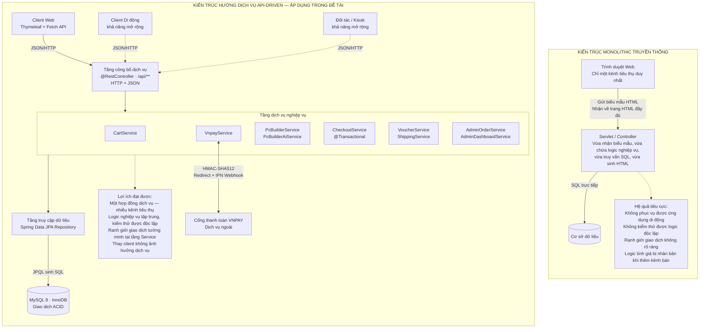
```mermaid
flowchart TD
    subgraph MONO["KIẾN TRÚC MONOLITHIC TRUYỀN THỐNG"]
        direction TB
        M1["Trình duyệt Web<br/>Chỉ một kênh tiêu thụ duy nhất"]
        M2["Servlet / Controller<br/>Vừa nhận biểu mẫu, vừa chứa logic nghiệp vụ,<br/>vừa truy vấn SQL, vừa sinh HTML"]
        M3[("Cơ sở dữ liệu")]
        M4["Hệ quả tiêu cực:<br/>Không phục vụ được ứng dụng di động<br/>Không kiểm thử được logic độc lập<br/>Ranh giới giao dịch không rõ ràng<br/>Logic tính giá bị nhân bản khi thêm kênh bán"]
        M1 -->|"Gửi biểu mẫu HTML<br/>Nhận về trang HTML đầy đủ"| M2
        M2 -->|"SQL trực tiếp"| M3
        M2 -.-> M4
    end

    subgraph SOA["KIẾN TRÚC HƯỚNG DỊCH VỤ API-DRIVEN — ÁP DỤNG TRONG ĐỀ TÀI"]
        direction TB
        C1["Client Web<br/>Thymeleaf + Fetch API"]
        C2["Client Di động<br/>khả năng mở rộng"]
        C3["Đối tác / Kiosk<br/>khả năng mở rộng"]
        GW["Tầng công bố dịch vụ<br/>@RestController · /api/**<br/>HTTP + JSON"]
        subgraph SVC["Tầng dịch vụ nghiệp vụ"]
            S1["CartService"]
            S2["PcBuilderService<br/>PcBuilderAiService"]
            S3["CheckoutService<br/>@Transactional"]
            S4["VnpayService"]
            S5["VoucherService<br/>ShippingService"]
            S6["AdminOrderService<br/>AdminDashboardService"]
        end
        REPO["Tầng truy cập dữ liệu<br/>Spring Data JPA Repository"]
        DB[("MySQL 8 · InnoDB<br/>Giao dịch ACID")]
        EXT["Cổng thanh toán VNPAY<br/>Dịch vụ ngoài"]
        NOTE["Lợi ích đạt được:<br/>Một hợp đồng dịch vụ — nhiều kênh tiêu thụ<br/>Logic nghiệp vụ tập trung, kiểm thử được độc lập<br/>Ranh giới giao dịch tường minh tại tầng Service<br/>Thay client không ảnh hưởng dịch vụ"]

        C1 -->|"JSON/HTTP"| GW
        C2 -.->|"JSON/HTTP"| GW
        C3 -.->|"JSON/HTTP"| GW
        GW --> SVC
        SVC --> REPO
        REPO -->|"JPQL sinh SQL"| DB
        S4 <-->|"HMAC-SHA512<br/>Redirect + IPN Webhook"| EXT
        SVC -.-> NOTE
    end
```

**Phân tích sơ đồ:** Sự khác biệt bản chất nằm ở vị trí của **ranh giới hợp đồng**. Trong mô hình nguyên khối, ranh giới duy nhất là biểu mẫu HTML — một giao diện chỉ trình duyệt hiểu được, không có lược đồ hình thức, không thể kiểm thử tự động ở mức nghiệp vụ. Trong mô hình hướng dịch vụ, ranh giới là một tập endpoint REST trao đổi JSON — có lược đồ tường minh (DTO), có ngữ nghĩa lỗi chuẩn hóa (mã trạng thái HTTP), và bất kỳ bên nào cũng tiêu thụ được. Chính ranh giới này cho phép ba mũi tên `C1`, `C2`, `C3` cùng trỏ vào một cổng dịch vụ duy nhất mà không cần nhân bản logic nghiệp vụ.

**Bảng 1.1 – So sánh kiến trúc Monolithic và kiến trúc hướng dịch vụ**

| Tiêu chí so sánh | Kiến trúc Monolithic truyền thống | Kiến trúc hướng dịch vụ (SOA/API-driven) | Áp dụng trong đề tài |
|---|---|---|---|
| **Ranh giới hợp đồng** | Biểu mẫu HTML, chỉ trình duyệt hiểu | Endpoint REST + lược đồ JSON, mọi nền tảng hiểu | Hợp đồng REST được đặc tả tường minh tại mục 2.4.3 và 3.2.2 |
| **Số kênh tiêu thụ hỗ trợ** | Một (trình duyệt web) | Nhiều (web, di động, đối tác, IoT) | Hiện có một client web; hợp đồng sẵn sàng cho client thứ hai |
| **Vị trí logic nghiệp vụ** | Phân tán trong Controller và View | Tập trung trong tầng Service | Toàn bộ quy tắc nằm trong gói `com.banlinhkien.service` |
| **Khả năng kiểm thử tự động** | Thấp, phải mô phỏng HTTP và phân tích HTML | Cao, kiểm thử trực tiếp phương thức dịch vụ và khẳng định trên JSON | 55 ca kiểm thử tự động, trong đó có kiểm thử đa luồng trên `CheckoutService` |
| **Ranh giới giao dịch** | Mơ hồ, dễ rò rỉ giữa các tầng | Tường minh tại biên phương thức dịch vụ | `@Transactional` đặt tại `CheckoutService.placeOrder()` và `AdminOrderService.updateStatus()` |
| **Khả năng tiến hóa độc lập** | Thấp, sửa giao diện có nguy cơ làm hỏng nghiệp vụ | Cao, giao diện và dịch vụ tiến hóa độc lập | Đã kiểm chứng: đổi bố cục Thymeleaf không cần sửa lớp dịch vụ |
| **Khả năng mở rộng quy mô** | Nhân bản toàn bộ ứng dụng | Có thể nhân bản hoặc tách riêng dịch vụ có tải cao | Hiện là monolith phân tầng; đường tiến hóa đã được chuẩn bị |
| **Độ phức tạp triển khai** | Thấp (một tiến trình, một gói) | Trung bình đến cao (đặc biệt nếu tách microservices) | Chọn monolith phân tầng để giữ độ phức tạp phù hợp quy mô bài tập lớn |
| **Độ trễ nội bộ** | Rất thấp (gọi phương thức trong bộ nhớ) | Cao hơn nếu dịch vụ tách tiến trình | Thấp: các dịch vụ chạy cùng JVM, chỉ giao tiếp ngoài với VNPAY |
| **Tính nhất quán dữ liệu** | Dễ đạt (một cơ sở dữ liệu, một giao dịch) | Khó hơn nếu tách cơ sở dữ liệu (cần saga/2PC) | Đạt tính nhất quán mạnh nhờ dùng chung một cơ sở dữ liệu ACID |

### 1.2.5. Định vị kiến trúc của hệ thống trong phổ SOA

Một sai lầm thường gặp trong các báo cáo bài tập lớn là tự nhận hệ thống Spring Boot của mình là "microservices". Nhóm chủ động tránh sai lầm này bằng cách định vị kiến trúc một cách chính xác.

**Hình 1.2 – Sơ đồ định vị kiến trúc của hệ thống trong phổ SOA**

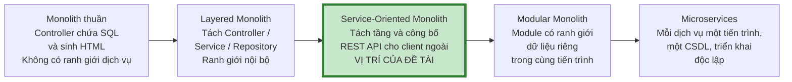
```mermaid
flowchart LR
    A["Monolith thuần<br/>Controller chứa SQL<br/>và sinh HTML<br/>Không có ranh giới dịch vụ"]
    B["Layered Monolith<br/>Tách Controller /<br/>Service / Repository<br/>Ranh giới nội bộ"]
    C["Service-Oriented Monolith<br/>Tách tầng và công bố<br/>REST API cho client ngoài<br/>VỊ TRÍ CỦA ĐỀ TÀI"]
    D["Modular Monolith<br/>Module có ranh giới<br/>dữ liệu riêng<br/>trong cùng tiến trình"]
    E["Microservices<br/>Mỗi dịch vụ một tiến trình,<br/>một CSDL, triển khai<br/>độc lập"]
    A --> B --> C --> D --> E
    style C fill:#c8e6c9,stroke:#2e7d32,stroke-width:4px
```

**Biện luận định vị:** Hệ thống của đề tài là một **Service-Oriented Monolith** — một ứng dụng triển khai dưới dạng một tiến trình JVM duy nhất, nhưng được tổ chức nội bộ theo nguyên lý hướng dịch vụ và **công bố năng lực nghiệp vụ ra bên ngoài dưới dạng hợp đồng REST API cho bên tiêu thụ độc lập**. Cụ thể:

| Đặc trưng của microservices | Hệ thống có hay không | Giải thích |
|---|---|---|
| Nhiều tiến trình triển khai độc lập | **Không** | Toàn bộ chạy trong một tiến trình Spring Boot tại cổng 8088 |
| Mỗi dịch vụ sở hữu cơ sở dữ liệu riêng | **Không** | Các dịch vụ dùng chung lược đồ `db_ban_linh_kien` |
| Service registry và service discovery | **Không** | Không sử dụng Eureka/Consul |
| API Gateway | **Không** | Client gọi trực tiếp endpoint |
| Giao tiếp liên dịch vụ qua mạng | **Một phần** | Chỉ giao tiếp ngoài với VNPAY và Groq |

| Đặc trưng của SOA | Hệ thống có hay không | Giải thích |
|---|---|---|
| Hợp đồng dịch vụ tường minh, độc lập nền tảng | **Có** | REST + JSON, có DTO làm lược đồ |
| Ràng buộc lỏng giữa bên cung cấp và bên tiêu thụ | **Có** | Client chỉ phụ thuộc hợp đồng |
| Khả năng tái sử dụng dịch vụ | **Có** | `CartService`, `VnpayService` phục vụ nhiều bên tiêu thụ |
| Khả năng kết hợp dịch vụ | **Có** | `CheckoutService` là dịch vụ tổ hợp |
| Tích hợp dịch vụ bên thứ ba | **Có** | VNPAY Payment Gateway, Groq LLM API |

Việc lựa chọn Service-Oriented Monolith thay vì microservices là **quyết định kiến trúc có cơ sở**, không phải hạn chế do thiếu năng lực. Với quy mô nghiệp vụ hiện tại và yêu cầu **tính nhất quán mạnh** trong giao dịch trừ kho – đặt hàng – ghi nhận thanh toán, việc giữ toàn bộ nghiệp vụ trong một ranh giới giao dịch ACID duy nhất là lựa chọn kỹ thuật đúng đắn. Nếu tách thành microservices, nghiệp vụ đặt hàng sẽ phải chuyển sang mô hình nhất quán cuối (eventual consistency) với saga và giao dịch bù trừ — làm tăng đáng kể độ phức tạp mà không mang lại lợi ích tương xứng ở quy mô này.

## 1.3. Tổng quan về công nghệ sử dụng trong đề tài

### 1.3.1. Java 17/21 và hệ sinh thái Spring Boot 3.x

#### a) Nền tảng ngôn ngữ Java

Dự án khai báo `java.version = 17` làm phiên bản tối thiểu trong tệp `pom.xml`, đồng thời cấu hình `maven-compiler-plugin` với `source`/`target` là `21` để tận dụng các tính năng ngôn ngữ mới nhất của phiên bản hỗ trợ dài hạn. Các tính năng hiện đại được khai thác trực tiếp trong mã nguồn:

| Tính năng | Phiên bản giới thiệu | Ứng dụng cụ thể trong hệ thống |
|---|---|---|
| **Record** | Java 16 | `PcBuilderService.SelectResult` và `PcBuilderService.BatchAddResult` được khai báo là record, tạo ra các đối tượng kết quả bất biến, ngắn gọn, tự sinh `equals`/`hashCode`/`toString` |
| **Switch expression với mũi tên** | Java 14 | `VnpayApiController.handleIpn()` ánh xạ mã phản hồi sang thông điệp bằng `switch (rspCode) { case "97" -> ... }` |
| **Text block** | Java 15 | Sử dụng cho các chuỗi truy vấn JPQL nhiều dòng |
| **`var` suy luận kiểu cục bộ** | Java 10 | Giảm nhiễu cú pháp trong các khối xử lý |
| **`Map.ofEntries` / `List.of` bất biến** | Java 9 | `VnpayService.getErrorMessage()` dựng bảng tra mã lỗi bất biến |
| **Stream API nâng cao (`toList()`)** | Java 16 | `CheckoutService` sắp xếp danh sách khóa sản phẩm: `requestedQuantities.keySet().stream().sorted().toList()` |

**Lý do lựa chọn:** Java được chọn vì ba lý do phù hợp trực tiếp với yêu cầu đề tài: (i) hệ thống kiểu tĩnh mạnh giúp phát hiện lỗi hợp đồng dữ liệu ngay tại thời điểm biên dịch, đặc biệt quan trọng khi làm việc với `BigDecimal` cho dữ liệu tiền tệ; (ii) mô hình đa luồng trưởng thành với các tiện ích trong `java.util.concurrent` cho phép hiện thực kiểm thử tranh chấp tồn kho một cách tin cậy; (iii) hệ sinh thái thư viện doanh nghiệp phong phú, đặc biệt là Spring Framework.

#### b) Spring Boot 3.4.3 và cơ chế tự động cấu hình

**Spring Boot** là lớp bao có định kiến (opinionated wrapper) trên Spring Framework, giải quyết bài toán cấu hình rườm rà của Spring truyền thống thông qua ba cơ chế:

1. **Auto-configuration (Tự động cấu hình).** Chú thích `@SpringBootApplication` trên lớp `BanLinhKienApplication` kích hoạt `@EnableAutoConfiguration`. Spring Boot quét classpath và tự động đăng ký các bean cần thiết dựa trên các thư viện hiện diện: phát hiện `spring-boot-starter-web` thì đăng ký `DispatcherServlet` và máy chủ Tomcat nhúng; phát hiện `mysql-connector-j` cùng thuộc tính `spring.datasource.url` thì tạo `DataSource` với bể kết nối HikariCP; phát hiện `spring-boot-starter-thymeleaf` thì đăng ký `ThymeleafViewResolver` và `TemplateEngine`.

2. **Starter dependencies (Gói phụ thuộc khởi tạo).** Mỗi starter là một nhóm phụ thuộc đã được kiểm chứng tương thích phiên bản với nhau. Dự án sử dụng bảy starter: `web`, `data-jpa`, `security`, `validation`, `thymeleaf`, `test` và `devtools`.

3. **Externalized configuration (Cấu hình ngoại vi).** Toàn bộ cấu hình tập trung tại `application.yml`, hỗ trợ thay thế bằng biến môi trường theo cú pháp `${BIEN:gia_tri_mac_dinh}`. Cơ chế này được hệ thống sử dụng để **không bao giờ đưa bí mật vào mã nguồn**: `password: ${DB_PASSWORD:}`, `hash-secret: ${VNPAY_HASH_SECRET:TEST_SECRET_KEY}`, `tmn-code: ${VNPAY_TMN_CODE:YOUR_TMN_CODE}`.

#### c) Inversion of Control và Dependency Injection

**Đảo ngược điều khiển** là nguyên lý theo đó việc khởi tạo và quản lý vòng đời đối tượng được chuyển giao từ mã ứng dụng sang một container. **Tiêm phụ thuộc** là kỹ thuật hiện thực nguyên lý đó: thay vì lớp tự tạo ra phụ thuộc bằng `new`, phụ thuộc được cung cấp từ bên ngoài.

Hệ thống áp dụng **tiêm qua hàm khởi tạo** (constructor injection) trên toàn bộ mã nguồn, thông qua chú thích `@RequiredArgsConstructor` của Lombok kết hợp với các trường `private final`:

```java
@Service
@RequiredArgsConstructor
@Slf4j
public class CheckoutService {
    private final ProductRepository productRepository;
    private final OrderRepository orderRepository;
    private final OrderItemRepository orderItemRepository;
    private final WarehouseLogRepository warehouseLogRepository;
    private final UserAddressRepository userAddressRepository;
    private final VoucherRepository voucherRepository;
    private final VoucherService voucherService;
    private final ShippingService shippingService;
    // ...
}
```

Lựa chọn tiêm qua hàm khởi tạo thay vì tiêm qua trường mang lại bốn lợi ích cụ thể: (i) các phụ thuộc là `final`, bảo đảm tính bất biến sau khi khởi tạo; (ii) đối tượng luôn ở trạng thái hợp lệ ngay sau khi được tạo, không tồn tại "cửa sổ" mà phụ thuộc còn `null`; (iii) lớp có thể được khởi tạo thủ công trong kiểm thử đơn vị mà không cần container Spring — chính điều này cho phép `CartServiceTest` và `PcBuilderServiceTest` chạy rất nhanh với đối tượng giả lập Mockito; (iv) phụ thuộc vòng được phát hiện ngay khi khởi động ứng dụng.

#### d) Spring Web MVC và mô hình xử lý yêu cầu

Spring Web MVC hiện thực mẫu Front Controller: mọi yêu cầu HTTP đi qua `DispatcherServlet` duy nhất, được định tuyến tới phương thức xử lý phù hợp thông qua `HandlerMapping`. Hệ thống sử dụng hai biến thể bộ điều khiển với ngữ nghĩa khác nhau rõ rệt:

| Chú thích | Cơ chế xử lý giá trị trả về | Kết quả gửi về client | Ví dụ trong hệ thống |
|---|---|---|---|
| `@Controller` | Chuỗi trả về được hiểu là **tên khung nhìn**, được `ViewResolver` phân giải thành tệp Thymeleaf; dữ liệu truyền qua `Model` | Tài liệu HTML hoàn chỉnh | `ProductViewController.show()` trả `"products/show"` |
| `@RestController` | Tương đương `@Controller` kết hợp `@ResponseBody`; đối tượng trả về được `HttpMessageConverter` (Jackson) tuần tự hóa | Tài liệu JSON | `CartApiController.addToCart()` trả `ResponseEntity<CartApiResponse>` |

Sự phân tách hai loại bộ điều khiển này chính là hiện thực kỹ thuật của ranh giới kiến trúc đã nêu ở mục 1.2: gói `controller.api` là **nhà cung cấp dịch vụ**, gói `controller.view` là **bên tiêu thụ dịch vụ ở phía máy chủ**.

### 1.3.2. Spring Data JPA và ORM Hibernate 6

#### a) Vấn đề trở kháng đối tượng – quan hệ

Mô hình đối tượng (kế thừa, đa hình, tham chiếu, đồ thị đối tượng) và mô hình quan hệ (bảng, hàng, cột, khóa ngoại, phép nối) có bản chất khác nhau. Sự khác biệt này được gọi là **trở kháng đối tượng – quan hệ** (object–relational impedance mismatch). ORM là lớp phần mềm trung gian giải quyết sự khác biệt đó, cho phép lập trình viên làm việc với đồ thị đối tượng Java trong khi dữ liệu vẫn được lưu trữ ở dạng quan hệ.

#### b) Jakarta Persistence API và Hibernate 6

**JPA** là đặc tả chuẩn; **Hibernate** là hiện thực phổ biến nhất của đặc tả này và là hiện thực mặc định trong Spring Boot. Điểm đáng lưu ý là Spring Boot 3.x đã chuyển từ không gian tên `javax.persistence` sang `jakarta.persistence` — toàn bộ entity trong dự án sử dụng `import jakarta.persistence.*`.

Cơ chế ánh xạ được minh họa qua entity `Product`:

```java
@Entity
@Table(name = "products")
@Getter @Setter @NoArgsConstructor @AllArgsConstructor @Builder
public class Product {
    @Id
    @GeneratedValue(strategy = GenerationType.IDENTITY)
    private Long id;

    @ManyToOne(fetch = FetchType.LAZY)
    @JoinColumn(name = "category_id")
    private Category category;

    @ManyToOne(fetch = FetchType.LAZY)
    @JoinColumn(name = "brand_id")
    private Brand brand;

    @Column(precision = 15, scale = 2)
    private BigDecimal price;
    // ...
}
```

Ba quyết định thiết kế quan trọng cần phân tích:

1. **`GenerationType.IDENTITY`** ủy thác việc sinh khóa chính cho cột `AUTO_INCREMENT` của MySQL, phù hợp với lược đồ cơ sở dữ liệu có sẵn.
2. **`FetchType.LAZY` cho mọi quan hệ `@ManyToOne`.** Mặc định của JPA cho `@ManyToOne` là `EAGER`, nghĩa là mỗi lần tải một `Product`, Hibernate sẽ tự động nối bảng để tải luôn `Category` và `Brand` — gây lãng phí khi chỉ cần thông tin sản phẩm. Hệ thống ghi đè thành `LAZY` để kiểm soát chủ động thời điểm tải dữ liệu liên kết.
3. **`BigDecimal` cho mọi trường tiền tệ**, ánh xạ sang `DECIMAL(15,2)`. Đây là yêu cầu bắt buộc về tính đúng đắn tài chính: kiểu `double`/`float` biểu diễn số theo chuẩn IEEE 754 nhị phân, không biểu diễn chính xác được các phân số thập phân, dẫn tới sai số tích lũy khi cộng dồn nhiều mục hàng có giá trị lớn.

Ngoài ra, hệ thống còn sử dụng **bộ chuyển đổi thuộc tính tùy biến** (`AttributeConverter`) cho enum `WarehouseLogType`: giá trị enum trong Java là `IMPORT`/`EXPORT` viết hoa theo quy ước Java, trong khi cột `type` của bảng `warehouse_logs` là `ENUM('import','export')` viết thường. Lớp lồng `WarehouseLogType.ConverterImpl` được chú thích `@Converter(autoApply = true)` thực hiện ánh xạ hai chiều tự động, cho phép giữ nguyên cả quy ước đặt tên Java lẫn lược đồ cơ sở dữ liệu kế thừa.

#### c) Spring Data JPA và bốn cơ chế sinh truy vấn

Spring Data JPA loại bỏ hoàn toàn mã lặp của tầng DAO. Lập trình viên chỉ khai báo interface kế thừa `JpaRepository<T, ID>`; Spring sinh ra hiện thực tại thời điểm chạy. Hệ thống khai thác bốn cơ chế truy vấn khác nhau:

**Cơ chế 1 – Truy vấn dẫn xuất từ tên phương thức (Derived Query).** Spring phân tích cú pháp tên phương thức thành truy vấn:

```java
Page<Product> findByCategoryIdAndIsActiveTrue(Long categoryId, Pageable pageable);
List<Product> findTop12ByIsActiveTrueAndIsFeaturedTrueOrderByCreatedAtDesc();
Optional<Voucher> findByCodeIgnoreCaseAndIsActiveTrue(String code);
boolean existsByVoucherIdAndUserId(Long voucherId, Long userId);
```

**Cơ chế 2 – Truy vấn JPQL tường minh với `@Query`.** Dùng khi logic vượt quá khả năng biểu đạt của tên phương thức:

```java
@Query("SELECT COUNT(p) FROM Product p WHERE p.isActive = true AND p.quantity <= 5")
long countLowStockProducts();
```

**Cơ chế 3 – `@EntityGraph` để giải quyết bài toán N+1.** Đây là một trong những vấn đề hiệu năng nghiêm trọng nhất của ORM: khi tải một danh sách N sản phẩm rồi truy cập `product.getCategory().getName()` cho từng phần tử, Hibernate phát sinh thêm N truy vấn phụ. Hệ thống giải quyết bằng cách khai báo đồ thị thực thể cần tải cùng lúc:

```java
@EntityGraph(attributePaths = {"category", "brand"})
Page<Product> findByIsActiveTrue(Pageable pageable);
```

Hibernate sẽ sinh ra một truy vấn duy nhất với `LEFT JOIN FETCH`, giảm từ `1 + 2N` truy vấn xuống còn `1` truy vấn.

**Cơ chế 4 – `Specification` cho truy vấn động.** Lớp `ProductSpecification` sử dụng Criteria API để dựng vị từ (predicate) động tại thời điểm chạy, phục vụ bộ lọc quản trị nhiều tiêu chí tùy chọn (từ khóa, danh mục, thương hiệu, trạng thái tồn kho, trạng thái kích hoạt). Ưu điểm so với việc nối chuỗi SQL là **an toàn tuyệt đối trước tấn công SQL Injection**, vì mọi giá trị đều được truyền dưới dạng tham số ràng buộc chứ không ghép vào chuỗi truy vấn.

#### d) Khóa bi quan cấp độ JPA

Đây là tính năng có ý nghĩa quyết định đối với tính toàn vẹn tồn kho của hệ thống:

```java
@Lock(LockModeType.PESSIMISTIC_WRITE)
@Query("SELECT p FROM Product p WHERE p.id = :id")
Optional<Product> findByIdForUpdate(@Param("id") Long id);
```

Chú thích `@Lock(LockModeType.PESSIMISTIC_WRITE)` chỉ thị Hibernate thêm mệnh đề `FOR UPDATE` vào câu lệnh `SELECT` được sinh ra. Trên engine InnoDB của MySQL, mệnh đề này đặt một khóa ghi độc quyền (exclusive lock) trên bản ghi tương ứng; mọi giao dịch khác muốn đọc-để-ghi cùng bản ghi sẽ bị chặn cho tới khi giao dịch hiện tại kết thúc bằng `COMMIT` hoặc `ROLLBACK`. Cơ chế này là nền tảng cho giải pháp chống bán vượt tồn kho được phân tích chi tiết tại mục 3.2.3.

### 1.3.3. Spring Security 6

#### a) Kiến trúc chuỗi bộ lọc

Spring Security hoạt động theo mô hình **chuỗi bộ lọc servlet** (filter chain). Một bộ lọc ủy nhiệm (`DelegatingFilterProxy`) được đăng ký vào vòng đời servlet container, chuyển tiếp yêu cầu tới `FilterChainProxy`, bộ này lần lượt áp dụng các bộ lọc chuyên trách: quản lý ngữ cảnh bảo mật, xử lý đăng nhập biểu mẫu, xử lý đăng xuất, xử lý ngoại lệ bảo mật, và cuối cùng là bộ lọc ủy quyền.

Spring Security 6 (đi kèm Spring Boot 3.x) loại bỏ hoàn toàn lớp `WebSecurityConfigurerAdapter` đã lỗi thời, chuyển sang mô hình khai báo bean `SecurityFilterChain` với cú pháp lambda. Cấu hình của hệ thống trong lớp `SecurityConfig`:

```java
@Bean
public SecurityFilterChain securityFilterChain(HttpSecurity http) throws Exception {
    http.authenticationProvider(authenticationProvider())
        .authorizeHttpRequests(auth -> auth
            .requestMatchers("/css/**", "/js/**", "/img/**", "/favicon.ico", "/webjars/**").permitAll()
            .requestMatchers("/", "/san-pham/**", "/danh-muc/**", "/api/**", "/vnpay/**").permitAll()
            .requestMatchers("/login", "/register").permitAll()
            .requestMatchers("/admin/**").hasRole("ADMIN")
            .requestMatchers("/profile/**", "/tai-khoan/**").authenticated()
            .anyRequest().permitAll())
        .formLogin(form -> form
            .loginPage("/login")
            .loginProcessingUrl("/login")
            .successHandler(/* điều hướng theo vai trò */)
            .failureUrl("/login?error=true").permitAll())
        .logout(logout -> logout
            .logoutUrl("/logout")
            .logoutSuccessUrl("/login?logout=true")
            .invalidateHttpSession(true)
            .deleteCookies("JSESSIONID").permitAll())
        .csrf(csrf -> csrf.disable());
    return http.build();
}
```

#### b) Quy trình xác thực

Quy trình xác thực trong hệ thống diễn ra theo sáu bước:

1. `UsernamePasswordAuthenticationFilter` chặn yêu cầu `POST /login`, trích xuất tham số `username` và `password`, đóng gói thành đối tượng `UsernamePasswordAuthenticationToken` chưa xác thực.
2. Token được chuyển cho `AuthenticationManager`, bộ này ủy thác cho `DaoAuthenticationProvider` đã được đăng ký.
3. `DaoAuthenticationProvider` gọi `CustomUserDetailsService.loadUserByUsername()`. Hiện thực của hệ thống cho phép đăng nhập **bằng tên đăng nhập hoặc email** thông qua truy vấn `userRepository.findByUsernameOrEmail(login)`.
4. Lớp dịch vụ này kiểm tra cờ `is_blocked`; nếu tài khoản bị khóa, ném `UsernameNotFoundException` kèm lý do khóa lấy từ trường `blocked_reason`.
5. Danh sách quyền hạn được xây dựng từ trường `users.role` bằng cách thêm tiền tố chuẩn `ROLE_` trước tên vai trò viết hoa. Bổ sung một quy tắc dự phòng: nếu cờ `is_admin = 1` mà vai trò chưa phải `ADMIN`, hệ thống tự cấp thêm `ROLE_ADMIN` — bảo đảm tương thích ngược với dữ liệu di trú từ hệ thống cũ.
6. `DaoAuthenticationProvider` so khớp mật khẩu bằng `PasswordEncoder.matches()`. Nếu khớp, đối tượng `Authentication` đã xác thực được đặt vào `SecurityContextHolder` và lưu vào phiên. Bộ xử lý thành công tùy biến (`successHandler`) kiểm tra quyền hạn để điều hướng quản trị viên tới `/admin` và khách hàng tới trang chủ.

#### c) Mã hóa mật khẩu với BCrypt

Hệ thống đăng ký `BCryptPasswordEncoder` làm bean `PasswordEncoder`. BCrypt có ba đặc tính quan trọng đối với bảo mật mật khẩu:

- **Một chiều (one-way).** Không tồn tại phép biến đổi ngược từ giá trị băm về mật khẩu gốc.
- **Có muối ngẫu nhiên (salted).** Mỗi lần băm sinh ra một chuỗi muối 128-bit ngẫu nhiên, được nhúng vào chính chuỗi kết quả. Hệ quả là cùng một mật khẩu băm hai lần sẽ cho hai chuỗi khác nhau, vô hiệu hóa tấn công bằng bảng tra trước (rainbow table).
- **Có hệ số chi phí điều chỉnh được (adaptive cost factor).** Số vòng lặp là `2^cost`. Khi phần cứng mạnh lên, có thể tăng `cost` để duy trì chi phí tấn công vét cạn ở mức không khả thi.

Cấu trúc chuỗi băm BCrypt gồm định danh phiên bản thuật toán (`$2a$`, `$2b$`, `$2y$`), hệ số chi phí, phần muối và phần giá trị băm nối liền.

**Một phát hiện kỹ thuật đáng lưu ý của đề tài:** Cơ sở dữ liệu của hệ thống được kế thừa từ một ứng dụng PHP/Laravel trước đó, trong đó mật khẩu được băm với tiền tố `$2y$` — biến thể do PHP sử dụng. Nhóm đã xác minh thông qua lớp kiểm thử chuyên biệt `BcryptSpikeTest` rằng `BCryptPasswordEncoder` của Spring Security **tự động nhận diện và so khớp thành công** cả ba biến thể `$2a$`, `$2b$`, `$2y$`, đồng thời **tự động đọc hệ số chi phí từ chính chuỗi băm** thay vì dùng giá trị cấu hình mặc định. Nhờ phát hiện này, hệ thống mới có thể sử dụng trực tiếp toàn bộ tài khoản người dùng cũ mà không cần buộc người dùng đặt lại mật khẩu — một yêu cầu quan trọng khi di trú hệ thống đang vận hành.

#### d) Phân quyền theo vai trò và hạn chế đã nhận diện

Hệ thống áp dụng RBAC ở mức URL thông qua `.requestMatchers("/admin/**").hasRole("ADMIN")`. Phương thức `hasRole("ADMIN")` tự động thêm tiền tố `ROLE_`, tương đương `hasAuthority("ROLE_ADMIN")`.

**Nhóm chủ động ghi nhận hai hạn chế bảo mật hiện hữu:**

*Hạn chế thứ nhất – Bảo vệ CSRF đang bị vô hiệu hóa.* Dòng `.csrf(csrf -> csrf.disable())` tắt cơ chế chống giả mạo yêu cầu liên trang. Quyết định này được đưa ra trong giai đoạn phát triển nhằm cho phép mã JavaScript gọi API bằng Fetch mà không phải quản lý token CSRF. Tuy nhiên, vì hệ thống sử dụng xác thực dựa trên cookie phiên, đây là một rủi ro thực sự: kẻ tấn công có thể dựng một trang web độc hại chứa biểu mẫu tự động gửi tới `/admin/products/{id}/delete`, và nếu quản trị viên đang có phiên hợp lệ thì thao tác sẽ được thực thi mà không cần sự đồng ý của họ. **Khuyến nghị khắc phục:** bật lại bảo vệ CSRF, đưa token vào thẻ `<meta>` của bố cục Thymeleaf và gửi kèm trong tiêu đề `X-CSRF-TOKEN` của mọi lời gọi Fetch; chỉ miễn trừ riêng endpoint `/api/vnpay/ipn` vì bên gọi là máy chủ VNPAY chứ không phải trình duyệt có cookie phiên.

*Hạn chế thứ hai – Quy tắc `anyRequest().permitAll()`.* Quy tắc bắt-tất-cả này mở mặc định cho mọi đường dẫn chưa được liệt kê tường minh. Nguyên tắc bảo mật "từ chối mặc định" (deny by default) đòi hỏi thay bằng `anyRequest().authenticated()` và liệt kê đầy đủ các đường dẫn công khai.

### 1.3.4. Hệ quản trị cơ sở dữ liệu MySQL 8

#### a) Lý do lựa chọn và cấu hình kết nối

MySQL 8 được chọn vì bốn lý do: hỗ trợ giao dịch ACID đầy đủ qua engine InnoDB; hiệu năng đọc cao phù hợp với đặc thù tải của thương mại điện tử; công cụ quản trị phong phú và cộng đồng hỗ trợ lớn; chi phí bằng không cho phiên bản cộng đồng.

Cấu hình kết nối trong `application.yml` khai báo rõ ba nhóm tham số quan trọng: `serverTimezone=Asia/Ho_Chi_Minh` để dấu thời gian đơn hàng khớp múi giờ Việt Nam; `characterEncoding=UTF-8` để lưu trữ chính xác tiếng Việt có dấu; và bộ tham số HikariCP (`maximum-pool-size: 10`, `minimum-idle: 2`, `idle-timeout: 30000`, `connection-timeout: 20000`) giới hạn số kết nối đồng thời và thời gian chờ.

Một cấu hình đáng chú ý khác là `spring.jpa.hibernate.ddl-auto: none`. Giá trị này chỉ thị Hibernate **không tự động tạo hay sửa đổi lược đồ cơ sở dữ liệu**. Lược đồ được quản lý tường minh bằng tệp `db_ban_linh_kien.sql`. Đây là thực hành đúng đắn cho hệ thống có dữ liệu thật: việc để Hibernate tự sửa lược đồ có nguy cơ làm mất dữ liệu hoặc mất chỉ mục đã tối ưu thủ công.

Bên cạnh đó, hệ thống khai báo `naming.physical-strategy: CamelCaseToUnderscoresNamingStrategy`, cho phép tên thuộc tính Java kiểu camelCase (`discountPercent`, `isActive`, `createdAt`) tự động ánh xạ sang tên cột kiểu snake_case (`discount_percent`, `is_active`, `created_at`) mà không cần khai báo `@Column(name = ...)` cho từng trường.

#### b) Engine InnoDB và bốn thuộc tính ACID

| Thuộc tính | Định nghĩa | Hiện thực trong hệ thống |
|---|---|---|
| **Atomicity** (Nguyên tử) | Giao dịch hoặc thực hiện trọn vẹn, hoặc không có tác động nào | Toàn bộ chín bước của `CheckoutService.placeOrder()` nằm trong một giao dịch. Nếu bước 7 (ghi `OrderItem`) thất bại, việc trừ kho ở bước 4 và việc tạo `Order` ở bước 6 đều bị hoàn tác hoàn toàn |
| **Consistency** (Nhất quán) | Giao dịch chuyển cơ sở dữ liệu từ trạng thái hợp lệ này sang trạng thái hợp lệ khác | Các ràng buộc khóa ngoại, ràng buộc duy nhất (`uk_orders_access_token`, `unique_user_voucher`) và kiểm tra nghiệp vụ trong tầng dịch vụ cùng bảo đảm bất biến nghiệp vụ |
| **Isolation** (Cô lập) | Các giao dịch đồng thời không nhìn thấy trạng thái trung gian của nhau | Mức cô lập mặc định của InnoDB là `REPEATABLE READ`; hệ thống nâng cường độ bằng khóa bi quan `SELECT ... FOR UPDATE` tại điểm nóng tranh chấp là bản ghi tồn kho |
| **Durability** (Bền vững) | Dữ liệu đã cam kết tồn tại kể cả khi hệ thống sự cố | InnoDB ghi redo log theo giao thức write-ahead logging trước khi trả kết quả cam kết |

#### c) Chiến lược lập chỉ mục

Lược đồ cơ sở dữ liệu áp dụng chiến lược lập chỉ mục có chủ đích, phản ánh trực tiếp các mẫu truy vấn của ứng dụng:

| Chỉ mục | Bảng | Loại | Mẫu truy vấn được tối ưu |
|---|---|---|---|
| `idx_products_category_active (category_id, is_active)` | `products` | Ghép | Liệt kê sản phẩm đang bán theo danh mục — truy vấn phổ biến nhất của storefront và của công cụ Build PC |
| `idx_products_active_created (is_active, created_at)` | `products` | Ghép | Lấy sản phẩm mới nhất cho trang chủ |
| `idx_products_featured_active (is_featured, is_active)` | `products` | Ghép | Lấy sản phẩm nổi bật |
| `idx_products_discount_active (is_active, discount_percent)` | `products` | Ghép | Lấy sản phẩm đang khuyến mại |
| `idx_products_name_search (name, description)` | `products` | **FULLTEXT** | Tìm kiếm toàn văn theo từ khóa |
| `idx_product_specs_product_name (product_id, spec_name)` | `product_specs` | Ghép | Tra cứu giá trị một thông số cụ thể (ví dụ `Socket`) của một sản phẩm — truy vấn được `PcBuilderService` gọi rất nhiều lần |
| `idx_orders_user_created (user_id, created_at)` | `orders` | Ghép | Liệt kê lịch sử đơn hàng của một khách hàng theo thứ tự thời gian |
| `uk_orders_access_token` | `orders` | **UNIQUE** | Tra cứu đơn hàng theo token, đồng thời bảo đảm token không trùng |
| `unique_user_voucher (voucher_id, user_id)` | `voucher_usages` | **UNIQUE** | Thực thi ở mức cơ sở dữ liệu quy tắc "mỗi người dùng chỉ dùng mỗi mã một lần" |

Nguyên tắc thiết kế chỉ mục ghép được áp dụng là **nguyên tắc tiền tố trái nhất** (leftmost prefix): thứ tự cột trong chỉ mục ghép được sắp xếp sao cho cột có độ chọn lọc cao và xuất hiện trong mệnh đề `WHERE` đẳng thức đứng trước, cột dùng để sắp xếp đứng sau. Nhờ đó, một chỉ mục ghép có thể phục vụ nhiều truy vấn khác nhau.

### 1.3.5. Ứng dụng client: Thymeleaf, Layout Dialect và Fetch API

#### a) Thymeleaf như một máy kết xuất khung

**Thymeleaf** là template engine phía máy chủ theo triết lý "khuôn mẫu tự nhiên" (natural templates): tệp khuôn mẫu là HTML5 hợp lệ, mở được trực tiếp trong trình duyệt ở dạng bản mẫu tĩnh, đồng thời chứa các thuộc tính `th:*` được máy chủ xử lý khi kết xuất.

Trong kiến trúc của đề tài, Thymeleaf đảm nhiệm **kết xuất khung trang và nội dung ổn định** (danh mục, chi tiết sản phẩm, bố cục, điều hướng), còn **nội dung biến động theo tương tác người dùng** (giỏ hàng, cấu hình PC, danh sách huyện/xã, kết quả áp mã) được cập nhật bằng lời gọi API bất đồng bộ. Sự phân công này mang lại ba lợi ích: trang đầu tiên hiển thị nhanh và thân thiện với công cụ tìm kiếm nhờ kết xuất phía máy chủ; các thao tác kế tiếp mượt mà nhờ chỉ cập nhật cục bộ; và tầng dịch vụ REST có bên tiêu thụ thực sự để kiểm chứng hợp đồng.

#### b) Thymeleaf Layout Dialect

Thư viện `nz.net.ultraq.thymeleaf:thymeleaf-layout-dialect` phiên bản 3.3.0 bổ sung mẫu **decorator** cho Thymeleaf. Dự án định nghĩa hai bố cục gốc:

- `templates/layout/storefront.html` — bố cục cho toàn bộ giao diện khách hàng, chứa thanh điều hướng, biểu tượng giỏ hàng có bộ đếm động, chân trang và các tệp tài nguyên chung.
- `templates/layout/admin.html` — bố cục cho bảng điều khiển quản trị, chứa thanh bên với các huy hiệu chỉ số (số đơn chờ xử lý, số sản phẩm sắp hết hàng).

Mỗi trang con khai báo `layout:decorate="~{layout/storefront}"` và chỉ cung cấp phần nội dung riêng thông qua `layout:fragment`, nhờ đó loại bỏ hoàn toàn việc lặp lại mã HTML khung trang trên 44 tệp khuôn mẫu của dự án.

#### c) Thymeleaf Extras Spring Security 6

Thư viện `thymeleaf-extras-springsecurity6` cung cấp không gian tên `sec:` cho phép kết xuất có điều kiện theo quyền hạn ngay trong khuôn mẫu, ví dụ `sec:authorize="hasRole('ADMIN')"` để chỉ hiển thị liên kết vào bảng điều khiển quản trị cho người dùng có vai trò tương ứng. Cần nhấn mạnh rằng đây chỉ là biện pháp **cải thiện trải nghiệm người dùng**, không phải biện pháp bảo mật; việc kiểm soát truy cập thực sự vẫn do chuỗi bộ lọc của Spring Security đảm nhiệm ở phía máy chủ.

#### d) Fetch API và mô hình tiêu thụ dịch vụ phía trình duyệt

Toàn bộ tương tác bất đồng bộ được hiện thực bằng **Fetch API** — giao diện chuẩn của trình duyệt dựa trên `Promise`, thay thế cho `XMLHttpRequest` cổ điển. Hệ thống không sử dụng thư viện bên thứ ba như Axios hay jQuery AJAX cho các lời gọi này, nhằm giảm phụ thuộc và giữ mã client gần với chuẩn web.

Các điểm tiêu thụ API thực tế trong mã nguồn client:

| Tệp khuôn mẫu | Endpoint được gọi | Mục đích |
|---|---|---|
| `layout/storefront.html` | `POST /api/cart/add` | Thêm sản phẩm vào giỏ từ bất kỳ thẻ sản phẩm nào trên toàn site |
| `cart/index.html` | `POST /api/cart/update`, `POST /api/cart/remove`, `POST /api/cart/clear`, `POST /api/voucher/apply` | Quản lý giỏ hàng và áp mã giảm giá |
| `checkout/index.html` | `GET /api/location/districts?province_id=`, `GET /api/location/wards?district_id=` | Tải phụ thuộc ba cấp tỉnh → huyện → xã |
| `buildpc/index.html` | `GET /build-pc/components?category_id=`, `POST /build-pc/select`, `POST /build-pc/ai` | Công cụ ráp cấu hình PC và gợi ý cấu hình |

### 1.3.6. Dịch vụ cổng thanh toán VNPAY và cơ chế checksum HMAC-SHA512

#### a) Vai trò của cổng thanh toán trung gian

Cổng thanh toán trung gian giải quyết bài toán tin cậy giữa ba bên: người mua, người bán và ngân hàng. Website bán hàng **không bao giờ tiếp xúc với thông tin thẻ hoặc thông tin đăng nhập ngân hàng** của khách hàng — dữ liệu nhạy cảm được nhập trực tiếp trên hạ tầng đã đạt chứng nhận bảo mật của VNPAY. Website chỉ tham gia vào hai điểm giao tiếp: tạo yêu cầu thanh toán đã ký số, và tiếp nhận kết quả đã ký số.

#### b) Nguyên lý chữ ký HMAC-SHA512

**HMAC** là cấu trúc mã xác thực thông điệp kết hợp hàm băm mật mã với một khóa bí mật chia sẻ, theo công thức:

```
HMAC(K, m) = H( (K XOR opad) || H( (K XOR ipad) || m ) )
```

trong đó `H` là hàm băm (ở đây là SHA-512), `K` là khóa bí mật (chuỗi `vnp_HashSecret` do VNPAY cấp riêng cho từng merchant), `m` là thông điệp, `opad` và `ipad` là hai hằng số đệm.

HMAC cung cấp đồng thời hai bảo đảm: **tính toàn vẹn** — mọi thay đổi dù chỉ một bit trong thông điệp đều làm giá trị băm thay đổi hoàn toàn; và **tính xác thực nguồn gốc** — chỉ bên nắm khóa bí mật mới tạo được chữ ký hợp lệ. Hai bảo đảm này ngăn chặn kịch bản tấn công điển hình nhất: kẻ tấn công chặn URL chuyển hướng và sửa `vnp_Amount` từ 25.000.000 xuống 1.000 đồng.

#### c) Quy trình ký và xác minh trong hệ thống

**Hình 1.3 – Sơ đồ luồng hoạt động tổng quát của cơ chế ký checksum HMAC-SHA512**

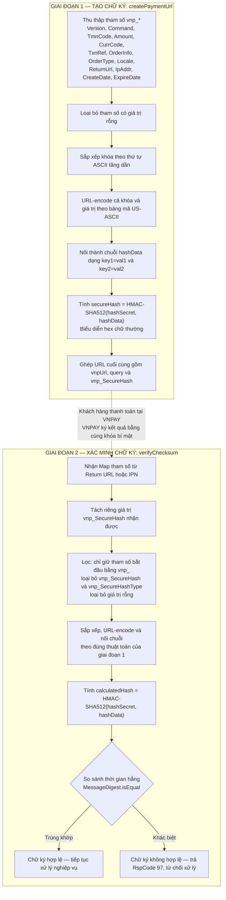
```mermaid
flowchart TD
    subgraph SIGN["GIAI ĐOẠN 1 — TẠO CHỮ KÝ: createPaymentUrl"]
        A1["Thu thập tham số vnp_*<br/>Version, Command, TmnCode, Amount, CurrCode,<br/>TxnRef, OrderInfo, OrderType, Locale,<br/>ReturnUrl, IpAddr, CreateDate, ExpireDate"]
        A2["Loại bỏ tham số có giá trị rỗng"]
        A3["Sắp xếp khóa theo thứ tự ASCII tăng dần"]
        A4["URL-encode cả khóa và giá trị theo bảng mã US-ASCII"]
        A5["Nối thành chuỗi hashData dạng key1=val1 và key2=val2"]
        A6["Tính secureHash = HMAC-SHA512(hashSecret, hashData)<br/>Biểu diễn hex chữ thường"]
        A7["Ghép URL cuối cùng gồm vnpUrl, query và vnp_SecureHash"]
        A1 --> A2 --> A3 --> A4 --> A5 --> A6 --> A7
    end

    subgraph VERIFY["GIAI ĐOẠN 2 — XÁC MINH CHỮ KÝ: verifyChecksum"]
        B1["Nhận Map tham số từ Return URL hoặc IPN"]
        B2["Tách riêng giá trị vnp_SecureHash nhận được"]
        B3["Lọc: chỉ giữ tham số bắt đầu bằng vnp_<br/>loại bỏ vnp_SecureHash và vnp_SecureHashType<br/>loại bỏ giá trị rỗng"]
        B4["Sắp xếp, URL-encode và nối chuỗi<br/>theo đúng thuật toán của giai đoạn 1"]
        B5["Tính calculatedHash = HMAC-SHA512(hashSecret, hashData)"]
        B6{"So sánh thời gian hằng<br/>MessageDigest.isEqual"}
        B7["Chữ ký hợp lệ — tiếp tục xử lý nghiệp vụ"]
        B8["Chữ ký không hợp lệ — trả RspCode 97, từ chối xử lý"]
        B1 --> B2 --> B3 --> B4 --> B5 --> B6
        B6 -->|"Trùng khớp"| B7
        B6 -->|"Khác biệt"| B8
    end

    A7 -.->|"Khách hàng thanh toán tại VNPAY<br/>VNPAY ký kết quả bằng cùng khóa bí mật"| B1
```

**Ba điểm kỹ thuật then chốt cần nhấn mạnh:**

1. **Thứ tự sắp xếp tham số phải tuyệt đối nhất quán.** Cả hai bên (hệ thống bán hàng và VNPAY) đều sắp xếp tên tham số theo thứ tự ASCII tăng dần trước khi nối chuỗi. Chỉ cần một bên sắp xếp khác đi, chữ ký sẽ không bao giờ khớp. Đây là nguyên nhân phổ biến nhất của lỗi "sai chữ ký" khi tích hợp cổng thanh toán.

2. **Đơn vị tiền tệ nhân 100.** VNPAY quy định `vnp_Amount` được biểu diễn bằng đơn vị nhỏ nhất, tức số tiền VND nhân với 100. Hệ thống thực hiện `amount.multiply(BigDecimal.valueOf(100)).longValue()` khi tạo yêu cầu, và thực hiện phép nhân tương tự khi đối chiếu số tiền lúc nhận kết quả.

3. **So sánh chữ ký bằng thuật toán thời gian hằng.** Hệ thống **không** dùng `String.equals()` mà dùng `MessageDigest.isEqual()`:

```java
return MessageDigest.isEqual(
        calculatedHash.toLowerCase().getBytes(StandardCharsets.UTF_8),
        vnpSecureHash.toLowerCase().getBytes(StandardCharsets.UTF_8));
```

Lý do: `String.equals()` thoát khỏi vòng lặp ngay tại byte đầu tiên khác biệt, khiến thời gian thực thi phụ thuộc vào số ký tự đầu trùng khớp. Kẻ tấn công có thể khai thác chênh lệch thời gian này để dò từng byte của chữ ký hợp lệ — đây là **tấn công phân tích thời gian** (timing attack). `MessageDigest.isEqual()` luôn duyệt hết toàn bộ mảng byte, giữ thời gian thực thi không phụ thuộc vào vị trí khác biệt.

#### d) Hai kênh phản hồi kết quả và lý do phải có cả hai

| Đặc điểm | Return URL (`GET /vnpay/return`) | IPN Webhook (`GET /api/vnpay/ipn`) |
|---|---|---|
| Bên khởi tạo lời gọi | Trình duyệt của khách hàng (chuyển hướng) | Máy chủ VNPAY gọi trực tiếp máy chủ bán hàng |
| Mục đích chính | Hiển thị kết quả cho khách hàng | Cập nhật trạng thái đơn hàng một cách tin cậy |
| Độ tin cậy | **Thấp** — khách có thể đóng trình duyệt, mất mạng, hoặc chuyển hướng bị chặn | **Cao** — VNPAY thử lại nhiều lần cho tới khi nhận được phản hồi hợp lệ |
| Khả năng bị giả mạo | Cao (URL nằm trong tay người dùng) | Thấp (gọi từ máy chủ tới máy chủ) |
| Định dạng phản hồi | Chuyển hướng HTTP tới trang kết quả | JSON `{"RspCode": "...", "Message": "..."}` |
| Vai trò trong hệ thống | Trải nghiệm người dùng | **Nguồn chân lý** cho trạng thái thanh toán |

Nguyên tắc thiết kế then chốt: **không bao giờ tin Return URL làm căn cứ duy nhất để ghi nhận thanh toán thành công**. Hệ thống xử lý cả hai kênh qua cùng một phương thức `processPaymentResult()` có tính bất biến, nên dù kênh nào đến trước thì kết quả cuối cùng vẫn đúng và không bị ghi nhận hai lần.

### 1.3.7. Bảng tổng hợp công nghệ và vai trò kiến trúc

**Bảng 1.3 – Tổng hợp công nghệ và vai trò kiến trúc**

| Thành phần kiến trúc | Công nghệ | Phiên bản | Vai trò cụ thể trong hệ thống | Lý do lựa chọn |
|---|---|---|---|---|
| Ngôn ngữ backend | Java | 17 (tối thiểu) / 21 (biên dịch) | Ngôn ngữ hiện thực toàn bộ dịch vụ | Kiểu tĩnh mạnh, đa luồng trưởng thành, hệ sinh thái doanh nghiệp |
| Khung ứng dụng | Spring Boot | 3.4.3 | Tự động cấu hình, quản lý bean, máy chủ nhúng | Giảm cấu hình thủ công, chuẩn công nghiệp |
| Khung web | Spring Web MVC | 6.2.x | Định tuyến HTTP, ràng buộc tham số, tuần tự hóa JSON | Tích hợp sẵn, hỗ trợ cả `@Controller` và `@RestController` |
| Bảo mật | Spring Security | 6.4.x | Xác thực biểu mẫu, phân quyền URL, mã hóa mật khẩu | Chuẩn de-facto cho ứng dụng Spring |
| Truy cập dữ liệu | Spring Data JPA | 3.4.x | Sinh tự động tầng repository, hỗ trợ phân trang và Specification | Loại bỏ mã DAO lặp lại |
| ORM | Hibernate | 6.6.x | Ánh xạ đối tượng – quan hệ, quản lý ngữ cảnh bền vững, sinh SQL | Hiện thực JPA đầy đủ nhất |
| Cơ sở dữ liệu | MySQL | 8.x | Lưu trữ dữ liệu tập trung, bảo đảm ACID, thực thi ràng buộc | InnoDB hỗ trợ giao dịch và khóa hàng |
| Bể kết nối | HikariCP | Mặc định Boot 3.4 | Quản lý và tái sử dụng kết nối cơ sở dữ liệu | Hiệu năng cao nhất trong nhóm connection pool Java |
| Template engine | Thymeleaf | 3.1.x | Kết xuất HTML phía máy chủ | Khuôn mẫu tự nhiên, tích hợp sâu với Spring |
| Bố cục giao diện | Thymeleaf Layout Dialect | 3.3.0 | Mẫu decorator cho bố cục chung | Tránh lặp mã HTML khung trang |
| Tích hợp bảo mật giao diện | thymeleaf-extras-springsecurity6 | 3.1.x | Thuộc tính `sec:authorize` hiển thị theo quyền | Ẩn hoặc hiện phần tử giao diện theo vai trò |
| Tiêu thụ API phía trình duyệt | Fetch API (chuẩn WHATWG) | Chuẩn trình duyệt | Gửi yêu cầu HTTP bất đồng bộ, xử lý JSON | Chuẩn gốc, không cần thư viện ngoài |
| Khung CSS | Bootstrap | 5.x | Lưới đáp ứng, thành phần giao diện | Rút ngắn thời gian dựng giao diện |
| Giảm mã lặp | Project Lombok | Mặc định Boot 3.4 | Sinh getter, setter, builder, constructor, logger | Giảm đáng kể khối lượng mã lặp trong entity và DTO |
| Xử lý JSON | Jackson Databind | Mặc định Boot 3.4 | Tuần tự hóa và giải tuần tự hóa JSON | Bộ chuyển đổi mặc định của Spring |
| Kiểm chứng dữ liệu | Jakarta Bean Validation (Hibernate Validator) | 8.x | Ràng buộc `@NotBlank` trên DTO đầu vào | Kiểm chứng khai báo, tự động kích hoạt bởi `@Valid` |
| Cổng thanh toán | VNPAY Payment Gateway | API v2.1.0 (Sandbox) | Xử lý giao dịch thanh toán trực tuyến | Phổ biến nhất tại Việt Nam, có môi trường thử nghiệm công khai |
| Dịch vụ suy luận ngôn ngữ | Groq API (Llama 3.3 70B) | `llama-3.3-70b-versatile` | Sinh đoạn diễn giải cho cấu hình PC đề xuất | Độ trễ thấp; chỉ dùng cho phần diễn giải, không sinh dữ liệu sản phẩm |
| Khung kiểm thử | JUnit | 5 (Jupiter) | Nền tảng thực thi ca kiểm thử | Chuẩn hiện hành của hệ sinh thái Java |
| Thư viện giả lập | Mockito | Mặc định Boot 3.4 | Tạo đối tượng giả lập cho kiểm thử đơn vị | Cô lập lớp dịch vụ khỏi cơ sở dữ liệu |
| Kiểm thử bảo mật | Spring Security Test | 6.4.x | `@WithMockUser`, `SecurityMockMvcRequestPostProcessors` | Kiểm thử phân quyền không cần đăng nhập thật |
| Kiểm thử tầng web | Spring MockMvc | 6.2.x | Mô phỏng yêu cầu HTTP không khởi động máy chủ thật | Kiểm thử tích hợp nhanh |
| Công cụ xây dựng | Apache Maven (Wrapper) | Wrapper đi kèm dự án | Quản lý phụ thuộc, biên dịch, đóng gói, chạy kiểm thử | Không yêu cầu cài Maven trên máy đích |
| Quản lý mã nguồn | Git / GitHub | — | Quản lý phiên bản, cộng tác nhóm | Chuẩn công nghiệp |
| Kiểm thử API thủ công | Postman | 11.x | Gửi yêu cầu thủ công tới endpoint, kiểm tra phản hồi | Kiểm chứng hợp đồng API độc lập với client |

## 1.4. Khảo sát các hệ thống tương tự và phân tích bài toán

### 1.4.1. Khảo sát các nền tảng bán lẻ linh kiện tiêu biểu

#### a) Phong Vũ

Phong Vũ là chuỗi bán lẻ thiết bị công nghệ lâu đời, có hệ thống cửa hàng vật lý phủ rộng và nền tảng trực tuyến quy mô lớn.

*Ưu điểm:* Danh mục hàng hóa rất rộng, bao phủ cả thiết bị nguyên bộ và linh kiện rời. Thông tin sản phẩm chi tiết, có mô tả kỹ thuật đầy đủ và hình ảnh chất lượng cao. Chính sách bảo hành và đổi trả minh bạch, có mạng lưới trung tâm bảo hành riêng. Tích hợp đa dạng phương thức thanh toán, bao gồm trả góp qua thẻ tín dụng và công ty tài chính.

*Nhược điểm:* Công cụ hỗ trợ xây dựng cấu hình còn sơ khai, chủ yếu dừng ở mức gợi ý các bộ máy dựng sẵn theo phân khúc giá, chưa cho phép người dùng tự ghép linh kiện với kiểm tra tương thích tự động. Bộ lọc sản phẩm chủ yếu dựa trên thương hiệu và khoảng giá, thiếu bộ lọc theo thông số kỹ thuật chuyên sâu như chuẩn socket, chipset bo mạch chủ hay công suất nguồn định mức.

#### b) MemoryZone

MemoryZone định vị là nhà bán lẻ chuyên sâu về linh kiện cao cấp và thiết bị gaming.

*Ưu điểm:* Đây là một trong số ít nền tảng trong nước có công cụ xây dựng cấu hình tương đối hoàn chỉnh, cho phép chọn linh kiện theo từng nhóm và hiển thị tổng chi phí. Thông tin thông số kỹ thuật được chuẩn hóa tốt. Giao diện hiện đại, tối ưu tốt cho thiết bị di động. Cộng đồng người dùng tích cực với nhiều bài đánh giá chi tiết.

*Nhược điểm:* Việc kiểm tra tương thích chưa thực sự chặt chẽ và chưa mang tính ràng buộc — hệ thống có cảnh báo nhưng vẫn cho phép người dùng tạo ra cấu hình không hợp lệ. Chức năng tính tổng công suất tiêu thụ chưa được tích hợp trực tiếp và đầy đủ. Chưa có cơ chế gợi ý cấu hình tự động theo ngân sách và mục đích sử dụng.

#### c) HACOM

HACOM là nhà phân phối và bán lẻ có thế mạnh về máy tính lắp ráp theo yêu cầu và giải pháp máy chủ.

*Ưu điểm:* Có công cụ Build PC cho phép chọn linh kiện theo từng khe, kèm dịch vụ lắp ráp và kiểm thử trước khi giao hàng. Danh mục linh kiện chuyên dụng phong phú, bao gồm cả thiết bị máy chủ và máy trạm. Hệ thống phân phối rộng, thời gian giao hàng nhanh.

*Nhược điểm:* Giao diện người dùng tương đối phức tạp, mật độ thông tin dày đặc gây khó khăn cho người dùng phổ thông. Luồng ráp cấu hình còn nhiều bước thủ công, chưa tự động lọc bỏ linh kiện không tương thích khi người dùng đã chọn CPU hoặc bo mạch chủ. Trải nghiệm trên thiết bị di động chưa được tối ưu tương xứng.

### 1.4.2. Bảng so sánh tính năng

**Bảng 1.4 – So sánh tính năng các nền tảng bán lẻ linh kiện**

| Tiêu chí | Phong Vũ | MemoryZone | HACOM | **Hệ thống của đề tài** |
|---|---|---|---|---|
| Danh mục sản phẩm phong phú | Rất cao | Cao | Rất cao | Trung bình (giới hạn bởi dữ liệu mẫu) |
| Công cụ ráp cấu hình PC | Thấp | Cao | Trung bình | Cao |
| **Kiểm tra tương thích socket tự động và có ràng buộc** | Không | Chỉ cảnh báo | Một phần | **Có — lọc hai chiều và tự loại linh kiện xung đột** |
| **Tính tổng công suất tiêu thụ thời gian thực** | Không | Một phần | Không | **Có** |
| **Gợi ý cấu hình tự động theo ngân sách và mục đích** | Không | Không | Không | **Có — mô hình lai luật kết hợp LLM** |
| Bộ lọc theo thông số kỹ thuật chuyên sâu | Thấp | Trung bình | Trung bình | Cao |
| Thanh toán VNPAY hoặc QR | Có | Có | Có | Có |
| Đa dạng cổng thanh toán (MoMo, ZaloPay, trả góp) | Rất cao | Cao | Cao | Thấp (chỉ VNPAY, COD, chuyển khoản) |
| **Công bố hợp đồng REST API cho bên tiêu thụ độc lập** | Không công khai | Không công khai | Không công khai | **Có — đặc tả đầy đủ trong báo cáo** |
| **Nhật ký biến động tồn kho có kiểm toán** | Nội bộ | Nội bộ | Nội bộ | **Có — bảng `warehouse_logs` ghi mọi lần nhập và xuất** |
| **Chống bán vượt tồn kho được kiểm chứng bằng kiểm thử đa luồng** | Không công bố | Không công bố | Không công bố | **Có — `CheckoutConcurrencyTest`** |
| Quy mô dữ liệu và lưu lượng thực tế | Rất cao | Cao | Rất cao | Thấp |
| Hạ tầng phân tán, CDN, cân bằng tải | Rất cao | Cao | Cao | Không (triển khai cục bộ) |

### 1.4.3. Đánh giá và đề xuất cải tiến

Từ kết quả khảo sát, nhóm rút ra ba nhận định:

**Nhận định thứ nhất:** Các nền tảng thương mại có lợi thế áp đảo về quy mô dữ liệu, độ phủ hàng hóa, hạ tầng và mạng lưới hậu cần. Đây là những lợi thế mà một bài tập lớn môn học không thể và không nên cạnh tranh.

**Nhận định thứ hai:** Tất cả các nền tảng khảo sát đều có **khoảng trống chung về hỗ trợ ra quyết định kỹ thuật**. Không nền tảng nào cung cấp đồng thời ba năng lực: (i) ràng buộc tương thích cứng ở mức không cho phép tạo cấu hình sai; (ii) tính tổng công suất tiêu thụ tức thời; (iii) sinh cấu hình tự động theo ngân sách và mục đích sử dụng.

**Nhận định thứ ba:** Không nền tảng nào công bố hợp đồng dịch vụ cho bên thứ ba. Điều này phản ánh kiến trúc đóng, khó mở rộng kênh bán và khó tích hợp với hệ sinh thái đối tác.

Trên cơ sở đó, đề tài xác định **bốn đóng góp cải tiến** làm trọng tâm:

| Mã | Cải tiến đề xuất | Hiện thực kỹ thuật |
|---|---|---|
| CT01 | **Ràng buộc tương thích socket hai chiều và tự động loại linh kiện xung đột** | `PcBuilderService.normalizeSocket()` chuẩn hóa chuỗi socket (loại bỏ khoảng trắng, gạch nối, gạch dưới và chuyển hoa) để so sánh bền vững; `selectComponent()` kiểm tra hai chiều CPU và Mainboard rồi tự động gỡ linh kiện không tương thích kèm thông điệp cảnh báo; `getComponentsForCategory()` lọc trước danh sách trả về cho client |
| CT02 | **Gợi ý cấu hình lai luật – mô hình ngôn ngữ** | `PcBuilderAiService` luôn chạy bộ luật trên dữ liệu tồn kho thực để sinh cấu hình khả thi với mã sản phẩm và giá chính xác; mô hình ngôn ngữ chỉ được gọi để viết đoạn diễn giải và **không được phép sinh mã sản phẩm hay giá**; nếu lời gọi mô hình thất bại, hệ thống tự động lùi về kết quả thuần luật |
| CT03 | **Bảo đảm toàn vẹn tồn kho được kiểm chứng hình thức** | Khóa bi quan theo thứ tự khóa tăng dần trong `CheckoutService`; ngoại lệ chuyên biệt `InsufficientStockException`; hoàn tác giao dịch tự động; kiểm chứng bằng kiểm thử đa luồng có khẳng định chặt chẽ |
| CT04 | **Công bố hợp đồng dịch vụ REST được đặc tả đầy đủ** | Sáu nhóm tài nguyên API với đặc tả chi tiết động từ, URI, tham số, thân yêu cầu, thân phản hồi và mã trạng thái, trình bày tại mục 2.4.3 và 3.2.2 |

## 1.5. Kết luận chương 1

Chương 1 đã hoàn thành ba nhiệm vụ.

**Thứ nhất**, chương đã xác lập cơ sở thực tiễn của đề tài. Bài toán bán lẻ linh kiện máy tính trực tuyến có bốn đặc thù khiến nó khác biệt căn bản so với thương mại điện tử thông thường: sản phẩm ràng buộc kỹ thuật lẫn nhau, không gian thuộc tính lớn và không đồng nhất, giá trị đơn hàng cao đi kèm tồn kho mỏng, và rủi ro thanh toán lớn. Bốn đặc thù này đòi hỏi một kiến trúc phần mềm đặt logic nghiệp vụ ở vị trí trung tâm và bảo đảm được tính toàn vẹn dữ liệu ở mức giao dịch.

**Thứ hai**, chương đã hệ thống hóa cơ sở lý thuyết. Bốn nguyên lý cốt lõi của SOA (ràng buộc lỏng, tái sử dụng, liên tác, kết hợp) đã được phân tích không phải ở mức định nghĩa trừu tượng, mà gắn với minh chứng cụ thể trong mã nguồn: `CartService` được ba bên tiêu thụ khác nhau sử dụng lại, `CheckoutService` là dịch vụ tổ hợp điều phối bốn dịch vụ thành phần, hợp đồng JSON cho phép liên tác đa nền tảng. Sáu ràng buộc REST đã được đối chiếu với hiện trạng hệ thống một cách trung thực, bao gồm việc thừa nhận rõ rằng hệ thống đạt mức 2 của mô hình trưởng thành Richardson và lưu trạng thái giỏ hàng trong phiên máy chủ như một đánh đổi thiết kế có cân nhắc.

**Thứ ba**, chương đã định vị chính xác kiến trúc của hệ thống là **Service-Oriented Monolith** — không phải microservices — kèm biện luận đầy đủ; luận giải lựa chọn từng công nghệ theo vai trò kiến trúc cụ thể; và khảo sát ba nền tảng thương mại tiêu biểu để xác lập bốn hướng cải tiến trọng tâm (CT01 đến CT04).

Những nội dung này tạo thành khung tham chiếu cho Chương 2, nơi các yêu cầu sẽ được đặc tả hình thức và hệ thống sẽ được thiết kế chi tiết từ mô hình nghiệp vụ, kiến trúc phân tầng, lược đồ dữ liệu, hợp đồng dịch vụ cho tới ứng dụng client.

---

<div style="page-break-after: always;"></div>

# CHƯƠNG 2. PHÂN TÍCH VÀ THIẾT KẾ HỆ THỐNG

## 2.1. Phân tích yêu cầu hệ thống

### 2.1.1. Yêu cầu chức năng

Yêu cầu chức năng được phân rã theo ba nhóm tác nhân. Mỗi yêu cầu được gán một mã định danh duy nhất theo quy ước `FR-<nhóm><số thứ tự>`, trong đó `G` là Guest (khách vãng lai), `C` là Customer (khách hàng đã đăng nhập), `A` là Administrator (quản trị viên). Cột "Mức ưu tiên" sử dụng thang MoSCoW: **M** (Must have – bắt buộc), **S** (Should have – nên có), **C** (Could have – có thì tốt).

**Bảng 2.1 – Yêu cầu chức năng nhóm Khách vãng lai**

| Mã | Tên yêu cầu | Mô tả chi tiết | Đầu vào | Đầu ra | Ưu tiên | Trạng thái |
|---|---|---|---|---|---|---|
| FR-G01 | Xem trang chủ | Hiển thị danh mục linh kiện, sản phẩm nổi bật, sản phẩm mới nhất, sản phẩm đang khuyến mại và danh sách thương hiệu | Không | Trang chủ đã kết xuất | M | Hoàn thành |
| FR-G02 | Duyệt danh sách sản phẩm có phân trang | Hiển thị danh sách linh kiện đang kinh doanh, mỗi trang 12 sản phẩm, có điều hướng trang | Tham số `page`, `size` | Danh sách sản phẩm kèm thanh phân trang | M | Hoàn thành |
| FR-G03 | Lọc sản phẩm theo danh mục | Giới hạn kết quả theo một danh mục linh kiện cụ thể | `category_id` | Danh sách sản phẩm thuộc danh mục | M | Hoàn thành |
| FR-G04 | Tìm kiếm sản phẩm theo từ khóa | Tìm theo tên và mô tả sản phẩm, không phân biệt hoa thường | Chuỗi `search` | Danh sách sản phẩm khớp từ khóa | M | Hoàn thành |
| FR-G05 | Xem chi tiết sản phẩm | Hiển thị đầy đủ hình ảnh, giá gốc, giá sau khuyến mại, tình trạng tồn kho, bảng thông số kỹ thuật, bình luận và sản phẩm liên quan | `product_id` | Trang chi tiết sản phẩm | M | Hoàn thành |
| FR-G06 | Xem nhanh sản phẩm qua API | Trả về dữ liệu tóm tắt sản phẩm dưới dạng JSON để hiển thị cửa sổ xem nhanh không cần tải lại trang | `product_id` | Tài liệu JSON hoặc mã `404` | S | Hoàn thành |
| FR-G07 | Thêm sản phẩm vào giỏ hàng | Thêm linh kiện vào giỏ hàng lưu trong phiên, có kiểm tra tồn kho tại thời điểm thêm | `product_id`, `quantity` | Kết quả JSON kèm số mục trong giỏ và tạm tính | M | Hoàn thành |
| FR-G08 | Quản lý giỏ hàng | Cập nhật số lượng, xóa một mục, xóa toàn bộ giỏ hàng | `product_id`, `quantity` | Trạng thái giỏ hàng sau thao tác | M | Hoàn thành |
| FR-G09 | Sử dụng công cụ ráp cấu hình PC | Chọn linh kiện cho bảy khe tiêu chuẩn, xem tổng tiền và tổng công suất tiêu thụ ước lượng | `category_id`, `product_id` | Trạng thái cấu hình cập nhật | M | Hoàn thành |
| FR-G10 | Kiểm tra tương thích socket tự động | Hệ thống lọc và loại bỏ linh kiện không tương thích giữa CPU và bo mạch chủ | Cấu hình hiện tại | Danh sách linh kiện đã lọc, cảnh báo nếu có xung đột | M | Hoàn thành |
| FR-G11 | Nhận gợi ý cấu hình tự động | Nhập ngân sách và nhu cầu sử dụng, hệ thống đề xuất một cấu hình khả thi từ tồn kho thực tế | Ngân sách, mục đích sử dụng | Cấu hình đề xuất kèm diễn giải | S | Hoàn thành |
| FR-G12 | Chuyển cấu hình PC vào giỏ hàng | Thêm toàn bộ linh kiện của cấu hình vào giỏ trong một thao tác, kiểm tra tồn kho theo lô | Cấu hình trong phiên | Kết quả kèm danh sách lỗi tồn kho nếu có | M | Hoàn thành |
| FR-G13 | Tra cứu địa giới hành chính | Tải danh sách tỉnh/thành, quận/huyện, phường/xã theo quan hệ phụ thuộc ba cấp | `province_id`, `district_id` | Mảng JSON các đơn vị hành chính | M | Hoàn thành |
| FR-G14 | Đặt hàng không cần tài khoản | Hoàn tất đặt hàng bằng cách nhập trực tiếp thông tin người nhận | Thông tin giao hàng, phương thức thanh toán | Đơn hàng được tạo, chuyển tới trang xác nhận | M | Hoàn thành |
| FR-G15 | Đăng ký tài khoản | Tạo tài khoản mới với tên đăng nhập, email và mật khẩu | Biểu mẫu đăng ký | Tài khoản mới, chuyển hướng tới trang đăng nhập | M | Hoàn thành |
| FR-G16 | Xem trang thông tin tĩnh | Xem giới thiệu, liên hệ và chính sách bán hàng | Không | Trang nội dung tương ứng | C | Hoàn thành |

**Bảng 2.2 – Yêu cầu chức năng nhóm Khách hàng đã đăng nhập**

| Mã | Tên yêu cầu | Mô tả chi tiết | Đầu vào | Đầu ra | Ưu tiên | Trạng thái |
|---|---|---|---|---|---|---|
| FR-C01 | Đăng nhập hệ thống | Xác thực bằng tên đăng nhập **hoặc** email kết hợp mật khẩu; điều hướng theo vai trò sau khi thành công | `username`, `password` | Phiên xác thực, chuyển hướng theo vai trò | M | Hoàn thành |
| FR-C02 | Đăng xuất | Kết thúc phiên, hủy hiệu lực và xóa cookie `JSESSIONID` | Không | Chuyển hướng về trang đăng nhập | M | Hoàn thành |
| FR-C03 | Kế thừa toàn bộ chức năng của khách vãng lai | Mọi chức năng FR-G01 đến FR-G14 đều khả dụng | — | — | M | Hoàn thành |
| FR-C04 | Xem thông tin tài khoản cá nhân | Hiển thị hồ sơ, danh sách địa chỉ đã lưu và danh sách mã giảm giá được cấp | Phiên xác thực | Trang tài khoản | M | Hoàn thành |
| FR-C05 | Xem lịch sử đơn hàng | Liệt kê các đơn hàng của chính người dùng, sắp xếp theo thời gian giảm dần | Phiên xác thực | Danh sách đơn hàng kèm trạng thái | M | Hoàn thành |
| FR-C06 | Lưu và tái sử dụng địa chỉ giao hàng | Tự động điền địa chỉ mặc định khi thanh toán; cho phép lưu địa chỉ mới | Cờ `saveAddress` | Bản ghi địa chỉ được lưu | S | Hoàn thành |
| FR-C07 | Áp dụng mã giảm giá | Nhập mã và nhận về mức giảm được tính, kèm thông báo lý do nếu mã không áp dụng được | `code` | Mức giảm và tổng tiền mới | M | Hoàn thành |
| FR-C08 | Thanh toán trực tuyến qua VNPAY | Chuyển hướng tới cổng thanh toán, hoàn tất giao dịch và nhận kết quả | `order_id`, `token` | Trạng thái thanh toán của đơn hàng | M | Hoàn thành |
| FR-C09 | Thanh toán khi nhận hàng hoặc chuyển khoản | Chọn phương thức `cod` hoặc `bank` khi đặt hàng | Phương thức thanh toán | Đơn hàng ở trạng thái chưa thanh toán | M | Hoàn thành |
| FR-C10 | Đánh giá và bình luận sản phẩm | Gửi nội dung bình luận kèm điểm đánh giá từ 1 đến 5 sao cho sản phẩm | `product_id`, `rating`, `comment` | Bình luận hiển thị trên trang sản phẩm | S | Hoàn thành |
| FR-C11 | Theo dõi tiến trình đơn hàng | Xem lịch sử chuyển trạng thái của đơn hàng | `order_id` | Dòng thời gian trạng thái | S | Hoàn thành |

**Bảng 2.3 – Yêu cầu chức năng nhóm Quản trị viên**

| Mã | Tên yêu cầu | Mô tả chi tiết | Đầu vào | Đầu ra | Ưu tiên | Trạng thái |
|---|---|---|---|---|---|---|
| FR-A01 | Truy cập bảng điều khiển quản trị | Xem các chỉ số tổng hợp: doanh thu, số đơn hàng, số đơn chờ xử lý, số sản phẩm sắp hết hàng | Phiên có `ROLE_ADMIN` | Trang bảng điều khiển | M | Hoàn thành |
| FR-A02 | Quản lý sản phẩm | Thêm, sửa, xóa, ẩn/hiện sản phẩm; quản lý thông số kỹ thuật và hình ảnh | Biểu mẫu sản phẩm | Dữ liệu sản phẩm được cập nhật | M | Hoàn thành |
| FR-A03 | Lọc và tìm kiếm sản phẩm nâng cao | Lọc theo từ khóa, danh mục, thương hiệu, trạng thái tồn kho, trạng thái kích hoạt | Tập tiêu chí lọc | Danh sách sản phẩm đã lọc | S | Hoàn thành |
| FR-A04 | Quản lý danh mục và thương hiệu | Thao tác CRUD trên danh mục linh kiện và thương hiệu | Biểu mẫu tương ứng | Dữ liệu được cập nhật | M | Hoàn thành |
| FR-A05 | Quản lý đơn hàng | Xem danh sách đơn, lọc theo trạng thái, xem chi tiết từng đơn | Tiêu chí lọc, `order_id` | Danh sách và chi tiết đơn hàng | M | Hoàn thành |
| FR-A06 | Cập nhật trạng thái đơn hàng | Chuyển trạng thái đơn theo máy trạng thái đã định nghĩa, có kiểm tra tính hợp lệ của phép chuyển | `order_id`, trạng thái mới, ghi chú | Trạng thái mới, bản ghi lịch sử | M | Hoàn thành |
| FR-A07 | Hoàn kho tự động khi hủy đơn | Khi hủy đơn, hệ thống tự cộng trả tồn kho và ghi nhật ký nhập kho | `order_id` | Tồn kho được khôi phục, nhật ký được ghi | M | Hoàn thành |
| FR-A08 | Quản lý nhật ký biến động kho | Xem toàn bộ lịch sử nhập – xuất kho kèm lý do và tham chiếu đơn hàng | Tiêu chí lọc | Danh sách nhật ký kho | M | Hoàn thành |
| FR-A09 | Quản lý mã giảm giá | Tạo, sửa, vô hiệu hóa mã giảm giá; theo dõi số lượt đã sử dụng | Biểu mẫu voucher | Dữ liệu voucher được cập nhật | S | Hoàn thành |
| FR-A10 | Quản lý người dùng | Xem danh sách, khóa hoặc mở khóa tài khoản kèm lý do | `user_id`, lý do | Trạng thái tài khoản được cập nhật | S | Hoàn thành |
| FR-A11 | Quản lý khu vực vận chuyển | Cấu hình vùng giao hàng, phí cơ bản và ngưỡng miễn phí vận chuyển | Biểu mẫu vùng | Cấu hình được cập nhật | S | Hoàn thành |
| FR-A12 | Kiểm duyệt bình luận | Ẩn hoặc hiển thị bình luận của khách hàng | `comment_id` | Trạng thái hiển thị được cập nhật | C | Hoàn thành |
| FR-A13 | Xuất báo cáo | Kết xuất dữ liệu đơn hàng, sản phẩm, người dùng, doanh thu và lợi nhuận | Khoảng thời gian | Tệp báo cáo tải về | S | Hoàn thành |
| FR-A14 | Cấu hình thông tin cửa hàng | Quản lý các tham số vận hành lưu trong bảng cấu hình dạng khóa – giá trị | Biểu mẫu cấu hình | Cấu hình được lưu | C | Hoàn thành |

### 2.1.2. Yêu cầu phi chức năng

**Bảng 2.4 – Yêu cầu phi chức năng**

| Mã | Thuộc tính chất lượng | Yêu cầu cụ thể và tiêu chí đo lường | Giải pháp kỹ thuật hiện thực | Trạng thái |
|---|---|---|---|---|
| NFR-01 | **Tính toàn vẹn dữ liệu** | Trong mọi tình huống tranh chấp, tồn kho không bao giờ nhận giá trị âm; tổng số lượng bán ra không vượt quá tồn kho ban đầu | Giao dịch `@Transactional` bao trọn nghiệp vụ đặt hàng; khóa bi quan `SELECT ... FOR UPDATE`; sắp xếp thứ tự khóa tăng dần để chống bế tắc | Đã kiểm chứng bằng `CheckoutConcurrencyTest` |
| NFR-02 | **Tính đúng đắn tài chính** | Mọi phép tính tiền tệ phải chính xác tuyệt đối, không có sai số dấu phẩy động | Sử dụng `BigDecimal` với `RoundingMode.HALF_UP`; cột cơ sở dữ liệu kiểu `DECIMAL(15,2)`; giá luôn được tính lại tại máy chủ từ dữ liệu gốc | Hoàn thành |
| NFR-03 | **Bảo mật xác thực** | Mật khẩu không được lưu ở dạng văn bản rõ; phải chống được tấn công bảng tra trước | `BCryptPasswordEncoder` với muối ngẫu nhiên cho từng bản ghi; hỗ trợ tương thích ngược với chuỗi băm `$2y$` kế thừa | Hoàn thành |
| NFR-04 | **Bảo mật phân quyền** | Người dùng không có vai trò quản trị không được truy cập bất kỳ tài nguyên nào dưới `/admin/**` | Quy tắc `hasRole("ADMIN")` trong `SecurityFilterChain`; kiểm chứng bằng ca kiểm thử với `@WithMockUser` | Hoàn thành |
| NFR-05 | **Chống truy cập trái phép theo tham chiếu trực tiếp** | Không thể xem đơn hàng của người khác bằng cách thay đổi định danh trên thanh địa chỉ | Mỗi đơn hàng có `access_token` là UUID phiên bản 4; trang xác nhận và trang thanh toán bắt buộc token khớp | Hoàn thành |
| NFR-06 | **Bảo mật giao dịch thanh toán** | Không thể giả mạo hoặc sửa đổi kết quả thanh toán | Chữ ký HMAC-SHA512 trên toàn bộ tham số; so sánh chữ ký bằng thuật toán thời gian hằng; đối chiếu số tiền với giá trị đơn hàng trong cơ sở dữ liệu | Hoàn thành |
| NFR-07 | **Tính bất biến của webhook** | Lời gọi IPN lặp lại nhiều lần không được tạo ra tác động trùng lặp | Kiểm tra trạng thái `paid` trước khi xử lý; trả mã `02` cho lời gọi lặp | Hoàn thành |
| NFR-08 | **Chống tấn công tiêm SQL** | Không tồn tại điểm nào ghép chuỗi đầu vào của người dùng vào câu lệnh SQL | Toàn bộ truy vấn qua JPA với tham số ràng buộc; truy vấn động dùng Criteria API | Hoàn thành |
| NFR-09 | **Hiệu năng truy vấn danh sách** | Trang danh sách sản phẩm không được phát sinh vấn đề truy vấn N+1 | `@EntityGraph(attributePaths = {"category", "brand"})`; chỉ mục ghép phù hợp mẫu truy vấn | Hoàn thành |
| NFR-10 | **Thời gian phản hồi** | Thời gian phản hồi trung bình của các endpoint API dưới 200 ms trong môi trường thử nghiệm cục bộ | Bể kết nối HikariCP; nạp lười quan hệ; chỉ mục cơ sở dữ liệu | Đạt (xem mục 3.4.3) |
| NFR-11 | **Khả năng sử dụng** | Giao diện đáp ứng trên màn hình từ 360 px trở lên; thao tác giỏ hàng không tải lại trang | Bootstrap 5 với hệ lưới đáp ứng; cập nhật DOM cục bộ qua Fetch API | Hoàn thành |
| NFR-12 | **Khả năng bảo trì** | Mã nguồn phân tầng rõ ràng, tầng trên chỉ gọi tầng kề dưới | Cấu trúc gói `controller` → `service` → `repository`; tiêm phụ thuộc qua hàm khởi tạo | Hoàn thành |
| NFR-13 | **Khả năng kiểm thử** | Logic nghiệp vụ phải kiểm thử được mà không cần khởi động máy chủ web | Tiêm qua hàm khởi tạo cho phép khởi tạo thủ công; 55 ca kiểm thử tự động trên 11 lớp | Hoàn thành |
| NFR-14 | **Tính liên tác** | Hợp đồng dịch vụ phải tiêu thụ được bởi mọi nền tảng | HTTP/1.1 + JSON UTF-8; ánh xạ tên trường qua `@JsonProperty` | Hoàn thành |
| NFR-15 | **Bảo vệ bí mật cấu hình** | Khóa bí mật không được xuất hiện trong mã nguồn hay kho mã | Cấu hình ngoại vi với cú pháp `${BIEN:mac_dinh}`; khóa VNPAY và khóa API mô hình ngôn ngữ đọc từ biến môi trường | Hoàn thành |
| NFR-16 | **Khả năng truy vết** | Mọi biến động tồn kho và mọi lần đổi trạng thái đơn hàng đều phải truy vết được | Bảng `warehouse_logs` ghi mọi lần nhập – xuất kèm lý do và tham chiếu; bảng `order_status_history` ghi mọi phép chuyển trạng thái kèm người thực hiện | Hoàn thành |
| NFR-17 | **Hỗ trợ tiếng Việt** | Lưu trữ và hiển thị chính xác tiếng Việt có dấu trên mọi trường dữ liệu | Bộ ký tự `utf8mb4` cho cơ sở dữ liệu; `characterEncoding=UTF-8` trong chuỗi kết nối; `Content-Type: text/html; charset=UTF-8` | Hoàn thành |

### 2.1.3. Quy tắc nghiệp vụ

Quy tắc nghiệp vụ là những ràng buộc thuộc về bản chất bài toán, độc lập với công nghệ hiện thực. Đây chính là yếu tố phân biệt một hệ thống nghiệp vụ thực thụ với một ứng dụng CRUD thuần túy. Toàn bộ quy tắc dưới đây đều được hiện thực tại tầng dịch vụ và được bao phủ bởi kiểm thử tự động.

**Bảng 2.5 – Quy tắc nghiệp vụ**

| Mã | Tên quy tắc | Phát biểu chính xác | Vị trí hiện thực | Hành vi khi vi phạm |
|---|---|---|---|---|
| BR-01 | Giá do máy chủ quyết định | Giá bán của một sản phẩm luôn được máy chủ tính lại từ `price` và `discount_percent` trong cơ sở dữ liệu tại thời điểm đặt hàng. Giá do client gửi lên (nếu có) bị bỏ qua hoàn toàn | `Product.getFinalPrice()`; `CheckoutService` bước 5 | Giá client gửi lên không được sử dụng |
| BR-02 | Hiệu lực khuyến mại theo thời gian | Mức giảm giá chỉ có hiệu lực khi thời điểm hiện tại nằm trong khoảng `[sale_start, sale_end]`. Nếu `sale_start` là rỗng thì xem như có hiệu lực từ vô hạn quá khứ; tương tự với `sale_end` | `Product.hasDiscount()` | Trả về giá gốc, không áp dụng giảm |
| BR-03 | Không bán vượt tồn kho | Với mọi sản phẩm trong đơn hàng, số lượng đặt phải nhỏ hơn hoặc bằng `quantity` hiện có tại thời điểm khóa bản ghi | `CheckoutService.placeOrder()` bước 3 | Ném `InsufficientStockException`, toàn bộ giao dịch bị hoàn tác |
| BR-04 | Chỉ bán sản phẩm đang kinh doanh | Sản phẩm có `is_active = 0` không được phép xuất hiện trong đơn hàng | `CheckoutService.placeOrder()` bước 3 | Ném ngoại lệ với thông điệp "sản phẩm ngừng kinh doanh" |
| BR-05 | Gộp số lượng theo sản phẩm trước khi khóa | Nếu cùng một sản phẩm xuất hiện nhiều lần trong giỏ hàng, số lượng phải được cộng dồn trước khi kiểm tra tồn kho | `CheckoutService` bước 1, dùng `LinkedHashMap` | Ngăn tình huống kiểm tra từng phần đều hợp lệ nhưng tổng lại vượt tồn kho |
| BR-06 | Thứ tự khóa tài nguyên | Các bản ghi sản phẩm phải được khóa theo thứ tự định danh tăng dần | `CheckoutService` bước 2 | Loại trừ khả năng bế tắc giữa hai giao dịch khóa chéo |
| BR-07 | Tương thích chuẩn chân cắm | CPU và bo mạch chủ trong cùng một cấu hình phải có cùng giá trị thông số `Socket` sau khi chuẩn hóa | `PcBuilderService.selectComponent()` và `getComponentsForCategory()` | Tự động gỡ linh kiện xung đột khỏi cấu hình và trả về cảnh báo cho người dùng |
| BR-08 | Chuẩn hóa chuỗi socket | Việc so sánh socket phải bỏ qua khoảng trắng, dấu gạch nối, dấu gạch dưới và sự khác biệt hoa thường | `PcBuilderService.normalizeSocket()` | Bảo đảm `LGA 1700`, `lga-1700` và `LGA1700` được xem là tương đương |
| BR-09 | Một mã giảm giá, một lần dùng cho mỗi người | Mỗi người dùng chỉ được sử dụng mỗi mã giảm giá đúng một lần | `VoucherService.validate()` kiểm tra `existsByVoucherIdAndUserId`; ràng buộc `UNIQUE (voucher_id, user_id)` | Từ chối áp mã kèm thông điệp giải thích; tầng cơ sở dữ liệu là chốt chặn cuối |
| BR-10 | Mã giảm giá yêu cầu đăng nhập | Khách vãng lai không được sử dụng mã giảm giá | `VoucherService.validate()` | Trả về kết quả không hợp lệ kèm yêu cầu đăng nhập |
| BR-11 | Giới hạn tổng lượt sử dụng mã | Số lượt sử dụng đã ghi nhận (`used_count`) phải nhỏ hơn giới hạn (`usage_limit`) | `VoucherService.validate()` | Từ chối áp mã với thông điệp "mã đã hết lượt sử dụng" |
| BR-12 | Mã giảm giá cá nhân hóa | Nếu trường `user_id` của mã khác rỗng, chỉ đúng người dùng đó mới sử dụng được | `VoucherService.validate()` | Từ chối áp mã |
| BR-13 | Giá trị đơn hàng tối thiểu | Giá trị tạm tính phải lớn hơn hoặc bằng `min_order` của mã giảm giá | `VoucherService.validate()` | Từ chối áp mã kèm thông báo giá trị tối thiểu còn thiếu |
| BR-14 | Trần mức giảm theo tỷ lệ phần trăm | Với mã loại `percent`, mức giảm bằng `subtotal × value / 100` làm tròn về số nguyên, nhưng không vượt quá `max_discount` nếu trường này được thiết lập | `VoucherService.calculateDiscount()` | Mức giảm bị cắt về đúng giá trị trần |
| BR-15 | Mức giảm không vượt giá trị hàng hóa | Với mã loại `fixed` và `freeship`, mức giảm bằng giá trị nhỏ hơn giữa `value` và `subtotal` | `VoucherService.calculateDiscount()` | Mức giảm bị giới hạn bằng tạm tính |
| BR-16 | Tổng thanh toán không âm | Tổng tiền cuối cùng bằng `max(0, tạm tính + phí vận chuyển − mức giảm)` | `CheckoutService` bước 5 | Giá trị âm được đưa về 0 |
| BR-17 | Miễn phí vận chuyển theo ngưỡng | Nếu vùng vận chuyển có `free_shipping_min > 0` và tạm tính đạt hoặc vượt ngưỡng đó, phí vận chuyển bằng 0; ngược lại áp dụng `base_fee` của vùng | `ShippingService.calculateFee()` | Áp phí mặc định 50.000 đồng khi không tìm thấy vùng phù hợp |
| BR-18 | Đơn hàng đã hủy là bất biến | Đơn hàng ở trạng thái `cancelled` không thể chuyển sang bất kỳ trạng thái nào khác | `AdminOrderService.updateStatus()` | Từ chối thao tác, trả thông báo lỗi |
| BR-19 | Không hủy đơn đã hoàn tất hoặc đang giao | Đơn hàng ở trạng thái `completed` hoặc `shipped` không được phép hủy | `AdminOrderService.updateStatus()` | Từ chối thao tác |
| BR-20 | Hoàn kho bắt buộc khi hủy đơn | Khi đơn hàng chuyển sang `cancelled`, toàn bộ số lượng đã trừ phải được cộng trả về tồn kho và ghi nhật ký nhập kho với lý do `order_cancel` | `AdminOrderService.rollbackInventoryForOrder()` | Thao tác hủy không thể hoàn tất nếu hoàn kho thất bại (cùng một giao dịch) |
| BR-21 | Tự động chuyển trạng thái hoàn tiền | Khi hủy một đơn hàng đã ở trạng thái `paid`, trạng thái thanh toán tự động chuyển thành `refunded` | `AdminOrderService.updateStatus()` | Bảo đảm dữ liệu kế toán nhất quán |
| BR-22 | Ghi nhật ký mọi biến động kho | Mọi thay đổi tồn kho đều phải sinh một bản ghi trong `warehouse_logs` với loại, số lượng, lý do và tham chiếu đơn hàng | `CheckoutService` bước 7; `AdminOrderService.rollbackInventoryForOrder()` | Bảo đảm khả năng kiểm toán tồn kho |
| BR-23 | Ghi nhận lịch sử chuyển trạng thái | Mọi phép chuyển trạng thái đơn hàng phải sinh một bản ghi trong `order_status_history` ghi rõ trạng thái trước, trạng thái sau và người thực hiện | `AdminOrderService.updateStatus()`; `VnpayService.processPaymentResult()` | Bảo đảm khả năng truy vết trách nhiệm |
| BR-24 | Tính bất biến của kết quả thanh toán | Nếu đơn hàng đã ở trạng thái `paid`, mọi lần xử lý kết quả thanh toán tiếp theo cho cùng đơn đó đều không được thay đổi dữ liệu | `VnpayService.processPaymentResult()` trả mã `02` | Ngăn ghi nhận thanh toán trùng lặp và ngăn tấn công phát lại |
| BR-25 | Đối chiếu số tiền thanh toán | Số tiền do cổng thanh toán báo về phải đúng bằng tổng tiền của đơn hàng nhân 100 | `VnpayService.processPaymentResult()` trả mã `04` | Từ chối ghi nhận thanh toán khi số tiền không khớp |
| BR-26 | Xác thực chữ ký trước mọi xử lý | Không một thao tác nghiệp vụ nào được thực hiện trước khi chữ ký HMAC được xác minh thành công | `VnpayService.verifyChecksum()` trả mã `97` khi sai | Từ chối toàn bộ yêu cầu |
| BR-27 | Bảo vệ truy cập đơn hàng bằng token | Trang xác nhận đơn hàng và trang khởi tạo thanh toán chỉ hiển thị khi tham số `token` khớp `access_token` của đơn | `CheckoutViewController`, `VnpayViewController` | Chuyển hướng về trang chủ, không tiết lộ thông tin đơn hàng |
| BR-28 | Chặn tài khoản bị khóa | Tài khoản có `is_blocked = 1` không thể đăng nhập, kèm hiển thị lý do khóa | `CustomUserDetailsService.loadUserByUsername()` | Ném `UsernameNotFoundException` kèm lý do |
| BR-29 | Xóa giỏ hàng sau khi đặt hàng thành công | Giỏ hàng trong phiên phải được làm rỗng ngay sau khi đơn hàng được tạo thành công | `CheckoutService` bước 9 | Ngăn đặt trùng đơn do tải lại trang |
| BR-30 | Số lượng đặt phải là số dương | Số lượng của mỗi mục hàng phải lớn hơn 0 | `CartService.addToCart()` và `updateQuantity()` | Trả phản hồi `400 Bad Request` |

## 2.2. Phân tích chức năng hệ thống

### 2.2.1. Xác định tác nhân và biểu đồ Use Case tổng quan

**Bảng 2.6 – Danh sách tác nhân**

| Mã | Tác nhân | Loại | Mô tả vai trò | Cơ chế nhận dạng trong hệ thống |
|---|---|---|---|---|
| ACT01 | **Khách vãng lai** (Guest) | Chính, con người | Người dùng chưa xác thực, có thể duyệt sản phẩm, ráp cấu hình, quản lý giỏ hàng và đặt hàng không cần tài khoản | Không có đối tượng `Authentication` trong ngữ cảnh bảo mật; định danh bởi cookie `JSESSIONID` |
| ACT02 | **Khách hàng** (Customer) | Chính, con người | Người dùng đã xác thực; kế thừa toàn bộ năng lực của khách vãng lai, bổ sung quản lý tài khoản, lịch sử đơn hàng, mã giảm giá và bình luận sản phẩm | Quyền hạn `ROLE_USER` sinh từ trường `users.role` |
| ACT03 | **Quản trị viên** (Administrator) | Chính, con người | Người vận hành hệ thống; quản lý danh mục hàng hóa, đơn hàng, tồn kho, khuyến mại, người dùng và báo cáo | Quyền hạn `ROLE_ADMIN` sinh từ `users.role` hoặc cờ `users.is_admin` |
| ACT04 | **Cổng thanh toán VNPAY** | Phụ, hệ thống ngoài | Hệ thống bên thứ ba xử lý giao dịch thanh toán; gọi ngược lại hệ thống qua Return URL và IPN Webhook | Xác thực bằng chữ ký HMAC-SHA512 trên tham số truy vấn |
| ACT05 | **Dịch vụ suy luận ngôn ngữ** | Phụ, hệ thống ngoài | Dịch vụ mô hình ngôn ngữ lớn, được gọi để sinh đoạn diễn giải cho cấu hình PC đề xuất | Xác thực bằng khóa API trong tiêu đề `Authorization` |
| ACT06 | **Dịch vụ dữ liệu địa giới hành chính** | Phụ, hệ thống ngoài | Nguồn dữ liệu tỉnh/thành, quận/huyện, phường/xã của Việt Nam | Truy vấn công khai, không cần xác thực |

**Hình 2.1 – Biểu đồ Use Case tổng quan toàn hệ thống**

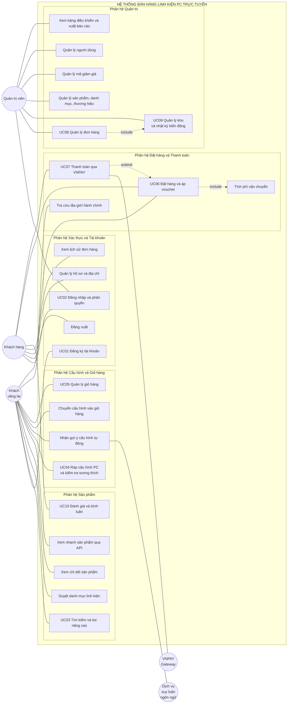
```mermaid
flowchart LR
    G(("Khách<br/>vãng lai"))
    C(("Khách hàng"))
    A(("Quản trị viên"))
    V(("VNPAY<br/>Gateway"))
    L(("Dịch vụ<br/>suy luận<br/>ngôn ngữ"))

    subgraph SYS["HỆ THỐNG BÁN HÀNG LINH KIỆN PC TRỰC TUYẾN"]
        subgraph P1["Phân hệ Xác thực và Tài khoản"]
            UC01["UC01 Đăng ký tài khoản"]
            UC02["UC02 Đăng nhập và phân quyền"]
            UCA1["Đăng xuất"]
            UCA2["Quản lý hồ sơ và địa chỉ"]
            UCA3["Xem lịch sử đơn hàng"]
        end
        subgraph P2["Phân hệ Sản phẩm"]
            UC03["UC03 Tìm kiếm và lọc nâng cao"]
            UCB1["Duyệt danh mục linh kiện"]
            UCB2["Xem chi tiết sản phẩm"]
            UCB3["Xem nhanh sản phẩm qua API"]
            UC10["UC10 Đánh giá và bình luận"]
        end
        subgraph P3["Phân hệ Cấu hình và Giỏ hàng"]
            UC04["UC04 Ráp cấu hình PC<br/>và kiểm tra tương thích"]
            UCC1["Nhận gợi ý cấu hình tự động"]
            UCC2["Chuyển cấu hình vào giỏ hàng"]
            UC05["UC05 Quản lý giỏ hàng"]
        end
        subgraph P4["Phân hệ Đặt hàng và Thanh toán"]
            UC06["UC06 Đặt hàng và áp voucher"]
            UC07["UC07 Thanh toán qua VNPAY"]
            UCD1["Tra cứu địa giới hành chính"]
            UCD2["Tính phí vận chuyển"]
        end
        subgraph P5["Phân hệ Quản trị"]
            UC08["UC08 Quản lý đơn hàng"]
            UC09["UC09 Quản lý kho<br/>và nhật ký biến động"]
            UCE1["Quản lý sản phẩm, danh mục, thương hiệu"]
            UCE2["Quản lý mã giảm giá"]
            UCE3["Quản lý người dùng"]
            UCE4["Xem bảng điều khiển và xuất báo cáo"]
        end
    end

    G --- UC01
    G --- UC03
    G --- UCB1
    G --- UCB2
    G --- UCB3
    G --- UC04
    G --- UCC1
    G --- UCC2
    G --- UC05
    G --- UC06
    G --- UCD1

    C --- UC02
    C --- UCA1
    C --- UCA2
    C --- UCA3
    C --- UC10
    C --- UC06
    C --- UC07

    A --- UC02
    A --- UC08
    A --- UC09
    A --- UCE1
    A --- UCE2
    A --- UCE3
    A --- UCE4

    UC07 --- V
    UCC1 --- L
    UC06 -. "include" .-> UCD2
    UC07 -. "extend" .-> UC06
    UC08 -. "include" .-> UC09
```

**Giải thích biểu đồ:** Biểu đồ phân chia hệ thống thành năm phân hệ chức năng. Quan hệ kế thừa giữa tác nhân được thể hiện ở chỗ Khách hàng có thể thực hiện mọi ca sử dụng của Khách vãng lai, cộng thêm các ca sử dụng yêu cầu xác thực. Hai quan hệ phụ thuộc đáng chú ý: `UC06 Đặt hàng` **include** `Tính phí vận chuyển` (phí vận chuyển luôn được tính trong mọi lần đặt hàng, không phải tùy chọn), còn `UC07 Thanh toán VNPAY` **extend** `UC06 Đặt hàng` (thanh toán trực tuyến chỉ xảy ra khi khách chọn phương thức `vnpay`, còn với `cod` và `bank` thì luồng đặt hàng kết thúc ngay). Quan hệ `UC08` **include** `UC09` phản ánh quy tắc BR-20: thao tác hủy đơn bắt buộc kéo theo nghiệp vụ hoàn kho.

### 2.2.2. Biểu đồ Use Case phân rã theo phân hệ

**Hình 2.2 – Biểu đồ Use Case phân hệ Xác thực và Tài khoản**

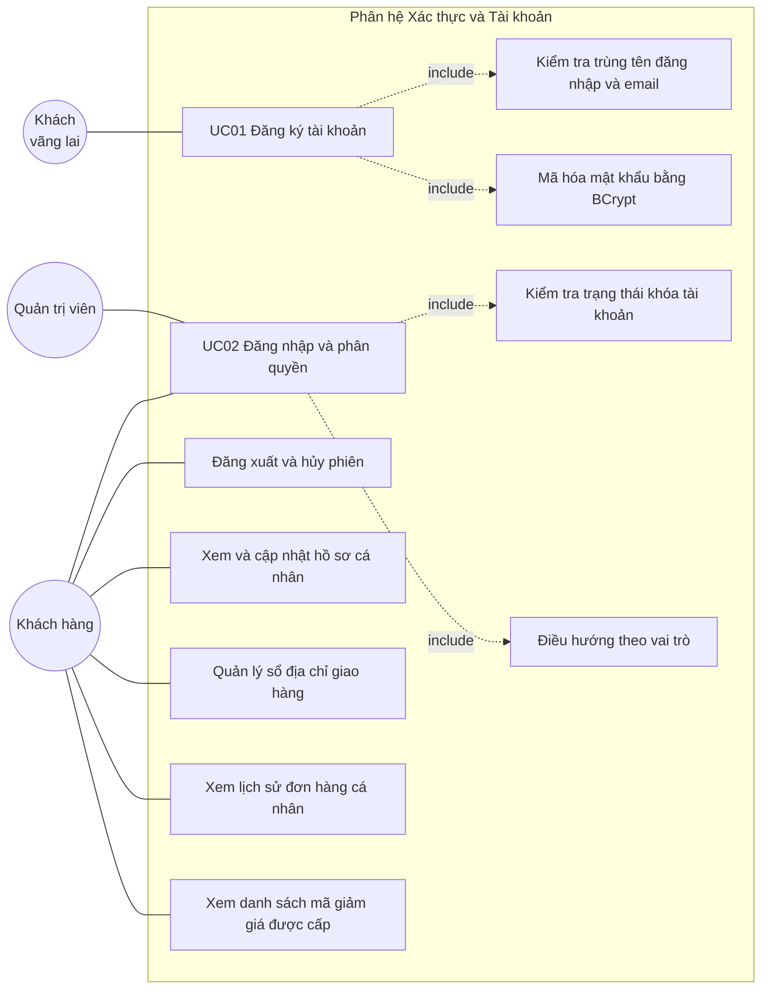
```mermaid
flowchart LR
    G(("Khách<br/>vãng lai"))
    C(("Khách hàng"))
    A(("Quản trị viên"))
    subgraph S["Phân hệ Xác thực và Tài khoản"]
        U1["UC01 Đăng ký tài khoản"]
        U2["UC02 Đăng nhập và phân quyền"]
        U3["Kiểm tra trùng tên đăng nhập và email"]
        U4["Mã hóa mật khẩu bằng BCrypt"]
        U5["Kiểm tra trạng thái khóa tài khoản"]
        U6["Điều hướng theo vai trò"]
        U7["Đăng xuất và hủy phiên"]
        U8["Xem và cập nhật hồ sơ cá nhân"]
        U9["Quản lý sổ địa chỉ giao hàng"]
        U10["Xem lịch sử đơn hàng cá nhân"]
        U11["Xem danh sách mã giảm giá được cấp"]
    end
    G --- U1
    C --- U2
    C --- U7
    C --- U8
    C --- U9
    C --- U10
    C --- U11
    A --- U2
    U1 -. "include" .-> U3
    U1 -. "include" .-> U4
    U2 -. "include" .-> U5
    U2 -. "include" .-> U6
```

**Hình 2.3 – Biểu đồ Use Case phân hệ Sản phẩm và Danh mục**

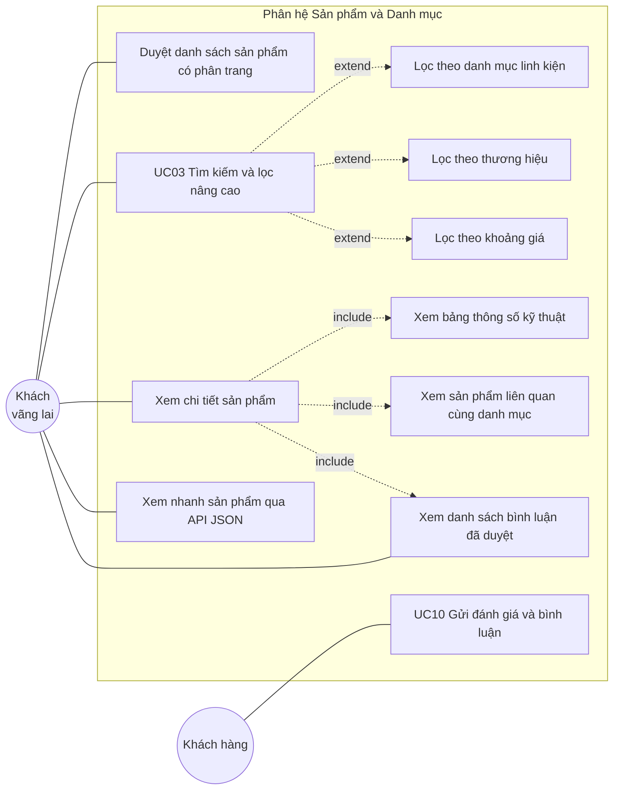
```mermaid
flowchart LR
    G(("Khách<br/>vãng lai"))
    C(("Khách hàng"))
    subgraph S["Phân hệ Sản phẩm và Danh mục"]
        U1["Duyệt danh sách sản phẩm có phân trang"]
        U2["UC03 Tìm kiếm và lọc nâng cao"]
        U3["Lọc theo danh mục linh kiện"]
        U4["Lọc theo thương hiệu"]
        U5["Lọc theo khoảng giá"]
        U6["Xem chi tiết sản phẩm"]
        U7["Xem bảng thông số kỹ thuật"]
        U8["Xem sản phẩm liên quan cùng danh mục"]
        U9["Xem nhanh sản phẩm qua API JSON"]
        U10["UC10 Gửi đánh giá và bình luận"]
        U11["Xem danh sách bình luận đã duyệt"]
    end
    G --- U1
    G --- U2
    G --- U6
    G --- U9
    G --- U11
    C --- U10
    U2 -. "extend" .-> U3
    U2 -. "extend" .-> U4
    U2 -. "extend" .-> U5
    U6 -. "include" .-> U7
    U6 -. "include" .-> U8
    U6 -. "include" .-> U11
```

**Hình 2.4 – Biểu đồ Use Case phân hệ Giỏ hàng và Build PC**

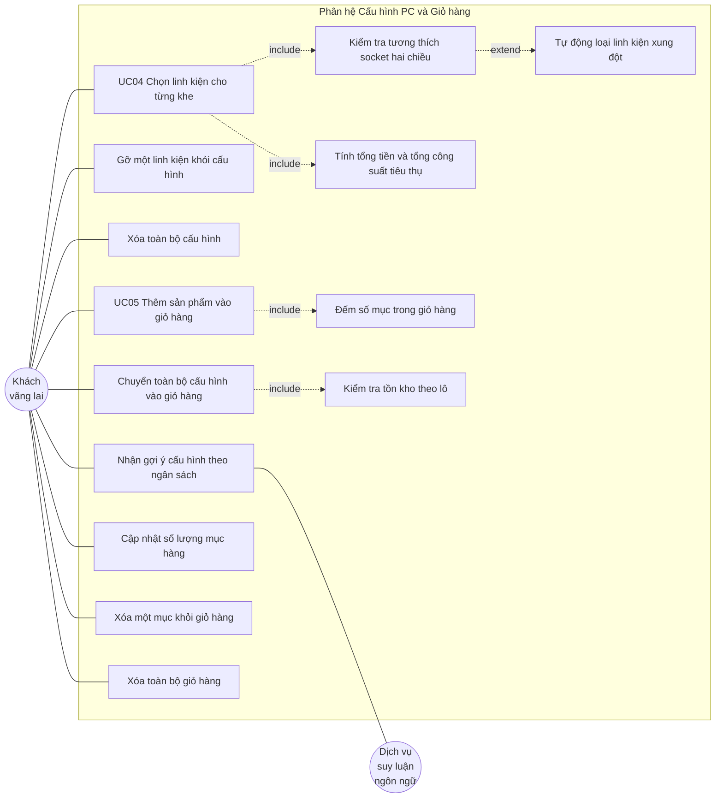
```mermaid
flowchart LR
    G(("Khách<br/>vãng lai"))
    L(("Dịch vụ<br/>suy luận<br/>ngôn ngữ"))
    subgraph S["Phân hệ Cấu hình PC và Giỏ hàng"]
        U1["UC04 Chọn linh kiện cho từng khe"]
        U2["Kiểm tra tương thích socket hai chiều"]
        U3["Tự động loại linh kiện xung đột"]
        U4["Tính tổng tiền và tổng công suất tiêu thụ"]
        U5["Gỡ một linh kiện khỏi cấu hình"]
        U6["Xóa toàn bộ cấu hình"]
        U7["Nhận gợi ý cấu hình theo ngân sách"]
        U8["Chuyển toàn bộ cấu hình vào giỏ hàng"]
        U9["UC05 Thêm sản phẩm vào giỏ hàng"]
        U10["Cập nhật số lượng mục hàng"]
        U11["Xóa một mục khỏi giỏ hàng"]
        U12["Xóa toàn bộ giỏ hàng"]
        U13["Đếm số mục trong giỏ hàng"]
        U14["Kiểm tra tồn kho theo lô"]
    end
    G --- U1
    G --- U5
    G --- U6
    G --- U7
    G --- U8
    G --- U9
    G --- U10
    G --- U11
    G --- U12
    U7 --- L
    U1 -. "include" .-> U2
    U2 -. "extend" .-> U3
    U1 -. "include" .-> U4
    U8 -. "include" .-> U14
    U9 -. "include" .-> U13
```

**Hình 2.5 – Biểu đồ Use Case phân hệ Đặt hàng và Thanh toán VNPAY**

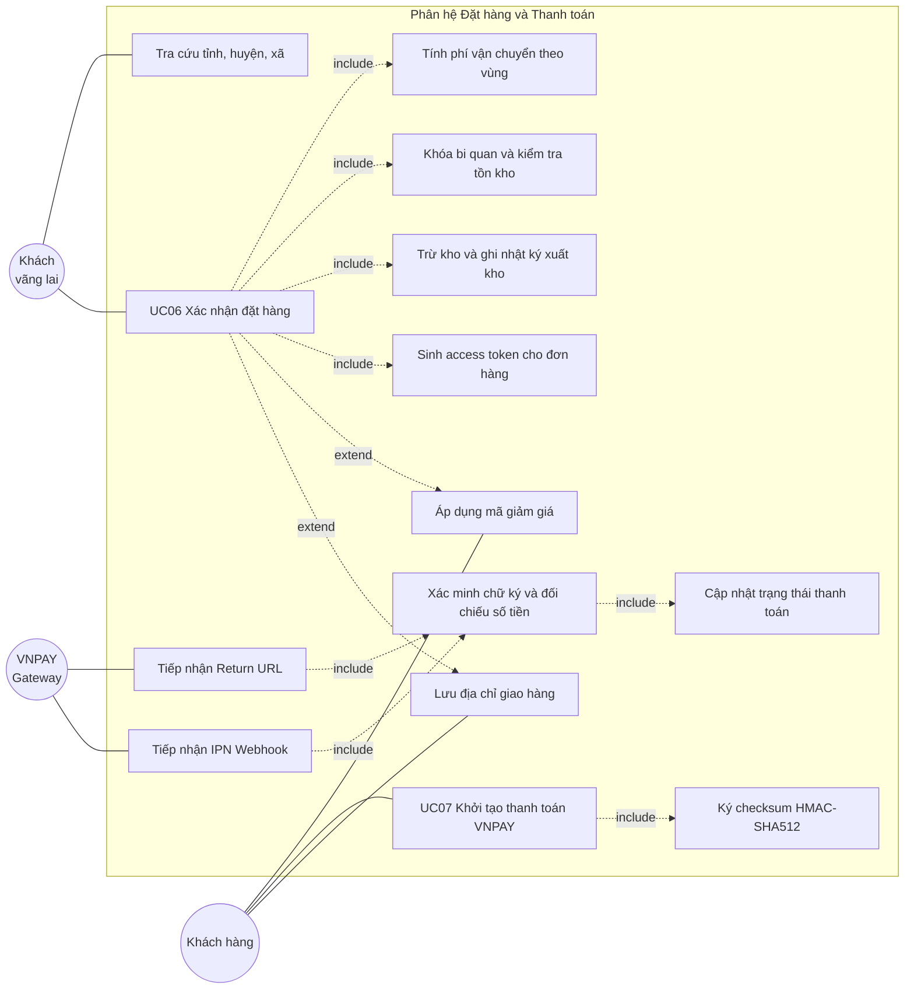
```mermaid
flowchart LR
    G(("Khách<br/>vãng lai"))
    C(("Khách hàng"))
    V(("VNPAY<br/>Gateway"))
    subgraph S["Phân hệ Đặt hàng và Thanh toán"]
        U1["Tra cứu tỉnh, huyện, xã"]
        U2["Tính phí vận chuyển theo vùng"]
        U3["Áp dụng mã giảm giá"]
        U4["UC06 Xác nhận đặt hàng"]
        U5["Khóa bi quan và kiểm tra tồn kho"]
        U6["Trừ kho và ghi nhật ký xuất kho"]
        U7["Sinh access token cho đơn hàng"]
        U8["Lưu địa chỉ giao hàng"]
        U9["UC07 Khởi tạo thanh toán VNPAY"]
        U10["Ký checksum HMAC-SHA512"]
        U11["Tiếp nhận Return URL"]
        U12["Tiếp nhận IPN Webhook"]
        U13["Xác minh chữ ký và đối chiếu số tiền"]
        U14["Cập nhật trạng thái thanh toán"]
    end
    G --- U1
    G --- U4
    C --- U3
    C --- U9
    C --- U8
    V --- U11
    V --- U12
    U4 -. "include" .-> U2
    U4 -. "include" .-> U5
    U4 -. "include" .-> U6
    U4 -. "include" .-> U7
    U4 -. "extend" .-> U3
    U4 -. "extend" .-> U8
    U9 -. "include" .-> U10
    U11 -. "include" .-> U13
    U12 -. "include" .-> U13
    U13 -. "include" .-> U14
```

**Hình 2.6 – Biểu đồ Use Case phân hệ Quản trị**

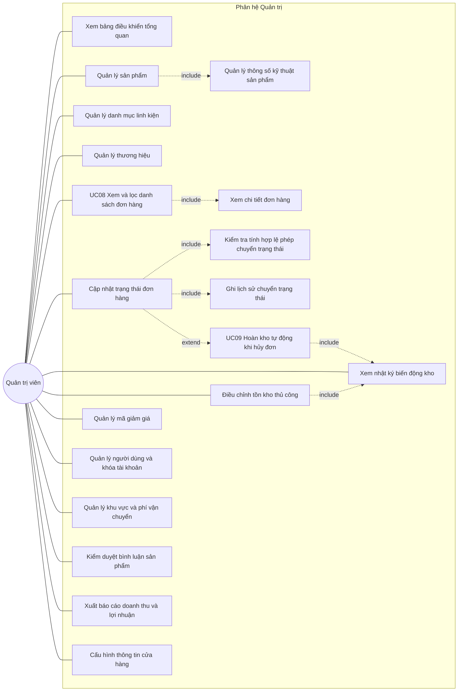
```mermaid
flowchart LR
    A(("Quản trị viên"))
    subgraph S["Phân hệ Quản trị"]
        U1["Xem bảng điều khiển tổng quan"]
        U2["Quản lý sản phẩm"]
        U3["Quản lý thông số kỹ thuật sản phẩm"]
        U4["Quản lý danh mục linh kiện"]
        U5["Quản lý thương hiệu"]
        U6["UC08 Xem và lọc danh sách đơn hàng"]
        U7["Xem chi tiết đơn hàng"]
        U8["Cập nhật trạng thái đơn hàng"]
        U9["Kiểm tra tính hợp lệ phép chuyển trạng thái"]
        U10["Ghi lịch sử chuyển trạng thái"]
        U11["UC09 Hoàn kho tự động khi hủy đơn"]
        U12["Xem nhật ký biến động kho"]
        U13["Điều chỉnh tồn kho thủ công"]
        U14["Quản lý mã giảm giá"]
        U15["Quản lý người dùng và khóa tài khoản"]
        U16["Quản lý khu vực và phí vận chuyển"]
        U17["Kiểm duyệt bình luận sản phẩm"]
        U18["Xuất báo cáo doanh thu và lợi nhuận"]
        U19["Cấu hình thông tin cửa hàng"]
    end
    A --- U1
    A --- U2
    A --- U4
    A --- U5
    A --- U6
    A --- U8
    A --- U12
    A --- U13
    A --- U14
    A --- U15
    A --- U16
    A --- U17
    A --- U18
    A --- U19
    U2 -. "include" .-> U3
    U6 -. "include" .-> U7
    U8 -. "include" .-> U9
    U8 -. "include" .-> U10
    U8 -. "extend" .-> U11
    U11 -. "include" .-> U12
    U13 -. "include" .-> U12
```

### 2.2.3. Đặc tả chi tiết các Use Case

Mười ca sử dụng trọng yếu được đặc tả theo mẫu chuẩn gồm mười ba trường: mã, tên, tác nhân, mô tả, tiền điều kiện, hậu điều kiện thành công, hậu điều kiện thất bại, kích hoạt, luồng sự kiện chính, luồng thay thế, luồng ngoại lệ, quy tắc nghiệp vụ liên quan và điểm cuối kỹ thuật tương ứng.

#### a) UC01 – Đăng ký tài khoản

**Bảng 2.7 – Đặc tả Use Case UC01: Đăng ký tài khoản**

| Thành phần | Nội dung |
|---|---|
| **Mã Use Case** | UC01 |
| **Tên Use Case** | Đăng ký tài khoản |
| **Tác nhân chính** | Khách vãng lai (ACT01) |
| **Tác nhân phụ** | Không |
| **Mô tả tóm tắt** | Khách vãng lai tạo một tài khoản mới trên hệ thống để có thể sử dụng các chức năng dành riêng cho khách hàng đã xác thực như quản lý địa chỉ, theo dõi đơn hàng, sử dụng mã giảm giá và đánh giá sản phẩm |
| **Mức độ ưu tiên** | Bắt buộc (Must have) |
| **Tần suất sử dụng** | Thấp — mỗi người dùng thực hiện một lần |
| **Tiền điều kiện** | 1. Người dùng đang ở trạng thái chưa xác thực<br/>2. Hệ thống đang hoạt động và kết nối được tới cơ sở dữ liệu |
| **Hậu điều kiện thành công** | 1. Một bản ghi mới được tạo trong bảng `users`<br/>2. Trường `password` chứa chuỗi băm BCrypt, không chứa mật khẩu ở dạng văn bản rõ<br/>3. Trường `role` được gán giá trị mặc định `user`, `is_admin = 0`, `is_blocked = 0`<br/>4. Người dùng được chuyển hướng tới trang đăng nhập kèm thông báo thành công |
| **Hậu điều kiện thất bại** | Không có bản ghi nào được tạo; biểu mẫu được hiển thị lại kèm thông báo lỗi cụ thể và giữ nguyên dữ liệu người dùng đã nhập (trừ trường mật khẩu) |
| **Sự kiện kích hoạt** | Người dùng chọn liên kết "Đăng ký" trên thanh điều hướng hoặc truy cập trực tiếp `GET /register` |
| **Luồng sự kiện chính** | 1. Người dùng truy cập `GET /register`<br/>2. Hệ thống kết xuất biểu mẫu đăng ký gồm các trường: tên đăng nhập, họ tên, thư điện tử, số điện thoại, mật khẩu, xác nhận mật khẩu<br/>3. Người dùng điền đầy đủ thông tin và gửi biểu mẫu tới `POST /register`<br/>4. Hệ thống kiểm chứng định dạng dữ liệu đầu vào ở phía máy chủ<br/>5. Hệ thống kiểm tra tên đăng nhập chưa tồn tại thông qua `userRepository.existsByUsername()`<br/>6. Hệ thống kiểm tra thư điện tử chưa tồn tại thông qua `userRepository.existsByEmail()`<br/>7. Hệ thống mã hóa mật khẩu bằng `passwordEncoder.encode()` với thuật toán BCrypt và muối ngẫu nhiên<br/>8. Hệ thống tạo đối tượng `User` với vai trò mặc định và lưu vào cơ sở dữ liệu<br/>9. Hệ thống chuyển hướng tới `/login?registered=true`<br/>10. Trang đăng nhập hiển thị thông báo "Đăng ký thành công, vui lòng đăng nhập" |
| **Luồng thay thế** | **A1 – Tên đăng nhập đã tồn tại** (rẽ nhánh tại bước 5): Hệ thống hiển thị lại biểu mẫu với thông báo "Tên đăng nhập đã được sử dụng". Quay về bước 3.<br/>**A2 – Thư điện tử đã tồn tại** (rẽ nhánh tại bước 6): Hệ thống hiển thị lại biểu mẫu với thông báo "Email đã được đăng ký". Quay về bước 3.<br/>**A3 – Mật khẩu xác nhận không khớp** (rẽ nhánh tại bước 4): Hệ thống hiển thị thông báo "Mật khẩu xác nhận không khớp". Quay về bước 3.<br/>**A4 – Người dùng hủy thao tác**: Người dùng rời khỏi trang; không có tác động nào lên hệ thống. |
| **Luồng ngoại lệ** | **E1 – Mất kết nối cơ sở dữ liệu** (có thể xảy ra tại bước 5, 6 hoặc 8): Giao dịch bị hoàn tác; hệ thống hiển thị trang lỗi chung và ghi nhật ký lỗi phía máy chủ.<br/>**E2 – Vi phạm ràng buộc duy nhất do tranh chấp** (bước 8): Hai yêu cầu đăng ký cùng tên đăng nhập đến đồng thời; ràng buộc `UNIQUE KEY username` của cơ sở dữ liệu chặn bản ghi thứ hai; hệ thống bắt ngoại lệ và hiển thị thông báo như luồng A1. |
| **Quy tắc nghiệp vụ liên quan** | NFR-03 (mã hóa mật khẩu bằng BCrypt) |
| **Điểm cuối kỹ thuật** | `GET /register` → khung nhìn `auth/register`<br/>`POST /register` → chuyển hướng `302` tới `/login?registered=true` |
| **Ràng buộc dữ liệu** | `username`: chuỗi tối đa 50 ký tự, duy nhất, bắt buộc<br/>`email`: chuỗi tối đa 100 ký tự, duy nhất, bắt buộc, đúng định dạng thư điện tử<br/>`password`: tối thiểu 6 ký tự trước khi mã hóa; sau mã hóa là chuỗi 60 ký tự<br/>`phone`: chuỗi tối đa 20 ký tự, tùy chọn |

#### b) UC02 – Đăng nhập và phân quyền

**Bảng 2.8 – Đặc tả Use Case UC02: Đăng nhập và phân quyền**

| Thành phần | Nội dung |
|---|---|
| **Mã Use Case** | UC02 |
| **Tên Use Case** | Đăng nhập hệ thống và phân quyền theo vai trò |
| **Tác nhân chính** | Khách hàng (ACT02), Quản trị viên (ACT03) |
| **Tác nhân phụ** | Không |
| **Mô tả tóm tắt** | Người dùng xác thực danh tính bằng tên đăng nhập hoặc thư điện tử kết hợp mật khẩu. Sau khi xác thực thành công, hệ thống thiết lập ngữ cảnh bảo mật, gán quyền hạn tương ứng và điều hướng người dùng tới trang phù hợp với vai trò |
| **Mức độ ưu tiên** | Bắt buộc (Must have) |
| **Tần suất sử dụng** | Rất cao — nhiều lần mỗi ngày với quản trị viên |
| **Tiền điều kiện** | 1. Tài khoản đã tồn tại trong bảng `users`<br/>2. Tài khoản có `is_blocked = 0` |
| **Hậu điều kiện thành công** | 1. Đối tượng `Authentication` đã xác thực được lưu trong `SecurityContextHolder` và gắn vào phiên HTTP<br/>2. Tập quyền hạn `ROLE_USER` hoặc `ROLE_ADMIN` được gán cho phiên<br/>3. Người dùng được điều hướng tới `/admin` nếu có `ROLE_ADMIN`, ngược lại tới trang chủ `/`<br/>4. Giỏ hàng trong phiên trước khi đăng nhập được giữ nguyên |
| **Hậu điều kiện thất bại** | Ngữ cảnh bảo mật không thay đổi; người dùng được chuyển hướng tới `/login?error=true` |
| **Sự kiện kích hoạt** | Người dùng gửi biểu mẫu đăng nhập, hoặc Spring Security chuyển hướng tự động khi người dùng chưa xác thực truy cập tài nguyên được bảo vệ |
| **Luồng sự kiện chính** | 1. Người dùng truy cập `GET /login`; hệ thống kết xuất biểu mẫu đăng nhập<br/>2. Người dùng nhập thông tin đăng nhập và gửi tới `POST /login`<br/>3. `UsernamePasswordAuthenticationFilter` chặn yêu cầu, tạo đối tượng `UsernamePasswordAuthenticationToken` chưa xác thực<br/>4. `AuthenticationManager` ủy thác cho `DaoAuthenticationProvider`<br/>5. `DaoAuthenticationProvider` gọi `CustomUserDetailsService.loadUserByUsername(login)`<br/>6. Lớp dịch vụ thực thi truy vấn `userRepository.findByUsernameOrEmail(login)`, cho phép đăng nhập bằng cả hai định danh<br/>7. Lớp dịch vụ kiểm tra cờ `is_blocked`<br/>8. Lớp dịch vụ xây dựng tập quyền hạn: thêm tiền tố `ROLE_` trước giá trị `users.role` viết hoa; nếu `is_admin = 1` mà chưa có `ROLE_ADMIN` thì bổ sung thêm<br/>9. `DaoAuthenticationProvider` so khớp mật khẩu bằng `BCryptPasswordEncoder.matches()`<br/>10. Xác thực thành công; ngữ cảnh bảo mật được thiết lập và lưu vào phiên<br/>11. Bộ xử lý thành công kiểm tra tập quyền hạn và điều hướng: `/admin` cho quản trị viên, `/` cho khách hàng |
| **Luồng thay thế** | **A1 – Đăng nhập bằng thư điện tử** (bước 6): Truy vấn `findByUsernameOrEmail` khớp theo cột `email`; luồng tiếp tục bình thường từ bước 7.<br/>**A2 – Mật khẩu kế thừa từ hệ thống cũ** (bước 9): Chuỗi băm có tiền tố `$2y$` do hệ thống PHP sinh ra; `BCryptPasswordEncoder` tự nhận diện biến thể và hệ số chi phí, so khớp thành công; luồng tiếp tục bình thường.<br/>**A3 – Người dùng đã đăng nhập truy cập lại `/login`**: Hệ thống vẫn hiển thị biểu mẫu; nếu đăng nhập lại thành công thì phiên cũ được thay thế. |
| **Luồng ngoại lệ** | **E1 – Không tìm thấy tài khoản** (bước 6): `CustomUserDetailsService` ném `UsernameNotFoundException`; chuyển hướng `/login?error=true` với thông báo chung "Tên đăng nhập hoặc mật khẩu không đúng" — cố ý không tiết lộ định danh nào sai nhằm chống dò tài khoản.<br/>**E2 – Tài khoản bị khóa** (bước 7): Ném `UsernameNotFoundException` kèm lý do lấy từ `blocked_reason`; hiển thị thông báo khóa cho người dùng.<br/>**E3 – Mật khẩu không khớp** (bước 9): Ném `BadCredentialsException`; chuyển hướng `/login?error=true`.<br/>**E4 – Người dùng có `ROLE_USER` truy cập `/admin/**`**: Bộ lọc ủy quyền từ chối; trả mã `403 Forbidden`. |
| **Quy tắc nghiệp vụ liên quan** | BR-28 (chặn tài khoản bị khóa), NFR-03, NFR-04 |
| **Điểm cuối kỹ thuật** | `GET /login` → khung nhìn `auth/login`<br/>`POST /login` → do `UsernamePasswordAuthenticationFilter` xử lý, trả `302`<br/>`POST /logout` → `302` tới `/login?logout=true`, hủy phiên và xóa cookie `JSESSIONID` |
| **Yêu cầu đặc biệt** | Thời gian sống của phiên là 60 phút không hoạt động, cấu hình bởi `server.servlet.session.timeout: 60m` |

#### c) UC03 – Tìm kiếm và lọc sản phẩm nâng cao

**Bảng 2.9 – Đặc tả Use Case UC03: Tìm kiếm và lọc sản phẩm nâng cao**

| Thành phần | Nội dung |
|---|---|
| **Mã Use Case** | UC03 |
| **Tên Use Case** | Tìm kiếm và lọc sản phẩm nâng cao |
| **Tác nhân chính** | Khách vãng lai (ACT01), Khách hàng (ACT02) |
| **Tác nhân phụ** | Không |
| **Mô tả tóm tắt** | Người dùng thu hẹp danh sách linh kiện theo từ khóa và/hoặc danh mục, kết quả được phân trang. Phân hệ quản trị mở rộng thêm các tiêu chí lọc theo thương hiệu, trạng thái tồn kho và trạng thái kích hoạt thông qua cơ chế `Specification` |
| **Mức độ ưu tiên** | Bắt buộc (Must have) |
| **Tần suất sử dụng** | Rất cao |
| **Tiền điều kiện** | Cơ sở dữ liệu có ít nhất một sản phẩm với `is_active = 1` |
| **Hậu điều kiện thành công** | Danh sách sản phẩm thỏa mãn toàn bộ tiêu chí được hiển thị, kèm thông tin tổng số kết quả và thanh điều hướng trang |
| **Hậu điều kiện thất bại** | Hiển thị trạng thái rỗng kèm thông báo "Không tìm thấy sản phẩm phù hợp" và gợi ý điều chỉnh tiêu chí |
| **Sự kiện kích hoạt** | Người dùng nhập từ khóa vào ô tìm kiếm, chọn một danh mục từ menu, hoặc chuyển trang kết quả |
| **Luồng sự kiện chính** | 1. Người dùng gửi yêu cầu `GET /san-pham` kèm các tham số truy vấn tùy chọn `search`, `category_id`, `page`, `size`<br/>2. `ProductViewController` nhận tham số; giá trị mặc định là `page = 0`, `size = 12`<br/>3. Bộ điều khiển xác định nhánh truy vấn: có cả từ khóa và danh mục, chỉ có từ khóa, chỉ có danh mục, hoặc không có tiêu chí nào<br/>4. Bộ điều khiển gọi phương thức repository tương ứng, ví dụ `findByNameContainingIgnoreCaseAndCategoryIdAndIsActiveTrue(search, categoryId, pageable)`<br/>5. Spring Data JPA sinh câu lệnh SQL có mệnh đề `WHERE`, `LIMIT` và `OFFSET`; `@EntityGraph` bổ sung `LEFT JOIN FETCH` cho `category` và `brand` nhằm tránh vấn đề N+1<br/>6. Kết quả kiểu `Page<Product>` được đưa vào `Model` cùng danh sách danh mục và thương hiệu phục vụ dựng bộ lọc<br/>7. Thymeleaf kết xuất lưới sản phẩm; mỗi thẻ hiển thị hình ảnh, tên, giá gốc gạch ngang nếu có khuyến mại, giá cuối và nhãn tình trạng tồn kho<br/>8. Thanh phân trang được dựng từ `page.getTotalPages()` và `page.getNumber()` |
| **Luồng thay thế** | **A1 – Lọc theo danh mục từ menu điều hướng**: Người dùng truy cập `GET /danh-muc/{id}`; bộ điều khiển chuyển tiếp sang cùng logic với `category_id = {id}`.<br/>**A2 – Lọc nâng cao trong phân hệ quản trị**: `AdminProductController` dựng đối tượng `Specification` động từ các tiêu chí `keyword`, `categoryId`, `brandId`, `stockStatus`, `activeStatus`; mỗi tiêu chí khác rỗng tạo ra một vị từ và được kết hợp bằng phép hội.<br/>**A3 – Từ khóa chứa ký tự tiếng Việt có dấu**: So khớp thực hiện trên bộ đối chiếu `utf8mb4_unicode_ci`, không phân biệt hoa thường.<br/>**A4 – Yêu cầu trang vượt quá tổng số trang**: Spring Data trả về trang rỗng; giao diện hiển thị trạng thái rỗng. |
| **Luồng ngoại lệ** | **E1 – Tham số `category_id` không phải số nguyên**: Spring ném lỗi chuyển đổi kiểu, trả `400 Bad Request`.<br/>**E2 – Tham số `size` có giá trị quá lớn**: Hệ thống giới hạn kích thước trang tối đa nhằm chống tấn công làm cạn tài nguyên. |
| **Quy tắc nghiệp vụ liên quan** | BR-01, BR-02 (hiển thị giá cuối do máy chủ tính), NFR-08 (chống tiêm SQL), NFR-09 (chống N+1) |
| **Điểm cuối kỹ thuật** | `GET /san-pham?page={p}&size={s}&search={q}&category_id={c}` → khung nhìn `products/index`<br/>`GET /danh-muc/{id}` → khung nhìn `products/index`<br/>`GET /api/san-pham/{id}/quick-view` → JSON `200` hoặc `404` |
| **Yêu cầu đặc biệt** | Bảng `products` có chỉ mục toàn văn `idx_products_name_search (name, description)` và chỉ mục ghép `idx_products_category_active (category_id, is_active)` phục vụ hai mẫu truy vấn phổ biến nhất |

#### d) UC04 – Ráp cấu hình PC và kiểm tra tương thích

**Bảng 2.10 – Đặc tả Use Case UC04: Ráp cấu hình PC và kiểm tra tương thích**

| Thành phần | Nội dung |
|---|---|
| **Mã Use Case** | UC04 |
| **Tên Use Case** | Ráp cấu hình PC với kiểm tra tương thích tự động |
| **Tác nhân chính** | Khách vãng lai (ACT01), Khách hàng (ACT02) |
| **Tác nhân phụ** | Dịch vụ suy luận ngôn ngữ (ACT05) — chỉ trong luồng thay thế A3 |
| **Mô tả tóm tắt** | Người dùng lần lượt chọn linh kiện cho bảy khe tiêu chuẩn của một bộ máy tính. Hệ thống kiểm tra tương thích chuẩn chân cắm giữa bộ xử lý và bo mạch chủ theo cả hai chiều, tự động loại bỏ linh kiện xung đột, đồng thời tính tổng chi phí và tổng công suất tiêu thụ ước lượng theo thời gian thực |
| **Mức độ ưu tiên** | Bắt buộc (Must have) — đây là chức năng đặc thù tạo nên giá trị khác biệt của đề tài |
| **Tần suất sử dụng** | Cao |
| **Tiền điều kiện** | 1. Cơ sở dữ liệu có sản phẩm thuộc các danh mục linh kiện tương ứng bảy khe<br/>2. Các sản phẩm bộ xử lý và bo mạch chủ đã được gán thông số `Socket` trong bảng `product_specs` |
| **Hậu điều kiện thành công** | 1. Đối tượng cấu hình được lưu trong phiên dưới khóa `buildpc`<br/>2. Mọi cặp bộ xử lý – bo mạch chủ trong cấu hình đều có chuẩn chân cắm tương thích<br/>3. Tổng chi phí và tổng công suất tiêu thụ ước lượng được cập nhật |
| **Hậu điều kiện thất bại** | Cấu hình giữ nguyên trạng thái trước thao tác; thông báo lỗi được trả về |
| **Sự kiện kích hoạt** | Người dùng truy cập `/build-pc` và chọn một linh kiện cho một khe bất kỳ |
| **Luồng sự kiện chính** | 1. Người dùng truy cập `GET /build-pc`; hệ thống kết xuất giao diện bảy khe theo thứ tự nghiệp vụ: bộ xử lý, bo mạch chủ, bộ nhớ trong, card đồ họa, ổ lưu trữ, bộ nguồn, vỏ máy<br/>2. Người dùng chọn một khe; giao diện gọi `GET /build-pc/components?category_id={id}`<br/>3. `PcBuilderService.getComponentsForCategory()` truy vấn sản phẩm đang kinh doanh thuộc danh mục yêu cầu<br/>4. Nếu khe đang mở là bo mạch chủ và cấu hình đã có bộ xử lý, dịch vụ đọc chuẩn chân cắm của bộ xử lý qua `productSpecRepository.findSpecValue(cpuId, "Socket")`, chuẩn hóa bằng `normalizeSocket()` và chỉ giữ lại các bo mạch chủ có chuẩn chân cắm trùng khớp. Trường hợp ngược lại được xử lý đối xứng<br/>5. Danh sách đã lọc được trả về dưới dạng JSON; giao diện hiển thị<br/>6. Người dùng chọn một linh kiện; giao diện gọi `POST /build-pc/select` với `category_id` và `product_id`<br/>7. `PcBuilderService.selectComponent()` nạp sản phẩm từ cơ sở dữ liệu, kiểm tra `is_active` và tồn kho<br/>8. Dịch vụ thực hiện kiểm tra tương thích hai chiều: nếu linh kiện mới là bộ xử lý và cấu hình đã có bo mạch chủ với chuẩn chân cắm khác, bo mạch chủ cũ bị gỡ khỏi cấu hình và thông điệp cảnh báo được sinh ra; quy tắc đối xứng áp dụng khi linh kiện mới là bo mạch chủ<br/>9. Linh kiện được ghi vào khe tương ứng trong đối tượng cấu hình lưu tại phiên<br/>10. Dịch vụ tính lại tổng chi phí bằng cách cộng `getFinalPrice()` của toàn bộ linh kiện đã chọn, và tính tổng công suất tiêu thụ ước lượng<br/>11. Bản ghi kết quả `SelectResult` gồm trạng thái, thông điệp, cảnh báo, cấu hình mới, tổng tiền được trả về dưới dạng JSON<br/>12. Giao diện cập nhật cục bộ khe vừa chọn, khối tổng kết và hiển thị cảnh báo nếu có |
| **Luồng thay thế** | **A1 – Gỡ một linh kiện khỏi cấu hình**: Người dùng gọi `POST /build-pc/remove` với `category_id`; khe tương ứng được xóa và tổng tiền được tính lại.<br/>**A2 – Xóa toàn bộ cấu hình**: Người dùng gọi `POST /build-pc/clear`; đối tượng cấu hình bị loại khỏi phiên.<br/>**A3 – Nhận gợi ý cấu hình tự động**: Người dùng nhập ngân sách và nhu cầu sử dụng rồi gọi `POST /build-pc/ai`. `PcBuilderAiService` chạy bộ luật phân bổ ngân sách trên dữ liệu tồn kho thực để chọn ra cấu hình khả thi, sau đó gọi dịch vụ suy luận ngôn ngữ chỉ để sinh đoạn diễn giải. Mã sản phẩm và giá luôn do bộ luật quyết định, không do mô hình sinh ra.<br/>**A4 – Dịch vụ suy luận ngôn ngữ không khả dụng**: Hệ thống lùi về kết quả thuần luật và vẫn trả cấu hình hợp lệ kèm diễn giải mẫu; người dùng không bị gián đoạn.<br/>**A5 – Sản phẩm không có thông số chuẩn chân cắm**: Dịch vụ bỏ qua bước kiểm tra tương thích cho sản phẩm đó và cho phép chọn, tránh chặn nhầm do dữ liệu thông số chưa đầy đủ. |
| **Luồng ngoại lệ** | **E1 – Mã danh mục không thuộc bảy khe hợp lệ**: Trả `400 Bad Request` với thông điệp "Danh mục linh kiện không hợp lệ".<br/>**E2 – Sản phẩm không tồn tại hoặc đã ngừng kinh doanh** (bước 7): Trả `400 Bad Request` kèm thông điệp tương ứng.<br/>**E3 – Sản phẩm đã hết hàng** (bước 7): Trả `400 Bad Request` với thông điệp "Sản phẩm đã hết hàng".<br/>**E4 – Phiên hết hạn**: Cấu hình trong phiên bị mất; hệ thống khởi tạo cấu hình rỗng mới. |
| **Quy tắc nghiệp vụ liên quan** | BR-07 (tương thích chuẩn chân cắm), BR-08 (chuẩn hóa chuỗi socket), BR-01 (giá do máy chủ tính) |
| **Điểm cuối kỹ thuật** | `GET /api/build-pc/components?category_id={id}` → JSON danh sách đã lọc<br/>`POST /api/build-pc/select` → JSON `SelectResult`<br/>`POST /api/build-pc/remove` → JSON trạng thái cấu hình<br/>`POST /api/build-pc/clear` → JSON xác nhận<br/>`POST /api/build-pc/ai` → JSON cấu hình đề xuất kèm diễn giải |
| **Yêu cầu đặc biệt** | Thứ tự ánh xạ khe với mã danh mục: 1 = bộ xử lý, 3 = bo mạch chủ, 2 = bộ nhớ trong, 4 = card đồ họa, 5 = ổ lưu trữ, 6 = bộ nguồn, 7 = vỏ máy. Thứ tự hiển thị đặt bo mạch chủ ngay sau bộ xử lý để người dùng giải quyết ràng buộc tương thích sớm nhất |

#### e) UC05 – Quản lý giỏ hàng

**Bảng 2.11 – Đặc tả Use Case UC05: Quản lý giỏ hàng**

| Thành phần | Nội dung |
|---|---|
| **Mã Use Case** | UC05 |
| **Tên Use Case** | Quản lý giỏ hàng |
| **Tác nhân chính** | Khách vãng lai (ACT01), Khách hàng (ACT02) |
| **Tác nhân phụ** | Không |
| **Mô tả tóm tắt** | Người dùng thêm linh kiện vào giỏ hàng, điều chỉnh số lượng, xóa từng mục hoặc xóa toàn bộ giỏ. Mọi thao tác đều được thực hiện bất đồng bộ qua REST API, không tải lại trang, và đều có kiểm tra tồn kho tại thời điểm thao tác |
| **Mức độ ưu tiên** | Bắt buộc (Must have) |
| **Tần suất sử dụng** | Rất cao |
| **Tiền điều kiện** | Phiên HTTP đã được khởi tạo (được bảo đảm tự động khi người dùng truy cập trang bất kỳ) |
| **Hậu điều kiện thành công** | 1. Đối tượng giỏ hàng trong phiên phản ánh đúng thao tác vừa thực hiện<br/>2. Tổng tạm tính được tính lại từ giá cuối do máy chủ xác định<br/>3. Bộ đếm giỏ hàng trên thanh điều hướng được cập nhật<br/>4. Nếu giỏ hàng có mã giảm giá đang áp dụng, mã bị hủy hiệu lực và cần áp lại để tính đúng theo tạm tính mới |
| **Hậu điều kiện thất bại** | Giỏ hàng giữ nguyên; phản hồi JSON có `success: false` kèm thông điệp giải thích |
| **Sự kiện kích hoạt** | Người dùng nhấn nút thêm vào giỏ trên thẻ sản phẩm hoặc trang chi tiết, hoặc thao tác trên trang giỏ hàng |
| **Luồng sự kiện chính** | 1. Người dùng nhấn nút "Thêm vào giỏ"; mã JavaScript gửi `POST /api/cart/add` với thân yêu cầu chứa `product_id` và `quantity`<br/>2. `CartApiController` nhận và ràng buộc tham số vào DTO yêu cầu<br/>3. Bộ điều khiển ủy thác cho `CartService.addToCart()`<br/>4. Dịch vụ kiểm chứng `quantity > 0`<br/>5. Dịch vụ nạp sản phẩm từ cơ sở dữ liệu và kiểm tra `is_active`<br/>6. Dịch vụ tính số lượng dự kiến sau thao tác: nếu sản phẩm đã có trong giỏ thì cộng dồn với số lượng hiện có<br/>7. Dịch vụ so sánh số lượng dự kiến với tồn kho; nếu vượt thì trả về lỗi<br/>8. Dịch vụ ghi mục hàng vào giỏ với giá lấy từ `product.getFinalPrice()` — đây là điểm then chốt bảo đảm client không thể can thiệp giá<br/>9. Dịch vụ tính lại tổng tạm tính và tổng số mục<br/>10. Bộ điều khiển trả `200 OK` kèm JSON gồm `success`, `message`, `cart_count`, `subtotal`, `item`<br/>11. Mã JavaScript cập nhật huy hiệu số lượng trên biểu tượng giỏ hàng và hiển thị thông báo nổi |
| **Luồng thay thế** | **A1 – Cập nhật số lượng**: Gọi `POST /api/cart/update` với `product_id` và `quantity` mới; dịch vụ kiểm tra tồn kho với giá trị tuyệt đối (không cộng dồn) rồi ghi đè.<br/>**A2 – Xóa một mục**: Gọi `POST /api/cart/remove` với `product_id`; mục bị loại khỏi giỏ và tổng tiền được tính lại.<br/>**A3 – Xóa toàn bộ giỏ hàng**: Gọi `POST /api/cart/clear`; toàn bộ mục bị xóa, tổng tiền về 0.<br/>**A4 – Đếm số mục trong giỏ**: Gọi `GET /api/cart/count`; dùng để đồng bộ huy hiệu khi người dùng mở nhiều tab trình duyệt.<br/>**A5 – Thêm hàng loạt từ cấu hình PC**: `PcBuilderService.batchAddToCart()` duyệt toàn bộ linh kiện của cấu hình, kiểm tra tồn kho từng món và trả về `BatchAddResult` chứa danh sách lỗi tồn kho nếu có, cho phép thêm thành công phần còn lại.<br/>**A6 – Thao tác không dùng JavaScript**: `CartViewController` cung cấp các điểm cuối dạng biểu mẫu `POST /gio-hang/add`, `/update`, `/remove`, `/clear`, dùng chung `CartService`, bảo đảm hệ thống vẫn hoạt động khi trình duyệt tắt JavaScript. |
| **Luồng ngoại lệ** | **E1 – Số lượng nhỏ hơn hoặc bằng 0** (bước 4): Trả `400 Bad Request` với thông điệp "Số lượng phải lớn hơn 0".<br/>**E2 – Sản phẩm không tồn tại** (bước 5): Trả `400 Bad Request` với thông điệp "Sản phẩm không tồn tại".<br/>**E3 – Sản phẩm đã ngừng kinh doanh** (bước 5): Trả `400 Bad Request`.<br/>**E4 – Vượt tồn kho** (bước 7): Trả `400 Bad Request` với thông điệp nêu rõ số lượng còn lại.<br/>**E5 – Phiên hết hạn**: Giỏ hàng trở về rỗng; hệ thống khởi tạo giỏ mới mà không báo lỗi. |
| **Quy tắc nghiệp vụ liên quan** | BR-01 (giá do máy chủ tính), BR-03 (không vượt tồn kho), BR-30 (số lượng dương) |
| **Điểm cuối kỹ thuật** | `POST /api/cart/add`, `POST /api/cart/update`, `POST /api/cart/remove`, `POST /api/cart/clear`, `GET /api/cart/count` |
| **Yêu cầu đặc biệt** | Kiểm tra tồn kho tại thời điểm thêm vào giỏ chỉ mang tính chất cải thiện trải nghiệm, **không phải bảo đảm cuối cùng**. Bảo đảm thực sự được thực hiện tại thời điểm đặt hàng với khóa bi quan (UC06), vì tồn kho có thể thay đổi trong khoảng thời gian sản phẩm nằm trong giỏ |

#### f) UC06 – Đặt hàng và áp dụng mã giảm giá

**Bảng 2.12 – Đặc tả Use Case UC06: Đặt hàng và áp dụng mã giảm giá**

| Thành phần | Nội dung |
|---|---|
| **Mã Use Case** | UC06 |
| **Tên Use Case** | Đặt hàng và áp dụng mã giảm giá |
| **Tác nhân chính** | Khách vãng lai (ACT01), Khách hàng (ACT02) |
| **Tác nhân phụ** | Không |
| **Mô tả tóm tắt** | Người dùng hoàn tất đơn hàng bằng cách cung cấp thông tin người nhận, chọn địa chỉ giao hàng, tùy chọn áp dụng mã giảm giá và chọn phương thức thanh toán. Hệ thống thực hiện toàn bộ nghiệp vụ trong một giao dịch nguyên tử có khóa bi quan trên bản ghi tồn kho |
| **Mức độ ưu tiên** | Bắt buộc (Must have) — đây là ca sử dụng có yêu cầu toàn vẹn dữ liệu cao nhất hệ thống |
| **Tần suất sử dụng** | Trung bình |
| **Tiền điều kiện** | 1. Giỏ hàng trong phiên có ít nhất một mục hàng<br/>2. Thông tin người nhận được cung cấp đầy đủ và hợp lệ |
| **Hậu điều kiện thành công** | 1. Một bản ghi mới trong bảng `orders` với `status = 'pending'`, `payment_status = 'unpaid'` và `access_token` là một UUID duy nhất<br/>2. Với mỗi sản phẩm, một bản ghi trong `order_items` lưu **ảnh chụp** tên và giá tại thời điểm mua<br/>3. Trường `quantity` của mỗi sản phẩm liên quan trong bảng `products` đã được trừ đúng số lượng đặt<br/>4. Với mỗi sản phẩm, một bản ghi trong `warehouse_logs` loại `export` với lý do `sale` và `reference_id` trỏ tới đơn hàng<br/>5. Nếu có mã giảm giá được áp dụng thành công, một bản ghi trong `voucher_usages` và giá trị `used_count` của mã tăng thêm 1<br/>6. Nếu người dùng chọn lưu địa chỉ, một bản ghi trong `user_addresses`<br/>7. Giỏ hàng trong phiên được làm rỗng<br/>8. Người dùng được chuyển hướng tới trang xác nhận kèm tham số `token` |
| **Hậu điều kiện thất bại** | **Toàn bộ thay đổi bị hoàn tác hoàn toàn.** Không có đơn hàng nào được tạo, tồn kho không bị trừ, không có bản ghi nhật ký kho nào, mã giảm giá không bị ghi nhận lượt dùng, và giỏ hàng vẫn còn nguyên nội dung |
| **Sự kiện kích hoạt** | Người dùng nhấn nút "Đặt hàng" trên trang thanh toán |
| **Luồng sự kiện chính** | 1. Người dùng truy cập `GET /thanh-toan`; hệ thống kết xuất biểu mẫu kèm nội dung giỏ hàng, danh sách địa chỉ đã lưu (nếu đã đăng nhập) và danh sách tỉnh/thành<br/>2. Người dùng chọn tỉnh/thành; giao diện gọi `GET /api/location/districts?province_id={id}` để nạp danh sách quận/huyện<br/>3. Người dùng chọn quận/huyện; giao diện gọi `GET /api/location/wards?district_id={id}`<br/>4. Hệ thống tính lại phí vận chuyển theo tỉnh/thành đã chọn và cập nhật khối tổng kết<br/>5. Người dùng tùy chọn nhập mã giảm giá và gọi `POST /api/voucher/apply?code={code}`; kết quả được hiển thị ngay<br/>6. Người dùng chọn phương thức thanh toán và gửi biểu mẫu tới `POST /thanh-toan`<br/>7. `CheckoutService.placeOrder()` bắt đầu một giao dịch với chú thích `@Transactional`<br/>8. **Bước 1 của dịch vụ** — Gộp số lượng theo định danh sản phẩm bằng `LinkedHashMap`, xử lý trường hợp cùng một sản phẩm xuất hiện nhiều lần trong giỏ<br/>9. **Bước 2** — Sắp xếp danh sách định danh sản phẩm theo thứ tự tăng dần nhằm bảo đảm mọi giao dịch đồng thời đều khóa tài nguyên theo cùng một thứ tự, loại trừ khả năng bế tắc<br/>10. **Bước 3** — Với từng định danh theo thứ tự đã sắp xếp, gọi `productRepository.findByIdForUpdate(id)`. Phương thức này sinh câu lệnh `SELECT ... FOR UPDATE`, đặt khóa ghi độc quyền trên bản ghi. Kiểm tra `is_active` và điều kiện `quantity >= số lượng đặt`; nếu không thỏa mãn thì ném `InsufficientStockException`<br/>11. **Bước 4** — Trừ tồn kho: `product.setQuantity(product.getQuantity() - soLuongDat)`<br/>12. **Bước 5** — Tính lại toàn bộ số tiền từ dữ liệu máy chủ: tạm tính là tổng của `getFinalPrice() × soLuong`; phí vận chuyển do `ShippingService.calculateFee()` xác định; mức giảm do `VoucherService.validate()` xác định; tổng cuối bằng `max(0, tạm tính + phí vận chuyển − mức giảm)`<br/>13. **Bước 6** — Tạo đối tượng `Order` với trạng thái `pending`, trạng thái thanh toán `unpaid` và `access_token` sinh bằng `UUID.randomUUID().toString()`<br/>14. **Bước 7** — Với mỗi sản phẩm, tạo một `OrderItem` lưu ảnh chụp tên và giá, đồng thời tạo một `WarehouseLog` loại xuất kho<br/>15. **Bước 8** — Nếu có mã giảm giá hợp lệ, gọi `VoucherService.recordUsage()` để ghi nhận lượt dùng và tăng `used_count`<br/>16. **Bước 9** — Nếu người dùng đã đăng nhập và chọn lưu địa chỉ, tạo bản ghi `UserAddress`; sau đó làm rỗng giỏ hàng trong phiên<br/>17. Giao dịch được cam kết; toàn bộ khóa được giải phóng<br/>18. Bộ điều khiển chuyển hướng tới `/dat-hang-thanh-cong/{orderId}?token={accessToken}` nếu phương thức là thanh toán khi nhận hàng hoặc chuyển khoản, hoặc tới `/vnpay/payment/{orderId}?token={accessToken}` nếu phương thức là thanh toán trực tuyến |
| **Luồng thay thế** | **A1 – Không áp dụng mã giảm giá**: Bỏ qua bước 5; mức giảm bằng 0.<br/>**A2 – Mã giảm giá không hợp lệ**: `VoucherService.validate()` trả kết quả không hợp lệ kèm lý do; đơn hàng vẫn được đặt với mức giảm bằng 0.<br/>**A3 – Đơn hàng đạt ngưỡng miễn phí vận chuyển**: `ShippingService` trả phí bằng 0 theo quy tắc BR-17.<br/>**A4 – Không tìm thấy vùng vận chuyển phù hợp**: Áp dụng phí mặc định 50.000 đồng.<br/>**A5 – Khách vãng lai đặt hàng**: Trường `user_id` của đơn hàng để rỗng; không áp dụng được mã giảm giá theo BR-10; không lưu địa chỉ.<br/>**A6 – Chọn địa chỉ đã lưu**: Biểu mẫu được điền sẵn từ bản ghi `user_addresses` mặc định. |
| **Luồng ngoại lệ** | **E1 – Giỏ hàng rỗng** (bước 6): Chuyển hướng về trang giỏ hàng kèm thông báo.<br/>**E2 – Không đủ tồn kho** (bước 10): Ném `InsufficientStockException`; **giao dịch bị hoàn tác toàn bộ**; hiển thị thông báo nêu rõ sản phẩm nào và số lượng còn lại là bao nhiêu.<br/>**E3 – Sản phẩm bị ngừng kinh doanh trong lúc nằm trong giỏ** (bước 10): Ném ngoại lệ tương ứng; giao dịch hoàn tác.<br/>**E4 – Mã giảm giá bị người khác dùng hết trong lúc thanh toán** (bước 15): `VoucherService.recordUsage()` phát hiện vi phạm ràng buộc duy nhất; giao dịch hoàn tác và người dùng được yêu cầu thử lại.<br/>**E5 – Lỗi hệ thống giữa chừng** (bất kỳ bước nào từ 8 đến 16): Giao dịch hoàn tác; tồn kho trở về nguyên trạng; không có đơn hàng mồ côi.<br/>**E6 – Bế tắc cơ sở dữ liệu**: Được loại trừ bằng thiết kế thông qua quy tắc sắp xếp thứ tự khóa BR-06. |
| **Quy tắc nghiệp vụ liên quan** | BR-01, BR-02, BR-03, BR-04, BR-05, BR-06, BR-09 đến BR-17, BR-22, BR-27, BR-29 |
| **Điểm cuối kỹ thuật** | `GET /thanh-toan` (bí danh `/checkout`) → khung nhìn `checkout/index`<br/>`POST /thanh-toan` → chuyển hướng `302`<br/>`POST /api/voucher/apply?code={code}` → JSON kết quả áp mã<br/>`GET /api/location/provinces`, `/districts`, `/wards` → JSON dữ liệu địa giới<br/>`GET /dat-hang-thanh-cong/{orderId}?token={token}` → khung nhìn `checkout/success` |
| **Yêu cầu đặc biệt** | Đây là ca sử dụng duy nhất trong hệ thống sử dụng khóa bi quan. Phạm vi giao dịch được giữ ở mức tối thiểu cần thiết nhằm giảm thời gian giữ khóa; không thực hiện bất kỳ lời gọi mạng ra ngoài nào bên trong giao dịch |

#### g) UC07 – Thanh toán trực tuyến qua VNPAY

**Bảng 2.13 – Đặc tả Use Case UC07: Thanh toán trực tuyến qua VNPAY**

| Thành phần | Nội dung |
|---|---|
| **Mã Use Case** | UC07 |
| **Tên Use Case** | Thanh toán trực tuyến qua cổng VNPAY |
| **Tác nhân chính** | Khách hàng (ACT02) |
| **Tác nhân phụ** | Cổng thanh toán VNPAY (ACT04) |
| **Mô tả tóm tắt** | Sau khi đơn hàng được tạo với phương thức thanh toán trực tuyến, hệ thống sinh một URL thanh toán đã ký số và chuyển hướng người dùng tới cổng VNPAY. Kết quả giao dịch được nhận về qua hai kênh song song: chuyển hướng trình duyệt và webhook máy chủ tới máy chủ, cả hai đều được xác minh chữ ký trước khi xử lý |
| **Mức độ ưu tiên** | Bắt buộc (Must have) |
| **Tần suất sử dụng** | Trung bình |
| **Tiền điều kiện** | 1. Đơn hàng đã tồn tại với `payment_method = 'vnpay'` và `payment_status = 'unpaid'`<br/>2. Tham số `token` trên đường dẫn khớp với `access_token` của đơn hàng<br/>3. Hệ thống đã được cấu hình `vnp_TmnCode` và `vnp_HashSecret` hợp lệ |
| **Hậu điều kiện thành công** | 1. Trường `payment_status` của đơn hàng chuyển thành `paid`<br/>2. Trường `status` của đơn hàng chuyển thành `processing`<br/>3. Trường `vnpay_transaction` lưu mã giao dịch do cổng thanh toán cấp<br/>4. Một bản ghi trong `payment_transactions` với `gateway = 'vnpay'`, `status = 'success'` và dấu thời gian thanh toán<br/>5. Một bản ghi trong `order_status_history` với người thực hiện được ghi là "VNPAY Gateway" |
| **Hậu điều kiện thất bại** | Đơn hàng giữ nguyên `payment_status = 'unpaid'`; người dùng được đưa tới trang kết quả thất bại kèm mô tả lỗi; đơn hàng vẫn tồn tại để khách hàng có thể thanh toán lại |
| **Sự kiện kích hoạt** | Người dùng chọn phương thức thanh toán trực tuyến và hoàn tất đặt hàng |
| **Luồng sự kiện chính** | 1. Sau khi đặt hàng, hệ thống chuyển hướng tới `GET /vnpay/payment/{orderId}?token={token}`<br/>2. `VnpayViewController` nạp đơn hàng và **kiểm tra token khớp `access_token`**; nếu không khớp thì chuyển hướng về trang chủ<br/>3. Bộ điều khiển lấy địa chỉ IP của khách hàng qua `getClientIp()`; phương thức này đọc tiêu đề `X-Forwarded-For`, **kiểm tra định dạng IPv4 bằng biểu thức chính quy** để chống tấn công tiêm tiêu đề, và quy đổi địa chỉ vòng lặp IPv6 `::1` thành `127.0.0.1` vì VNPAY chỉ chấp nhận IPv4<br/>4. `VnpayService.createPaymentUrl()` dựng tập tham số: `vnp_Version = 2.1.0`, `vnp_Command = pay`, `vnp_TmnCode`, `vnp_Amount` bằng tổng tiền nhân 100, `vnp_CurrCode = VND`, `vnp_TxnRef` theo định dạng `{orderId}_{timestamp}` bảo đảm duy nhất cho mỗi lần thử thanh toán, `vnp_OrderInfo`, `vnp_OrderType = billpayment`, `vnp_Locale = vn`, `vnp_ReturnUrl`, `vnp_IpAddr`, `vnp_CreateDate` và `vnp_ExpireDate` là thời điểm tạo cộng 15 phút<br/>5. Dịch vụ loại bỏ tham số rỗng, sắp xếp khóa theo thứ tự ASCII tăng dần, mã hóa URL cả khóa lẫn giá trị theo bảng mã US-ASCII và nối thành chuỗi băm<br/>6. Dịch vụ tính `vnp_SecureHash` bằng HMAC-SHA512 với khóa bí mật và ghép vào URL cuối cùng<br/>7. Bộ điều khiển chuyển hướng trình duyệt tới URL đó<br/>8. Người dùng hoàn tất thanh toán trên giao diện của VNPAY<br/>9. **Kênh IPN** — VNPAY gọi `GET /api/vnpay/ipn` với toàn bộ tham số kết quả đã ký<br/>10. `VnpayApiController` nhận `Map<String, String>` chứa toàn bộ tham số và chuyển cho `VnpayService.processPaymentResult()`<br/>11. Dịch vụ gọi `verifyChecksum()`: lọc giữ lại các tham số bắt đầu bằng `vnp_`, loại bỏ `vnp_SecureHash` và `vnp_SecureHashType` cùng các giá trị rỗng, sắp xếp, mã hóa URL, tính lại chữ ký và so sánh bằng `MessageDigest.isEqual()` theo thuật toán thời gian hằng<br/>12. Dịch vụ trích định danh đơn hàng từ `vnp_TxnRef` bằng cách tách theo dấu gạch dưới<br/>13. Dịch vụ kiểm tra tính bất biến: nếu đơn hàng đã ở trạng thái `paid` thì trả mã `02` mà không thực hiện thay đổi nào<br/>14. Dịch vụ đối chiếu `vnp_Amount` với `tổng tiền đơn hàng × 100`<br/>15. Nếu `vnp_ResponseCode = "00"`, dịch vụ cập nhật đơn hàng, ghi `PaymentTransaction` và ghi `OrderStatusHistory`<br/>16. Dịch vụ trả về JSON `{"RspCode": "00", "Message": "Confirm Success"}`<br/>17. **Kênh Return URL** — Trình duyệt của khách được chuyển hướng tới `GET /vnpay/return`; `VnpayViewController` gọi cùng phương thức `processPaymentResult()` và kết xuất trang kết quả tương ứng |
| **Luồng thay thế** | **A1 – Kênh Return URL đến trước kênh IPN**: Phương thức `processPaymentResult()` xử lý và cập nhật đơn hàng. Khi IPN đến sau, kiểm tra tính bất biến ở bước 13 phát hiện đơn đã `paid` và trả mã `02` mà không tạo bản ghi trùng lặp.<br/>**A2 – Khách hàng đóng trình duyệt sau khi thanh toán**: Kênh Return URL không bao giờ được gọi, nhưng kênh IPN vẫn bảo đảm đơn hàng được cập nhật đúng. Đây chính là lý do bắt buộc phải có cả hai kênh.<br/>**A3 – Khách hàng hủy giao dịch tại cổng thanh toán**: VNPAY trả `vnp_ResponseCode = "24"`; hệ thống hiển thị trang thất bại; đơn hàng giữ nguyên trạng thái chưa thanh toán.<br/>**A4 – Giao dịch hết hạn**: URL thanh toán hết hiệu lực sau 15 phút; VNPAY từ chối giao dịch; khách hàng có thể khởi tạo lại từ trang chi tiết đơn hàng với `vnp_TxnRef` mới. |
| **Luồng ngoại lệ** | **E1 – Chữ ký không hợp lệ** (bước 11): Trả `{"RspCode": "97", "Message": "Invalid Checksum"}`; **không thực hiện bất kỳ thao tác nghiệp vụ nào**.<br/>**E2 – Không tìm thấy đơn hàng** (bước 12): Trả `{"RspCode": "01", "Message": "Order not found"}`.<br/>**E3 – Đơn hàng đã được xác nhận thanh toán trước đó** (bước 13): Trả `{"RspCode": "02", "Message": "Order already confirmed"}`.<br/>**E4 – Số tiền không khớp** (bước 14): Trả `{"RspCode": "04", "Message": "Invalid amount"}`; ghi nhật ký cảnh báo ở mức nghiêm trọng vì đây có thể là dấu hiệu của hành vi tấn công.<br/>**E5 – Token không khớp khi khởi tạo thanh toán** (bước 2): Chuyển hướng về trang chủ, không tiết lộ bất kỳ thông tin nào về đơn hàng.<br/>**E6 – Giao dịch thất bại tại ngân hàng**: `vnp_ResponseCode` khác `"00"`; hệ thống tra bảng mã lỗi để hiển thị thông điệp bằng tiếng Việt cho người dùng. |
| **Quy tắc nghiệp vụ liên quan** | BR-24 (tính bất biến), BR-25 (đối chiếu số tiền), BR-26 (xác thực chữ ký trước mọi xử lý), BR-27 (bảo vệ bằng token), BR-23 (ghi lịch sử trạng thái) |
| **Điểm cuối kỹ thuật** | `GET /vnpay/payment/{orderId}?token={token}` → chuyển hướng `302` tới cổng thanh toán<br/>`GET /vnpay/return` → khung nhìn kết quả<br/>`GET /api/vnpay/ipn` → JSON `{"RspCode": "...", "Message": "..."}` |
| **Yêu cầu đặc biệt** | Endpoint IPN nằm trong danh sách cho phép truy cập công khai của cấu hình bảo mật vì bên gọi là máy chủ VNPAY, không mang cookie phiên. Cơ chế bảo vệ duy nhất và đầy đủ cho endpoint này là chữ ký HMAC-SHA512 |

#### h) UC08 – Quản lý đơn hàng (Quản trị viên)

**Bảng 2.14 – Đặc tả Use Case UC08: Quản lý đơn hàng**

| Thành phần | Nội dung |
|---|---|
| **Mã Use Case** | UC08 |
| **Tên Use Case** | Quản lý đơn hàng và cập nhật trạng thái |
| **Tác nhân chính** | Quản trị viên (ACT03) |
| **Tác nhân phụ** | Không |
| **Mô tả tóm tắt** | Quản trị viên xem danh sách đơn hàng có lọc theo trạng thái, xem chi tiết từng đơn và điều khiển tiến trình xử lý đơn thông qua việc cập nhật trạng thái. Mọi phép chuyển trạng thái đều được kiểm tra tính hợp lệ theo máy trạng thái đã định nghĩa và đều được ghi vào lịch sử |
| **Mức độ ưu tiên** | Bắt buộc (Must have) |
| **Tần suất sử dụng** | Rất cao |
| **Tiền điều kiện** | 1. Người dùng đã xác thực với quyền hạn `ROLE_ADMIN`<br/>2. Đơn hàng cần thao tác tồn tại trong hệ thống |
| **Hậu điều kiện thành công** | 1. Trường `status` của đơn hàng mang giá trị mới<br/>2. Một bản ghi mới trong `order_status_history` ghi rõ trạng thái trước, trạng thái sau, định danh và tên người thực hiện, ghi chú và dấu thời gian<br/>3. Nếu trạng thái mới là `cancelled`, tồn kho được hoàn trả đầy đủ và nhật ký nhập kho được ghi<br/>4. Nếu đơn hàng đã thanh toán và bị hủy, `payment_status` tự động chuyển thành `refunded` |
| **Hậu điều kiện thất bại** | Trạng thái đơn hàng không đổi; thông báo lỗi nêu rõ lý do phép chuyển bị từ chối |
| **Sự kiện kích hoạt** | Quản trị viên chọn trạng thái mới trong danh sách thả xuống trên trang chi tiết đơn hàng và xác nhận |
| **Luồng sự kiện chính** | 1. Quản trị viên truy cập `GET /admin/orders`, tùy chọn lọc theo trạng thái<br/>2. Hệ thống hiển thị danh sách đơn hàng sắp xếp theo thời gian giảm dần, kèm mã đơn, tên khách hàng, tổng tiền, phương thức thanh toán, trạng thái thanh toán và trạng thái xử lý<br/>3. Quản trị viên chọn một đơn; hệ thống hiển thị `GET /admin/orders/{id}` gồm thông tin người nhận, danh sách mục hàng với giá tại thời điểm mua, chi tiết tính tiền và dòng thời gian lịch sử trạng thái<br/>4. Quản trị viên chọn trạng thái mới, nhập ghi chú và gửi tới `POST /admin/orders/{id}/status`<br/>5. `AdminOrderService.updateStatus()` bắt đầu giao dịch<br/>6. Dịch vụ nạp đơn hàng và lưu lại trạng thái hiện tại làm `from_status`<br/>7. Dịch vụ kiểm tra quy tắc BR-18: nếu đơn đang ở trạng thái `cancelled` thì từ chối mọi phép chuyển<br/>8. Dịch vụ kiểm tra quy tắc BR-19: nếu trạng thái mới là `cancelled` mà đơn đang ở `completed` hoặc `shipped` thì từ chối<br/>9. Nếu phép chuyển hợp lệ, dịch vụ cập nhật trường `status`<br/>10. Nếu trạng thái mới là `cancelled`, dịch vụ gọi `rollbackInventoryForOrder()`<br/>11. Dịch vụ tạo bản ghi `OrderStatusHistory` với tên người thực hiện lấy từ ngữ cảnh bảo mật<br/>12. Giao dịch được cam kết; hệ thống chuyển hướng về trang chi tiết đơn với thông báo thành công |
| **Luồng thay thế** | **A1 – Hủy đơn hàng có hoàn kho** (bước 10): `rollbackInventoryForOrder()` gộp số lượng theo định danh sản phẩm, sắp xếp định danh tăng dần theo quy tắc BR-06, khóa từng bản ghi bằng `findByIdForUpdate()`, cộng trả số lượng vào tồn kho và tạo bản ghi `WarehouseLog` loại nhập kho với lý do `order_cancel`.<br/>**A2 – Hủy đơn hàng đã thanh toán** (bước 10): Ngoài hoàn kho, dịch vụ đặt `payment_status = 'refunded'` theo quy tắc BR-21.<br/>**A3 – Lọc đơn hàng theo trạng thái**: Bộ điều khiển thêm điều kiện lọc vào truy vấn; chỉ mục `idx_orders_status` được sử dụng.<br/>**A4 – Chuyển trạng thái tuần tự bình thường**: `pending` → `processing` → `shipped` → `completed`.<br/>**A5 – Xuất báo cáo đơn hàng**: Quản trị viên gọi `GET /admin/export/orders` để kết xuất dữ liệu ra tệp. |
| **Luồng ngoại lệ** | **E1 – Người dùng không có quyền quản trị**: Bộ lọc ủy quyền của Spring Security trả `403 Forbidden` trước khi yêu cầu chạm tới bộ điều khiển.<br/>**E2 – Đơn hàng không tồn tại** (bước 6): Trả về thông báo lỗi và chuyển hướng về danh sách đơn.<br/>**E3 – Đơn hàng đã bị hủy trước đó** (bước 7): Từ chối với thông báo "Đơn hàng đã hủy không thể thay đổi trạng thái".<br/>**E4 – Cố hủy đơn đã hoàn tất hoặc đang giao** (bước 8): Từ chối với thông báo tương ứng.<br/>**E5 – Sản phẩm trong đơn đã bị xóa khỏi hệ thống** (bước 10): Dịch vụ bỏ qua mục hàng đó khi hoàn kho nhưng vẫn ghi nhật ký cảnh báo; thao tác hủy đơn vẫn hoàn tất.<br/>**E6 – Lỗi trong quá trình hoàn kho**: Toàn bộ giao dịch bị hoàn tác; trạng thái đơn hàng không đổi — bảo đảm không bao giờ tồn tại tình huống đơn đã hủy nhưng kho chưa được hoàn. |
| **Quy tắc nghiệp vụ liên quan** | BR-18, BR-19, BR-20, BR-21, BR-22, BR-23, BR-06 |
| **Điểm cuối kỹ thuật** | `GET /admin/orders` → khung nhìn `admin/orders`<br/>`GET /admin/orders/{id}` → khung nhìn chi tiết đơn<br/>`POST /admin/orders/{id}/status` → chuyển hướng `302`<br/>`GET /admin/export/orders` → tệp kết xuất |
| **Yêu cầu đặc biệt** | Thao tác hủy đơn và hoàn kho phải nằm trong cùng một giao dịch để bảo đảm tính nguyên tử theo quy tắc BR-20 |

#### i) UC09 – Quản lý kho và nhật ký biến động

**Bảng 2.15 – Đặc tả Use Case UC09: Quản lý kho và nhật ký biến động**

| Thành phần | Nội dung |
|---|---|
| **Mã Use Case** | UC09 |
| **Tên Use Case** | Quản lý tồn kho và theo dõi nhật ký biến động kho |
| **Tác nhân chính** | Quản trị viên (ACT03) |
| **Tác nhân phụ** | Không |
| **Mô tả tóm tắt** | Quản trị viên theo dõi mức tồn kho hiện tại của toàn bộ linh kiện, nhận cảnh báo với các sản phẩm sắp hết hàng, thực hiện điều chỉnh tồn kho khi nhập hàng hoặc kiểm kê, và tra cứu toàn bộ lịch sử biến động kho phục vụ mục đích kiểm toán |
| **Mức độ ưu tiên** | Bắt buộc (Must have) |
| **Tần suất sử dụng** | Cao |
| **Tiền điều kiện** | Người dùng đã xác thực với quyền hạn `ROLE_ADMIN` |
| **Hậu điều kiện thành công** | 1. Trường `quantity` của sản phẩm phản ánh đúng số lượng sau điều chỉnh<br/>2. Một bản ghi tương ứng trong `warehouse_logs` với loại, số lượng, lý do, người thực hiện và dấu thời gian<br/>3. Chỉ số "sản phẩm sắp hết hàng" trên bảng điều khiển được cập nhật |
| **Hậu điều kiện thất bại** | Tồn kho không đổi; không có bản ghi nhật ký nào được tạo |
| **Sự kiện kích hoạt** | Quản trị viên thực hiện nhập hàng, kiểm kê, hoặc hệ thống tự động ghi nhận biến động do nghiệp vụ bán hàng và hủy đơn |
| **Luồng sự kiện chính** | 1. Quản trị viên truy cập bảng điều khiển; hệ thống hiển thị số lượng sản phẩm có `quantity <= min_stock`<br/>2. Quản trị viên truy cập trang quản lý tồn kho; hệ thống liệt kê sản phẩm kèm tồn kho hiện tại, ngưỡng tối thiểu và trạng thái cảnh báo<br/>3. Quản trị viên chọn một sản phẩm cần điều chỉnh và nhập số lượng cùng lý do<br/>4. Hệ thống bắt đầu giao dịch, khóa bản ghi sản phẩm bằng `findByIdForUpdate()`<br/>5. Hệ thống cập nhật trường `quantity`<br/>6. Hệ thống tạo bản ghi `WarehouseLog` với loại `import` hoặc `export`, số lượng, lý do, định danh người thực hiện và dấu thời gian<br/>7. Giao dịch được cam kết<br/>8. Quản trị viên truy cập trang nhật ký kho để xem toàn bộ lịch sử, có thể lọc theo sản phẩm, theo loại biến động hoặc theo khoảng thời gian |
| **Luồng thay thế** | **A1 – Biến động tự động do bán hàng**: `CheckoutService` tạo bản ghi loại `export` với lý do `sale` và `reference_id` trỏ tới đơn hàng, cho phép truy vết ngược từ biến động kho về đơn hàng gốc.<br/>**A2 – Biến động tự động do hủy đơn**: `AdminOrderService.rollbackInventoryForOrder()` tạo bản ghi loại `import` với lý do `order_cancel`.<br/>**A3 – Tra cứu lịch sử của một sản phẩm cụ thể**: Lọc theo `product_id`, sử dụng chỉ mục `idx_warehouse_logs_product`.<br/>**A4 – Đối soát tồn kho**: Đối chiếu tổng đại số của các bản ghi nhật ký với giá trị `quantity` hiện tại để phát hiện sai lệch. |
| **Luồng ngoại lệ** | **E1 – Người dùng không có quyền quản trị**: Trả `403 Forbidden`.<br/>**E2 – Số lượng điều chỉnh làm tồn kho âm**: Từ chối thao tác với thông báo lỗi.<br/>**E3 – Sản phẩm không tồn tại**: Trả về thông báo lỗi.<br/>**E4 – Lỗi khi ghi nhật ký**: Giao dịch hoàn tác; tồn kho không bị thay đổi — bảo đảm không tồn tại biến động kho nào không được ghi nhận. |
| **Quy tắc nghiệp vụ liên quan** | BR-22 (ghi nhật ký mọi biến động kho), BR-20 (hoàn kho khi hủy đơn), NFR-16 (khả năng truy vết) |
| **Điểm cuối kỹ thuật** | Các tuyến quản trị trong `AdminFeaturesController` phục vụ quản lý kho và nhật ký kho<br/>`GET /admin/export/products` → kết xuất báo cáo tồn kho |
| **Yêu cầu đặc biệt** | Enum `WarehouseLogType` trong Java dùng giá trị viết hoa `IMPORT`/`EXPORT`, trong khi cột cơ sở dữ liệu là `ENUM('import','export')` viết thường. Lớp `AttributeConverter` với `autoApply = true` thực hiện chuyển đổi hai chiều tự động |

#### j) UC10 – Đánh giá và bình luận sản phẩm

**Bảng 2.16 – Đặc tả Use Case UC10: Đánh giá và bình luận sản phẩm**

| Thành phần | Nội dung |
|---|---|
| **Mã Use Case** | UC10 |
| **Tên Use Case** | Gửi đánh giá và bình luận sản phẩm |
| **Tác nhân chính** | Khách hàng (ACT02) |
| **Tác nhân phụ** | Quản trị viên (ACT03) — trong vai trò kiểm duyệt |
| **Mô tả tóm tắt** | Khách hàng gửi nhận xét kèm điểm đánh giá từ 1 đến 5 sao cho một sản phẩm. Bình luận hiển thị công khai trên trang chi tiết sản phẩm và có thể bị quản trị viên ẩn nếu vi phạm quy định |
| **Mức độ ưu tiên** | Nên có (Should have) |
| **Tần suất sử dụng** | Thấp đến trung bình |
| **Tiền điều kiện** | 1. Sản phẩm tồn tại và đang được kinh doanh<br/>2. Người dùng đã xác thực |
| **Hậu điều kiện thành công** | 1. Một bản ghi mới trong bảng `product_comments` với `is_hidden = 0`<br/>2. Bình luận hiển thị ngay trên trang chi tiết sản phẩm<br/>3. Điểm đánh giá trung bình của sản phẩm được tính lại |
| **Hậu điều kiện thất bại** | Không có bản ghi nào được tạo; thông báo lỗi được hiển thị |
| **Sự kiện kích hoạt** | Người dùng gửi biểu mẫu bình luận trên trang chi tiết sản phẩm |
| **Luồng sự kiện chính** | 1. Người dùng truy cập trang chi tiết sản phẩm `GET /san-pham/{id}`<br/>2. Hệ thống hiển thị danh sách bình luận có `is_hidden = 0`, sắp xếp theo thời gian giảm dần, kèm biểu mẫu gửi bình luận mới<br/>3. Người dùng chọn số sao đánh giá và nhập nội dung nhận xét<br/>4. Người dùng gửi biểu mẫu tới `POST /san-pham/{id}/comment`<br/>5. Bộ điều khiển kiểm tra người dùng đã xác thực thông qua ngữ cảnh bảo mật<br/>6. Bộ điều khiển kiểm chứng điểm đánh giá nằm trong khoảng từ 1 đến 5 và nội dung không rỗng<br/>7. Hệ thống tạo bản ghi `ProductComment` với `product_id`, `user_id`, tên hiển thị của người dùng, điểm đánh giá, nội dung và `is_hidden = 0`<br/>8. Hệ thống chuyển hướng về trang chi tiết sản phẩm<br/>9. Bình luận mới xuất hiện ở đầu danh sách |
| **Luồng thay thế** | **A1 – Người dùng chưa đăng nhập**: Hệ thống hiển thị lời mời đăng nhập thay cho biểu mẫu bình luận.<br/>**A2 – Quản trị viên ẩn bình luận vi phạm**: Quản trị viên đặt `is_hidden = 1`; bình luận không còn xuất hiện với khách hàng nhưng bản ghi vẫn được lưu giữ phục vụ đối chiếu.<br/>**A3 – Quản trị viên hiển thị lại bình luận**: Đặt `is_hidden = 0`.<br/>**A4 – Sản phẩm chưa có bình luận nào**: Hiển thị trạng thái rỗng kèm lời mời trở thành người đánh giá đầu tiên. |
| **Luồng ngoại lệ** | **E1 – Nội dung bình luận rỗng** (bước 6): Từ chối với thông báo yêu cầu nhập nội dung.<br/>**E2 – Điểm đánh giá ngoài khoảng cho phép** (bước 6): Từ chối; ngoài ra cột `rating` kiểu `TINYINT UNSIGNED` với giá trị mặc định 5 là chốt chặn ở tầng dữ liệu.<br/>**E3 – Sản phẩm không tồn tại**: Trả `404 Not Found`.<br/>**E4 – Người dùng bị xóa khỏi hệ thống**: Khóa ngoại `fk_comment_user` có hành vi `ON DELETE SET NULL`; bình luận vẫn tồn tại với `user_id` rỗng nhưng giữ nguyên tên hiển thị đã lưu. |
| **Quy tắc nghiệp vụ liên quan** | FR-C10, FR-A12 |
| **Điểm cuối kỹ thuật** | `GET /san-pham/{id}` → khung nhìn `products/show` kèm danh sách bình luận<br/>`POST /san-pham/{id}/comment` → chuyển hướng `302` về trang sản phẩm<br/>Tuyến kiểm duyệt bình luận trong `AdminFeaturesController` |
| **Yêu cầu đặc biệt** | Hệ thống hiện chưa ràng buộc người bình luận phải là người đã mua sản phẩm. Đây là một hạn chế đã nhận diện; hướng khắc phục là kiểm tra sự tồn tại của bản ghi `order_items` tương ứng với người dùng và sản phẩm trước khi cho phép gửi đánh giá |

## 2.3. Thiết kế sơ đồ tuần tự cho các luồng nghiệp vụ trọng yếu

Mục này đặc tả năm luồng xử lý có độ phức tạp cao nhất của hệ thống bằng sơ đồ tuần tự UML. Mỗi sơ đồ được kèm theo phần phân tích chi tiết về luồng dữ liệu, ranh giới giao dịch và các điểm kiểm soát an toàn.

### 2.3.1. Sơ đồ tuần tự – Đăng nhập và xác thực phân quyền

**Hình 2.7 – Sơ đồ tuần tự: Đăng nhập và xác thực phân quyền qua Spring Security**

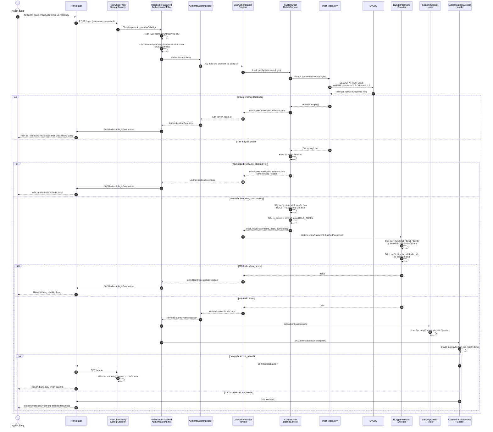
```mermaid
sequenceDiagram
    autonumber
    actor U as Người dùng
    participant BR as Trình duyệt
    participant FC as FilterChainProxy<br/>Spring Security
    participant UF as UsernamePassword<br/>AuthenticationFilter
    participant AM as AuthenticationManager
    participant AP as DaoAuthentication<br/>Provider
    participant UDS as CustomUser<br/>DetailsService
    participant UR as UserRepository
    participant DB as MySQL
    participant PE as BCryptPassword<br/>Encoder
    participant SC as SecurityContext<br/>Holder
    participant SH as AuthenticationSuccess<br/>Handler

    U->>BR: Nhập tên đăng nhập hoặc email và mật khẩu
    BR->>FC: POST /login (username, password)
    FC->>UF: Chuyển yêu cầu qua chuỗi bộ lọc
    UF->>UF: Trích xuất tham số từ thân yêu cầu
    UF->>UF: Tạo UsernamePasswordAuthenticationToken<br/>(chưa xác thực)
    UF->>AM: authenticate(token)
    AM->>AP: Ủy thác cho provider đã đăng ký
    AP->>UDS: loadUserByUsername(login)
    UDS->>UR: findByUsernameOrEmail(login)
    UR->>DB: SELECT * FROM users<br/>WHERE username = ? OR email = ?
    DB-->>UR: Bản ghi người dùng hoặc rỗng

    alt Không tìm thấy tài khoản
        UR-->>UDS: Optional.empty()
        UDS-->>AP: ném UsernameNotFoundException
        AP-->>AM: Lan truyền ngoại lệ
        AM-->>UF: AuthenticationException
        UF->>BR: 302 Redirect /login?error=true
        BR-->>U: Hiển thị "Tên đăng nhập hoặc mật khẩu không đúng"
    else Tìm thấy tài khoản
        UR-->>UDS: Đối tượng User
        UDS->>UDS: Kiểm tra cờ is_blocked

        alt Tài khoản bị khóa (is_blocked = 1)
            UDS-->>AP: ném UsernameNotFoundException<br/>kèm blocked_reason
            AP-->>UF: AuthenticationException
            UF->>BR: 302 Redirect /login?error=true
            BR-->>U: Hiển thị lý do tài khoản bị khóa
        else Tài khoản hoạt động bình thường
            UDS->>UDS: Xây dựng danh sách quyền hạn<br/>ROLE_ + users.role viết hoa
            UDS->>UDS: Nếu is_admin = 1 thì bổ sung ROLE_ADMIN
            UDS-->>AP: UserDetails (username, hash, authorities)
            AP->>PE: matches(rawPassword, hashedPassword)
            PE->>PE: Đọc biến thể ($2a$ / $2b$ / $2y$)<br/>và hệ số chi phí từ chuỗi băm
            PE->>PE: Trích muối, băm lại mật khẩu thô,<br/>so sánh kết quả

            alt Mật khẩu không khớp
                PE-->>AP: false
                AP-->>UF: ném BadCredentialsException
                UF->>BR: 302 Redirect /login?error=true
                BR-->>U: Hiển thị thông báo lỗi chung
            else Mật khẩu khớp
                PE-->>AP: true
                AP-->>AM: Authentication đã xác thực
                AM-->>UF: Trả về đối tượng Authentication
                UF->>SC: setAuthentication(auth)
                SC->>SC: Lưu SecurityContext vào HttpSession
                UF->>SH: onAuthenticationSuccess(auth)
                SH->>SH: Duyệt tập quyền hạn của người dùng

                alt Có quyền ROLE_ADMIN
                    SH->>BR: 302 Redirect /admin
                    BR->>FC: GET /admin
                    FC->>FC: Kiểm tra hasRole("ADMIN") — thỏa mãn
                    BR-->>U: Hiển thị bảng điều khiển quản trị
                else Chỉ có quyền ROLE_USER
                    SH->>BR: 302 Redirect /
                    BR-->>U: Hiển thị trang chủ với trạng thái đã đăng nhập
                end
            end
        end
    end
```

**Phân tích luồng xử lý dữ liệu:**

Luồng đăng nhập thể hiện rõ nguyên lý phân tách trách nhiệm của Spring Security. Dữ liệu đi qua năm lớp chuyển đổi liên tiếp:

1. **Từ tham số HTTP sang đối tượng xác thực.** `UsernamePasswordAuthenticationFilter` chuyển hai chuỗi văn bản thành một đối tượng `Authentication` chưa được xác thực. Ở bước này, mật khẩu vẫn tồn tại ở dạng văn bản rõ trong bộ nhớ, nhưng chỉ trong phạm vi rất hẹp và không bao giờ được ghi nhật ký.

2. **Từ định danh sang bản ghi người dùng.** `CustomUserDetailsService` thực hiện truy vấn `findByUsernameOrEmail` — đây là điểm hiện thực yêu cầu FR-C01 cho phép đăng nhập bằng cả hai định danh. Truy vấn sử dụng chỉ mục `idx_users_email` và ràng buộc duy nhất trên cột `username`.

3. **Từ bản ghi người dùng sang tập quyền hạn.** Đây là bước then chốt của cơ chế phân quyền. Hệ thống áp dụng hai nguồn quyền hạn: nguồn chính là trường `users.role`, nguồn dự phòng là cờ `users.is_admin`. Việc duy trì nguồn dự phòng xuất phát từ thực tế dữ liệu kế thừa có thể tồn tại bản ghi mà `is_admin = 1` nhưng `role` vẫn là `user`.

4. **Từ mật khẩu thô sang kết quả so khớp.** `BCryptPasswordEncoder` không giải mã chuỗi băm — điều đó là bất khả thi về mặt toán học. Thay vào đó, bộ mã hóa trích phần muối và hệ số chi phí từ chính chuỗi băm đã lưu, băm lại mật khẩu thô với cùng tham số đó, rồi so sánh hai kết quả.

5. **Từ kết quả xác thực sang ngữ cảnh phiên.** Ngữ cảnh bảo mật được lưu vào `HttpSession`, nghĩa là các yêu cầu tiếp theo mang cùng `JSESSIONID` sẽ được nhận dạng mà không cần xác thực lại.

**Điểm kiểm soát an toàn:** Cả ba nhánh thất bại (không tìm thấy tài khoản, tài khoản bị khóa, mật khẩu sai) đều dẫn tới cùng một địa chỉ chuyển hướng `/login?error=true` với thông điệp chung. Đây là biện pháp chống **liệt kê tài khoản** (account enumeration): kẻ tấn công không thể dựa vào sự khác biệt của thông điệp lỗi để xác định tên đăng nhập nào tồn tại trong hệ thống.

### 2.3.2. Sơ đồ tuần tự – Ráp cấu hình PC và chuyển vào giỏ hàng

**Hình 2.8 – Sơ đồ tuần tự: Ráp cấu hình PC và chuyển cấu hình vào giỏ hàng**

```mermaid
sequenceDiagram
    autonumber
    actor U as Người dùng
    participant JS as Client JavaScript<br/>buildpc/index.html
    participant PC as PcBuilderApiController
    participant PS as PcBuilderService
    participant SES as HttpSession<br/>khóa "buildpc"
    participant PR as ProductRepository
    participant SR as ProductSpecRepository
    participant CS as CartService
    participant DB as MySQL

    Note over U,DB: GIAI ĐOẠN 1 — Mở khe linh kiện và nạp danh sách đã lọc

    U->>JS: Nhấn vào khe "Bo mạch chủ"
    JS->>PC: GET /api/build-pc/components?category_id=3
    PC->>PS: getComponentsForCategory(3, session)
    PS->>SES: Đọc cấu hình hiện tại
    SES-->>PS: Map khe → sản phẩm (đã có CPU id=101)
    PS->>PR: findByCategoryIdAndIsActiveTrue(3)
    PR->>DB: SELECT ... WHERE category_id=3 AND is_active=1
    DB-->>PR: Danh sách bo mạch chủ
    PR-->>PS: List<Product>

    alt Cấu hình đã có bộ xử lý
        PS->>SR: findSpecValue(101, "Socket")
        SR->>DB: SELECT spec_value FROM product_specs<br/>WHERE product_id=101 AND spec_name='Socket'
        DB-->>SR: "LGA 1700"
        SR-->>PS: Giá trị chuẩn chân cắm của CPU
        PS->>PS: normalizeSocket("LGA 1700") → "LGA1700"
        loop Với từng bo mạch chủ trong danh sách
            PS->>SR: findSpecValue(mainboardId, "Socket")
            SR-->>PS: Giá trị chuẩn chân cắm
            PS->>PS: So sánh sau khi chuẩn hóa;<br/>chỉ giữ lại bản ghi trùng khớp
        end
        PS-->>PC: Danh sách bo mạch chủ tương thích
    else Cấu hình chưa có bộ xử lý
        PS-->>PC: Toàn bộ danh sách bo mạch chủ
    end

    PC-->>JS: 200 OK — JSON danh sách linh kiện
    JS-->>U: Hiển thị lưới linh kiện có thể chọn

    Note over U,DB: GIAI ĐOẠN 2 — Chọn linh kiện và kiểm tra tương thích hai chiều

    U->>JS: Chọn bo mạch chủ id=205
    JS->>PC: POST /api/build-pc/select<br/>{category_id: 3, product_id: 205}
    PC->>PS: selectComponent(3, 205, session)
    PS->>PR: findById(205)
    PR->>DB: SELECT * FROM products WHERE id=205
    DB-->>PR: Bản ghi sản phẩm
    PR-->>PS: Product

    alt Sản phẩm không tồn tại hoặc is_active = 0
        PS-->>PC: SelectResult(success=false, "Sản phẩm không khả dụng")
        PC-->>JS: 400 Bad Request
    else Tồn kho bằng 0
        PS-->>PC: SelectResult(success=false, "Sản phẩm đã hết hàng")
        PC-->>JS: 400 Bad Request
    else Sản phẩm hợp lệ
        PS->>SR: findSpecValue(205, "Socket")
        SR-->>PS: "LGA1700"
        PS->>SES: Đọc bộ xử lý hiện có trong cấu hình
        SES-->>PS: CPU id=101
        PS->>SR: findSpecValue(101, "Socket")
        SR-->>PS: "LGA 1700"
        PS->>PS: Chuẩn hóa và so sánh hai giá trị

        alt Hai chuẩn chân cắm không trùng khớp
            PS->>SES: Gỡ bộ xử lý khỏi cấu hình
            PS->>PS: Sinh cảnh báo mô tả xung đột
        end

        PS->>SES: Ghi bo mạch chủ vào khe số 3
        PS->>PS: Tính lại tổng tiền bằng tổng getFinalPrice()
        PS->>PS: Tính tổng công suất tiêu thụ ước lượng
        PS-->>PC: SelectResult(success, message, warning,<br/>build, totalPrice)
        PC-->>JS: 200 OK — JSON kết quả
        JS-->>U: Cập nhật khe, tổng tiền và hiển thị cảnh báo nếu có
    end

    Note over U,DB: GIAI ĐOẠN 3 — Chuyển toàn bộ cấu hình vào giỏ hàng

    U->>JS: Nhấn "Thêm toàn bộ cấu hình vào giỏ"
    JS->>PC: POST /api/build-pc/add-to-cart
    PC->>PS: batchAddToCart(session)
    PS->>SES: Đọc toàn bộ cấu hình
    SES-->>PS: Map khe → sản phẩm

    alt Cấu hình rỗng
        PS-->>PC: BatchAddResult(success=false, "Chưa chọn linh kiện nào")
        PC-->>JS: 400 Bad Request
    else Cấu hình có linh kiện
        loop Với từng linh kiện trong cấu hình
            PS->>PR: findById(productId)
            PR->>DB: SELECT * FROM products WHERE id=?
            DB-->>PR: Bản ghi sản phẩm hiện tại
            PR-->>PS: Product với tồn kho mới nhất
            alt Đủ tồn kho
                PS->>CS: addToCart(productId, 1, session)
                CS->>SES: Ghi mục hàng với giá getFinalPrice()
            else Không đủ tồn kho
                PS->>PS: Thêm mô tả lỗi vào danh sách stockErrors
            end
        end
        PS->>CS: getCartCount(session)
        CS-->>PS: Số mục trong giỏ sau thao tác
        PS-->>PC: BatchAddResult(success, message,<br/>stockErrors, cartCount)
        PC-->>JS: 200 OK — JSON kết quả
        JS-->>U: Cập nhật huy hiệu giỏ hàng và liệt kê<br/>các linh kiện không thêm được (nếu có)
    end
```

**Phân tích luồng xử lý dữ liệu:**

Sơ đồ này minh họa rõ nhất đặc trưng nghiệp vụ của đề tài. Ba điểm thiết kế đáng phân tích:

**Thứ nhất – Lọc hai lớp cho ràng buộc tương thích.** Hệ thống áp dụng ràng buộc tương thích ở **hai thời điểm khác nhau** với mục đích khác nhau. Lớp thứ nhất tại giai đoạn 1 (`getComponentsForCategory`) mang tính **phòng ngừa**: người dùng chỉ nhìn thấy những linh kiện có thể lắp được, do đó khó tạo ra lựa chọn sai. Lớp thứ hai tại giai đoạn 2 (`selectComponent`) mang tính **cưỡng chế**: ngay cả khi người dùng gửi trực tiếp yêu cầu HTTP tới API mà không qua giao diện, hệ thống vẫn phát hiện xung đột và tự động gỡ linh kiện không tương thích. Nguyên tắc ở đây là **không bao giờ tin vào dữ liệu do client gửi lên**.

**Thứ hai – Chuẩn hóa chuỗi trước khi so sánh.** Dữ liệu thông số kỹ thuật trong thực tế được nhập bởi nhiều người ở nhiều thời điểm, nên cùng một chuẩn chân cắm có thể được ghi là `LGA 1700`, `LGA1700`, `lga-1700` hoặc `LGA_1700`. Phương thức `normalizeSocket()` loại bỏ khoảng trắng, dấu gạch nối, dấu gạch dưới và chuyển toàn bộ sang chữ hoa trước khi so sánh, khiến logic nghiệp vụ bền vững trước sự thiếu nhất quán của dữ liệu đầu vào.

**Thứ ba – Chiến lược thành công một phần khi thêm hàng loạt.** Phương thức `batchAddToCart()` **không** áp dụng ngữ nghĩa tất-cả-hoặc-không-gì. Nếu sáu trên bảy linh kiện còn hàng, hệ thống thêm sáu linh kiện đó vào giỏ và trả về danh sách lỗi cho linh kiện còn lại. Lựa chọn này dựa trên phân tích trải nghiệm người dùng: việc bắt người dùng làm lại toàn bộ cấu hình chỉ vì một linh kiện hết hàng là một trải nghiệm tồi. Cần nhấn mạnh rằng **tồn kho được đọc lại từ cơ sở dữ liệu tại thời điểm thêm vào giỏ**, chứ không dùng giá trị đã lưu trong phiên, vì tồn kho có thể đã thay đổi kể từ lúc người dùng chọn linh kiện.

### 2.3.3. Sơ đồ tuần tự – Đặt hàng với khóa bi quan và kiểm tra voucher

**Hình 2.9 – Sơ đồ tuần tự: Đặt hàng với khóa bi quan trừ kho và kiểm tra voucher**

```mermaid
sequenceDiagram
    autonumber
    actor U as Người dùng
    participant CVC as CheckoutViewController
    participant CHS as CheckoutService<br/>@Transactional
    participant TX as Trình quản lý<br/>giao dịch
    participant PR as ProductRepository
    participant SS as ShippingService
    participant VS as VoucherService
    participant OR as OrderRepository
    participant WR as WarehouseLogRepository
    participant DB as MySQL InnoDB
    participant SES as HttpSession

    U->>CVC: POST /thanh-toan (thông tin giao hàng,<br/>mã giảm giá, phương thức thanh toán)
    CVC->>SES: Đọc nội dung giỏ hàng
    SES-->>CVC: Danh sách mục hàng

    alt Giỏ hàng rỗng
        CVC->>U: 302 Redirect /gio-hang kèm cảnh báo
    else Giỏ hàng có hàng
        CVC->>CHS: placeOrder(request, cart, session)
        CHS->>TX: BEGIN TRANSACTION
        activate TX

        Note over CHS: BƯỚC 1 — Gộp số lượng theo định danh sản phẩm
        CHS->>CHS: Duyệt giỏ hàng, cộng dồn số lượng<br/>vào LinkedHashMap<productId, quantity>

        Note over CHS: BƯỚC 2 — Sắp xếp thứ tự khóa chống bế tắc
        CHS->>CHS: keySet().stream().sorted().toList()

        Note over CHS,DB: BƯỚC 3 — Khóa bi quan và kiểm tra tồn kho
        loop Với từng productId theo thứ tự tăng dần
            CHS->>PR: findByIdForUpdate(productId)
            PR->>DB: SELECT * FROM products<br/>WHERE id = ? FOR UPDATE
            DB->>DB: Đặt khóa ghi độc quyền trên bản ghi;<br/>giao dịch khác phải chờ
            DB-->>PR: Bản ghi sản phẩm đã khóa
            PR-->>CHS: Product

            alt Sản phẩm không tồn tại hoặc is_active = 0
                CHS->>TX: ném IllegalArgumentException
                TX->>DB: ROLLBACK — giải phóng mọi khóa
                deactivate TX
                CHS-->>CVC: Ngoại lệ
                CVC->>U: 302 Redirect /thanh-toan kèm thông báo lỗi
            else quantity < số lượng đặt
                CHS->>TX: ném InsufficientStockException
                TX->>DB: ROLLBACK — hoàn tác mọi thay đổi
                CHS-->>CVC: Ngoại lệ kèm tên sản phẩm và tồn kho còn lại
                CVC->>U: 302 Redirect kèm thông báo hết hàng
            else Đủ tồn kho
                Note over CHS: BƯỚC 4 — Trừ kho trong bộ nhớ
                CHS->>CHS: product.setQuantity(quantity - soLuongDat)
            end
        end

        Note over CHS: BƯỚC 5 — Tính lại toàn bộ số tiền từ dữ liệu máy chủ
        CHS->>CHS: subtotal = Σ getFinalPrice() × soLuong
        CHS->>SS: calculateFee(province, subtotal)
        SS->>DB: SELECT * FROM shipping_zones WHERE is_active = 1
        DB-->>SS: Danh sách vùng vận chuyển
        SS->>SS: Phân tích cột provinces dạng mảng JSON,<br/>chuẩn hóa tên tỉnh và đối chiếu
        alt Đạt ngưỡng miễn phí vận chuyển
            SS-->>CHS: shippingFee = 0
        else Chưa đạt ngưỡng
            SS-->>CHS: shippingFee = base_fee của vùng
        end

        alt Có nhập mã giảm giá
            CHS->>VS: validate(code, userId, subtotal)
            VS->>DB: SELECT * FROM vouchers WHERE code = ? AND is_active = 1
            DB-->>VS: Bản ghi voucher hoặc rỗng
            VS->>VS: Kiểm tra hạn dùng, used_count < usage_limit,<br/>voucher cá nhân hóa, subtotal >= min_order
            VS->>DB: SELECT EXISTS(... voucher_usages<br/>WHERE voucher_id = ? AND user_id = ?)
            DB-->>VS: Đã dùng hay chưa
            alt Voucher hợp lệ
                VS->>VS: Tính mức giảm theo loại percent / fixed / freeship,<br/>áp trần max_discount
                VS-->>CHS: VoucherResult(valid = true, discount)
            else Voucher không hợp lệ
                VS-->>CHS: VoucherResult(valid = false, lý do)
                CHS->>CHS: discount = 0, tiếp tục đặt hàng
            end
        end

        CHS->>CHS: finalAmount = max(0, subtotal + shippingFee − discount)

        Note over CHS,DB: BƯỚC 6 — Tạo đơn hàng
        CHS->>CHS: accessToken = UUID.randomUUID().toString()
        CHS->>OR: save(Order: status=pending,<br/>payment_status=unpaid, accessToken)
        OR->>DB: INSERT INTO orders (...)
        DB-->>OR: order_id vừa sinh

        Note over CHS,DB: BƯỚC 7 — Ghi mục hàng và nhật ký xuất kho
        loop Với từng sản phẩm trong đơn
            CHS->>DB: INSERT INTO order_items<br/>(order_id, product_id, product_name, price, quantity)
            CHS->>WR: save(WarehouseLog: type=EXPORT,<br/>reason='sale', reference_id=order_id)
            WR->>DB: INSERT INTO warehouse_logs (...)
        end

        Note over CHS,DB: BƯỚC 8 — Ghi nhận lượt dùng voucher
        alt Voucher đã được áp dụng thành công
            CHS->>VS: recordUsage(voucherId, userId, orderId)
            VS->>DB: INSERT INTO voucher_usages (...)
            VS->>DB: UPDATE vouchers SET used_count = used_count + 1
            Note right of DB: Ràng buộc UNIQUE (voucher_id, user_id)<br/>là chốt chặn cuối chống dùng lại
        end

        Note over CHS,DB: BƯỚC 9 — Lưu địa chỉ và xóa giỏ hàng
        alt Người dùng đã đăng nhập và chọn lưu địa chỉ
            CHS->>DB: INSERT INTO user_addresses (...)
        end
        CHS->>SES: cart.clear()

        CHS->>TX: COMMIT
        TX->>DB: Ghi bền vững toàn bộ thay đổi<br/>và giải phóng mọi khóa
        deactivate TX
        CHS-->>CVC: Đối tượng Order đã lưu

        alt Phương thức thanh toán là vnpay
            CVC->>U: 302 Redirect /vnpay/payment/{id}?token={accessToken}
        else Phương thức là cod hoặc bank
            CVC->>U: 302 Redirect /dat-hang-thanh-cong/{id}?token={accessToken}
        end
    end
```

**Phân tích luồng xử lý dữ liệu và ranh giới giao dịch:**

**Về ranh giới giao dịch.** Chú thích `@Transactional` đặt tại phương thức `placeOrder()` xác lập một ranh giới giao dịch bao trọn cả chín bước. Spring sử dụng mẫu ủy nhiệm động để bọc phương thức: trước khi thân phương thức chạy, một giao dịch được mở; nếu phương thức trả về bình thường, giao dịch được cam kết; nếu một ngoại lệ thuộc loại không kiểm tra (`RuntimeException`) thoát ra, giao dịch bị hoàn tác. Cả `InsufficientStockException` và `IllegalArgumentException` đều thuộc loại này, nên cơ chế hoàn tác hoạt động mà không cần mã xử lý tường minh.

**Về ý nghĩa của bước 1 (gộp số lượng).** Giả sử giỏ hàng chứa hai mục cùng trỏ tới sản phẩm định danh 101, mỗi mục số lượng 3, trong khi tồn kho chỉ còn 5. Nếu kiểm tra từng mục riêng lẻ, cả hai lần kiểm tra đều cho kết quả hợp lệ (3 ≤ 5), dẫn tới bán 6 đơn vị từ tồn kho 5. Việc gộp thành một mục duy nhất với số lượng 6 khiến phép kiểm tra phát hiện đúng tình huống thiếu hàng. Cấu trúc `LinkedHashMap` được chọn thay vì `HashMap` để bảo toàn thứ tự chèn, giúp thông điệp lỗi trả về theo đúng thứ tự người dùng nhìn thấy trên giỏ hàng.

**Về ý nghĩa của bước 2 (sắp xếp thứ tự khóa).** Đây là kỹ thuật kinh điển phòng chống bế tắc. Xét hai giao dịch đồng thời: giao dịch A mua sản phẩm 101 và 205, giao dịch B mua sản phẩm 205 và 101. Nếu không sắp xếp, A có thể khóa 101 rồi chờ 205, trong khi B đã khóa 205 và đang chờ 101 — hai giao dịch chờ nhau vô hạn, tạo thành bế tắc. Khi cả hai đều bắt buộc khóa theo thứ tự tăng dần, cả A và B đều khóa 101 trước; giao dịch đến sau chỉ đơn giản phải chờ, và sau khi giao dịch trước hoàn tất thì tiếp tục bình thường. Bế tắc bị **loại trừ bằng thiết kế**, không phải bằng cơ chế phát hiện và thử lại.

**Về ý nghĩa của bước 5 (tính lại số tiền).** Đây là điểm kiểm soát an ninh quan trọng nhất của toàn hệ thống về mặt tài chính. Mọi con số đều được tính lại từ nguồn dữ liệu đáng tin cậy: giá lấy từ `product.getFinalPrice()` trên đối tượng vừa được nạp từ cơ sở dữ liệu trong cùng giao dịch, phí vận chuyển do `ShippingService` tính, mức giảm do `VoucherService` tính. **Không một giá trị tiền tệ nào do client gửi lên được sử dụng.** Ngay cả khi kẻ tấn công sửa đổi thân yêu cầu HTTP để khai báo giá bằng 1 đồng, giá trị đó cũng bị bỏ qua hoàn toàn.

**Về ảnh chụp dữ liệu tại bước 7.** Bản ghi `order_items` lưu cả `product_name` và `price` thay vì chỉ lưu khóa ngoại trỏ tới `products`. Đây là chủ đích thiết kế: nếu sau này sản phẩm đổi tên hoặc đổi giá, hóa đơn cũ vẫn phải phản ánh đúng thông tin tại thời điểm giao dịch. Đây là nguyên tắc **bất biến của dữ liệu giao dịch tài chính**.

### 2.3.4. Sơ đồ tuần tự – Thanh toán VNPAY với hai kênh phản hồi

**Hình 2.10 – Sơ đồ tuần tự: Thanh toán VNPAY (tạo URL, Return URL và IPN Webhook)**

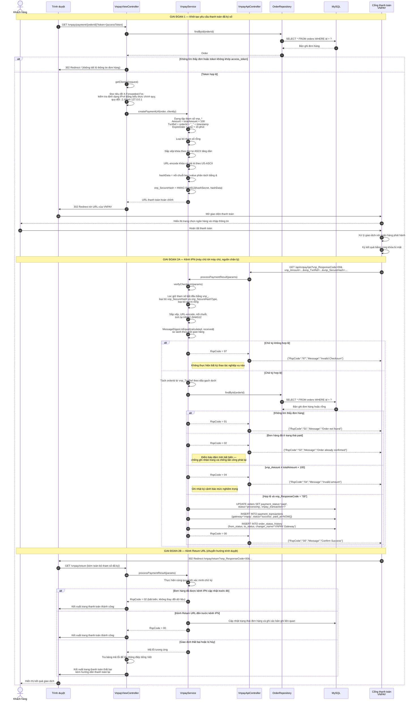
```mermaid
sequenceDiagram
    autonumber
    actor U as Khách hàng
    participant BR as Trình duyệt
    participant VVC as VnpayViewController
    participant VS as VnpayService
    participant VAC as VnpayApiController
    participant OR as OrderRepository
    participant DB as MySQL
    participant GW as Cổng thanh toán<br/>VNPAY

    Note over U,GW: GIAI ĐOẠN 1 — Khởi tạo yêu cầu thanh toán đã ký số

    BR->>VVC: GET /vnpay/payment/{orderId}?token={accessToken}
    VVC->>OR: findById(orderId)
    OR->>DB: SELECT * FROM orders WHERE id = ?
    DB-->>OR: Bản ghi đơn hàng
    OR-->>VVC: Order

    alt Không tìm thấy đơn hoặc token không khớp access_token
        VVC->>BR: 302 Redirect / (không tiết lộ thông tin đơn hàng)
    else Token hợp lệ
        VVC->>VVC: getClientIp(request)
        VVC->>VVC: Đọc tiêu đề X-Forwarded-For,<br/>kiểm tra định dạng IPv4 bằng biểu thức chính quy,<br/>quy đổi ::1 thành 127.0.0.1
        VVC->>VS: createPaymentUrl(order, clientIp)
        VS->>VS: Dựng tập tham số vnp_*<br/>Amount = totalAmount × 100<br/>TxnRef = orderId + "_" + timestamp<br/>ExpireDate = now + 15 phút
        VS->>VS: Loại bỏ tham số rỗng
        VS->>VS: Sắp xếp khóa theo thứ tự ASCII tăng dần
        VS->>VS: URL-encode khóa và giá trị theo US-ASCII
        VS->>VS: hashData = nối chuỗi key=value phân tách bằng &
        VS->>VS: vnp_SecureHash = HMAC-SHA512(hashSecret, hashData)
        VS-->>VVC: URL thanh toán hoàn chỉnh
        VVC->>BR: 302 Redirect tới URL của VNPAY
        BR->>GW: Mở giao diện thanh toán
        GW-->>U: Hiển thị trang chọn ngân hàng và nhập thông tin
        U->>GW: Hoàn tất thanh toán
        GW->>GW: Xử lý giao dịch với ngân hàng phát hành
        GW->>GW: Ký kết quả bằng cùng khóa bí mật

        Note over U,GW: GIAI ĐOẠN 2A — Kênh IPN (máy chủ tới máy chủ, nguồn chân lý)

        GW->>VAC: GET /api/vnpay/ipn?vnp_ResponseCode=00&<br/>vnp_Amount=...&vnp_TxnRef=...&vnp_SecureHash=...
        VAC->>VS: processPaymentResult(params)
        VS->>VS: verifyChecksum(params)
        VS->>VS: Lọc giữ tham số bắt đầu bằng vnp_,<br/>loại bỏ vnp_SecureHash và vnp_SecureHashType,<br/>loại bỏ giá trị rỗng
        VS->>VS: Sắp xếp, URL-encode, nối chuỗi,<br/>tính lại HMAC-SHA512
        VS->>VS: MessageDigest.isEqual(calculated, received)<br/>so sánh theo thời gian hằng

        alt Chữ ký không hợp lệ
            VS-->>VAC: RspCode = 97
            VAC-->>GW: {"RspCode":"97","Message":"Invalid Checksum"}
            Note right of VS: Không thực hiện bất kỳ thao tác nghiệp vụ nào
        else Chữ ký hợp lệ
            VS->>VS: Tách orderId từ vnp_TxnRef theo dấu gạch dưới
            VS->>OR: findById(orderId)
            OR->>DB: SELECT * FROM orders WHERE id = ?
            DB-->>OR: Bản ghi đơn hàng hoặc rỗng

            alt Không tìm thấy đơn hàng
                VS-->>VAC: RspCode = 01
                VAC-->>GW: {"RspCode":"01","Message":"Order not found"}
            else Đơn hàng đã ở trạng thái paid
                VS-->>VAC: RspCode = 02
                VAC-->>GW: {"RspCode":"02","Message":"Order already confirmed"}
                Note right of VS: Điểm bảo đảm tính bất biến —<br/>chống ghi nhận trùng và chống tấn công phát lại
            else vnp_Amount ≠ totalAmount × 100
                VS-->>VAC: RspCode = 04
                VAC-->>GW: {"RspCode":"04","Message":"Invalid amount"}
                Note right of VS: Ghi nhật ký cảnh báo mức nghiêm trọng
            else Hợp lệ và vnp_ResponseCode = "00"
                VS->>DB: UPDATE orders SET payment_status='paid',<br/>status='processing', vnpay_transaction=?
                VS->>DB: INSERT INTO payment_transactions<br/>(gateway='vnpay', status='success', paid_at=NOW())
                VS->>DB: INSERT INTO order_status_history<br/>(from_status, to_status, changer_name='VNPAY Gateway')
                VS-->>VAC: RspCode = 00
                VAC-->>GW: {"RspCode":"00","Message":"Confirm Success"}
            end
        end

        Note over U,GW: GIAI ĐOẠN 2B — Kênh Return URL (chuyển hướng trình duyệt)

        GW->>BR: 302 Redirect /vnpay/return?vnp_ResponseCode=00&...
        BR->>VVC: GET /vnpay/return (kèm toàn bộ tham số đã ký)
        VVC->>VS: processPaymentResult(params)
        VS->>VS: Thực hiện cùng quy trình xác minh chữ ký

        alt Đơn hàng đã được kênh IPN cập nhật trước đó
            VS-->>VVC: RspCode = 02 (bất biến, không thay đổi dữ liệu)
            VVC->>BR: Kết xuất trang thanh toán thành công
        else Kênh Return URL đến trước kênh IPN
            VS->>DB: Cập nhật trạng thái đơn hàng và ghi các bản ghi liên quan
            VS-->>VVC: RspCode = 00
            VVC->>BR: Kết xuất trang thanh toán thành công
        else Giao dịch thất bại hoặc bị hủy
            VS-->>VVC: Mã lỗi tương ứng
            VVC->>VVC: Tra bảng mã lỗi để lấy thông điệp tiếng Việt
            VVC->>BR: Kết xuất trang thanh toán thất bại<br/>kèm hướng dẫn thanh toán lại
        end
        BR-->>U: Hiển thị kết quả giao dịch
    end
```

**Phân tích luồng xử lý dữ liệu:**

**Về sự cần thiết của hai kênh.** Kênh Return URL phụ thuộc hoàn toàn vào trình duyệt của khách hàng: nếu khách đóng tab ngay sau khi thanh toán, nếu mạng di động mất kết nối trong lúc chuyển hướng, hoặc nếu trình duyệt chặn chuyển hướng, thì kênh này không bao giờ được kích hoạt. Trong khi đó, tiền đã bị trừ khỏi tài khoản khách hàng. Kênh IPN giải quyết triệt để vấn đề này: VNPAY gọi trực tiếp từ máy chủ của họ tới máy chủ bán hàng và sẽ **thử lại nhiều lần** cho tới khi nhận được phản hồi hợp lệ. Vì vậy, kênh IPN là **nguồn chân lý** cho trạng thái thanh toán, còn kênh Return URL chỉ phục vụ trải nghiệm người dùng.

**Về tính bất biến.** Vì cả hai kênh đều gọi cùng phương thức `processPaymentResult()`, và vì thứ tự đến của hai kênh là không xác định, tính bất biến trở thành yêu cầu bắt buộc. Cơ chế hiện thực rất đơn giản nhưng hiệu quả: kiểm tra `payment_status == PAID` ngay sau khi nạp đơn hàng và trước mọi thao tác ghi. Nếu điều kiện đúng, phương thức trả mã `02` và kết thúc ngay. Nhờ đó, dù kênh nào đến trước, dù VNPAY thử lại bao nhiêu lần, dù kẻ tấn công có phát lại nguyên văn URL đã ký hợp lệ, hệ thống vẫn chỉ ghi nhận thanh toán đúng một lần.

**Về ba lớp phòng vệ.** Endpoint IPN được bảo vệ bằng ba lớp kiểm tra tuần tự, mỗi lớp chặn một loại tấn công khác nhau: (i) xác minh chữ ký HMAC chặn việc giả mạo hoặc sửa đổi tham số; (ii) kiểm tra tính bất biến chặn tấn công phát lại; (iii) đối chiếu số tiền chặn kịch bản kẻ tấn công lấy được khóa bí mật của một merchant khác hoặc khai thác lỗi cấu hình. Thứ tự các lớp là quan trọng: xác minh chữ ký phải đứng đầu tiên vì nếu chữ ký sai thì toàn bộ dữ liệu còn lại đều không đáng tin.

### 2.3.5. Sơ đồ tuần tự – Quản trị viên duyệt đơn và hoàn kho tự động

**Hình 2.11 – Sơ đồ tuần tự: Quản trị viên duyệt đơn và hoàn kho tự động**

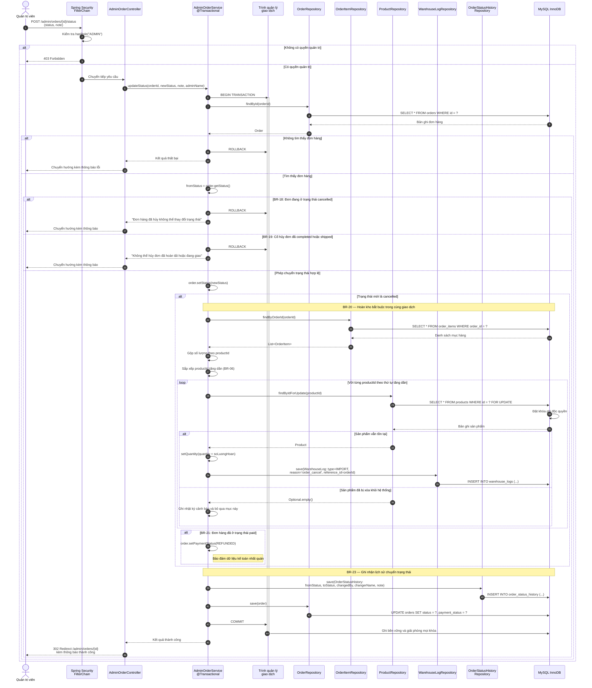
```mermaid
sequenceDiagram
    autonumber
    actor A as Quản trị viên
    participant SEC as Spring Security<br/>FilterChain
    participant AOC as AdminOrderController
    participant AOS as AdminOrderService<br/>@Transactional
    participant TX as Trình quản lý<br/>giao dịch
    participant OR as OrderRepository
    participant OIR as OrderItemRepository
    participant PR as ProductRepository
    participant WR as WarehouseLogRepository
    participant HR as OrderStatusHistory<br/>Repository
    participant DB as MySQL InnoDB

    A->>SEC: POST /admin/orders/{id}/status<br/>(status, note)
    SEC->>SEC: Kiểm tra hasRole("ADMIN")

    alt Không có quyền quản trị
        SEC-->>A: 403 Forbidden
    else Có quyền quản trị
        SEC->>AOC: Chuyển tiếp yêu cầu
        AOC->>AOS: updateStatus(orderId, newStatus, note, adminName)
        AOS->>TX: BEGIN TRANSACTION
        activate TX

        AOS->>OR: findById(orderId)
        OR->>DB: SELECT * FROM orders WHERE id = ?
        DB-->>OR: Bản ghi đơn hàng
        OR-->>AOS: Order

        alt Không tìm thấy đơn hàng
            AOS->>TX: ROLLBACK
            AOS-->>AOC: Kết quả thất bại
            AOC-->>A: Chuyển hướng kèm thông báo lỗi
        else Tìm thấy đơn hàng
            AOS->>AOS: fromStatus = order.getStatus()

            alt BR-18: Đơn đang ở trạng thái cancelled
                AOS->>TX: ROLLBACK
                AOS-->>AOC: "Đơn hàng đã hủy không thể thay đổi trạng thái"
                AOC-->>A: Chuyển hướng kèm thông báo
            else BR-19: Cố hủy đơn đã completed hoặc shipped
                AOS->>TX: ROLLBACK
                AOS-->>AOC: "Không thể hủy đơn đã hoàn tất hoặc đang giao"
                AOC-->>A: Chuyển hướng kèm thông báo
            else Phép chuyển trạng thái hợp lệ
                AOS->>AOS: order.setStatus(newStatus)

                alt Trạng thái mới là cancelled
                    Note over AOS,DB: BR-20 — Hoàn kho bắt buộc trong cùng giao dịch
                    AOS->>OIR: findByOrderId(orderId)
                    OIR->>DB: SELECT * FROM order_items WHERE order_id = ?
                    DB-->>OIR: Danh sách mục hàng
                    OIR-->>AOS: List<OrderItem>
                    AOS->>AOS: Gộp số lượng theo productId
                    AOS->>AOS: Sắp xếp productId tăng dần (BR-06)

                    loop Với từng productId theo thứ tự tăng dần
                        AOS->>PR: findByIdForUpdate(productId)
                        PR->>DB: SELECT * FROM products WHERE id = ? FOR UPDATE
                        DB->>DB: Đặt khóa ghi độc quyền
                        DB-->>PR: Bản ghi sản phẩm

                        alt Sản phẩm vẫn tồn tại
                            PR-->>AOS: Product
                            AOS->>AOS: setQuantity(quantity + soLuongHoan)
                            AOS->>WR: save(WarehouseLog: type=IMPORT,<br/>reason='order_cancel', reference_id=orderId)
                            WR->>DB: INSERT INTO warehouse_logs (...)
                        else Sản phẩm đã bị xóa khỏi hệ thống
                            PR-->>AOS: Optional.empty()
                            AOS->>AOS: Ghi nhật ký cảnh báo và bỏ qua mục này
                        end
                    end

                    alt BR-21: Đơn hàng đã ở trạng thái paid
                        AOS->>AOS: order.setPaymentStatus(REFUNDED)
                        Note right of AOS: Bảo đảm dữ liệu kế toán nhất quán
                    end
                end

                Note over AOS,DB: BR-23 — Ghi nhận lịch sử chuyển trạng thái
                AOS->>HR: save(OrderStatusHistory:<br/>fromStatus, toStatus, changedBy, changerName, note)
                HR->>DB: INSERT INTO order_status_history (...)

                AOS->>OR: save(order)
                OR->>DB: UPDATE orders SET status = ?, payment_status = ?

                AOS->>TX: COMMIT
                TX->>DB: Ghi bền vững và giải phóng mọi khóa
                deactivate TX
                AOS-->>AOC: Kết quả thành công
                AOC-->>A: 302 Redirect /admin/orders/{id}<br/>kèm thông báo thành công
            end
        end
    end
```

**Phân tích luồng xử lý dữ liệu:**

**Về tính nguyên tử của cặp thao tác hủy đơn – hoàn kho.** Đây là điểm thiết kế quan trọng nhất của luồng này. Hai thao tác "đổi trạng thái đơn thành đã hủy" và "cộng trả tồn kho" **bắt buộc phải nằm trong cùng một giao dịch**. Nếu tách rời, tồn tại hai kịch bản hỏng dữ liệu: (i) đơn đã hủy nhưng kho chưa hoàn — hàng bị "kẹt" trong đơn không tồn tại, gây thất thoát cơ hội bán hàng; (ii) kho đã hoàn nhưng đơn chưa hủy — hàng bị đếm hai lần, dẫn tới bán vượt tồn kho thực tế. Chú thích `@Transactional` trên `updateStatus()` loại trừ cả hai kịch bản.

**Về việc tái sử dụng khóa bi quan trong luồng hoàn kho.** Thao tác hoàn kho cũng dùng `findByIdForUpdate()` với cùng quy tắc sắp xếp thứ tự khóa tăng dần như luồng đặt hàng. Lý do là hai luồng này có thể chạy đồng thời trên cùng một bản ghi sản phẩm: quản trị viên hủy đơn A trong khi khách hàng khác đang đặt mua chính sản phẩm đó. Nếu chỉ một trong hai luồng dùng khóa, cơ chế bảo vệ sẽ vô hiệu. Việc cả hai luồng cùng tuân thủ một quy ước khóa thống nhất là điều kiện cần để bảo đảm tính đúng đắn.

**Về xử lý dữ liệu không nhất quán.** Nhánh "sản phẩm đã bị xóa khỏi hệ thống" phản ánh một tình huống thực tế: khóa ngoại `order_items_ibfk_2` trỏ tới `products` không có hành vi xóa lan truyền, nhưng trong quá trình vận hành vẫn có thể phát sinh trường hợp dữ liệu không toàn vẹn. Thiết kế chọn cách **ghi nhật ký cảnh báo và tiếp tục** thay vì hủy toàn bộ giao dịch, vì việc chặn thao tác hủy đơn chỉ vì một sản phẩm không còn tồn tại sẽ khiến quản trị viên không thể xử lý đơn hàng — một hệ quả nghiêm trọng hơn.

**Về khả năng kiểm toán.** Mỗi lần chuyển trạng thái sinh ra một bản ghi `order_status_history` ghi rõ trạng thái trước, trạng thái sau, định danh và tên người thực hiện, ghi chú và dấu thời gian. Kết hợp với các bản ghi `warehouse_logs` mang `reference_id` trỏ tới đơn hàng, hệ thống cho phép tái dựng đầy đủ lịch sử của bất kỳ đơn hàng nào: ai đã làm gì, vào lúc nào, và tác động ra sao lên tồn kho.

## 2.4. Thiết kế hệ thống

### 2.4.1. Thiết kế kiến trúc tổng thể

#### a) Mô hình kiến trúc phân tầng

Hệ thống được tổ chức theo kiến trúc phân tầng nghiêm ngặt với năm tầng. Nguyên tắc bất di bất dịch là **tầng trên chỉ được phép gọi tầng kề dưới**, không tồn tại lời gọi vượt tầng hay lời gọi ngược lên trên.

**Hình 2.12 – Sơ đồ kiến trúc phân tầng tổng thể của hệ thống**

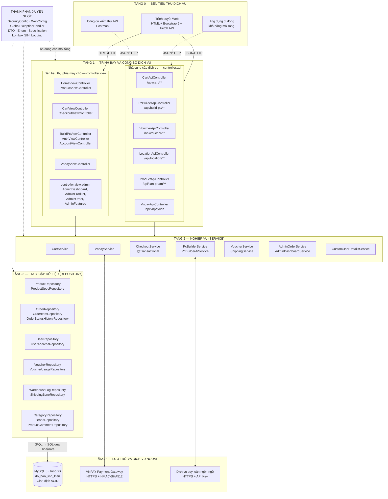
```mermaid
flowchart TD
    subgraph T0["TẦNG 0 — BÊN TIÊU THỤ DỊCH VỤ"]
        direction LR
        CL1["Trình duyệt Web<br/>HTML + Bootstrap 5 + Fetch API"]
        CL2["Ứng dụng di động<br/>khả năng mở rộng"]
        CL3["Công cụ kiểm thử API<br/>Postman"]
    end

    subgraph T1["TẦNG 1 — TRÌNH BÀY VÀ CÔNG BỐ DỊCH VỤ"]
        direction LR
        subgraph T1A["Nhà cung cấp dịch vụ — controller.api"]
            A1["CartApiController<br/>/api/cart/**"]
            A2["PcBuilderApiController<br/>/api/build-pc/**"]
            A3["VoucherApiController<br/>/api/voucher/**"]
            A4["LocationApiController<br/>/api/location/**"]
            A5["ProductApiController<br/>/api/san-pham/**"]
            A6["VnpayApiController<br/>/api/vnpay/ipn"]
        end
        subgraph T1B["Bên tiêu thụ phía máy chủ — controller.view"]
            V1["HomeViewController<br/>ProductViewController"]
            V2["CartViewController<br/>CheckoutViewController"]
            V3["BuildPcViewController<br/>AuthViewController<br/>AccountViewController"]
            V4["VnpayViewController"]
            V5["controller.view.admin<br/>AdminDashboard, AdminProduct,<br/>AdminOrder, AdminFeatures"]
        end
    end

    subgraph T2["TẦNG 2 — NGHIỆP VỤ (SERVICE)"]
        direction LR
        S1["CartService"]
        S2["PcBuilderService<br/>PcBuilderAiService"]
        S3["CheckoutService<br/>@Transactional"]
        S4["VnpayService"]
        S5["VoucherService<br/>ShippingService"]
        S6["AdminOrderService<br/>AdminDashboardService"]
        S7["CustomUserDetailsService"]
    end

    subgraph T3["TẦNG 3 — TRUY CẬP DỮ LIỆU (REPOSITORY)"]
        direction LR
        R1["ProductRepository<br/>ProductSpecRepository"]
        R2["OrderRepository<br/>OrderItemRepository<br/>OrderStatusHistoryRepository"]
        R3["UserRepository<br/>UserAddressRepository"]
        R4["VoucherRepository<br/>VoucherUsageRepository"]
        R5["WarehouseLogRepository<br/>ShippingZoneRepository"]
        R6["CategoryRepository<br/>BrandRepository<br/>ProductCommentRepository"]
    end

    subgraph T4["TẦNG 4 — LƯU TRỮ VÀ DỊCH VỤ NGOÀI"]
        direction LR
        DB[("MySQL 8 · InnoDB<br/>db_ban_linh_kien<br/>Giao dịch ACID")]
        EX1["VNPAY Payment Gateway<br/>HTTPS + HMAC-SHA512"]
        EX2["Dịch vụ suy luận ngôn ngữ<br/>HTTPS + API Key"]
    end

    XC["THÀNH PHẦN XUYÊN SUỐT<br/>SecurityConfig · WebConfig<br/>GlobalExceptionHandler<br/>DTO · Enum · Specification<br/>Lombok Slf4j Logging"]

    CL1 -->|"JSON/HTTP"| T1A
    CL1 -->|"HTML/HTTP"| T1B
    CL2 -.->|"JSON/HTTP"| T1A
    CL3 -.->|"JSON/HTTP"| T1A
    T1A --> T2
    T1B --> T2
    T2 --> T3
    T3 -->|"JPQL → SQL qua Hibernate"| DB
    S4 <--> EX1
    S2 <--> EX2
    XC -.->|"áp dụng cho mọi tầng"| T1
    XC -.-> T2
    XC -.-> T3
```

**Bảng 2.17 – Trách nhiệm của từng tầng kiến trúc**

| Tầng | Tên tầng | Thành phần đại diện | Trách nhiệm được phép | Điều cấm tuyệt đối |
|---|---|---|---|---|
| **0** | Bên tiêu thụ dịch vụ | Trình duyệt, ứng dụng di động, công cụ kiểm thử | Hiển thị dữ liệu, thu thập thao tác người dùng, gọi API, xử lý trạng thái giao diện | Không được tính toán giá bán, không được tự quyết định tính hợp lệ nghiệp vụ |
| **1** | Trình bày và công bố dịch vụ | `controller.api`, `controller.view` | Ràng buộc tham số HTTP vào DTO, kiểm chứng cú pháp đầu vào, ủy thác cho tầng dịch vụ, chuyển kết quả thành JSON hoặc tên khung nhìn, ánh xạ ngoại lệ sang mã trạng thái HTTP | Không được chứa logic nghiệp vụ, không được gọi trực tiếp repository, không được mở giao dịch |
| **2** | Nghiệp vụ | `service` | Hiện thực toàn bộ quy tắc nghiệp vụ BR-01 đến BR-30, xác lập ranh giới giao dịch, điều phối nhiều repository, gọi dịch vụ ngoài, chuyển đổi entity sang DTO | Không được phụ thuộc vào đối tượng `HttpServletRequest` hay `HttpServletResponse`, không được sinh HTML |
| **3** | Truy cập dữ liệu | `repository` | Định nghĩa truy vấn dẫn xuất, JPQL, `@EntityGraph`, `Specification`, khai báo khóa bi quan | Không được chứa quy tắc nghiệp vụ, không được mở giao dịch riêng |
| **4** | Lưu trữ và dịch vụ ngoài | MySQL, VNPAY, dịch vụ suy luận ngôn ngữ | Lưu trữ bền vững, thực thi ràng buộc toàn vẹn, quản lý khóa và giao dịch, xử lý thanh toán | — |

**Hai điểm cần làm rõ về sơ đồ:**

*Thứ nhất, về vai trò kép của tầng 1.* Gói `controller.api` đóng vai trò **nhà cung cấp dịch vụ**, công bố hợp đồng REST cho bên tiêu thụ bên ngoài. Gói `controller.view` đóng vai trò **bên tiêu thụ dịch vụ phía máy chủ**: các lớp này gọi cùng những dịch vụ ở tầng 2 nhưng kết xuất kết quả thành HTML thay vì JSON. Sự phân tách này chính là biểu hiện cụ thể của nguyên lý tái sử dụng dịch vụ: cùng một `CartService` phục vụ cả kênh JSON lẫn kênh HTML mà không cần nhân bản logic.

*Thứ hai, về thành phần xuyên suốt.* Các mối quan tâm cắt ngang như bảo mật, xử lý ngoại lệ, ghi nhật ký và định nghĩa DTO không thuộc về riêng tầng nào. Chúng được biểu diễn tách rời để nhấn mạnh rằng chúng áp dụng đồng đều cho mọi tầng.

#### b) Biểu đồ lớp các thực thể nghiệp vụ chính

**Hình 2.13 – Biểu đồ lớp (Class Diagram) các thực thể nghiệp vụ chính**


```mermaid
classDiagram
    direction LR

    class User {
        -Long id
        -String username
        -String password
        -String fullName
        -String email
        -String phone
        -String address
        -String avatar
        -String role
        -Boolean isAdmin
        -Boolean isBlocked
        -String blockedReason
        -LocalDateTime createdAt
        +isAdministrator() boolean
    }

    class UserAddress {
        -Long id
        -Long userId
        -String fullName
        -String phone
        -String province
        -String district
        -String ward
        -String addressDetail
        -Boolean isDefault
    }

    class Category {
        -Long id
        -String name
        -String slug
    }

    class Brand {
        -Long id
        -String name
        -String image
    }

    class Product {
        -Long id
        -Category category
        -Brand brand
        -String name
        -BigDecimal price
        -BigDecimal costPrice
        -Integer discountPercent
        -LocalDateTime saleStart
        -LocalDateTime saleEnd
        -Integer quantity
        -Integer minStock
        -String image
        -String description
        -Boolean isFeatured
        -Boolean isActive
        -String socket
        +hasDiscount() boolean
        +getFinalPrice() BigDecimal
        +isInStock() boolean
        +onCreate() void
    }

    class ProductSpec {
        -Long id
        -Long productId
        -String specName
        -String specValue
    }

    class ProductComment {
        -Long id
        -Long productId
        -Long userId
        -String name
        -Integer rating
        -String comment
        -Boolean isHidden
        -LocalDateTime createdAt
    }

    class Order {
        -Long id
        -Long userId
        -String accessToken
        -String customerName
        -String customerEmail
        -String customerPhone
        -String customerAddress
        -String shippingProvince
        -BigDecimal totalAmount
        -BigDecimal shippingFee
        -BigDecimal discountAmount
        -String voucherCode
        -OrderStatus status
        -PaymentMethod paymentMethod
        -PaymentStatus paymentStatus
        -String trackingCode
        -String vnpayTransaction
        -LocalDateTime createdAt
    }

    class OrderItem {
        -Long id
        -Long orderId
        -Long productId
        -String productName
        -BigDecimal price
        -Integer quantity
        +getLineTotal() BigDecimal
    }

    class OrderStatusHistory {
        -Long id
        -Long orderId
        -String fromStatus
        -String toStatus
        -Long changedBy
        -String changerName
        -String note
        -LocalDateTime createdAt
    }

    class PaymentTransaction {
        -Long id
        -Long orderId
        -String gateway
        -String transactionCode
        -BigDecimal amount
        -String status
        -String gatewayResponse
        -LocalDateTime paidAt
    }

    class Voucher {
        -Long id
        -String code
        -Long userId
        -String name
        -String description
        -VoucherType type
        -BigDecimal value
        -BigDecimal maxDiscount
        -BigDecimal minOrder
        -Integer usageLimit
        -Integer usedCount
        -LocalDate expireDate
        -Boolean isActive
        +isExpired() boolean
        +isUsedUp() boolean
    }

    class VoucherUsage {
        -Long id
        -Long voucherId
        -Long userId
        -Long orderId
        -LocalDateTime usedAt
    }

    class WarehouseLog {
        -Long id
        -Long productId
        -WarehouseLogType type
        -Integer quantity
        -String note
        -Long referenceId
        -Long createdBy
        -String reason
        -LocalDateTime createdAt
    }

    class ShippingZone {
        -Long id
        -String zoneName
        -String provinces
        -BigDecimal baseFee
        -BigDecimal freeShippingMin
        -Boolean isActive
    }

    class OrderStatus {
        <<enumeration>>
        pending
        processing
        shipped
        completed
        cancelled
    }

    class PaymentStatus {
        <<enumeration>>
        unpaid
        paid
        refunded
    }

    class PaymentMethod {
        <<enumeration>>
        cod
        bank
        vnpay
    }

    class VoucherType {
        <<enumeration>>
        percent
        fixed
        freeship
    }

    class WarehouseLogType {
        <<enumeration>>
        IMPORT
        EXPORT
    }

    User "1" --o "0..*" UserAddress : sở hữu
    User "0..1" --o "0..*" Order : đặt
    User "1" --o "0..*" ProductComment : viết
    User "1" --o "0..*" VoucherUsage : sử dụng
    Category "1" --o "0..*" Product : phân loại
    Brand "1" --o "0..*" Product : thuộc thương hiệu
    Product "1" --o "0..*" ProductSpec : có thông số
    Product "1" --o "0..*" ProductComment : nhận đánh giá
    Product "1" --o "0..*" OrderItem : xuất hiện trong
    Product "1" --o "0..*" WarehouseLog : biến động kho
    Order "1" *-- "1..*" OrderItem : bao gồm
    Order "1" *-- "0..*" OrderStatusHistory : có lịch sử
    Order "1" *-- "0..*" PaymentTransaction : có giao dịch
    Order "1" --o "0..1" VoucherUsage : áp dụng
    Voucher "1" --o "0..*" VoucherUsage : được dùng qua
    Order ..> OrderStatus : sử dụng
    Order ..> PaymentStatus : sử dụng
    Order ..> PaymentMethod : sử dụng
    Voucher ..> VoucherType : sử dụng
    WarehouseLog ..> WarehouseLogType : sử dụng
```

**Phân tích biểu đồ lớp:**

Biểu đồ sử dụng hai loại quan hệ với ngữ nghĩa khác nhau rõ rệt:

- **Quan hệ hợp thành** (composition, ký hiệu hình thoi đặc) được dùng giữa `Order` và `OrderItem`, `OrderStatusHistory`, `PaymentTransaction`. Ngữ nghĩa là các đối tượng con **không tồn tại độc lập** với đối tượng cha: một mục hàng không có ý nghĩa nếu không thuộc về đơn hàng nào. Điều này được hiện thực ở tầng cơ sở dữ liệu bằng khóa ngoại với hành vi `ON DELETE CASCADE`.
- **Quan hệ tập hợp** (aggregation, ký hiệu hình thoi rỗng) được dùng giữa `Category` và `Product`, `User` và `Order`. Ngữ nghĩa là các đối tượng có thể tồn tại độc lập: xóa một danh mục không nên xóa các sản phẩm thuộc danh mục đó. Điều này được hiện thực bằng `ON DELETE SET NULL`.

Hai phương thức nghiệp vụ trên lớp `Product` đáng được chú ý vì chúng là hiện thân của nguyên tắc "logic nghiệp vụ nằm cùng dữ liệu mà nó thao tác":

```java
public boolean hasDiscount() {
    if (discountPercent == null || discountPercent <= 0) return false;
    LocalDateTime now = LocalDateTime.now();
    if (saleStart != null && now.isBefore(saleStart)) return false;
    if (saleEnd != null && now.isAfter(saleEnd)) return false;
    return true;
}

public BigDecimal getFinalPrice() {
    if (!hasDiscount()) return price;
    BigDecimal multiplier = BigDecimal.ONE.subtract(
            BigDecimal.valueOf(discountPercent).divide(BigDecimal.valueOf(100)));
    return price.multiply(multiplier).setScale(0, RoundingMode.HALF_UP);
}
```

Hai phương thức này hiện thực quy tắc BR-01 và BR-02. Việc đặt chúng trên chính entity `Product` bảo đảm rằng **mọi nơi trong hệ thống cần biết giá bán đều nhận được cùng một câu trả lời**, không có khả năng một tầng nào đó tính sai.

### 2.4.2. Thiết kế cơ sở dữ liệu

#### a) Sơ đồ thực thể liên kết

**Hình 2.14 – Sơ đồ thực thể liên kết (ERD) của cơ sở dữ liệu**

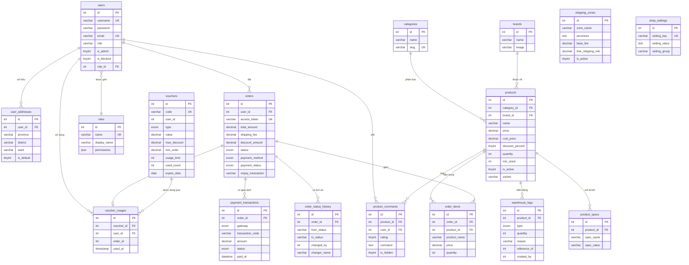
```mermaid
erDiagram
    users ||--o{ user_addresses : "sở hữu"
    users ||--o{ orders : "đặt"
    users ||--o{ product_comments : "viết"
    users ||--o{ voucher_usages : "sử dụng"
    users }o--|| roles : "được gán"
    categories ||--o{ products : "phân loại"
    brands ||--o{ products : "thuộc về"
    products ||--o{ product_specs : "mô tả bởi"
    products ||--o{ product_comments : "nhận"
    products ||--o{ order_items : "bán trong"
    products ||--o{ warehouse_logs : "biến động"
    orders ||--|{ order_items : "gồm"
    orders ||--o{ order_status_history : "có lịch sử"
    orders ||--o{ payment_transactions : "có giao dịch"
    orders ||--o| voucher_usages : "áp dụng"
    vouchers ||--o{ voucher_usages : "được dùng qua"

    users {
        int id PK
        varchar username UK
        varchar password
        varchar email UK
        varchar role
        tinyint is_admin
        tinyint is_blocked
        int role_id FK
    }
    roles {
        int id PK
        varchar name UK
        varchar display_name
        json permissions
    }
    user_addresses {
        int id PK
        int user_id FK
        varchar province
        varchar district
        varchar ward
        tinyint is_default
    }
    categories {
        int id PK
        varchar name
        varchar slug UK
    }
    brands {
        int id PK
        varchar name
        varchar image
    }
    products {
        int id PK
        int category_id FK
        int brand_id FK
        varchar name
        decimal price
        decimal cost_price
        tinyint discount_percent
        int quantity
        int min_stock
        tinyint is_active
        varchar socket
    }
    product_specs {
        int id PK
        int product_id FK
        varchar spec_name
        varchar spec_value
    }
    product_comments {
        int id PK
        int product_id FK
        int user_id FK
        tinyint rating
        text comment
        tinyint is_hidden
    }
    orders {
        int id PK
        int user_id FK
        varchar access_token UK
        decimal total_amount
        decimal shipping_fee
        decimal discount_amount
        enum status
        enum payment_method
        enum payment_status
        varchar vnpay_transaction
    }
    order_items {
        int id PK
        int order_id FK
        int product_id FK
        varchar product_name
        decimal price
        int quantity
    }
    order_status_history {
        int id PK
        int order_id FK
        varchar from_status
        varchar to_status
        int changed_by
        varchar changer_name
    }
    payment_transactions {
        int id PK
        int order_id FK
        enum gateway
        varchar transaction_code
        decimal amount
        enum status
        datetime paid_at
    }
    vouchers {
        int id PK
        varchar code UK
        int user_id
        enum type
        decimal value
        decimal max_discount
        decimal min_order
        int usage_limit
        int used_count
        date expire_date
    }
    voucher_usages {
        int id PK
        int voucher_id FK
        int user_id FK
        int order_id
        timestamp used_at
    }
    warehouse_logs {
        int id PK
        int product_id FK
        enum type
        int quantity
        varchar reason
        int reference_id
        int created_by
    }
    shipping_zones {
        int id PK
        varchar zone_name
        text provinces
        decimal base_fee
        decimal free_shipping_min
        tinyint is_active
    }
    shop_settings {
        int id PK
        varchar setting_key UK
        text setting_value
        varchar setting_group
    }
```

#### b) Danh mục bảng dữ liệu

Cơ sở dữ liệu `db_ban_linh_kien` chứa tổng cộng 56 bảng, trong đó 17 bảng dưới đây tạo thành lõi nghiệp vụ được các dịch vụ trong phạm vi đề tài sử dụng trực tiếp. Các bảng còn lại phục vụ những phân hệ mở rộng của phần mềm quản trị (quản lý nhà cung cấp, phiếu nhập, đơn đặt hàng mua, thông báo, cấu hình giao diện) và nằm ngoài phạm vi khảo sát của báo cáo này.

**Ghi chú quan trọng về sai lệch giữa đặc tả ban đầu và lược đồ thực tế:** Đặc tả yêu cầu mô tả hai bảng `app_roles` và `user_roles` theo mô hình phân quyền nhiều–nhiều. Khảo sát lược đồ thực tế cho thấy hệ thống **không sử dụng mô hình đó**. Thay vào đó, hệ thống áp dụng mô hình phân quyền đơn giản hơn gồm: bảng `roles` lưu định nghĩa vai trò kèm tập quyền dưới dạng tài liệu JSON, cột `users.role` kiểu chuỗi lưu tên vai trò hiệu lực, cột `users.role_id` kiểu số nguyên tham chiếu mềm tới `roles.id`, và cột `users.is_admin` làm cờ dự phòng. Lớp `CustomUserDetailsService` sinh quyền hạn từ cột `users.role` chứ không qua bảng trung gian nào. Báo cáo mô tả **đúng lược đồ thực tế**; hai bảng `roles` và `product_comments` được đưa vào danh mục thay cho `app_roles` và `user_roles` để giữ nguyên số lượng 17 bảng lõi.

**Bảng 2.18 – Danh mục bảng dữ liệu của hệ thống**

| STT | Tên bảng | Nhóm chức năng | Số cột | Vai trò nghiệp vụ | Dịch vụ sử dụng chính |
|---|---|---|---|---|---|
| 1 | `users` | Người dùng | 15 | Lưu tài khoản của khách hàng và quản trị viên | `CustomUserDetailsService`, `AuthViewController` |
| 2 | `roles` | Người dùng | 6 | Định nghĩa vai trò và tập quyền dưới dạng JSON | Phân hệ quản trị người dùng |
| 3 | `user_addresses` | Người dùng | 10 | Sổ địa chỉ giao hàng của khách hàng | `CheckoutService`, `AccountViewController` |
| 4 | `categories` | Danh mục hàng hóa | 3 | Phân loại linh kiện thành bảy nhóm chính | `ProductViewController`, `PcBuilderService` |
| 5 | `brands` | Danh mục hàng hóa | 3 | Thương hiệu nhà sản xuất linh kiện | `ProductViewController` |
| 6 | `products` | Danh mục hàng hóa | 23 | Bảng trung tâm lưu thông tin linh kiện, giá, khuyến mại và tồn kho | Hầu hết các dịch vụ |
| 7 | `product_specs` | Danh mục hàng hóa | 4 | Thông số kỹ thuật dạng khóa – giá trị, nguồn dữ liệu cho kiểm tra tương thích | `PcBuilderService` |
| 8 | `product_comments` | Tương tác | 8 | Đánh giá và bình luận sản phẩm của khách hàng | `ProductViewController`, phân hệ kiểm duyệt |
| 9 | `orders` | Đơn hàng | 18 | Đầu đơn hàng, lưu thông tin người nhận, tổng tiền và các trạng thái | `CheckoutService`, `AdminOrderService`, `VnpayService` |
| 10 | `order_items` | Đơn hàng | 6 | Chi tiết mục hàng, lưu ảnh chụp tên và giá tại thời điểm mua | `CheckoutService`, `AdminOrderService` |
| 11 | `order_status_history` | Đơn hàng | 8 | Nhật ký kiểm toán mọi phép chuyển trạng thái đơn hàng | `AdminOrderService`, `VnpayService` |
| 12 | `payment_transactions` | Thanh toán | 10 | Bản ghi giao dịch thanh toán từ các cổng thanh toán | `VnpayService` |
| 13 | `vouchers` | Khuyến mại | 16 | Định nghĩa mã giảm giá, loại, giá trị và điều kiện áp dụng | `VoucherService` |
| 14 | `voucher_usages` | Khuyến mại | 5 | Ghi nhận lượt sử dụng mã, thực thi quy tắc một lần cho mỗi người | `VoucherService` |
| 15 | `warehouse_logs` | Kho vận | 14 | Nhật ký kiểm toán mọi biến động nhập – xuất kho | `CheckoutService`, `AdminOrderService` |
| 16 | `shipping_zones` | Kho vận | 7 | Cấu hình vùng vận chuyển, phí cơ bản và ngưỡng miễn phí | `ShippingService` |
| 17 | `shop_settings` | Cấu hình | 5 | Tham số vận hành dạng khóa – giá trị | Phân hệ cấu hình cửa hàng |

#### c) Từ điển dữ liệu chi tiết

**Bảng 2.19 – Từ điển dữ liệu bảng `users`**

| Tên trường | Kiểu dữ liệu | PK/FK | Null | Mặc định | Ý nghĩa |
|---|---|---|---|---|---|
| `id` | `INT AUTO_INCREMENT` | PK | Không | — | Khóa chính, định danh duy nhất của người dùng |
| `username` | `VARCHAR(50)` | UK | Không | — | Tên đăng nhập, duy nhất toàn hệ thống, dùng để xác thực |
| `password` | `VARCHAR(255)` | — | Không | — | Chuỗi băm BCrypt của mật khẩu; chứa cả biến thể thuật toán, hệ số chi phí và muối; không bao giờ lưu văn bản rõ |
| `full_name` | `VARCHAR(100)` | — | Có | `NULL` | Họ và tên đầy đủ, dùng để hiển thị và điền sẵn biểu mẫu giao hàng |
| `email` | `VARCHAR(100)` | UK | Không | — | Thư điện tử, duy nhất, có thể dùng thay tên đăng nhập khi xác thực |
| `email_verified_at` | `TIMESTAMP` | — | Có | `NULL` | Thời điểm xác minh thư điện tử; hiện chưa sử dụng, dành cho tính năng xác minh trong tương lai |
| `phone` | `VARCHAR(20)` | — | Có | `NULL` | Số điện thoại liên hệ |
| `address` | `TEXT` | — | Có | `NULL` | Địa chỉ mặc định dạng văn bản tự do |
| `avatar` | `VARCHAR(500)` | — | Có | `NULL` | Đường dẫn tới tệp ảnh đại diện |
| `role` | `VARCHAR(20)` | — | Có | `'user'` | **Nguồn chính sinh quyền hạn.** `CustomUserDetailsService` tạo authority bằng cách ghép tiền tố `ROLE_` với giá trị này viết hoa |
| `created_at` | `TIMESTAMP` | — | Có | `CURRENT_TIMESTAMP` | Thời điểm tạo tài khoản |
| `is_admin` | `TINYINT(1)` | — | Có | `0` | **Cờ dự phòng.** Nếu bằng 1 mà `role` chưa là `ADMIN`, hệ thống vẫn cấp thêm quyền `ROLE_ADMIN` nhằm tương thích dữ liệu kế thừa |
| `is_blocked` | `TINYINT(1)` | — | Không | `0` | Cờ khóa tài khoản; bằng 1 thì mọi lần đăng nhập đều bị từ chối (quy tắc BR-28) |
| `blocked_reason` | `VARCHAR(255)` | — | Có | `NULL` | Lý do khóa tài khoản, được hiển thị cho người dùng khi họ cố đăng nhập |
| `role_id` | `INT` | FK mềm | Có | `NULL` | Tham chiếu tới `roles.id`; **không có ràng buộc khóa ngoại vật lý**; hiện chưa được tầng bảo mật sử dụng |

*Chỉ mục:* `PRIMARY KEY (id)`, `UNIQUE (username)`, `UNIQUE (email)`, `KEY idx_users_email (email)`, `KEY idx_users_role (role_id)`, `KEY idx_users_blocked (is_blocked)`.

**Bảng 2.20 – Từ điển dữ liệu bảng `roles`**

| Tên trường | Kiểu dữ liệu | PK/FK | Null | Mặc định | Ý nghĩa |
|---|---|---|---|---|---|
| `id` | `INT AUTO_INCREMENT` | PK | Không | — | Khóa chính của vai trò |
| `name` | `VARCHAR(50)` | UK | Không | — | Tên kỹ thuật của vai trò, ví dụ `admin`, `user`, `staff`; duy nhất |
| `display_name` | `VARCHAR(100)` | — | Không | — | Tên hiển thị thân thiện với người dùng trong giao diện quản trị |
| `description` | `TEXT` | — | Có | `NULL` | Mô tả phạm vi trách nhiệm của vai trò |
| `permissions` | `JSON` | — | Có | `NULL` | Tài liệu JSON chứa tập khóa quyền hạn chi tiết; dành cho cơ chế phân quyền mịn trong tương lai |
| `created_at` | `TIMESTAMP` | — | Có | `CURRENT_TIMESTAMP` | Thời điểm tạo bản ghi vai trò |

*Chỉ mục:* `PRIMARY KEY (id)`, `UNIQUE (name)`.

**Bảng 2.21 – Từ điển dữ liệu bảng `user_addresses`**

| Tên trường | Kiểu dữ liệu | PK/FK | Null | Mặc định | Ý nghĩa |
|---|---|---|---|---|---|
| `id` | `INT AUTO_INCREMENT` | PK | Không | — | Khóa chính của bản ghi địa chỉ |
| `user_id` | `INT` | FK → `users.id` | Không | — | Chủ sở hữu địa chỉ; ràng buộc `ON DELETE CASCADE` bảo đảm địa chỉ bị xóa cùng tài khoản |
| `full_name` | `VARCHAR(150)` | — | Không | — | Họ tên người nhận hàng, có thể khác chủ tài khoản |
| `phone` | `VARCHAR(20)` | — | Không | — | Số điện thoại người nhận, dùng cho đơn vị vận chuyển liên hệ |
| `province` | `VARCHAR(100)` | — | Không | — | Tỉnh hoặc thành phố; **là đầu vào của `ShippingService` để xác định vùng phí vận chuyển** |
| `district` | `VARCHAR(100)` | — | Không | — | Quận hoặc huyện |
| `ward` | `VARCHAR(100)` | — | Có | `''` | Phường hoặc xã |
| `address_detail` | `TEXT` | — | Không | — | Số nhà, tên đường và các thông tin chi tiết còn lại |
| `is_default` | `TINYINT(1)` | — | Có | `0` | Cờ đánh dấu địa chỉ mặc định; địa chỉ này được điền sẵn khi khách vào trang thanh toán |
| `created_at` | `TIMESTAMP` | — | Có | `CURRENT_TIMESTAMP` | Thời điểm tạo bản ghi |

*Chỉ mục:* `PRIMARY KEY (id)`, `KEY user_id (user_id)`.
*Khóa ngoại:* `user_addresses_ibfk_1 FOREIGN KEY (user_id) REFERENCES users(id) ON DELETE CASCADE`.

**Bảng 2.22 – Từ điển dữ liệu bảng `categories`**

| Tên trường | Kiểu dữ liệu | PK/FK | Null | Mặc định | Ý nghĩa |
|---|---|---|---|---|---|
| `id` | `INT AUTO_INCREMENT` | PK | Không | — | Khóa chính của danh mục. **Giá trị của trường này mang ngữ nghĩa nghiệp vụ trong công cụ Build PC**: 1 = bộ xử lý, 2 = bộ nhớ trong, 3 = bo mạch chủ, 4 = card đồ họa, 5 = ổ lưu trữ, 6 = bộ nguồn, 7 = vỏ máy |
| `name` | `VARCHAR(100)` | — | Không | — | Tên danh mục hiển thị cho người dùng |
| `slug` | `VARCHAR(100)` | UK | Có | `NULL` | Chuỗi định danh thân thiện với URL, duy nhất, phục vụ tối ưu hóa công cụ tìm kiếm |

*Chỉ mục:* `PRIMARY KEY (id)`, `UNIQUE (slug)`, `KEY idx_categories_name (name)`.

**Bảng 2.23 – Từ điển dữ liệu bảng `brands`**

| Tên trường | Kiểu dữ liệu | PK/FK | Null | Mặc định | Ý nghĩa |
|---|---|---|---|---|---|
| `id` | `INT AUTO_INCREMENT` | PK | Không | — | Khóa chính của thương hiệu |
| `name` | `VARCHAR(100)` | — | Không | — | Tên nhà sản xuất, ví dụ Intel, AMD, ASUS, Gigabyte, Corsair |
| `image` | `VARCHAR(255)` | — | Có | `NULL` | Đường dẫn tới tệp ảnh biểu trưng của thương hiệu |

*Chỉ mục:* `PRIMARY KEY (id)`, `KEY idx_brands_name (name)`.

**Bảng 2.24 – Từ điển dữ liệu bảng `products`**

| Tên trường | Kiểu dữ liệu | PK/FK | Null | Mặc định | Ý nghĩa |
|---|---|---|---|---|---|
| `id` | `INT AUTO_INCREMENT` | PK | Không | — | Khóa chính của sản phẩm; là đối tượng của khóa bi quan trong nghiệp vụ đặt hàng |
| `category_id` | `INT` | FK → `categories.id` | Có | `NULL` | Danh mục linh kiện; `ON DELETE SET NULL` để việc xóa danh mục không làm mất sản phẩm |
| `brand_id` | `INT` | FK → `brands.id` | Có | `NULL` | Thương hiệu; `ON DELETE SET NULL` |
| `name` | `VARCHAR(255)` | — | Không | — | Tên đầy đủ của sản phẩm; nằm trong chỉ mục toàn văn phục vụ tìm kiếm |
| `price` | `DECIMAL(15,2)` | — | Không | — | Giá niêm yết. Kiểu `DECIMAL` được chọn thay cho `FLOAT`/`DOUBLE` nhằm bảo đảm tính chính xác tuyệt đối của phép tính tiền tệ |
| `cost_price` | `DECIMAL(15,2)` | — | Có | `0.00` | Giá vốn, phục vụ tính lợi nhuận trong báo cáo quản trị. **Trường này tuyệt đối không được phơi bày qua bất kỳ endpoint công khai nào** |
| `discount_percent` | `TINYINT UNSIGNED` | — | Có | `0` | Tỷ lệ giảm giá tính theo phần trăm, giá trị hợp lệ từ 0 đến 100 |
| `sale_start` | `DATETIME` | — | Có | `NULL` | Thời điểm bắt đầu hiệu lực khuyến mại; rỗng nghĩa là có hiệu lực ngay |
| `sale_end` | `DATETIME` | — | Có | `NULL` | Thời điểm kết thúc khuyến mại; rỗng nghĩa là không giới hạn |
| `quantity` | `INT` | — | Có | `0` | **Số lượng tồn kho hiện tại.** Đây là trường nhạy cảm nhất hệ thống về mặt tranh chấp đồng thời; mọi thao tác đọc-để-ghi trên trường này đều phải qua khóa bi quan |
| `image` | `VARCHAR(255)` | — | Có | `NULL` | Đường dẫn tới tệp ảnh đại diện sản phẩm |
| `description` | `TEXT` | — | Có | `NULL` | Mô tả chi tiết; nằm trong chỉ mục toàn văn cùng với `name` |
| `is_featured` | `TINYINT(1)` | — | Có | `0` | Cờ đánh dấu sản phẩm nổi bật, hiển thị ở khu vực ưu tiên trên trang chủ |
| `created_at` | `TIMESTAMP` | — | Có | `CURRENT_TIMESTAMP` | Thời điểm tạo bản ghi; dùng để sắp xếp danh sách sản phẩm mới |
| `is_active` | `TINYINT(1)` | — | Không | `1` | Cờ kinh doanh. Sản phẩm có giá trị 0 không hiển thị với khách hàng và **không được phép đưa vào đơn hàng** (quy tắc BR-04) |
| `min_stock` | `INT` | — | Có | `5` | Ngưỡng cảnh báo tồn kho tối thiểu; bảng điều khiển đếm số sản phẩm có `quantity <= min_stock` |
| `meta_title` | `VARCHAR(255)` | — | Có | `''` | Tiêu đề dùng cho thẻ meta phục vụ tối ưu hóa công cụ tìm kiếm |
| `meta_description` | `TEXT` | — | Có | `NULL` | Mô tả ngắn dùng cho thẻ meta |
| `meta_keywords` | `VARCHAR(500)` | — | Có | `''` | Danh sách từ khóa dùng cho thẻ meta |
| `warehouse_id` | `INT` | — | Có | `1` | Định danh kho vật lý; dành cho mở rộng đa kho trong tương lai |
| `bin_location` | `VARCHAR(50)` | — | Có | `NULL` | Vị trí kệ hàng trong kho, hỗ trợ nghiệp vụ lấy hàng |
| `socket` | `VARCHAR(50)` | — | Có | `NULL` | Chuẩn chân cắm ghi trực tiếp trên bản ghi sản phẩm. **Lưu ý:** `PcBuilderService` hiện đọc chuẩn chân cắm từ bảng `product_specs` với `spec_name = 'Socket'` chứ không từ cột này; cột này là dữ liệu dự phòng chưa được sử dụng |

*Chỉ mục:* `PRIMARY KEY (id)`, `KEY idx_products_category_active (category_id, is_active)`, `KEY idx_products_brand (brand_id)`, `KEY idx_products_active_created (is_active, created_at)`, `KEY idx_products_featured_active (is_featured, is_active)`, `KEY idx_products_discount_active (is_active, discount_percent)`, `FULLTEXT KEY idx_products_name_search (name, description)`.
*Khóa ngoại:* `products_ibfk_1 (category_id) REFERENCES categories(id) ON DELETE SET NULL`; `products_ibfk_2 (brand_id) REFERENCES brands(id) ON DELETE SET NULL`.

**Bảng 2.25 – Từ điển dữ liệu bảng `product_specs`**

| Tên trường | Kiểu dữ liệu | PK/FK | Null | Mặc định | Ý nghĩa |
|---|---|---|---|---|---|
| `id` | `INT AUTO_INCREMENT` | PK | Không | — | Khóa chính của bản ghi thông số |
| `product_id` | `INT` | FK → `products.id` | Có | `NULL` | Sản phẩm sở hữu thông số; `ON DELETE CASCADE` |
| `spec_name` | `VARCHAR(100)` | — | Có | `NULL` | Tên thông số, ví dụ `Socket`, `TDP`, `Chipset`, `Dung lượng`, `Tốc độ bus`. **Giá trị `Socket` có ý nghĩa nghiệp vụ đặc biệt: đây là nguồn dữ liệu cho toàn bộ logic kiểm tra tương thích** |
| `spec_value` | `VARCHAR(255)` | — | Có | `NULL` | Giá trị của thông số, ví dụ `LGA 1700`, `AM5`, `125W`. Giá trị này được chuẩn hóa bằng `normalizeSocket()` trước khi so sánh |

*Chỉ mục:* `PRIMARY KEY (id)`, `KEY idx_product_specs_product (product_id)`, `KEY idx_product_specs_product_name (product_id, spec_name)`.
*Khóa ngoại:* `product_specs_ibfk_1 (product_id) REFERENCES products(id) ON DELETE CASCADE`.

**Nhận xét thiết kế:** Bảng này áp dụng mô hình **thực thể – thuộc tính – giá trị**. Lựa chọn này phù hợp với đặc thù của hàng hóa linh kiện máy tính, nơi mỗi loại linh kiện có tập thuộc tính hoàn toàn khác nhau: bộ xử lý có số nhân và xung nhịp, bộ nhớ trong có dung lượng và tốc độ bus, bộ nguồn có công suất và chuẩn hiệu suất. Nếu dùng mô hình cột cố định, bảng `products` sẽ phải chứa hàng chục cột mà phần lớn bỏ trống với mỗi bản ghi. Đánh đổi của mô hình này là truy vấn phức tạp hơn và không tận dụng được ràng buộc kiểu dữ liệu ở tầng cơ sở dữ liệu; hệ thống bù đắp bằng chỉ mục ghép `(product_id, spec_name)` cho phép tra cứu một thông số cụ thể với chi phí rất thấp.

**Bảng 2.26 – Từ điển dữ liệu bảng `product_comments`**

| Tên trường | Kiểu dữ liệu | PK/FK | Null | Mặc định | Ý nghĩa |
|---|---|---|---|---|---|
| `id` | `INT AUTO_INCREMENT` | PK | Không | — | Khóa chính của bình luận |
| `product_id` | `INT` | FK → `products.id` | Không | — | Sản phẩm được đánh giá; `ON DELETE CASCADE` |
| `user_id` | `INT` | FK → `users.id` | Có | `NULL` | Tác giả bình luận; `ON DELETE SET NULL` để giữ lại bình luận khi tài khoản bị xóa |
| `name` | `VARCHAR(100)` | — | Không | — | Tên hiển thị của người bình luận, được sao chép tại thời điểm gửi nhằm bảo toàn thông tin ngay cả khi tài khoản bị xóa |
| `rating` | `TINYINT UNSIGNED` | — | Không | `5` | Điểm đánh giá theo thang từ 1 đến 5 sao |
| `comment` | `TEXT` | — | Không | — | Nội dung nhận xét |
| `created_at` | `TIMESTAMP` | — | Không | `CURRENT_TIMESTAMP` | Thời điểm gửi bình luận; dùng để sắp xếp danh sách |
| `is_hidden` | `TINYINT(1)` | — | Không | `0` | Cờ kiểm duyệt; bằng 1 thì bình luận bị ẩn khỏi giao diện khách hàng nhưng bản ghi vẫn được lưu giữ |

*Chỉ mục:* `PRIMARY KEY (id)`, `KEY idx_product_id (product_id)`, `KEY idx_user_id (user_id)`, `KEY idx_product_comments_product (product_id, is_hidden)`, `KEY idx_product_comments_user (user_id)`.
*Khóa ngoại:* `fk_comment_product (product_id) REFERENCES products(id) ON DELETE CASCADE`; `fk_comment_user (user_id) REFERENCES users(id) ON DELETE SET NULL`.

**Bảng 2.27 – Từ điển dữ liệu bảng `orders`**

| Tên trường | Kiểu dữ liệu | PK/FK | Null | Mặc định | Ý nghĩa |
|---|---|---|---|---|---|
| `id` | `INT AUTO_INCREMENT` | PK | Không | — | Khóa chính, đồng thời là mã đơn hàng hiển thị cho khách hàng |
| `user_id` | `INT` | FK → `users.id` | Có | `NULL` | Khách hàng đặt đơn; **giá trị rỗng nghĩa là đơn của khách vãng lai**; `ON DELETE SET NULL` bảo toàn dữ liệu bán hàng khi tài khoản bị xóa |
| `access_token` | `VARCHAR(36)` | UK | Không | — | **Mã bí mật dạng UUID phiên bản 4** sinh tại thời điểm tạo đơn. Bắt buộc phải khớp thì mới được xem trang xác nhận hoặc khởi tạo thanh toán. Đây là cơ chế chống truy cập trái phép theo tham chiếu trực tiếp (quy tắc BR-27) |
| `customer_name` | `VARCHAR(100)` | — | Không | — | Họ tên người nhận, lưu dưới dạng ảnh chụp tại thời điểm đặt |
| `customer_email` | `VARCHAR(100)` | — | Có | `NULL` | Thư điện tử liên hệ |
| `customer_phone` | `VARCHAR(20)` | — | Không | — | Số điện thoại người nhận |
| `customer_address` | `TEXT` | — | Không | — | Địa chỉ giao hàng đầy đủ |
| `shipping_province` | `VARCHAR(100)` | — | Có | `NULL` | Tỉnh hoặc thành phố giao hàng; là đầu vào của `ShippingService.calculateFee()` |
| `total_amount` | `DECIMAL(15,2)` | — | Có | `NULL` | **Tổng tiền cuối cùng phải thanh toán** = tạm tính + phí vận chuyển − mức giảm, đã được chặn dưới bằng 0. Giá trị này là căn cứ đối chiếu với `vnp_Amount` theo quy tắc BR-25 |
| `status` | `ENUM('pending','processing','shipped','completed','cancelled')` | — | Có | `'pending'` | Trạng thái xử lý đơn hàng; phép chuyển tuân theo máy trạng thái tại Hình 2.15 |
| `created_at` | `TIMESTAMP` | — | Có | `CURRENT_TIMESTAMP` | Thời điểm đặt hàng |
| `voucher_code` | `VARCHAR(50)` | — | Có | `NULL` | Mã giảm giá đã áp dụng, lưu dưới dạng chuỗi để bảo toàn thông tin ngay cả khi voucher bị xóa |
| `discount_amount` | `DECIMAL(10,2)` | — | Có | `0.00` | Số tiền được giảm, do `VoucherService` tính tại thời điểm đặt |
| `shipping_fee` | `DECIMAL(10,2)` | — | Không | `0.00` | Phí vận chuyển, do `ShippingService` tính tại thời điểm đặt |
| `payment_method` | `ENUM('cod','bank','vnpay')` | — | Không | `'cod'` | Phương thức thanh toán; giá trị `vnpay` kích hoạt luồng UC07 |
| `payment_status` | `ENUM('unpaid','paid','refunded')` | — | Có | `'unpaid'` | Trạng thái thanh toán. **Giá trị `paid` là điều kiện kiểm tra tính bất biến của webhook IPN** (quy tắc BR-24) |
| `tracking_code` | `VARCHAR(20)` | — | Có | `NULL` | Mã vận đơn của đơn vị giao hàng |
| `vnpay_transaction` | `VARCHAR(100)` | — | Có | `NULL` | Mã giao dịch do cổng VNPAY cấp, lấy từ tham số `vnp_TransactionNo`; phục vụ đối soát với sao kê của cổng thanh toán |

*Chỉ mục:* `PRIMARY KEY (id)`, `UNIQUE KEY uk_orders_access_token (access_token)`, `KEY idx_orders_user_created (user_id, created_at)`, `KEY idx_orders_status (status)`, `KEY idx_orders_tracking (tracking_code)`, `KEY idx_orders_payment_status (payment_status)`, `KEY idx_orders_payment_method (payment_method)`.
*Khóa ngoại:* `fk_order_user (user_id) REFERENCES users(id) ON DELETE SET NULL`.

**Bảng 2.28 – Từ điển dữ liệu bảng `order_items`**

| Tên trường | Kiểu dữ liệu | PK/FK | Null | Mặc định | Ý nghĩa |
|---|---|---|---|---|---|
| `id` | `INT AUTO_INCREMENT` | PK | Không | — | Khóa chính của mục hàng |
| `order_id` | `INT` | FK → `orders.id` | Có | `NULL` | Đơn hàng chứa mục này; `ON DELETE CASCADE` thể hiện quan hệ hợp thành |
| `product_id` | `INT` | FK → `products.id` | Có | `NULL` | Sản phẩm được mua; **không có `ON DELETE CASCADE`** nhằm ngăn việc xóa sản phẩm làm mất dữ liệu bán hàng lịch sử |
| `product_name` | `VARCHAR(255)` | — | Có | `NULL` | **Ảnh chụp tên sản phẩm tại thời điểm mua.** Nếu sau này sản phẩm đổi tên, hóa đơn cũ vẫn phản ánh đúng tên tại thời điểm giao dịch |
| `price` | `DECIMAL(15,2)` | — | Có | `NULL` | **Ảnh chụp đơn giá tại thời điểm mua**, lấy từ `product.getFinalPrice()`. Đây là nguyên tắc bất biến của dữ liệu giao dịch tài chính: thay đổi giá trong tương lai không được làm thay đổi giá trị hóa đơn đã phát hành |
| `quantity` | `INT` | — | Có | `NULL` | Số lượng mua của mục hàng này; là cơ sở để tính số lượng hoàn kho khi hủy đơn |

*Chỉ mục:* `PRIMARY KEY (id)`, `KEY idx_order_items_order (order_id)`, `KEY idx_order_items_product (product_id)`.
*Khóa ngoại:* `order_items_ibfk_1 (order_id) REFERENCES orders(id) ON DELETE CASCADE`; `order_items_ibfk_2 (product_id) REFERENCES products(id)`.

**Bảng 2.29 – Từ điển dữ liệu bảng `order_status_history`**

| Tên trường | Kiểu dữ liệu | PK/FK | Null | Mặc định | Ý nghĩa |
|---|---|---|---|---|---|
| `id` | `INT AUTO_INCREMENT` | PK | Không | — | Khóa chính của bản ghi lịch sử |
| `order_id` | `INT` | FK → `orders.id` | Không | — | Đơn hàng liên quan; `ON DELETE CASCADE` |
| `from_status` | `VARCHAR(50)` | — | Có | `NULL` | Trạng thái trước khi chuyển; rỗng với bản ghi đầu tiên của đơn hàng |
| `to_status` | `VARCHAR(50)` | — | Không | — | Trạng thái sau khi chuyển |
| `changed_by` | `INT` | — | Có | `NULL` | Định danh người thực hiện; rỗng khi phép chuyển do hệ thống tự động thực hiện |
| `changer_name` | `VARCHAR(150)` | — | Có | `NULL` | Tên người thực hiện. **Giá trị `VNPAY Gateway` được dùng khi phép chuyển do webhook thanh toán kích hoạt**, giúp phân biệt rõ thao tác của con người và thao tác tự động |
| `note` | `TEXT` | — | Có | `NULL` | Ghi chú giải thích lý do chuyển trạng thái |
| `created_at` | `TIMESTAMP` | — | Có | `CURRENT_TIMESTAMP` | Thời điểm chuyển trạng thái |

*Chỉ mục:* `PRIMARY KEY (id)`, `KEY order_id (order_id)`, `KEY created_at (created_at)`.
*Khóa ngoại:* `order_status_history_ibfk_1 (order_id) REFERENCES orders(id) ON DELETE CASCADE`.

**Bảng 2.30 – Từ điển dữ liệu bảng `payment_transactions`**

| Tên trường | Kiểu dữ liệu | PK/FK | Null | Mặc định | Ý nghĩa |
|---|---|---|---|---|---|
| `id` | `INT AUTO_INCREMENT` | PK | Không | — | Khóa chính của giao dịch thanh toán |
| `order_id` | `INT` | FK → `orders.id` | Không | — | Đơn hàng được thanh toán; `ON DELETE CASCADE` |
| `gateway` | `ENUM('vnpay','momo','bank_transfer','cod')` | — | Không | — | Cổng thanh toán xử lý giao dịch; hiện hệ thống chỉ tích hợp `vnpay`, các giá trị còn lại dành cho mở rộng |
| `transaction_code` | `VARCHAR(100)` | — | Có | `NULL` | Mã giao dịch do cổng thanh toán cấp, dùng để đối soát |
| `amount` | `DECIMAL(12,0)` | — | Không | — | Số tiền giao dịch tính bằng đồng Việt Nam, không có phần thập phân |
| `status` | `ENUM('pending','success','failed','cancelled','refunded')` | — | Có | `'pending'` | Trạng thái giao dịch; chỉ giá trị `success` mới làm đơn hàng chuyển sang `paid` |
| `gateway_response` | `TEXT` | — | Có | `NULL` | Toàn bộ phản hồi thô từ cổng thanh toán, lưu lại phục vụ điều tra sự cố và đối chiếu tranh chấp |
| `paid_at` | `DATETIME` | — | Có | `NULL` | Thời điểm thanh toán thành công |
| `created_at` | `TIMESTAMP` | — | Có | `CURRENT_TIMESTAMP` | Thời điểm khởi tạo bản ghi giao dịch |
| `updated_at` | `TIMESTAMP` | — | Có | `CURRENT_TIMESTAMP ON UPDATE` | Thời điểm cập nhật gần nhất, tự động cập nhật bởi cơ sở dữ liệu |

*Chỉ mục:* `PRIMARY KEY (id)`, `KEY order_id (order_id)`, `KEY status (status)`, `KEY gateway (gateway)`.
*Khóa ngoại:* `payment_transactions_ibfk_1 (order_id) REFERENCES orders(id) ON DELETE CASCADE`.

**Bảng 2.31 – Từ điển dữ liệu bảng `vouchers`**

| Tên trường | Kiểu dữ liệu | PK/FK | Null | Mặc định | Ý nghĩa |
|---|---|---|---|---|---|
| `id` | `INT AUTO_INCREMENT` | PK | Không | — | Khóa chính của mã giảm giá |
| `code` | `VARCHAR(50)` | UK | Không | — | Mã người dùng nhập; duy nhất toàn hệ thống; so khớp không phân biệt hoa thường |
| `user_id` | `INT` | — | Có | `NULL` | **Nếu khác rỗng thì mã chỉ dành riêng cho người dùng này** (quy tắc BR-12); rỗng nghĩa là mã dùng chung |
| `name` | `VARCHAR(100)` | — | Không | — | Tên chương trình khuyến mại hiển thị cho khách hàng |
| `description` | `VARCHAR(255)` | — | Có | `NULL` | Mô tả điều kiện áp dụng |
| `personal_note` | `VARCHAR(500)` | — | Có | `NULL` | Ghi chú riêng gửi kèm khi cấp mã cho một khách hàng cụ thể |
| `type` | `ENUM('percent','fixed','freeship')` | — | Không | `'fixed'` | Loại mã quyết định công thức tính mức giảm (quy tắc BR-14 và BR-15) |
| `value` | `DECIMAL(10,2)` | — | Không | `0.00` | Giá trị giảm; với loại `percent` là tỷ lệ phần trăm, với hai loại còn lại là số tiền tuyệt đối |
| `max_discount` | `DECIMAL(10,2)` | — | Có | `NULL` | **Trần mức giảm đối với mã loại phần trăm**; rỗng nghĩa là không giới hạn |
| `min_order` | `DECIMAL(10,2)` | — | Có | `0.00` | Giá trị đơn hàng tối thiểu để mã có hiệu lực (quy tắc BR-13) |
| `usage_limit` | `INT` | — | Có | `NULL` | Tổng số lượt sử dụng tối đa của mã; rỗng nghĩa là không giới hạn |
| `used_count` | `INT` | — | Có | `0` | Số lượt đã sử dụng; được tăng thêm 1 trong cùng giao dịch đặt hàng |
| `expire_date` | `DATE` | — | Không | — | Ngày hết hạn; mã không còn hiệu lực từ sau ngày này |
| `sent_at` | `DATETIME` | — | Có | `NULL` | Thời điểm gửi mã cho khách hàng |
| `is_active` | `TINYINT(1)` | — | Có | `1` | Cờ kích hoạt; quản trị viên có thể vô hiệu hóa mã ngay lập tức |
| `created_at` | `TIMESTAMP` | — | Có | `CURRENT_TIMESTAMP` | Thời điểm tạo mã |

*Chỉ mục:* `PRIMARY KEY (id)`, `UNIQUE (code)`, `KEY idx_vouchers_code_active (code, is_active)`, `KEY idx_vouchers_user (user_id)`.

**Bảng 2.32 – Từ điển dữ liệu bảng `voucher_usages`**

| Tên trường | Kiểu dữ liệu | PK/FK | Null | Mặc định | Ý nghĩa |
|---|---|---|---|---|---|
| `id` | `INT AUTO_INCREMENT` | PK | Không | — | Khóa chính của bản ghi sử dụng |
| `voucher_id` | `INT` | FK → `vouchers.id` | Không | — | Mã giảm giá được sử dụng |
| `user_id` | `INT` | FK mềm → `users.id` | Không | — | Người dùng đã sử dụng mã |
| `order_id` | `INT` | — | Có | `NULL` | Đơn hàng áp dụng mã; không có ràng buộc khóa ngoại vật lý |
| `used_at` | `TIMESTAMP` | — | Có | `CURRENT_TIMESTAMP` | Thời điểm sử dụng |

*Chỉ mục:* `PRIMARY KEY (id)`, **`UNIQUE KEY unique_user_voucher (voucher_id, user_id)`**, `KEY idx_voucher_usages_user (user_id)`, `KEY idx_voucher_usages_voucher_user (voucher_id, user_id)`.
*Khóa ngoại:* `voucher_usages_ibfk_1 (voucher_id) REFERENCES vouchers(id)`.

**Nhận xét thiết kế:** Ràng buộc duy nhất `unique_user_voucher (voucher_id, user_id)` là hiện thực ở **tầng cơ sở dữ liệu** của quy tắc nghiệp vụ BR-09. Đây là một ví dụ điển hình của nguyên tắc phòng vệ nhiều lớp: tầng dịch vụ kiểm tra bằng `existsByVoucherIdAndUserId()` để trả về thông báo thân thiện cho người dùng, nhưng nếu hai yêu cầu đồng thời cùng vượt qua phép kiểm tra đó, ràng buộc cơ sở dữ liệu vẫn chặn được bản ghi thứ hai và làm hoàn tác giao dịch. **Quy tắc nghiệp vụ được bảo đảm tuyệt đối, không phụ thuộc vào thời điểm của các luồng thực thi.**

**Bảng 2.33 – Từ điển dữ liệu bảng `warehouse_logs`**

| Tên trường | Kiểu dữ liệu | PK/FK | Null | Mặc định | Ý nghĩa |
|---|---|---|---|---|---|
| `id` | `INT AUTO_INCREMENT` | PK | Không | — | Khóa chính của bản ghi nhật ký |
| `product_id` | `INT` | FK mềm → `products.id` | Không | — | Sản phẩm có biến động tồn kho |
| `type` | `ENUM('import','export')` | — | Không | — | Loại biến động: nhập kho hoặc xuất kho. Enum Java `WarehouseLogType` dùng giá trị viết hoa và được chuyển đổi tự động bởi `AttributeConverter` |
| `quantity` | `INT` | — | Không | — | Số lượng biến động, luôn là số dương; chiều biến động do trường `type` quyết định |
| `note` | `TEXT` | — | Có | `NULL` | Ghi chú mô tả chi tiết |
| `reference_id` | `INT` | — | Có | `NULL` | **Tham chiếu tới đơn hàng gây ra biến động.** Cho phép truy vết ngược từ một biến động kho về đơn hàng gốc |
| `created_by` | `INT` | — | Có | `NULL` | Định danh người thực hiện; rỗng khi biến động do hệ thống tự động sinh |
| `created_at` | `DATETIME` | — | Có | `CURRENT_TIMESTAMP` | Thời điểm phát sinh biến động |
| `unit_cost` | `DECIMAL(15,0)` | — | Có | `0` | Giá nhập mỗi đơn vị, phục vụ tính giá vốn hàng bán |
| `reason` | `VARCHAR(30)` | — | Có | `'purchase'` | **Lý do biến động.** Các giá trị nghiệp vụ trong hệ thống: `sale` (xuất kho do bán hàng, sinh bởi `CheckoutService`), `order_cancel` (nhập kho do hủy đơn, sinh bởi `AdminOrderService`), `purchase` (nhập hàng từ nhà cung cấp) |
| `warehouse_id` | `INT` | — | Có | `1` | Kho vật lý phát sinh biến động |
| `receipt_id` | `INT` | — | Có | `NULL` | Tham chiếu phiếu nhập kho, thuộc phân hệ quản trị mở rộng |
| `batch_no` | `VARCHAR(50)` | — | Có | `NULL` | Số lô hàng, phục vụ truy vết chất lượng |
| `po_id` | `INT` | — | Có | `NULL` | Tham chiếu đơn đặt hàng mua, thuộc phân hệ quản trị mở rộng |

*Chỉ mục:* `PRIMARY KEY (id)`, `KEY idx_product (product_id)`, `KEY idx_type (type)`, `KEY idx_created (created_at)`, `KEY idx_warehouse_logs_product (product_id)`, `KEY idx_warehouse_logs_type (type)`, `KEY idx_warehouse_logs_ref (reference_id)`.

**Bảng 2.34 – Từ điển dữ liệu bảng `shipping_zones`**

| Tên trường | Kiểu dữ liệu | PK/FK | Null | Mặc định | Ý nghĩa |
|---|---|---|---|---|---|
| `id` | `INT AUTO_INCREMENT` | PK | Không | — | Khóa chính của vùng vận chuyển |
| `zone_name` | `VARCHAR(100)` | — | Không | — | Tên vùng, ví dụ "Nội thành Hà Nội", "Các tỉnh miền Bắc", "Miền Nam" |
| `provinces` | `TEXT` | — | Có | `NULL` | **Mảng JSON chứa danh sách tên tỉnh hoặc thành phố thuộc vùng.** `ShippingService` phân tích chuỗi này bằng thư viện Jackson, sau đó chuẩn hóa tên tỉnh (loại bỏ các tiền tố "thành phố", "tỉnh", "tp.") trước khi đối chiếu |
| `base_fee` | `DECIMAL(12,0)` | — | Có | `50000` | Phí vận chuyển cơ bản của vùng, tính bằng đồng |
| `free_shipping_min` | `DECIMAL(12,0)` | — | Có | `0` | **Ngưỡng miễn phí vận chuyển.** Giá trị 0 nghĩa là vùng này không áp dụng miễn phí; giá trị dương nghĩa là đơn hàng đạt hoặc vượt ngưỡng sẽ được miễn phí (quy tắc BR-17) |
| `is_active` | `TINYINT(1)` | — | Có | `1` | Cờ kích hoạt; chỉ các vùng đang kích hoạt được đưa vào tính toán |
| `created_at` | `TIMESTAMP` | — | Có | `CURRENT_TIMESTAMP` | Thời điểm tạo cấu hình vùng |

*Chỉ mục:* `PRIMARY KEY (id)`.

**Nhận xét thiết kế:** Việc lưu danh sách tỉnh dưới dạng mảng JSON trong một cột `TEXT` là **vi phạm dạng chuẩn thứ nhất** của lý thuyết chuẩn hóa quan hệ. Đánh đổi này được chấp nhận có ý thức vì: (i) số lượng vùng vận chuyển rất nhỏ, thường dưới 10 bản ghi, nên chi phí quét toàn bảng là không đáng kể; (ii) việc phân tích JSON diễn ra trong bộ nhớ ứng dụng với độ phức tạp tuyến tính theo số vùng; (iii) thiết kế chuẩn hóa đầy đủ sẽ cần thêm một bảng trung gian `shipping_zone_provinces` với hơn 60 bản ghi mà không mang lại lợi ích thực tế nào ở quy mô hiện tại. Nếu hệ thống mở rộng tới mức phí vận chuyển phân biệt tới cấp quận/huyện, thiết kế này cần được chuẩn hóa lại.

**Bảng 2.35 – Từ điển dữ liệu bảng `shop_settings`**

| Tên trường | Kiểu dữ liệu | PK/FK | Null | Mặc định | Ý nghĩa |
|---|---|---|---|---|---|
| `id` | `INT AUTO_INCREMENT` | PK | Không | — | Khóa chính của bản ghi cấu hình |
| `setting_key` | `VARCHAR(100)` | UK | Không | — | Khóa cấu hình, duy nhất toàn hệ thống, ví dụ `shop_name`, `hotline`, `email_contact`, `free_ship_threshold` |
| `setting_value` | `TEXT` | — | Có | `NULL` | Giá trị cấu hình lưu dưới dạng chuỗi; ứng dụng chịu trách nhiệm chuyển đổi sang kiểu dữ liệu phù hợp |
| `setting_group` | `VARCHAR(50)` | — | Có | `'general'` | Nhóm cấu hình, dùng để tổ chức giao diện quản trị theo từng phần |
| `updated_at` | `TIMESTAMP` | — | Có | `CURRENT_TIMESTAMP ON UPDATE` | Thời điểm cập nhật gần nhất, tự động duy trì bởi cơ sở dữ liệu |

*Chỉ mục:* `PRIMARY KEY (id)`, `UNIQUE (setting_key)`.

#### d) Ma trận quan hệ khóa ngoại

**Bảng 2.36 – Ma trận quan hệ khóa ngoại**

| STT | Tên ràng buộc | Bảng con | Cột con | Bảng cha | Cột cha | Hành vi khi xóa | Lý do thiết kế |
|---|---|---|---|---|---|---|---|
| 1 | `user_addresses_ibfk_1` | `user_addresses` | `user_id` | `users` | `id` | `CASCADE` | Địa chỉ không có ý nghĩa độc lập với chủ sở hữu; xóa tài khoản thì xóa luôn sổ địa chỉ |
| 2 | `products_ibfk_1` | `products` | `category_id` | `categories` | `id` | `SET NULL` | Xóa một danh mục không được phép làm mất sản phẩm; sản phẩm trở thành chưa phân loại |
| 3 | `products_ibfk_2` | `products` | `brand_id` | `brands` | `id` | `SET NULL` | Tương tự, xóa thương hiệu không làm mất sản phẩm |
| 4 | `product_specs_ibfk_1` | `product_specs` | `product_id` | `products` | `id` | `CASCADE` | Thông số kỹ thuật là thuộc tính phụ thuộc hoàn toàn vào sản phẩm |
| 5 | `fk_comment_product` | `product_comments` | `product_id` | `products` | `id` | `CASCADE` | Bình luận về một sản phẩm không còn ý nghĩa khi sản phẩm bị xóa |
| 6 | `fk_comment_user` | `product_comments` | `user_id` | `users` | `id` | `SET NULL` | Bình luận được giữ lại để bảo toàn nội dung cộng đồng; tên hiển thị đã được sao chép sẵn vào cột `name` |
| 7 | `fk_order_user` | `orders` | `user_id` | `users` | `id` | `SET NULL` | **Dữ liệu bán hàng phải được bảo toàn vĩnh viễn** phục vụ kế toán và báo cáo; đơn hàng trở thành đơn của khách vãng lai |
| 8 | `order_items_ibfk_1` | `order_items` | `order_id` | `orders` | `id` | `CASCADE` | Quan hệ hợp thành: mục hàng không tồn tại độc lập với đơn hàng |
| 9 | `order_items_ibfk_2` | `order_items` | `product_id` | `products` | `id` | `RESTRICT` (mặc định) | **Ngăn xóa sản phẩm đã từng được bán**, bảo vệ tính toàn vẹn của dữ liệu lịch sử |
| 10 | `order_status_history_ibfk_1` | `order_status_history` | `order_id` | `orders` | `id` | `CASCADE` | Lịch sử trạng thái thuộc về đơn hàng |
| 11 | `payment_transactions_ibfk_1` | `payment_transactions` | `order_id` | `orders` | `id` | `CASCADE` | Giao dịch thanh toán thuộc về đơn hàng |
| 12 | `voucher_usages_ibfk_1` | `voucher_usages` | `voucher_id` | `vouchers` | `id` | `RESTRICT` (mặc định) | Ngăn xóa mã giảm giá đã có lượt sử dụng, bảo toàn dữ liệu đối soát khuyến mại |

**Ba quan hệ tham chiếu mềm không có ràng buộc vật lý** cần được ghi nhận rõ vì đây là hạn chế của lược đồ hiện tại:

| Cột | Bảng đích dự kiến | Hệ quả của việc thiếu ràng buộc | Khuyến nghị |
|---|---|---|---|
| `users.role_id` | `roles.id` | Có thể tồn tại giá trị trỏ tới vai trò không tồn tại | Bổ sung khóa ngoại với hành vi `SET NULL` |
| `voucher_usages.user_id` | `users.id` | Bản ghi sử dụng có thể trỏ tới người dùng đã bị xóa | Bổ sung khóa ngoại với hành vi `CASCADE` |
| `warehouse_logs.product_id` | `products.id` | Nhật ký có thể trỏ tới sản phẩm không còn tồn tại; đây chính là nguyên nhân của nhánh xử lý ngoại lệ E5 trong UC08 | Giữ nguyên tham chiếu mềm để bảo toàn nhật ký kiểm toán, hoặc bổ sung khóa ngoại `RESTRICT` |

#### e) Máy trạng thái của đơn hàng

**Hình 2.15 – Sơ đồ máy trạng thái của đơn hàng**

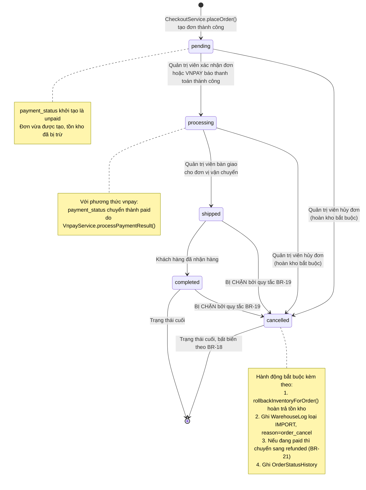
```mermaid
stateDiagram-v2
    [*] --> pending : CheckoutService.placeOrder()<br/>tạo đơn thành công

    pending --> processing : Quản trị viên xác nhận đơn<br/>hoặc VNPAY báo thanh toán thành công
    pending --> cancelled : Quản trị viên hủy đơn<br/>(hoàn kho bắt buộc)

    processing --> shipped : Quản trị viên bàn giao<br/>cho đơn vị vận chuyển
    processing --> cancelled : Quản trị viên hủy đơn<br/>(hoàn kho bắt buộc)

    shipped --> completed : Khách hàng đã nhận hàng
    shipped --> cancelled : BỊ CHẶN bởi quy tắc BR-19

    completed --> cancelled : BỊ CHẶN bởi quy tắc BR-19
    cancelled --> [*] : Trạng thái cuối, bất biến theo BR-18
    completed --> [*] : Trạng thái cuối

    note right of pending
        payment_status khởi tạo là unpaid
        Đơn vừa được tạo, tồn kho đã bị trừ
    end note

    note right of processing
        Với phương thức vnpay:
        payment_status chuyển thành paid
        do VnpayService.processPaymentResult()
    end note

    note right of cancelled
        Hành động bắt buộc kèm theo:
        1. rollbackInventoryForOrder() hoàn trả tồn kho
        2. Ghi WarehouseLog loại IMPORT, reason=order_cancel
        3. Nếu đang paid thì chuyển sang refunded (BR-21)
        4. Ghi OrderStatusHistory
    end note
```

**Phân tích máy trạng thái:**

Máy trạng thái này hiện thực ba nhóm quy tắc nghiệp vụ:

1. **Trạng thái khởi tạo là duy nhất.** Mọi đơn hàng đều bắt đầu ở `pending` bất kể phương thức thanh toán. Với phương thức thanh toán trực tuyến, đơn vẫn được tạo ở trạng thái `pending` với `payment_status = unpaid` **trước khi** chuyển hướng tới cổng thanh toán. Đây là thiết kế đúng đắn vì nó bảo đảm tồn kho đã được giữ chỗ trước khi khách hàng bắt đầu thanh toán, tránh tình huống khách thanh toán xong mới phát hiện hết hàng.

2. **Hai trạng thái cuối, một trong đó tuyệt đối bất biến.** Trạng thái `completed` và `cancelled` đều là trạng thái cuối. Riêng `cancelled` được bảo vệ bởi quy tắc BR-18: không có phép chuyển nào thoát ra khỏi trạng thái này. Lý do là thao tác hủy đơn đã kéo theo hoàn kho; nếu cho phép "bỏ hủy", hệ thống sẽ phải trừ kho lại, làm phát sinh một chuỗi nghiệp vụ phức tạp với nguy cơ sai lệch cao. Thay vào đó, quy trình vận hành yêu cầu tạo đơn mới.

3. **Hai phép chuyển bị chặn tường minh.** Các phép chuyển `shipped → cancelled` và `completed → cancelled` bị từ chối bởi quy tắc BR-19. Lý do nghiệp vụ là hàng đã rời kho và đang trên đường tới khách hoặc đã tới tay khách; việc hoàn kho tự động sẽ tạo ra số liệu tồn kho sai lệch so với thực tế vật lý. Quy trình đúng cho tình huống này là nghiệp vụ trả hàng, cần được xử lý riêng với phiếu nhập kho tường minh.

**Về sự tách biệt giữa hai trục trạng thái:** Hệ thống duy trì hai trục trạng thái độc lập: `status` mô tả tiến trình xử lý đơn hàng, còn `payment_status` mô tả tình trạng dòng tiền. Sự tách biệt này là cần thiết vì một đơn hàng có thể ở trạng thái `processing` nhưng chưa thanh toán (phương thức thanh toán khi nhận hàng), hoặc đã thanh toán nhưng vẫn ở `pending` (thanh toán trực tuyến thành công nhưng quản trị viên chưa xác nhận). Nếu gộp hai trục vào một trường duy nhất, số lượng trạng thái sẽ tăng theo tích Descartes và làm máy trạng thái trở nên khó quản lý.

### 2.4.3. Thiết kế API dịch vụ

Đây là mục trọng tâm của học phần Phát triển phần mềm hướng dịch vụ. Mục này đặc tả **hợp đồng dịch vụ** mà hệ thống công bố ra bên ngoài: quy ước thiết kế chung, định dạng trao đổi dữ liệu, cấu trúc phản hồi lỗi, và các đối tượng truyền dữ liệu. Danh sách đặc tả chi tiết từng endpoint được trình bày tại mục 3.2.2 của Chương 3.

#### a) Quy ước thiết kế API

**Bảng 2.37 – Quy ước thiết kế API**

| Hạng mục quy ước | Quy định áp dụng | Ví dụ minh họa cụ thể |
|---|---|---|
| **Giao thức truyền tải** | HTTP/1.1; khuyến nghị bắt buộc dùng HTTPS ở môi trường vận hành thật để bảo vệ cookie phiên và dữ liệu cá nhân | `http://localhost:8088` ở môi trường phát triển |
| **Base URL của dịch vụ** | `{scheme}://{host}:{port}/api` | `http://localhost:8088/api` |
| **Phân nhóm tài nguyên** | Mỗi nhóm năng lực nghiệp vụ có một tiền tố riêng | `/api/cart`, `/api/build-pc`, `/api/voucher`, `/api/location`, `/api/san-pham`, `/api/vnpay` |
| **Quy tắc đặt tên đường dẫn** | Chữ thường toàn bộ; từ ghép nối bằng dấu gạch nối; danh từ số nhiều cho tập hợp | `/api/location/provinces`, `/api/build-pc/add-to-cart` |
| **Động từ HTTP** | `GET` cho thao tác đọc an toàn và bất biến; `POST` cho thao tác biến đổi trạng thái hoặc thực thi lệnh nghiệp vụ | `GET /api/cart/count`, `POST /api/cart/add` |
| **Kiểu nội dung yêu cầu** | `application/json; charset=UTF-8` cho thân yêu cầu dạng JSON; `application/x-www-form-urlencoded` được chấp nhận cho một số endpoint nhằm tương thích với biểu mẫu HTML | `Content-Type: application/json` |
| **Kiểu nội dung phản hồi** | `application/json; charset=UTF-8` cho toàn bộ endpoint dưới `/api/**` | `Content-Type: application/json;charset=UTF-8` |
| **Bảng mã ký tự** | UTF-8 thống nhất cho mọi tầng: cơ sở dữ liệu, ứng dụng và giao thức | Bảo đảm hiển thị chính xác tiếng Việt có dấu |
| **Quy ước đặt tên trường JSON** | `snake_case` cho toàn bộ trường trong tài liệu JSON; ánh xạ sang `camelCase` của Java bằng chú thích `@JsonProperty` | `cart_count`, `product_id`, `build_suggestion`, `stock_errors` |
| **Trường bắt buộc của mọi phản hồi** | `success` kiểu boolean và `message` kiểu chuỗi phải có mặt trong mọi phản hồi nghiệp vụ | `{"success": true, "message": "Đã thêm vào giỏ hàng"}` |
| **Tham số truy vấn** | Dùng cho tiêu chí lọc, phân trang và tham chiếu quan hệ | `?category_id=3`, `?province_id=1`, `?page=0&size=12` |
| **Tham số đường dẫn** | Dùng cho định danh tài nguyên | `/api/san-pham/{id}/quick-view` |
| **Cơ chế xác thực** | Phiên dựa trên cookie `JSESSIONID` do Spring Security quản lý; các endpoint dưới `/api/**` hiện được cấu hình cho phép truy cập công khai, quyền hạn được kiểm tra ở tầng nghiệp vụ khi cần | Endpoint áp mã giảm giá kiểm tra người dùng đã đăng nhập bên trong `VoucherService` |
| **Cơ chế xác thực cho dịch vụ ngoài** | Chữ ký HMAC-SHA512 trên toàn bộ tham số, so sánh theo thuật toán thời gian hằng | Endpoint `GET /api/vnpay/ipn` |
| **Định dạng số tiền** | Số nguyên hoặc số thực không kèm ký hiệu đơn vị; đơn vị mặc định là đồng Việt Nam; việc định dạng hiển thị thuộc trách nhiệm của client | `"subtotal": 25990000` |
| **Định dạng ngày giờ** | Chuẩn ISO 8601 theo múi giờ `Asia/Ho_Chi_Minh` | `"created_at": "2026-09-30T14:25:00"` |
| **Định dạng mã lỗi cổng thanh toán** | Tuân thủ đặc tả của VNPAY: trường `RspCode` và `Message` viết theo kiểu PascalCase | `{"RspCode": "00", "Message": "Confirm Success"}` |
| **Phiên bản hóa API** | Chưa áp dụng ở phiên bản hiện tại; đường tiến hóa đã được chuẩn bị theo hướng thêm tiền tố phiên bản vào đường dẫn | Dự kiến `/api/v2/...` cho phiên bản kế tiếp |
| **Lưu đệm phản hồi** | Chưa gắn tiêu đề `Cache-Control` tường minh cho endpoint dữ liệu; đây là điểm cần hoàn thiện | Dự kiến `Cache-Control: public, max-age=86400` cho dữ liệu địa giới |
| **Giới hạn tần suất** | Chưa áp dụng ở phiên bản hiện tại | Dự kiến áp dụng cho endpoint gọi dịch vụ suy luận ngôn ngữ do chi phí cao |

#### b) Cấu trúc phản hồi chuẩn

Toàn bộ endpoint dưới `/api/**` (trừ endpoint IPN tuân theo đặc tả riêng của VNPAY) đều trả về tài liệu JSON có cấu trúc thống nhất:

```json
{
  "success": true,
  "message": "Đã thêm sản phẩm vào giỏ hàng",
  "cart_count": 3,
  "subtotal": 25990000,
  "item": {
    "product_id": 101,
    "product_name": "CPU Intel Core i5-13400F",
    "price": 3990000,
    "quantity": 1,
    "line_total": 3990000
  }
}
```

Cấu trúc này gồm hai phần: **phần khung bắt buộc** (`success`, `message`) mô tả kết quả ở mức ngữ nghĩa nghiệp vụ, và **phần dữ liệu tùy theo tài nguyên** chứa kết quả cụ thể. Ưu điểm của cách thiết kế này là client có thể xử lý lỗi một cách thống nhất bằng một hàm chung kiểm tra trường `success`, thay vì phải viết logic riêng cho từng endpoint.

#### c) Cấu trúc phản hồi lỗi

**Bảng 2.38 – Cấu trúc phản hồi lỗi chuẩn**

| Loại lỗi | Mã HTTP | Cấu trúc thân phản hồi | Tình huống phát sinh | Cách client xử lý |
|---|---|---|---|---|
| **Lỗi kiểm chứng đầu vào** | `400` | `{"success": false, "message": "Số lượng phải lớn hơn 0"}` | Số lượng nhỏ hơn hoặc bằng 0; thiếu tham số bắt buộc; mã danh mục không hợp lệ | Hiển thị thông điệp cạnh trường nhập liệu tương ứng |
| **Lỗi nghiệp vụ về tồn kho** | `400` | `{"success": false, "message": "Sản phẩm chỉ còn 2 sản phẩm"}` | Số lượng yêu cầu vượt tồn kho hiện có | Hiển thị cảnh báo và tự động điều chỉnh ô nhập số lượng về mức tối đa khả dụng |
| **Lỗi tương thích linh kiện** | `400` | `{"success": false, "message": "...", "warning": "Đã gỡ CPU do không tương thích socket"}` | Linh kiện được chọn xung đột chuẩn chân cắm với linh kiện đã có | Hiển thị hộp cảnh báo và làm mới toàn bộ giao diện cấu hình |
| **Không tìm thấy tài nguyên** | `404` | `{"success": false, "message": "Không tìm thấy sản phẩm"}` | Truy vấn xem nhanh với định danh sản phẩm không tồn tại | Đóng cửa sổ xem nhanh và hiển thị thông báo |
| **Chưa xác thực** | `302` | Chuyển hướng tới `/login` | Truy cập tài nguyên yêu cầu đăng nhập khi chưa có phiên hợp lệ | Phát hiện chuyển hướng và điều hướng người dùng tới trang đăng nhập |
| **Không đủ quyền** | `403` | Trang lỗi chuẩn của Spring Security | Người dùng có `ROLE_USER` truy cập `/admin/**` | Hiển thị trang thông báo không đủ quyền |
| **Kết quả nghiệp vụ không thuận lợi** | `200` | `{"success": false, "message": "Mã giảm giá đã hết lượt sử dụng", "discount": 0}` | Mã giảm giá hết hạn, hết lượt, chưa đạt giá trị tối thiểu, hoặc đã được dùng | Hiển thị lý do ngay dưới ô nhập mã; không xem là lỗi hệ thống |
| **Lỗi chữ ký cổng thanh toán** | `200` | `{"RspCode": "97", "Message": "Invalid Checksum"}` | Chữ ký HMAC không khớp | Bên gọi là máy chủ VNPAY, không phải trình duyệt |
| **Lỗi hệ thống** | `500` | Trang lỗi chung, không tiết lộ chi tiết kỹ thuật | Mất kết nối cơ sở dữ liệu; ngoại lệ không được bắt | Hiển thị thông báo lỗi chung và đề nghị thử lại |

**Nguyên tắc phân biệt hai loại lỗi** đã được trình bày tại mục 1.2.3 được áp dụng nhất quán ở đây: lỗi về mặt giao thức hoặc cú pháp đầu vào trả mã HTTP lỗi; kết quả nghiệp vụ không thuận lợi trả mã `200` kèm `success: false`. Cách phân biệt này giúp client dễ dàng tách bạch giữa "yêu cầu của tôi bị sai" và "yêu cầu của tôi hợp lệ nhưng kết quả không như mong muốn".

#### d) Thiết kế đối tượng truyền dữ liệu

Hệ thống sử dụng mẫu **đối tượng truyền dữ liệu** để tách bạch giữa mô hình dữ liệu nội bộ (entity JPA) và hợp đồng công bố ra bên ngoài. Đây là hiện thực của nguyên lý *Service Abstraction* đã nêu tại mục 1.2.1.

| Nhóm | Lớp DTO | Chiều | Vai trò và các trường chính |
|---|---|---|---|
| Giỏ hàng | `CartAddRequest` | Yêu cầu | `product_id` (bắt buộc), `quantity` (mặc định 1) |
| Giỏ hàng | `CartUpdateRequest` | Yêu cầu | `product_id`, `quantity` (giá trị tuyệt đối, không cộng dồn) |
| Giỏ hàng | `CartApiResponse` | Phản hồi | `success`, `message`, `cart_count`, `subtotal`, `item` |
| Giỏ hàng | `CartItemDto` | Phản hồi | `product_id`, `product_name`, `image`, `price`, `quantity`, `line_total`, `stock_available` |
| Build PC | `ComponentSelectRequest` | Yêu cầu | `category_id`, `product_id` |
| Build PC | `ComponentListResponse` | Phản hồi | `success`, `category_id`, `components` (mảng), `filtered_by_socket` |
| Build PC | `BuildStateResponse` | Phản hồi | `success`, `message`, `warning`, `build` (bản đồ khe → linh kiện), `total_price`, `estimated_wattage` |
| Build PC | `AiSuggestRequest` | Yêu cầu | `budget`, `purpose` |
| Build PC | `AiSuggestResponse` | Phản hồi | `success`, `build_suggestion`, `explanation`, `total_price`, `source` (giá trị `rule` hoặc `rule+llm`) |
| Voucher | `VoucherApplyResponse` | Phản hồi | `success`, `message`, `code`, `discount`, `final_amount` |
| Địa giới | `ProvinceDto`, `DistrictDto`, `WardDto` | Phản hồi | `id`, `name`, kèm khóa ngoại tương ứng |
| Sản phẩm | `ProductQuickViewDto` | Phản hồi | `id`, `name`, `image`, `price`, `final_price`, `discount_percent`, `quantity`, `category_name`, `brand_name`, `specs` |
| Thanh toán | `IpnResponse` | Phản hồi | `RspCode`, `Message` (theo đặc tả của VNPAY) |
| Đặt hàng | `CheckoutRequest` | Yêu cầu | Thông tin người nhận, địa chỉ, phương thức thanh toán, mã giảm giá, cờ lưu địa chỉ |

**Ba lợi ích cụ thể của việc dùng DTO thay vì phơi bày entity trực tiếp:**

1. **Ngăn rò rỉ dữ liệu nhạy cảm.** Entity `Product` chứa trường `cost_price` (giá vốn) — một thông tin kinh doanh tuyệt mật. Nếu tuần tự hóa entity trực tiếp, giá vốn sẽ xuất hiện trong mọi phản hồi JSON công khai. `ProductQuickViewDto` chỉ chứa đúng những trường cần thiết. Tương tự, entity `User` chứa chuỗi băm mật khẩu.
2. **Ổn định hợp đồng khi mô hình nội bộ thay đổi.** Việc đổi tên một trường trong entity hoặc tách một bảng thành hai bảng sẽ không làm vỡ hợp đồng API, vì tầng ánh xạ DTO hấp thụ sự thay đổi đó.
3. **Tránh lỗi tuần tự hóa do nạp lười.** Entity `Product` có quan hệ `@ManyToOne(fetch = LAZY)` tới `Category` và `Brand`. Nếu tuần tự hóa entity bên ngoài ngữ cảnh bền vững, Jackson sẽ gặp đối tượng ủy nhiệm chưa được khởi tạo và ném ngoại lệ. Việc ánh xạ sang DTO ngay trong tầng dịch vụ loại trừ hoàn toàn nguy cơ này.

### 2.4.4. Thiết kế ứng dụng Client

#### a) Danh sách màn hình và sơ đồ điều hướng

Ứng dụng client gồm 44 tệp khuôn mẫu Thymeleaf với tổng cộng 9.294 dòng mã, được tổ chức theo hai bố cục gốc: `layout/storefront.html` cho giao diện khách hàng và `layout/admin.html` cho bảng điều khiển quản trị.

**Hình 2.16 – Sơ đồ điều hướng màn hình của ứng dụng client**

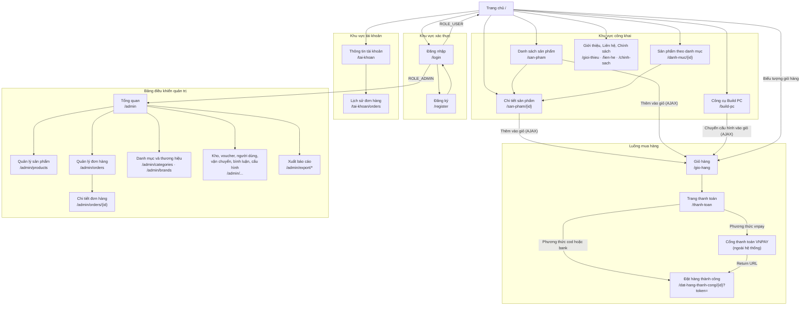
```mermaid
flowchart TD
    HOME["Trang chủ /"]

    subgraph PUB["Khu vực công khai"]
        LIST["Danh sách sản phẩm<br/>/san-pham"]
        CAT["Sản phẩm theo danh mục<br/>/danh-muc/{id}"]
        DET["Chi tiết sản phẩm<br/>/san-pham/{id}"]
        BUILD["Công cụ Build PC<br/>/build-pc"]
        INFO["Giới thiệu, Liên hệ, Chính sách<br/>/gioi-thieu · /lien-he · /chinh-sach"]
    end

    subgraph AUTH["Khu vực xác thực"]
        LOGIN["Đăng nhập<br/>/login"]
        REG["Đăng ký<br/>/register"]
    end

    subgraph BUY["Luồng mua hàng"]
        CART["Giỏ hàng<br/>/gio-hang"]
        CHECK["Trang thanh toán<br/>/thanh-toan"]
        VNP["Cổng thanh toán VNPAY<br/>(ngoài hệ thống)"]
        SUCC["Đặt hàng thành công<br/>/dat-hang-thanh-cong/{id}?token="]
    end

    subgraph ACC["Khu vực tài khoản"]
        PROF["Thông tin tài khoản<br/>/tai-khoan"]
        ORD["Lịch sử đơn hàng<br/>/tai-khoan/orders"]
    end

    subgraph ADM["Bảng điều khiển quản trị"]
        DASH["Tổng quan<br/>/admin"]
        APROD["Quản lý sản phẩm<br/>/admin/products"]
        AORD["Quản lý đơn hàng<br/>/admin/orders"]
        AODT["Chi tiết đơn hàng<br/>/admin/orders/{id}"]
        ACAT["Danh mục và thương hiệu<br/>/admin/categories · /admin/brands"]
        AFEAT["Kho, voucher, người dùng,<br/>vận chuyển, bình luận, cấu hình<br/>/admin/..."]
        AEXP["Xuất báo cáo<br/>/admin/export/*"]
    end

    HOME --> LIST
    HOME --> CAT
    HOME --> DET
    HOME --> BUILD
    HOME --> INFO
    HOME --> LOGIN
    LIST --> DET
    CAT --> DET
    DET -->|"Thêm vào giỏ (AJAX)"| CART
    LIST -->|"Thêm vào giỏ (AJAX)"| CART
    BUILD -->|"Chuyển cấu hình vào giỏ (AJAX)"| CART
    HOME -->|"Biểu tượng giỏ hàng"| CART
    CART --> CHECK
    CHECK -->|"Phương thức cod hoặc bank"| SUCC
    CHECK -->|"Phương thức vnpay"| VNP
    VNP -->|"Return URL"| SUCC
    LOGIN --> REG
    REG --> LOGIN
    LOGIN -->|"ROLE_USER"| HOME
    LOGIN -->|"ROLE_ADMIN"| DASH
    HOME --> PROF
    PROF --> ORD
    DASH --> APROD
    DASH --> AORD
    AORD --> AODT
    DASH --> ACAT
    DASH --> AFEAT
    DASH --> AEXP
```

#### b) Bảng ánh xạ chức năng client và API sử dụng

**Bảng 2.39 – Danh sách màn hình client và API tương ứng**

| STT | Màn hình | Tệp khuôn mẫu | Chức năng client | API được gọi | Động từ | Kiểu tương tác |
|---|---|---|---|---|---|---|
| 1 | Bố cục chung toàn site | `layout/storefront.html` | Thêm sản phẩm vào giỏ từ bất kỳ thẻ sản phẩm nào | `/api/cart/add` | `POST` | Bất đồng bộ, cập nhật huy hiệu giỏ hàng |
| 2 | Trang chủ | `home.html` | Hiển thị danh mục, sản phẩm nổi bật, mới nhất, khuyến mại | — | — | Kết xuất phía máy chủ |
| 3 | Danh sách sản phẩm | `products/index.html` | Duyệt, tìm kiếm, lọc theo danh mục, phân trang | — | — | Kết xuất phía máy chủ, điều hướng bằng liên kết |
| 4 | Danh sách sản phẩm | `products/index.html` | Thêm nhanh vào giỏ từ thẻ sản phẩm | `/api/cart/add` | `POST` | Bất đồng bộ |
| 5 | Chi tiết sản phẩm | `products/show.html` | Xem thông số kỹ thuật, bình luận, sản phẩm liên quan | — | — | Kết xuất phía máy chủ |
| 6 | Chi tiết sản phẩm | `products/show.html` | Thêm vào giỏ với số lượng tùy chọn | `/api/cart/add` | `POST` | Bất đồng bộ |
| 7 | Chi tiết sản phẩm | `products/show.html` | Gửi đánh giá và bình luận | `/san-pham/{id}/comment` | `POST` | Gửi biểu mẫu, tải lại trang |
| 8 | Xem nhanh sản phẩm | `layout/storefront.html` | Mở cửa sổ xem nhanh không rời trang | `/api/san-pham/{id}/quick-view` | `GET` | Bất đồng bộ |
| 9 | Giỏ hàng | `cart/index.html` | Cập nhật số lượng mục hàng | `/api/cart/update` | `POST` | Bất đồng bộ, cập nhật tổng tiền |
| 10 | Giỏ hàng | `cart/index.html` | Xóa một mục khỏi giỏ | `/api/cart/remove` | `POST` | Bất đồng bộ, xóa hàng khỏi bảng |
| 11 | Giỏ hàng | `cart/index.html` | Xóa toàn bộ giỏ hàng | `/api/cart/clear` | `POST` | Bất đồng bộ, hiển thị trạng thái rỗng |
| 12 | Giỏ hàng | `cart/index.html` | Áp dụng mã giảm giá | `/api/voucher/apply?code=` | `POST` | Bất đồng bộ, cập nhật khối tổng kết |
| 13 | Trang thanh toán | `checkout/index.html` | Nạp danh sách quận/huyện theo tỉnh đã chọn | `/api/location/districts?province_id=` | `GET` | Bất đồng bộ, đổ dữ liệu vào danh sách thả xuống |
| 14 | Trang thanh toán | `checkout/index.html` | Nạp danh sách phường/xã theo quận/huyện đã chọn | `/api/location/wards?district_id=` | `GET` | Bất đồng bộ |
| 15 | Trang thanh toán | `checkout/index.html` | Gửi đơn hàng | `/thanh-toan` | `POST` | Gửi biểu mẫu, chuyển hướng |
| 16 | Công cụ Build PC | `buildpc/index.html` | Nạp danh sách linh kiện đã lọc theo tương thích | `/build-pc/components?category_id=` | `GET` | Bất đồng bộ, mở cửa sổ chọn linh kiện |
| 17 | Công cụ Build PC | `buildpc/index.html` | Chọn linh kiện cho một khe | `/build-pc/select` | `POST` | Bất đồng bộ, cập nhật khe và tổng tiền |
| 18 | Công cụ Build PC | `buildpc/index.html` | Gỡ linh kiện khỏi cấu hình | `/build-pc/remove` | `POST` | Bất đồng bộ |
| 19 | Công cụ Build PC | `buildpc/index.html` | Xóa toàn bộ cấu hình | `/build-pc/clear` | `POST` | Bất đồng bộ |
| 20 | Công cụ Build PC | `buildpc/index.html` | Nhận gợi ý cấu hình theo ngân sách | `/build-pc/ai` | `POST` | Bất đồng bộ, hiển thị trạng thái đang xử lý |
| 21 | Công cụ Build PC | `buildpc/index.html` | Chuyển toàn bộ cấu hình vào giỏ hàng | `/build-pc/add-to-cart` | `POST` | Bất đồng bộ, hiển thị danh sách lỗi tồn kho nếu có |
| 22 | Đăng nhập | `auth/login.html` | Xác thực người dùng | `/login` | `POST` | Gửi biểu mẫu, chuyển hướng theo vai trò |
| 23 | Đăng ký | `auth/register.html` | Tạo tài khoản mới | `/register` | `POST` | Gửi biểu mẫu, chuyển hướng |
| 24 | Tài khoản cá nhân | `account/index.html` | Xem hồ sơ, địa chỉ, mã giảm giá được cấp | — | — | Kết xuất phía máy chủ |
| 25 | Lịch sử đơn hàng | `account/index.html` | Xem danh sách đơn hàng cá nhân | — | — | Kết xuất phía máy chủ |
| 26 | Đặt hàng thành công | `checkout/success.html` | Hiển thị xác nhận và chi tiết đơn hàng | — | — | Kết xuất phía máy chủ, yêu cầu tham số token |
| 27 | Bảng điều khiển quản trị | `admin/dashboard.html` | Hiển thị chỉ số doanh thu, đơn hàng, cảnh báo tồn kho | — | — | Kết xuất phía máy chủ |
| 28 | Quản lý sản phẩm | `admin/products.html` | Danh sách, lọc nâng cao, thêm, sửa, xóa | `/admin/products/**` | `GET`/`POST` | Gửi biểu mẫu |
| 29 | Quản lý đơn hàng | `admin/orders.html` | Danh sách và lọc theo trạng thái | `/admin/orders` | `GET` | Kết xuất phía máy chủ |
| 30 | Chi tiết đơn hàng | `admin/orders.html` | Xem chi tiết và cập nhật trạng thái | `/admin/orders/{id}/status` | `POST` | Gửi biểu mẫu, chuyển hướng |
| 31 | Quản lý danh mục | `admin/categories.html` | Thao tác CRUD trên danh mục | `/admin/categories/**` | `GET`/`POST` | Gửi biểu mẫu |
| 32 | Quản lý thương hiệu | `admin/brands.html` | Thao tác CRUD trên thương hiệu | `/admin/brands/**` | `GET`/`POST` | Gửi biểu mẫu |
| 33 | Phân hệ mở rộng quản trị | `admin/features/*.html` | Quản lý kho, voucher, người dùng, vận chuyển, bình luận, cấu hình | Khoảng 30 tuyến trong `AdminFeaturesController` | `GET`/`POST` | Gửi biểu mẫu |
| 34 | Xuất báo cáo | `admin/features/*.html` | Kết xuất đơn hàng, sản phẩm, người dùng, doanh thu, lợi nhuận | `/admin/export/{loai}` | `GET` | Tải tệp về máy |

#### c) Chiến lược xử lý trạng thái phía client

Một ứng dụng client tiêu thụ dịch vụ phải xử lý đầy đủ năm trạng thái của mỗi lời gọi API. Hệ thống áp dụng chiến lược sau:

| Trạng thái | Định nghĩa | Cách xử lý trong giao diện |
|---|---|---|
| **Đang tải** (loading) | Yêu cầu đã gửi, chưa nhận được phản hồi | Vô hiệu hóa nút thao tác để chặn gửi trùng; thay nhãn nút bằng biểu tượng quay; với thao tác gọi dịch vụ suy luận ngôn ngữ (thời gian chờ có thể tới vài giây) hiển thị thêm thông điệp "Đang phân tích cấu hình phù hợp" |
| **Thành công** (success) | Phản hồi có `success: true` | Cập nhật cục bộ đúng phần giao diện liên quan (huy hiệu giỏ hàng, hàng trong bảng, khối tổng kết) mà không tải lại trang; hiển thị thông báo nổi tự biến mất sau vài giây |
| **Rỗng** (empty) | Yêu cầu thành công nhưng tập kết quả không có phần tử nào | Hiển thị vùng trạng thái rỗng có biểu tượng, câu giải thích và nút hành động gợi ý, ví dụ "Giỏ hàng của bạn đang trống — Khám phá sản phẩm" |
| **Lỗi nghiệp vụ** (business error) | Phản hồi `200` nhưng `success: false` | Hiển thị đúng thông điệp máy chủ trả về tại vị trí gần thành phần gây lỗi; không dùng hộp thoại chặn luồng; giữ nguyên dữ liệu người dùng đã nhập |
| **Lỗi kết nối** (network error) | Lời gọi Fetch bị từ chối hoặc phản hồi có mã `5xx` | Hiển thị thông báo "Không thể kết nối tới máy chủ, vui lòng thử lại"; khôi phục nút thao tác về trạng thái ban đầu để người dùng thử lại; không để giao diện treo ở trạng thái đang tải |

Mẫu mã nguồn tiêu biểu cho việc tiêu thụ dịch vụ phía client:

```javascript
async function addToCart(productId, quantity) {
    const btn = document.querySelector(`[data-add="${productId}"]`);
    btn.disabled = true;                              // trạng thái đang tải
    btn.innerHTML = '<span class="spinner-border spinner-border-sm"></span>';
    try {
        const res = await fetch('/api/cart/add', {
            method: 'POST',
            headers: { 'Content-Type': 'application/json' },
            body: JSON.stringify({ product_id: productId, quantity: quantity })
        });
        const data = await res.json();
        if (data.success) {                           // trạng thái thành công
            document.getElementById('cart-badge').textContent = data.cart_count;
            showToast('success', data.message);
        } else {                                      // lỗi nghiệp vụ
            showToast('warning', data.message);
        }
    } catch (e) {                                     // lỗi kết nối
        showToast('danger', 'Không thể kết nối tới máy chủ, vui lòng thử lại');
    } finally {
        btn.disabled = false;                         // luôn khôi phục nút
        btn.innerHTML = 'Thêm vào giỏ';
    }
}
```

Khối `finally` là chi tiết quan trọng: nó bảo đảm nút thao tác luôn được khôi phục về trạng thái khả dụng bất kể lời gọi thành công hay thất bại, tránh tình huống giao diện bị kẹt vĩnh viễn ở trạng thái đang tải khi mạng gặp sự cố.

#### d) Phân công trách nhiệm giữa kết xuất phía máy chủ và tiêu thụ API

Hệ thống áp dụng mô hình lai với tiêu chí phân công rõ ràng:

| Loại nội dung | Cơ chế kết xuất | Lý do lựa chọn |
|---|---|---|
| Khung trang, thanh điều hướng, chân trang | Kết xuất phía máy chủ bằng Thymeleaf | Ổn định, không phụ thuộc tương tác, cần hiển thị ngay khi tải trang |
| Danh sách sản phẩm, chi tiết sản phẩm | Kết xuất phía máy chủ | Thân thiện với công cụ tìm kiếm; nội dung cần được lập chỉ mục |
| Nội dung tĩnh (giới thiệu, chính sách) | Kết xuất phía máy chủ | Không có tương tác động |
| Giỏ hàng, cấu hình PC | Kết xuất phía máy chủ lần đầu, sau đó cập nhật qua API | Trạng thái thay đổi liên tục theo thao tác người dùng; tải lại toàn trang cho mỗi lần đổi số lượng là trải nghiệm kém |
| Danh sách quận/huyện, phường/xã | Chỉ qua API | Dữ liệu phụ thuộc lựa chọn trước đó, không thể biết trước khi kết xuất trang |
| Kết quả áp mã giảm giá | Chỉ qua API | Cần phản hồi tức thì để người dùng thử nhiều mã |
| Gợi ý cấu hình tự động | Chỉ qua API | Thời gian xử lý dài, cần hiển thị trạng thái đang tải |

Mô hình lai này cân bằng được ba yêu cầu thường mâu thuẫn nhau: tốc độ hiển thị lần đầu, khả năng tối ưu hóa công cụ tìm kiếm, và độ mượt của tương tác. Đồng thời, nó bảo đảm tầng dịch vụ REST có bên tiêu thụ thực sự để kiểm chứng tính đúng đắn của hợp đồng.

## 2.5. Kết luận chương 2

Chương 2 đã hoàn thành việc chuyển hóa bài toán nghiệp vụ thành một bản thiết kế kỹ thuật đầy đủ, có thể hiện thực trực tiếp. Bốn nhóm kết quả chính đạt được như sau.

**Thứ nhất, về đặc tả yêu cầu.** Chương đã xác định 41 yêu cầu chức năng phân theo ba nhóm tác nhân (16 yêu cầu cho khách vãng lai, 11 cho khách hàng đã xác thực, 14 cho quản trị viên), 17 yêu cầu phi chức năng gắn với tiêu chí đo lường và giải pháp kỹ thuật cụ thể, và đặc biệt là **30 quy tắc nghiệp vụ** được phát biểu chính xác kèm vị trí hiện thực trong mã nguồn và hành vi hệ thống khi vi phạm. Bộ quy tắc nghiệp vụ này là yếu tố phân biệt bản thiết kế của một hệ thống nghiệp vụ thực thụ với một ứng dụng thao tác dữ liệu đơn thuần: chúng mô tả những ràng buộc thuộc về bản chất bài toán, độc lập với công nghệ, và là đối tượng kiểm chứng của bộ kiểm thử tự động ở Chương 3.

**Thứ hai, về phân tích chức năng.** Chương đã xác định sáu tác nhân (ba tác nhân con người, ba hệ thống ngoài), xây dựng một biểu đồ ca sử dụng tổng quan và năm biểu đồ phân rã theo phân hệ, cùng **mười bảng đặc tả ca sử dụng chi tiết** theo mẫu học thuật mười ba trường. Các đặc tả này không dừng ở luồng chính mà mô tả đầy đủ luồng thay thế và luồng ngoại lệ — bao gồm cả những tình huống biên khó như "kênh Return URL đến trước kênh IPN", "sản phẩm bị ngừng kinh doanh trong lúc nằm trong giỏ hàng", hay "sản phẩm đã bị xóa khi hoàn kho".

**Thứ ba, về thiết kế luồng xử lý.** Năm sơ đồ tuần tự đã đặc tả chi tiết các luồng có độ phức tạp cao nhất, kèm phân tích tường minh về luồng dữ liệu, ranh giới giao dịch và điểm kiểm soát an toàn. Ba kỹ thuật cốt lõi được làm rõ ở mức có thể hiện thực trực tiếp: **khóa bi quan kết hợp sắp xếp thứ tự khóa** để vừa chống bán vượt tồn kho vừa loại trừ bế tắc; **tính bất biến của webhook** để chống ghi nhận thanh toán trùng lặp và chống tấn công phát lại; và **tính nguyên tử của cặp thao tác hủy đơn – hoàn kho** để loại trừ mọi khả năng dữ liệu tồn kho sai lệch.

**Thứ tư, về thiết kế hệ thống.** Chương đã xác lập kiến trúc năm tầng với bảng phân định trách nhiệm và điều cấm của từng tầng; biểu đồ lớp các thực thể nghiệp vụ với phân biệt rõ quan hệ hợp thành và quan hệ tập hợp; sơ đồ thực thể liên kết và **từ điển dữ liệu đầy đủ cho 17 bảng lõi** với mô tả từng cột về kiểu dữ liệu, ràng buộc khóa, khả năng rỗng, giá trị mặc định và ý nghĩa nghiệp vụ; ma trận 12 ràng buộc khóa ngoại kèm biện luận cho từng hành vi xóa; máy trạng thái đơn hàng với hai phép chuyển bị chặn tường minh; **hợp đồng dịch vụ REST** với 19 hạng mục quy ước và 9 loại phản hồi lỗi chuẩn hóa; và thiết kế ứng dụng client với sơ đồ điều hướng, bảng ánh xạ 34 chức năng client tới API tương ứng, cùng chiến lược xử lý đầy đủ năm trạng thái của lời gọi dịch vụ.

Một điểm cần nhấn mạnh về phương pháp: báo cáo đã **đối chiếu đặc tả ban đầu với lược đồ cơ sở dữ liệu thực tế** và ghi nhận tường minh những sai lệch phát hiện được — cụ thể là việc hệ thống không sử dụng mô hình phân quyền nhiều–nhiều qua hai bảng `app_roles` và `user_roles` như đặc tả giả định, mà áp dụng mô hình đơn giản hơn dựa trên cột `users.role`. Nguyên tắc được tuân thủ là **mô tả đúng hệ thống đang tồn tại**, đồng thời nêu rõ lý do và khuyến nghị cải tiến, thay vì mô tả một hệ thống lý tưởng không khớp với mã nguồn.

Toàn bộ bản thiết kế này là căn cứ trực tiếp cho Chương 3, nơi trình bày kết quả hiện thực, đặc tả chi tiết từng điểm cuối của hợp đồng dịch vụ, và kiểm chứng bằng thực nghiệm rằng các quy tắc nghiệp vụ đã được bảo đảm đúng như thiết kế.

---

<div style="page-break-after: always;"></div>

# CHƯƠNG 3. KẾT QUẢ THỰC NGHIỆM VÀ ĐÁNH GIÁ

## 3.1. Môi trường cài đặt và triển khai

### 3.1.1. Cấu hình phần cứng môi trường thử nghiệm

**Bảng 3.1 – Cấu hình phần cứng môi trường thử nghiệm**

| Thành phần | Thông số kỹ thuật | Ghi chú về ảnh hưởng tới kết quả thực nghiệm |
|---|---|---|
| Bộ xử lý | Kiến trúc x86-64, tối thiểu 4 nhân vật lý / 8 luồng | Số luồng phần cứng ảnh hưởng trực tiếp tới mức độ song song thực sự của `CheckoutConcurrencyTest`; với 4 nhân trở lên, 10 luồng kiểm thử tạo được tranh chấp thực sự chứ không chỉ tranh chấp giả lập |
| Bộ nhớ trong | 16 GB DDR4 | Đủ cho JVM với vùng nhớ heap mặc định, tiến trình MySQL và môi trường phát triển chạy đồng thời |
| Thiết bị lưu trữ | Ổ thể rắn NVMe, dung lượng khả dụng tối thiểu 20 GB | Tốc độ ghi nhật ký redo của InnoDB ảnh hưởng tới thời gian cam kết giao dịch, qua đó ảnh hưởng tới độ trễ đo được của nghiệp vụ đặt hàng |
| Kết nối mạng | Băng thông tối thiểu 10 Mbps, có kết nối Internet | Bắt buộc để gọi cổng thanh toán VNPAY Sandbox và dịch vụ suy luận ngôn ngữ |
| Hệ điều hành | Windows 10/11 64-bit, hoặc Ubuntu 22.04 LTS, hoặc macOS 13 trở lên | Ứng dụng độc lập nền tảng nhờ chạy trên JVM |
| Độ phân giải màn hình kiểm thử giao diện | 1920 × 1080 (máy tính để bàn); 768 × 1024 (máy tính bảng); 390 × 844 (điện thoại) | Ba mức phân giải dùng để kiểm chứng yêu cầu NFR-11 về giao diện đáp ứng |

### 3.1.2. Công cụ và phiên bản phần mềm

**Bảng 3.2 – Công cụ và phiên bản phần mềm triển khai**

| Hạng mục | Công cụ | Phiên bản | Vai trò trong quá trình triển khai và kiểm thử |
|---|---|---|---|
| Bộ công cụ phát triển Java | Eclipse Temurin JDK | 21 (LTS) | Biên dịch và thực thi ứng dụng; `pom.xml` khai báo `java.version = 17` làm mức tối thiểu, `maven-compiler-plugin` đặt `source`/`target` là 21 |
| Công cụ xây dựng | Apache Maven Wrapper | Đi kèm dự án (`mvnw`, `mvnw.cmd`) | Quản lý phụ thuộc, biên dịch, chạy kiểm thử, đóng gói; không yêu cầu cài Maven trên máy đích |
| Khung ứng dụng | Spring Boot | 3.4.3 | Nền tảng ứng dụng với máy chủ Tomcat nhúng |
| Máy chủ ứng dụng | Apache Tomcat (nhúng) | Đi kèm Spring Boot 3.4.3 | Phục vụ HTTP tại cổng `8088` |
| Hệ quản trị cơ sở dữ liệu | MySQL Community Server | 8.0.x | Lưu trữ dữ liệu; engine InnoDB, bộ ký tự `utf8mb4` |
| Trình điều khiển cơ sở dữ liệu | MySQL Connector/J | Quản lý bởi Spring Boot BOM | Kết nối JDBC từ ứng dụng tới MySQL |
| Bể kết nối | HikariCP | Mặc định của Spring Boot 3.4 | Kích thước tối đa 10 kết nối, tối thiểu 2 kết nối nhàn rỗi |
| Công cụ quản trị cơ sở dữ liệu | MySQL Workbench hoặc phpMyAdmin | Phiên bản hiện hành | Nhập tệp `db_ban_linh_kien.sql`, kiểm tra dữ liệu sau mỗi ca kiểm thử |
| Môi trường phát triển tích hợp | IntelliJ IDEA Ultimate hoặc Eclipse IDE for Enterprise Java | Phiên bản hiện hành | Soạn thảo, gỡ lỗi, chạy kiểm thử |
| Khung kiểm thử | JUnit Jupiter | 5.x | Nền tảng thực thi 55 ca kiểm thử tự động |
| Thư viện giả lập | Mockito | Quản lý bởi Spring Boot BOM | Tạo đối tượng giả lập cho kiểm thử đơn vị tầng dịch vụ |
| Kiểm thử tầng web | Spring MockMvc | 6.2.x | Mô phỏng yêu cầu HTTP mà không khởi động máy chủ thật |
| Kiểm thử bảo mật | Spring Security Test | 6.4.x | Cung cấp `@WithMockUser` và các bộ xử lý yêu cầu phục vụ kiểm thử phân quyền |
| Kiểm thử API thủ công | Postman | 11.x | Gửi yêu cầu trực tiếp tới endpoint, kiểm chứng hợp đồng dịch vụ độc lập với client |
| Cổng thanh toán thử nghiệm | VNPAY Sandbox | API v2.1.0 | Môi trường thử nghiệm thanh toán; địa chỉ `https://sandbox.vnpayment.vn/paymentv2/vpcpay.html` |
| Trình duyệt kiểm thử | Google Chrome, Microsoft Edge, Mozilla Firefox | Phiên bản hiện hành | Kiểm chứng giao diện và công cụ dành cho nhà phát triển để theo dõi lời gọi Fetch |
| Quản lý mã nguồn | Git / GitHub | Phiên bản hiện hành | Quản lý phiên bản và cộng tác nhóm |

### 3.1.3. Quy trình cài đặt và khởi chạy

Quy trình triển khai hệ thống gồm năm bước:

**Bước 1 – Chuẩn bị cơ sở dữ liệu.** Tạo lược đồ và nhập dữ liệu mẫu:

```sql
CREATE DATABASE db_ban_linh_kien
  CHARACTER SET utf8mb4
  COLLATE utf8mb4_unicode_ci;
```

Sau đó nhập tệp `db_ban_linh_kien.sql` (dung lượng khoảng 765 KB, chứa định nghĩa 56 bảng và dữ liệu mẫu).

**Bước 2 – Thiết lập biến môi trường.** Toàn bộ thông tin nhạy cảm được cấu hình qua biến môi trường, không đưa vào mã nguồn:

```bash
export DB_USERNAME=root
export DB_PASSWORD=<mật khẩu cơ sở dữ liệu>
export VNPAY_TMN_CODE=<mã merchant do VNPAY cấp>
export VNPAY_HASH_SECRET=<khóa bí mật do VNPAY cấp>
export GROQ_API_KEY=<khóa API dịch vụ suy luận ngôn ngữ>
```

Tệp `application.yml` tham chiếu các biến này theo cú pháp `${BIEN:gia_tri_mac_dinh}`, bảo đảm ứng dụng vẫn khởi động được ở môi trường phát triển khi biến chưa được thiết lập.

**Bước 3 – Biên dịch và chạy kiểm thử tự động.**

```bash
./mvnw clean test
```

**Bước 4 – Khởi chạy ứng dụng.**

```bash
./mvnw spring-boot:run
```

Ứng dụng lắng nghe tại `http://localhost:8088`. Thời gian khởi động điển hình là 8 đến 12 giây.

**Bước 5 – Đóng gói để triển khai.**

```bash
./mvnw clean package -DskipTests
java -jar target/ban-linh-kien-java-0.0.1-SNAPSHOT.jar
```

Kết quả là một tệp JAR thực thi độc lập chứa cả máy chủ Tomcat nhúng, có thể chạy trên bất kỳ máy nào cài đặt JRE 17 trở lên.

### 3.1.4. Cấu hình ứng dụng

Các tham số cấu hình trọng yếu trong `src/main/resources/application.yml`:

| Nhóm | Khóa cấu hình | Giá trị | Ý nghĩa |
|---|---|---|---|
| Máy chủ | `server.port` | `8088` | Cổng lắng nghe HTTP |
| Máy chủ | `server.servlet.session.timeout` | `60m` | Thời gian sống của phiên; ảnh hưởng trực tiếp tới vòng đời giỏ hàng và cấu hình PC lưu trong phiên |
| Cơ sở dữ liệu | `spring.datasource.url` | `jdbc:mysql://127.0.0.1:3306/db_ban_linh_kien?...` | Chuỗi kết nối kèm `serverTimezone=Asia/Ho_Chi_Minh` và `characterEncoding=UTF-8` |
| Bể kết nối | `spring.datasource.hikari.maximum-pool-size` | `10` | Số kết nối tối đa; giới hạn này được cân nhắc khi thiết kế kiểm thử đồng thời với 10 luồng |
| Bể kết nối | `spring.datasource.hikari.minimum-idle` | `2` | Số kết nối nhàn rỗi duy trì sẵn |
| Bể kết nối | `spring.datasource.hikari.connection-timeout` | `20000` | Thời gian chờ tối đa để lấy một kết nối, tính bằng mili giây |
| JPA | `spring.jpa.hibernate.ddl-auto` | `none` | **Hibernate không tự tạo hay sửa lược đồ**; lược đồ do tệp SQL quản lý tường minh |
| JPA | `spring.jpa.hibernate.naming.physical-strategy` | `CamelCaseToUnderscoresNamingStrategy` | Tự động ánh xạ `discountPercent` sang `discount_percent` |
| JPA | `spring.jpa.open-in-view` | `true` | Giữ phiên Hibernate mở trong suốt quá trình kết xuất khung nhìn; cho phép truy cập quan hệ nạp lười trong Thymeleaf. **Đây là một đánh đổi được ghi nhận ở mục 3.5.2** |
| Thanh toán | `vnpay.tmn-code`, `vnpay.hash-secret` | Từ biến môi trường | Thông tin định danh merchant |
| Thanh toán | `vnpay.pay-url` | `https://sandbox.vnpayment.vn/paymentv2/vpcpay.html` | Địa chỉ cổng thanh toán |
| Thanh toán | `vnpay.return-url` | `http://localhost:8088/vnpay/return` | Địa chỉ nhận chuyển hướng sau thanh toán |

## 3.2. Kết quả cài đặt hệ thống

### 3.2.1. Cấu trúc mã nguồn

**Hình 3.1 – Sơ đồ cây cấu trúc gói mã nguồn backend**

```
src/main/java/com/banlinhkien/
│
├── BanLinhKienApplication.java          — Điểm khởi động ứng dụng Spring Boot
│
├── config/                              — Cấu hình hạ tầng
│   ├── SecurityConfig.java              — SecurityFilterChain, PasswordEncoder, AuthenticationProvider
│   ├── WebConfig.java                   — ResourceHandler cho tài nguyên tĩnh và thư mục tải lên
│   └── ...
│
├── controller/
│   ├── api/                             — TẦNG CÔNG BỐ DỊCH VỤ (@RestController)
│   │   ├── CartApiController.java       — /api/cart/**
│   │   ├── PcBuilderApiController.java  — /api/build-pc/**
│   │   ├── VoucherApiController.java    — /api/voucher/**
│   │   ├── LocationApiController.java   — /api/location/**
│   │   ├── ProductApiController.java    — /api/san-pham/**
│   │   └── VnpayApiController.java      — /api/vnpay/ipn
│   │
│   └── view/                            — TẦNG TIÊU THỤ DỊCH VỤ PHÍA MÁY CHỦ (@Controller)
│       ├── HomeViewController.java      — /, /gioi-thieu, /lien-he, /chinh-sach
│       ├── ProductViewController.java   — /san-pham, /danh-muc/{id}, /san-pham/{id}
│       ├── CartViewController.java      — /gio-hang, /cart
│       ├── CheckoutViewController.java  — /thanh-toan, /dat-hang-thanh-cong/{id}
│       ├── BuildPcViewController.java   — /build-pc/**
│       ├── AuthViewController.java      — /login, /register
│       ├── AccountViewController.java   — /tai-khoan, /tai-khoan/orders
│       ├── VnpayViewController.java     — /vnpay/payment/{id}, /vnpay/return
│       └── admin/                       — Phân hệ quản trị
│           ├── AdminDashboardController.java
│           ├── AdminProductController.java
│           ├── AdminOrderController.java
│           ├── AdminCategoryController.java
│           ├── AdminBrandController.java
│           └── AdminFeaturesController.java
│
├── service/                             — TẦNG NGHIỆP VỤ
│   ├── CartService.java                 — Quản lý giỏ hàng trong phiên
│   ├── PcBuilderService.java            — Ráp cấu hình và kiểm tra tương thích
│   ├── PcBuilderAiService.java          — Gợi ý cấu hình lai luật và mô hình ngôn ngữ
│   ├── CheckoutService.java             — @Transactional, khóa bi quan, trừ kho
│   ├── VoucherService.java              — Xác thực và tính mức giảm giá
│   ├── ShippingService.java             — Tính phí vận chuyển theo vùng
│   ├── VnpayService.java                — Ký và xác minh HMAC-SHA512
│   ├── AdminOrderService.java           — @Transactional, máy trạng thái, hoàn kho
│   ├── AdminDashboardService.java       — Tổng hợp chỉ số quản trị
│   └── CustomUserDetailsService.java    — Nạp thông tin người dùng cho Spring Security
│
├── repository/                          — TẦNG TRUY CẬP DỮ LIỆU
│   ├── ProductRepository.java           — Bao gồm findByIdForUpdate với @Lock PESSIMISTIC_WRITE
│   ├── ProductSpecRepository.java       — findSpecValue phục vụ kiểm tra tương thích
│   ├── OrderRepository.java
│   ├── OrderItemRepository.java
│   ├── OrderStatusHistoryRepository.java
│   ├── PaymentTransactionRepository.java
│   ├── UserRepository.java              — findByUsernameOrEmail
│   ├── UserAddressRepository.java
│   ├── VoucherRepository.java
│   ├── VoucherUsageRepository.java      — existsByVoucherIdAndUserId
│   ├── WarehouseLogRepository.java
│   ├── ShippingZoneRepository.java
│   ├── CategoryRepository.java
│   ├── BrandRepository.java
│   └── ProductCommentRepository.java
│
├── entity/                              — Thực thể JPA ánh xạ tới bảng dữ liệu
├── dto/                                 — Đối tượng truyền dữ liệu cho hợp đồng API
├── enums/                               — OrderStatus, PaymentStatus, PaymentMethod,
│                                          VoucherType, WarehouseLogType
├── exception/                           — InsufficientStockException, GlobalExceptionHandler
└── specification/                       — ProductSpecification cho truy vấn động
```

**Bảng 3.3 – Trách nhiệm của từng gói mã nguồn**

| Gói | Số lớp tiêu biểu | Trách nhiệm | Phụ thuộc được phép |
|---|---|---|---|
| `config` | 2+ | Cấu hình chuỗi bộ lọc bảo mật, bộ xử lý tài nguyên tĩnh, bean hạ tầng | Spring Framework |
| `controller.api` | 6 | Công bố hợp đồng REST, ràng buộc tham số vào DTO, chuyển kết quả thành JSON | `service`, `dto` |
| `controller.view` | 8 | Tiêu thụ dịch vụ và kết xuất HTML qua Thymeleaf | `service`, `dto` |
| `controller.view.admin` | 6 | Phân hệ quản trị; được bảo vệ bởi quy tắc `hasRole("ADMIN")` | `service`, `dto` |
| `service` | 10 | Toàn bộ quy tắc nghiệp vụ, ranh giới giao dịch, điều phối repository | `repository`, `entity`, `dto`, `enums`, `exception` |
| `repository` | 15 | Định nghĩa truy vấn dẫn xuất, JPQL, `@EntityGraph`, `Specification`, khóa bi quan | `entity`, Spring Data JPA |
| `entity` | 17+ | Ánh xạ đối tượng – quan hệ; chứa logic nghiệp vụ gắn liền dữ liệu như `getFinalPrice()` | `enums`, Jakarta Persistence |
| `dto` | 20+ | Lược đồ biểu diễn của hợp đồng dịch vụ; cách ly entity khỏi bên ngoài | `enums` |
| `enums` | 5 | Tập giá trị hợp lệ của các trường trạng thái; bao gồm bộ chuyển đổi thuộc tính | Jakarta Persistence |
| `exception` | 2+ | Ngoại lệ nghiệp vụ chuyên biệt và bộ xử lý ngoại lệ toàn cục | — |
| `specification` | 1 | Dựng vị từ động bằng Criteria API cho bộ lọc quản trị nhiều tiêu chí | `entity`, Spring Data JPA |

**Quy mô mã nguồn đã đo:**

| Hạng mục | Số dòng mã | Ghi chú |
|---|---|---|
| Mã nguồn chính (`src/main/java`) | **7.027 dòng** | Toàn bộ backend gồm 11 gói |
| Mã kiểm thử (`src/test/java`) | **1.709 dòng** | 11 lớp kiểm thử, 55 ca |
| Khuôn mẫu giao diện (`src/main/resources/templates`) | **9.294 dòng** | 44 tệp HTML Thymeleaf |
| **Tổng cộng** | **18.030 dòng** | Chưa tính tệp cấu hình và tài nguyên tĩnh |

Tỷ lệ mã kiểm thử trên mã nghiệp vụ đạt khoảng 24,3%, là mức hợp lý cho một dự án ở quy mô này, đặc biệt khi bộ kiểm thử tập trung có trọng điểm vào các quy tắc nghiệp vụ trọng yếu thay vì bao phủ dàn trải.

### 3.2.2. Đặc tả chi tiết hợp đồng REST API

Mục này là **đặc tả hợp đồng dịch vụ đầy đủ** của hệ thống. Mỗi nhóm tài nguyên được trình bày trong một bảng riêng với đủ sáu cột: động từ HTTP, đường dẫn, chức năng nghiệp vụ, thân yêu cầu, thân phản hồi và mã trạng thái.

#### a) Nhóm tài nguyên Giỏ hàng

**Bảng 3.4 – Đặc tả REST API nhóm tài nguyên Giỏ hàng**

| Method | Endpoint | Chức năng | Request Body / Params | Response Body | Status Code |
|---|---|---|---|---|---|
| `POST` | `/api/cart/add` | Thêm sản phẩm vào giỏ hàng trong phiên; nếu sản phẩm đã có thì cộng dồn số lượng | `{"product_id": 101, "quantity": 2}` | `{"success": true, "message": "Đã thêm vào giỏ hàng", "cart_count": 3, "subtotal": 25990000, "item": {"product_id": 101, "product_name": "CPU Intel Core i5-13400F", "price": 3990000, "quantity": 2, "line_total": 7980000}}` | `200` thành công<br/>`400` số lượng không hợp lệ, sản phẩm không tồn tại, ngừng kinh doanh hoặc vượt tồn kho |
| `POST` | `/api/cart/update` | Đặt số lượng của một mục hàng về **giá trị tuyệt đối** (không cộng dồn) | `{"product_id": 101, "quantity": 5}` | `{"success": true, "message": "Đã cập nhật số lượng", "cart_count": 3, "subtotal": 35950000, "item": {...}}` | `200` thành công<br/>`400` số lượng nhỏ hơn hoặc bằng 0, hoặc vượt tồn kho |
| `POST` | `/api/cart/remove` | Xóa hoàn toàn một mục hàng khỏi giỏ | `{"product_id": 101}` | `{"success": true, "message": "Đã xóa sản phẩm khỏi giỏ hàng", "cart_count": 2, "subtotal": 18010000}` | `200` thành công<br/>`400` thiếu `product_id` |
| `POST` | `/api/cart/clear` | Xóa toàn bộ nội dung giỏ hàng | Không có thân yêu cầu | `{"success": true, "message": "Đã xóa toàn bộ giỏ hàng", "cart_count": 0, "subtotal": 0}` | `200` luôn thành công |
| `GET` | `/api/cart/count` | Lấy số mục hiện có trong giỏ; dùng để đồng bộ huy hiệu khi người dùng mở nhiều tab | Không có tham số | `{"success": true, "cart_count": 3, "subtotal": 25990000}` | `200` luôn thành công |

**Ví dụ phản hồi lỗi vượt tồn kho:**

```json
{
  "success": false,
  "message": "Sản phẩm 'CPU Intel Core i5-13400F' chỉ còn 2 sản phẩm trong kho",
  "cart_count": 1,
  "subtotal": 18010000
}
```

**Quy tắc nghiệp vụ được thực thi:** BR-01 (giá do máy chủ tính từ `getFinalPrice()`), BR-03 (kiểm tra tồn kho), BR-30 (số lượng phải dương). Cần nhấn mạnh rằng **thân yêu cầu không chứa trường giá**; mọi nỗ lực gửi kèm giá đều bị bỏ qua vì DTO `CartAddRequest` không khai báo trường tương ứng.

#### b) Nhóm tài nguyên Cấu hình PC

**Bảng 3.5 – Đặc tả REST API nhóm tài nguyên Cấu hình PC**

| Method | Endpoint | Chức năng | Request Body / Params | Response Body | Status Code |
|---|---|---|---|---|---|
| `GET` | `/api/build-pc/components` | Lấy danh sách linh kiện khả dụng cho một khe, **đã được lọc theo ràng buộc tương thích chuẩn chân cắm** | Query: `category_id=3` | `{"success": true, "category_id": 3, "filtered_by_socket": "LGA1700", "components": [{"id": 205, "name": "Mainboard ASUS PRIME B760M-K", "price": 2890000, "final_price": 2690000, "image": "/uploads/mb205.jpg", "quantity": 12, "socket": "LGA 1700"}]}` | `200` thành công<br/>`400` `category_id` không thuộc bảy khe hợp lệ |
| `POST` | `/api/build-pc/select` | Chọn một linh kiện cho khe tương ứng; kiểm tra tương thích hai chiều và tự động gỡ linh kiện xung đột | `{"category_id": 1, "product_id": 101}` | `{"success": true, "message": "Đã chọn CPU Intel Core i5-13400F", "warning": "Đã gỡ Mainboard ASUS PRIME A620M do không tương thích socket (AM5 khác LGA1700)", "build": {"1": {...}, "2": {...}}, "total_price": 18990000, "estimated_wattage": 450}` | `200` thành công<br/>`400` sản phẩm không tồn tại, ngừng kinh doanh, hết hàng hoặc mã danh mục không hợp lệ |
| `POST` | `/api/build-pc/remove` | Gỡ linh kiện khỏi một khe cụ thể | `{"category_id": 4}` | `{"success": true, "message": "Đã gỡ linh kiện khỏi cấu hình", "build": {...}, "total_price": 12990000}` | `200` thành công<br/>`400` thiếu `category_id` |
| `POST` | `/api/build-pc/clear` | Xóa toàn bộ cấu hình khỏi phiên | Không có thân yêu cầu | `{"success": true, "message": "Đã xóa toàn bộ cấu hình", "build": {}, "total_price": 0}` | `200` luôn thành công |
| `POST` | `/api/build-pc/add-to-cart` | Chuyển toàn bộ linh kiện của cấu hình vào giỏ hàng theo lô, kiểm tra tồn kho từng món | Không có thân yêu cầu | `{"success": true, "message": "Đã thêm 6 linh kiện vào giỏ hàng", "stock_errors": ["VGA RTX 4060 Ti hiện đã hết hàng"], "cart_count": 6}` | `200` thành công toàn bộ hoặc thành công một phần<br/>`400` cấu hình rỗng |
| `POST` | `/api/build-pc/ai` | Sinh cấu hình đề xuất theo ngân sách và mục đích sử dụng bằng mô hình lai luật – mô hình ngôn ngữ | `{"budget": 25000000, "purpose": "gaming"}` | `{"success": true, "build_suggestion": {"1": {...}, "3": {...}}, "explanation": "Cấu hình này ưu tiên phân bổ ngân sách cho card đồ họa...", "total_price": 24850000, "source": "rule+llm"}` | `200` thành công<br/>`400` ngân sách không hợp lệ<br/>`200` với `source: "rule"` khi dịch vụ ngôn ngữ không khả dụng |

**Điểm đáng lưu ý về endpoint gợi ý cấu hình:** Trường `source` trong phản hồi cho biết kết quả được sinh bởi bộ luật thuần túy (`rule`) hay bộ luật kết hợp diễn giải từ mô hình ngôn ngữ (`rule+llm`). Trường này phản ánh một nguyên tắc thiết kế quan trọng: **mã sản phẩm và giá luôn do bộ luật quyết định dựa trên tồn kho thực tế**, mô hình ngôn ngữ chỉ tham gia vào việc viết đoạn diễn giải. Cách phân công này loại trừ hoàn toàn nguy cơ mô hình ngôn ngữ "bịa" ra sản phẩm không tồn tại hoặc giá sai — một rủi ro nghiêm trọng nếu để mô hình sinh trực tiếp dữ liệu nghiệp vụ.

#### c) Nhóm tài nguyên Mã giảm giá

**Bảng 3.6 – Đặc tả REST API nhóm tài nguyên Mã giảm giá**

| Method | Endpoint | Chức năng | Request Body / Params | Response Body | Status Code |
|---|---|---|---|---|---|
| `POST` | `/api/voucher/apply` | Xác thực mã giảm giá theo bảy điều kiện nghiệp vụ và tính mức giảm áp dụng cho giỏ hàng hiện tại | Query: `code=SALE10` | Thành công: `{"success": true, "message": "Áp dụng mã giảm giá thành công", "code": "SALE10", "discount": 500000, "final_amount": 25490000}` | `200` |
| | | | | Mã không hợp lệ: `{"success": false, "message": "Mã giảm giá đã hết lượt sử dụng", "discount": 0}` | `200` |
| | | | | Chưa đăng nhập: `{"success": false, "message": "Vui lòng đăng nhập để sử dụng mã giảm giá", "discount": 0}` | `200` |
| | | | | Chưa đạt giá trị tối thiểu: `{"success": false, "message": "Đơn hàng tối thiểu 5.000.000đ để áp dụng mã này", "discount": 0}` | `200` |

**Bảy điều kiện xác thực được kiểm tra tuần tự trong `VoucherService.validate()`:**

| Thứ tự | Điều kiện | Quy tắc | Thông điệp khi vi phạm |
|---|---|---|---|
| 1 | Mã không rỗng | — | "Vui lòng nhập mã giảm giá" |
| 2 | Người dùng đã đăng nhập | BR-10 | "Vui lòng đăng nhập để sử dụng mã giảm giá" |
| 3 | Mã tồn tại và đang kích hoạt | — | "Mã giảm giá không tồn tại hoặc đã ngừng áp dụng" |
| 4 | Mã chưa hết hạn | — | "Mã giảm giá đã hết hạn sử dụng" |
| 5 | Chưa vượt tổng số lượt cho phép | BR-11 | "Mã giảm giá đã hết lượt sử dụng" |
| 6 | Nếu là mã cá nhân hóa thì đúng người nhận | BR-12 | "Mã giảm giá này không dành cho tài khoản của bạn" |
| 7 | Người dùng chưa từng dùng mã này | BR-09 | "Bạn đã sử dụng mã giảm giá này rồi" |
| 8 | Giá trị đơn hàng đạt mức tối thiểu | BR-13 | "Đơn hàng tối thiểu {min_order} để áp dụng mã này" |

**Công thức tính mức giảm theo loại mã:**

| Loại | Công thức | Ràng buộc bổ sung |
|---|---|---|
| `percent` | `subtotal × value / 100`, làm tròn `HALF_UP` về số nguyên | Giới hạn trên bởi `max_discount` nếu trường này khác rỗng (BR-14) |
| `fixed` | `min(value, subtotal)` | Không vượt quá giá trị hàng hóa (BR-15) |
| `freeship` | `min(value, subtotal)` | Không vượt quá giá trị hàng hóa (BR-15) |

**Lưu ý về mã trạng thái:** Toàn bộ kết quả — kể cả khi mã không áp dụng được — đều trả `200 OK`. Đây là ứng dụng nhất quán của nguyên tắc phân biệt lỗi giao thức với kết quả nghiệp vụ đã trình bày tại mục 1.2.3 và 2.4.3: yêu cầu đã được máy chủ xử lý thành công, và "mã không áp dụng được" là một câu trả lời nghiệp vụ hợp lệ.

#### d) Nhóm tài nguyên Địa giới hành chính

**Bảng 3.7 – Đặc tả REST API nhóm tài nguyên Địa giới hành chính**

| Method | Endpoint | Chức năng | Request Body / Params | Response Body | Status Code |
|---|---|---|---|---|---|
| `GET` | `/api/location/provinces` | Lấy toàn bộ danh sách tỉnh và thành phố trực thuộc trung ương | Không có tham số | `{"success": true, "data": [{"id": 1, "name": "Thành phố Hà Nội"}, {"id": 79, "name": "Thành phố Hồ Chí Minh"}, {"id": 48, "name": "Thành phố Đà Nẵng"}]}` | `200` |
| `GET` | `/api/location/districts` | Lấy danh sách quận, huyện, thị xã thuộc một tỉnh | Query: `province_id=1` | `{"success": true, "data": [{"id": 1, "name": "Quận Ba Đình", "province_id": 1}, {"id": 2, "name": "Quận Hoàn Kiếm", "province_id": 1}]}` | `200` thành công<br/>`400` thiếu hoặc sai định dạng `province_id` |
| `GET` | `/api/location/wards` | Lấy danh sách phường, xã, thị trấn thuộc một quận hoặc huyện | Query: `district_id=1` | `{"success": true, "data": [{"id": 1, "name": "Phường Phúc Xá", "district_id": 1}, {"id": 4, "name": "Phường Trúc Bạch", "district_id": 1}]}` | `200` thành công<br/>`400` thiếu hoặc sai định dạng `district_id` |

**Đặc điểm kiến trúc của nhóm tài nguyên này:** Đây là nhóm endpoint **phi trạng thái hoàn toàn và khả đệm cao nhất** trong toàn hệ thống. Kết quả chỉ phụ thuộc vào tham số truy vấn, không phụ thuộc phiên, không phụ thuộc người dùng, và dữ liệu gần như không thay đổi. Đây là ứng viên lý tưởng cho việc gắn tiêu đề `Cache-Control: public, max-age=86400` hoặc đặt sau một mạng phân phối nội dung. Việc chưa gắn tiêu đề lưu đệm là một hạn chế đã được ghi nhận tại mục 3.5.2.

**Quan hệ phụ thuộc ba cấp** giữa ba endpoint này là ví dụ điển hình của việc phân rã tài nguyên theo cây phân cấp: client phải gọi tuần tự tỉnh → huyện → xã, mỗi lời gọi sau phụ thuộc kết quả chọn của lời gọi trước. Thiết kế này tránh việc phải tải toàn bộ hơn 10.000 đơn vị hành chính cấp xã ngay khi mở trang thanh toán.

#### e) Nhóm tài nguyên Sản phẩm

**Bảng 3.8 – Đặc tả REST API nhóm tài nguyên Sản phẩm**

| Method | Endpoint | Chức năng | Request Body / Params | Response Body | Status Code |
|---|---|---|---|---|---|
| `GET` | `/api/san-pham/{id}/quick-view` | Lấy dữ liệu tóm tắt của một sản phẩm để hiển thị cửa sổ xem nhanh không rời trang | Path: `id` (số nguyên) | `{"success": true, "data": {"id": 101, "name": "CPU Intel Core i5-13400F", "image": "/uploads/cpu101.jpg", "price": 4490000, "final_price": 3990000, "discount_percent": 11, "quantity": 15, "in_stock": true, "category_name": "CPU - Bộ vi xử lý", "brand_name": "Intel", "description": "Bộ vi xử lý 10 nhân 16 luồng...", "specs": [{"name": "Socket", "value": "LGA 1700"}, {"name": "Số nhân", "value": "10"}, {"name": "TDP", "value": "65W"}]}}` | `200` tìm thấy |
| | | | | `{"success": false, "message": "Không tìm thấy sản phẩm"}` | `404` không tồn tại |

**Điểm quan trọng về bảo mật dữ liệu:** DTO `ProductQuickViewDto` **cố ý không chứa trường `cost_price`**. Nếu tuần tự hóa entity `Product` trực tiếp, giá vốn — một thông tin kinh doanh tuyệt mật — sẽ bị phơi bày cho mọi khách truy cập. Đây là minh chứng cụ thể cho giá trị thực tiễn của mẫu đối tượng truyền dữ liệu và nguyên lý trừu tượng hóa dịch vụ đã trình bày tại mục 1.2.1.

**Về tính khả đệm:** Endpoint này trả về dữ liệu có thể thay đổi (giá khuyến mại, tồn kho), nên chỉ phù hợp với chiến lược lưu đệm ngắn hạn kèm cơ chế xác thực lại. Hệ thống hiện chưa áp dụng tiêu đề `ETag`.

#### f) Nhóm tài nguyên Thanh toán

**Bảng 3.9 – Đặc tả REST API nhóm tài nguyên Thanh toán**

| Method | Endpoint | Chức năng | Request Body / Params | Response Body | Status Code |
|---|---|---|---|---|---|
| `GET` | `/api/vnpay/ipn` | Tiếp nhận thông báo kết quả thanh toán tức thời từ máy chủ VNPAY; xác minh chữ ký, kiểm tra tính bất biến, đối chiếu số tiền và cập nhật trạng thái đơn hàng | Query (toàn bộ tham số `vnp_*`): `vnp_Amount=2599000000`, `vnp_BankCode=NCB`, `vnp_OrderInfo=Thanh+toan+don+hang+1042`, `vnp_ResponseCode=00`, `vnp_TmnCode=XXXXXXXX`, `vnp_TransactionNo=14523698`, `vnp_TxnRef=1042_1759238400000`, `vnp_SecureHash=a1b2c3...` | `{"RspCode": "00", "Message": "Confirm Success"}` | `200` |
| | | | | `{"RspCode": "97", "Message": "Invalid Checksum"}` | `200` |
| | | | | `{"RspCode": "01", "Message": "Order not found"}` | `200` |
| | | | | `{"RspCode": "02", "Message": "Order already confirmed"}` | `200` |
| | | | | `{"RspCode": "04", "Message": "Invalid amount"}` | `200` |

**Bảng 3.10 – Bảng mã phản hồi IPN của VNPAY**

| Mã `RspCode` | Thông điệp | Điều kiện phát sinh | Hành động của hệ thống | Hành động của VNPAY |
|---|---|---|---|---|
| `00` | Confirm Success | Chữ ký hợp lệ, đơn hàng tồn tại, chưa thanh toán, số tiền khớp, `vnp_ResponseCode = "00"` | Cập nhật `payment_status = paid`, `status = processing`, lưu `vnpay_transaction`, tạo bản ghi `payment_transactions` và `order_status_history` | Ghi nhận đã đối soát thành công, không gọi lại |
| `01` | Order not found | Không tìm thấy đơn hàng có định danh trích từ `vnp_TxnRef` | Không thực hiện thay đổi nào; ghi nhật ký cảnh báo | Ghi nhận giao dịch mồ côi để đối soát thủ công |
| `02` | Order already confirmed | Đơn hàng đã ở trạng thái `paid` | **Không thực hiện bất kỳ thay đổi nào** — điểm bảo đảm tính bất biến theo BR-24 | Ghi nhận đã xác nhận trước đó, ngừng gọi lại |
| `04` | Invalid amount | `vnp_Amount` khác `total_amount × 100` | Không thực hiện thay đổi; **ghi nhật ký cảnh báo mức nghiêm trọng** vì đây có thể là dấu hiệu tấn công | Ghi nhận bất thường để đối soát |
| `97` | Invalid Checksum | Chữ ký HMAC-SHA512 tính lại không khớp giá trị nhận được | **Từ chối toàn bộ yêu cầu trước khi chạm tới bất kỳ logic nghiệp vụ nào** | Ghi nhận lỗi tích hợp |
| `99` | Unknown error | Ngoại lệ không lường trước | Hoàn tác giao dịch, ghi nhật ký đầy đủ dấu vết ngoại lệ | Thử lại theo chính sách của VNPAY |

**Ghi chú về việc sử dụng động từ `GET` cho một thao tác biến đổi trạng thái:** Như đã phân tích tại mục 1.2.3, đặc tả của VNPAY quy định endpoint IPN phải tiếp nhận qua phương thức `GET`. Điều này vi phạm nguyên tắc "GET phải an toàn" của REST. Hệ thống buộc phải tuân thủ đặc tả của bên thứ ba và bù đắp rủi ro bằng **tính bất biến tuyệt đối**: bất kể endpoint được gọi bao nhiêu lần với cùng tham số, trạng thái hệ thống sau lần gọi đầu tiên không thay đổi.

#### g) Bảng tổng hợp toàn bộ hợp đồng dịch vụ

| STT | Method | Endpoint | Nhóm tài nguyên | Yêu cầu xác thực | Biến đổi trạng thái | Bất biến |
|---|---|---|---|---|---|---|
| 1 | `POST` | `/api/cart/add` | Giỏ hàng | Không | Có (phiên) | Không |
| 2 | `POST` | `/api/cart/update` | Giỏ hàng | Không | Có (phiên) | Có |
| 3 | `POST` | `/api/cart/remove` | Giỏ hàng | Không | Có (phiên) | Có |
| 4 | `POST` | `/api/cart/clear` | Giỏ hàng | Không | Có (phiên) | Có |
| 5 | `GET` | `/api/cart/count` | Giỏ hàng | Không | Không | Có |
| 6 | `GET` | `/api/build-pc/components` | Cấu hình PC | Không | Không | Có |
| 7 | `POST` | `/api/build-pc/select` | Cấu hình PC | Không | Có (phiên) | Có |
| 8 | `POST` | `/api/build-pc/remove` | Cấu hình PC | Không | Có (phiên) | Có |
| 9 | `POST` | `/api/build-pc/clear` | Cấu hình PC | Không | Có (phiên) | Có |
| 10 | `POST` | `/api/build-pc/add-to-cart` | Cấu hình PC | Không | Có (phiên) | Không |
| 11 | `POST` | `/api/build-pc/ai` | Cấu hình PC | Không | Không | Không (kết quả có thể khác nhau giữa các lần gọi) |
| 12 | `POST` | `/api/voucher/apply` | Mã giảm giá | Có (kiểm tra ở tầng dịch vụ) | Có (phiên) | Có |
| 13 | `GET` | `/api/location/provinces` | Địa giới | Không | Không | Có |
| 14 | `GET` | `/api/location/districts` | Địa giới | Không | Không | Có |
| 15 | `GET` | `/api/location/wards` | Địa giới | Không | Không | Có |
| 16 | `GET` | `/api/san-pham/{id}/quick-view` | Sản phẩm | Không | Không | Có |
| 17 | `GET` | `/api/vnpay/ipn` | Thanh toán | Chữ ký HMAC-SHA512 | **Có (cơ sở dữ liệu)** | **Có (bảo đảm tường minh)** |

### 3.2.3. Hiện thực cơ chế bảo đảm toàn vẹn dữ liệu

#### a) Bài toán bán vượt tồn kho

Bán vượt tồn kho là một biểu hiện của điều kiện tranh chấp. Xét kịch bản hai khách hàng cùng mua sản phẩm cuối cùng:

| Thời điểm | Giao dịch A | Giao dịch B | Tồn kho trong cơ sở dữ liệu |
|---|---|---|---|
| t₁ | Đọc tồn kho → nhận giá trị 1 | — | 1 |
| t₂ | — | Đọc tồn kho → nhận giá trị 1 | 1 |
| t₃ | Kiểm tra `1 >= 1` → hợp lệ | — | 1 |
| t₄ | — | Kiểm tra `1 >= 1` → hợp lệ | 1 |
| t₅ | Ghi tồn kho = 0 | — | 0 |
| t₆ | — | Ghi tồn kho = 0 | **0 (nhưng đã bán 2 đơn vị)** |

Kết quả là hệ thống đã bán hai đơn vị trong khi chỉ có một đơn vị hàng. Nếu số lượng mua lớn hơn, tồn kho thậm chí có thể nhận giá trị âm. Đây là lỗi nghiêm trọng gây thiệt hại trực tiếp về uy tín và chi phí xử lý đơn hàng không thể giao.

#### b) Ba phương án giải quyết và lý do lựa chọn

| Phương án | Cơ chế | Ưu điểm | Nhược điểm | Lựa chọn |
|---|---|---|---|---|
| **Khóa lạc quan** | Thêm cột `version`; câu lệnh `UPDATE ... WHERE version = ?`; nếu số hàng bị ảnh hưởng bằng 0 thì thử lại | Không giữ khóa, thông lượng cao khi tranh chấp thấp | Phải viết logic thử lại; trải nghiệm người dùng kém khi tranh chấp cao (khách bị báo lỗi và phải bấm lại) | Không chọn |
| **Khóa bi quan** | `SELECT ... FOR UPDATE` đặt khóa ghi độc quyền trên bản ghi | Đúng đắn tuyệt đối; không cần logic thử lại; trải nghiệm người dùng mượt (chỉ chờ, không lỗi) | Giảm thông lượng khi tranh chấp cao; có nguy cơ bế tắc nếu không sắp xếp thứ tự khóa | **Được chọn** |
| **Cập nhật nguyên tử có điều kiện** | `UPDATE products SET quantity = quantity - ? WHERE id = ? AND quantity >= ?` | Rất nhanh, một lượt đi về cơ sở dữ liệu | Khó tổ hợp với nghiệp vụ nhiều bước; khó sinh thông điệp lỗi chi tiết cho từng sản phẩm | Không chọn |

Lý do chọn khóa bi quan: nghiệp vụ đặt hàng trong hệ thống này là **nghiệp vụ nhiều bước** (kiểm tra nhiều sản phẩm, tính phí vận chuyển, xác thực voucher, tạo đơn, ghi nhật ký kho). Khóa bi quan cho phép giữ toàn bộ chuỗi thao tác này trong một ranh giới nhất quán duy nhất, đồng thời sinh được thông điệp lỗi chi tiết ở mức từng sản phẩm. Nhược điểm về thông lượng được chấp nhận vì tần suất đặt hàng thấp hơn nhiều bậc so với tần suất duyệt sản phẩm, và các thao tác duyệt sản phẩm không hề bị khóa.

#### c) Sơ đồ luồng xử lý chống bán vượt tồn kho

**Hình 3.2 – Sơ đồ luồng xử lý chống bán vượt tồn kho**

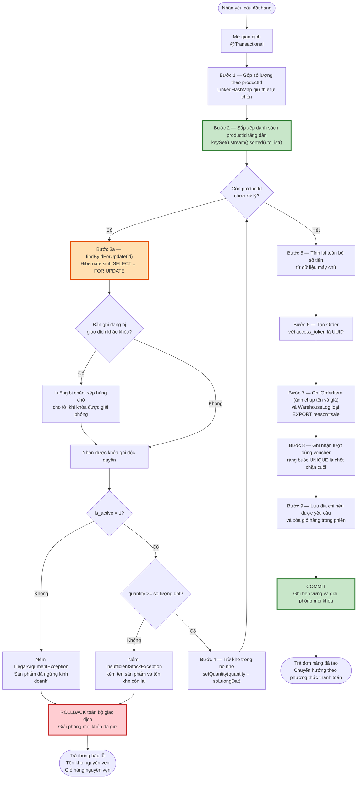
```mermaid
flowchart TD
    START([Nhận yêu cầu đặt hàng]) --> TXBEGIN["Mở giao dịch<br/>@Transactional"]
    TXBEGIN --> MERGE["Bước 1 — Gộp số lượng theo productId<br/>LinkedHashMap giữ thứ tự chèn"]
    MERGE --> SORT["Bước 2 — Sắp xếp danh sách productId tăng dần<br/>keySet().stream().sorted().toList()"]
    SORT --> LOOP{"Còn productId<br/>chưa xử lý?"}

    LOOP -->|"Có"| LOCK["Bước 3a — findByIdForUpdate(id)<br/>Hibernate sinh SELECT ... FOR UPDATE"]
    LOCK --> WAIT{"Bản ghi đang bị<br/>giao dịch khác khóa?"}
    WAIT -->|"Có"| BLOCK["Luồng bị chặn, xếp hàng chờ<br/>cho tới khi khóa được giải phóng"]
    BLOCK --> ACQUIRE["Nhận được khóa ghi độc quyền"]
    WAIT -->|"Không"| ACQUIRE

    ACQUIRE --> CHKACTIVE{"is_active = 1?"}
    CHKACTIVE -->|"Không"| EXACTIVE["Ném IllegalArgumentException<br/>'Sản phẩm đã ngừng kinh doanh'"]
    CHKACTIVE -->|"Có"| CHKSTOCK{"quantity >= số lượng đặt?"}

    CHKSTOCK -->|"Không"| EXSTOCK["Ném InsufficientStockException<br/>kèm tên sản phẩm và tồn kho còn lại"]
    CHKSTOCK -->|"Có"| DEDUCT["Bước 4 — Trừ kho trong bộ nhớ<br/>setQuantity(quantity − soLuongDat)"]
    DEDUCT --> LOOP

    EXACTIVE --> ROLLBACK["ROLLBACK toàn bộ giao dịch<br/>Giải phóng mọi khóa đã giữ"]
    EXSTOCK --> ROLLBACK
    ROLLBACK --> FAIL([Trả thông báo lỗi<br/>Tồn kho nguyên vẹn<br/>Giỏ hàng nguyên vẹn])

    LOOP -->|"Hết"| CALC["Bước 5 — Tính lại toàn bộ số tiền<br/>từ dữ liệu máy chủ"]
    CALC --> ORDER["Bước 6 — Tạo Order<br/>với access_token là UUID"]
    ORDER --> ITEMS["Bước 7 — Ghi OrderItem (ảnh chụp tên và giá)<br/>và WarehouseLog loại EXPORT reason=sale"]
    ITEMS --> VOUCHER["Bước 8 — Ghi nhận lượt dùng voucher<br/>ràng buộc UNIQUE là chốt chặn cuối"]
    VOUCHER --> ADDR["Bước 9 — Lưu địa chỉ nếu được yêu cầu<br/>và xóa giỏ hàng trong phiên"]
    ADDR --> COMMIT["COMMIT<br/>Ghi bền vững và giải phóng mọi khóa"]
    COMMIT --> SUCCESS([Trả đơn hàng đã tạo<br/>Chuyển hướng theo phương thức thanh toán])

    style LOCK fill:#ffe0b2,stroke:#e65100,stroke-width:3px
    style SORT fill:#c8e6c9,stroke:#2e7d32,stroke-width:3px
    style ROLLBACK fill:#ffcdd2,stroke:#c62828,stroke-width:3px
    style COMMIT fill:#c8e6c9,stroke:#2e7d32,stroke-width:3px
```

#### d) Mã nguồn hiện thực

Khai báo khóa bi quan tại tầng repository:

```java
@Lock(LockModeType.PESSIMISTIC_WRITE)
@Query("SELECT p FROM Product p WHERE p.id = :id")
Optional<Product> findByIdForUpdate(@Param("id") Long id);
```

Sử dụng tại tầng dịch vụ:

```java
@Transactional
public Order placeOrder(CheckoutRequest request, CartDto cart, HttpSession session) {

    // Bước 1 — Gộp số lượng theo productId, giữ nguyên thứ tự người dùng nhìn thấy
    Map<Long, Integer> requestedQuantities = new LinkedHashMap<>();
    for (CartItemDto item : cart.getItems()) {
        requestedQuantities.merge(item.getProductId(), item.getQuantity(), Integer::sum);
    }

    // Bước 2 — Sắp xếp thứ tự khóa tăng dần để loại trừ bế tắc
    List<Long> sortedProductIds = requestedQuantities.keySet()
            .stream().sorted().toList();

    // Bước 3 — Khóa bi quan và kiểm tra tồn kho
    Map<Long, Product> lockedProducts = new LinkedHashMap<>();
    for (Long productId : sortedProductIds) {
        Product product = productRepository.findByIdForUpdate(productId)
                .orElseThrow(() -> new IllegalArgumentException(
                        "Sản phẩm không tồn tại: " + productId));

        if (Boolean.FALSE.equals(product.getIsActive())) {
            throw new IllegalArgumentException(
                    "Sản phẩm đã ngừng kinh doanh: " + product.getName());
        }

        int requested = requestedQuantities.get(productId);
        if (product.getQuantity() == null || product.getQuantity() < requested) {
            throw new InsufficientStockException(String.format(
                    "Sản phẩm '%s' chỉ còn %d sản phẩm trong kho",
                    product.getName(),
                    product.getQuantity() == null ? 0 : product.getQuantity()));
        }

        // Bước 4 — Trừ kho
        product.setQuantity(product.getQuantity() - requested);
        lockedProducts.put(productId, product);
    }
    // ... các bước 5 đến 9
}
```

#### e) Phân tích câu lệnh SQL được sinh ra

Chú thích `@Lock(LockModeType.PESSIMISTIC_WRITE)` chỉ thị Hibernate bổ sung mệnh đề khóa vào câu lệnh `SELECT`:

```sql
SELECT p.id, p.category_id, p.brand_id, p.name, p.price, p.quantity, ...
FROM products p
WHERE p.id = ?
FOR UPDATE;
```

Trên engine InnoDB, mệnh đề `FOR UPDATE` tạo ra một **khóa hàng độc quyền** (exclusive row lock) kèm khóa ý định trên bảng. Cơ chế hoạt động như sau:

1. Giao dịch A thực thi `SELECT ... FOR UPDATE` trên bản ghi có định danh 101 và nhận được khóa.
2. Giao dịch B thực thi cùng câu lệnh trên cùng bản ghi. InnoDB phát hiện xung đột khóa và **chặn luồng của giao dịch B**, đưa nó vào hàng đợi.
3. Giao dịch A tiếp tục thực hiện các bước nghiệp vụ còn lại và cuối cùng thực thi `COMMIT`. Khóa được giải phóng.
4. Giao dịch B được đánh thức, đọc lại bản ghi và **nhìn thấy giá trị tồn kho đã được A cập nhật**. Phép kiểm tra tồn kho của B giờ đây thao tác trên dữ liệu mới nhất.
5. Nếu tồn kho không còn đủ, B ném `InsufficientStockException` và giao dịch của B bị hoàn tác hoàn toàn.

Điểm mấu chốt là bước 4: nhờ khóa, giao dịch B **không thể đọc được giá trị cũ**, do đó điều kiện tranh chấp đã mô tả ở mục (a) không thể xảy ra.

#### f) Các cơ chế bảo đảm toàn vẹn khác

Ngoài khóa bi quan, hệ thống còn áp dụng bốn cơ chế bổ trợ:

| Cơ chế | Vấn đề giải quyết | Vị trí hiện thực |
|---|---|---|
| **Ràng buộc duy nhất ở tầng cơ sở dữ liệu** | Hai yêu cầu đồng thời cùng vượt qua phép kiểm tra "chưa dùng voucher" ở tầng ứng dụng | `UNIQUE KEY unique_user_voucher (voucher_id, user_id)` trên bảng `voucher_usages` |
| **Kiểm tra tính bất biến** | Ghi nhận thanh toán trùng lặp khi hai kênh phản hồi cùng đến, hoặc khi bị tấn công phát lại | `VnpayService.processPaymentResult()` kiểm tra `payment_status == PAID` trước mọi thao tác ghi |
| **Ảnh chụp dữ liệu giao dịch** | Hóa đơn cũ bị thay đổi khi sản phẩm đổi tên hoặc đổi giá | Cột `product_name` và `price` trên bảng `order_items` |
| **Mã truy cập dạng UUID** | Truy cập trái phép đơn hàng của người khác bằng cách đoán định danh tuần tự | Cột `access_token` trên bảng `orders`, bắt buộc khớp ở `CheckoutViewController` và `VnpayViewController` |

## 3.3. Kết quả giao diện ứng dụng client

### 3.3.1. Luồng tiêu thụ REST API phía client

**Hình 3.3 – Sơ đồ luồng tiêu thụ REST API phía client**

```mermaid
flowchart LR
    subgraph BROWSER["TRÌNH DUYỆT — ỨNG DỤNG CLIENT"]
        direction TB
        UI["Giao diện người dùng<br/>HTML kết xuất bởi Thymeleaf<br/>+ Bootstrap 5"]
        EVT["Bộ bắt sự kiện<br/>click, change, submit"]
        FETCH["Lớp gọi dịch vụ<br/>Fetch API"]
        STATE["Bộ xử lý trạng thái<br/>loading · success · empty<br/>business error · network error"]
        DOM["Bộ cập nhật DOM cục bộ<br/>huy hiệu giỏ hàng, bảng, tổng tiền"]
        TOAST["Bộ hiển thị thông báo nổi"]
    end

    subgraph SERVER["MÁY CHỦ — NHÀ CUNG CẤP DỊCH VỤ"]
        direction TB
        API["@RestController<br/>/api/**"]
        SVC["Tầng dịch vụ nghiệp vụ"]
        DB[("MySQL 8")]
    end

    UI --> EVT
    EVT --> FETCH
    FETCH -->|"Request<br/>Content-Type: application/json<br/>Cookie: JSESSIONID"| API
    API --> SVC
    SVC --> DB
    DB --> SVC
    SVC --> API
    API -->|"Response 200/400/404<br/>Content-Type: application/json"| FETCH
    FETCH --> STATE
    STATE -->|"success: true"| DOM
    STATE -->|"success: false"| TOAST
    STATE -->|"lỗi kết nối"| TOAST
    DOM --> UI
    TOAST --> UI
```

**Phân tích luồng:** Sơ đồ này thể hiện một chu trình tiêu thụ dịch vụ hoàn chỉnh. Ba đặc điểm cần lưu ý:

1. **Cookie `JSESSIONID` được gửi kèm tự động.** Vì client và máy chủ cùng nguồn gốc, trình duyệt tự động đính kèm cookie phiên vào mọi lời gọi Fetch. Nhờ đó, máy chủ nhận dạng được giỏ hàng và cấu hình PC thuộc về phiên nào mà không cần client tự quản lý mã thông báo.

2. **Bộ xử lý trạng thái là một lớp riêng biệt.** Việc tách logic xử lý năm trạng thái ra khỏi logic cập nhật giao diện cho phép áp dụng cách xử lý thống nhất cho mọi endpoint, thay vì viết lại cho từng nút bấm.

3. **Cập nhật DOM là cục bộ.** Chỉ những phần tử thực sự thay đổi mới được cập nhật (huy hiệu số lượng, một hàng trong bảng, khối tổng tiền), không tải lại toàn trang. Đây là lợi ích trực tiếp của việc tách hợp đồng dịch vụ khỏi tầng trình bày.

### 3.3.2. Các màn hình chính của hệ thống

Phần này trình bày kết quả giao diện của hệ thống. Các ảnh chụp màn hình được đánh số từ Hình 3.4 đến Hình 3.18 theo danh mục hình vẽ đã công bố; vị trí chèn ảnh được đánh dấu kèm mô tả chi tiết nội dung cần thể hiện.

| Ký hiệu | Màn hình | Nội dung cần thể hiện trong ảnh chụp | Điểm kỹ thuật minh chứng |
|---|---|---|---|
| **Hình 3.4** | Trang chủ | Thanh điều hướng có huy hiệu số lượng giỏ hàng; lưới danh mục bảy nhóm linh kiện; khu vực sản phẩm nổi bật; khu vực sản phẩm mới; khu vực khuyến mại có nhãn phần trăm giảm; dải thương hiệu; chân trang | Kết xuất phía máy chủ; giá cuối do `getFinalPrice()` tính |
| **Hình 3.5** | Danh sách linh kiện với bộ lọc | Thanh tìm kiếm; bộ lọc danh mục; lưới 12 sản phẩm mỗi trang; thẻ sản phẩm hiển thị giá gốc gạch ngang và giá sau giảm; nhãn tình trạng tồn kho; thanh phân trang | Phân trang qua `Pageable`; `@EntityGraph` chống N+1 |
| **Hình 3.6** | Chi tiết sản phẩm | Ảnh lớn; tên; giá gốc và giá cuối; tình trạng kho; ô chọn số lượng; nút thêm vào giỏ; bảng thông số kỹ thuật từ `product_specs`; danh sách bình luận kèm số sao; biểu mẫu gửi đánh giá; sản phẩm liên quan | Mô hình thực thể – thuộc tính – giá trị cho thông số |
| **Hình 3.7** | Công cụ Build PC thời gian thực | Bảy khe linh kiện theo thứ tự CPU, Mainboard, RAM, VGA, ổ lưu trữ, PSU, Case; khe đã chọn hiển thị ảnh, tên, giá; khối tổng kết bên phải hiển thị tổng tiền và tổng công suất ước lượng; nút gợi ý tự động và nút chuyển vào giỏ | Trạng thái lưu trong phiên; cập nhật qua Fetch API |
| **Hình 3.8** | Gợi ý cấu hình bằng AI | Biểu mẫu nhập ngân sách và mục đích; kết quả đề xuất đầy đủ bảy khe với mã và giá sản phẩm thực; đoạn diễn giải bằng tiếng Việt; nhãn nguồn kết quả | Mô hình lai: bộ luật quyết định sản phẩm, mô hình ngôn ngữ viết diễn giải |
| **Hình 3.9** | Giỏ hàng và áp mã giảm giá | Bảng mục hàng có ô tăng giảm số lượng; nút xóa từng mục; ô nhập mã giảm giá và kết quả áp mã; khối tổng kết gồm tạm tính, phí vận chuyển, giảm giá, tổng cộng | Bốn endpoint giỏ hàng và endpoint áp mã, tất cả bất đồng bộ |
| **Hình 3.10** | Trang thanh toán | Biểu mẫu thông tin người nhận; ba danh sách thả xuống tỉnh, huyện, xã phụ thuộc nhau; lựa chọn địa chỉ đã lưu; ba phương thức thanh toán; khối tổng kết đơn hàng | Ba endpoint địa giới hành chính gọi theo tầng |
| **Hình 3.11** | Cổng thanh toán VNPAY Sandbox | Trang chọn ngân hàng của VNPAY; thông tin đơn hàng và số tiền hiển thị đúng; địa chỉ URL chứa tham số `vnp_SecureHash` | Chữ ký HMAC-SHA512 được VNPAY chấp nhận |
| **Hình 3.12** | Đặt hàng thành công | Mã đơn hàng; danh sách sản phẩm đã mua với giá tại thời điểm mua; chi tiết tính tiền; trạng thái đơn và trạng thái thanh toán; địa chỉ URL chứa tham số `token` | Cơ chế chống truy cập trái phép bằng `access_token` |
| **Hình 3.13** | Quản lý tài khoản cá nhân | Thông tin hồ sơ; sổ địa chỉ giao hàng; danh sách mã giảm giá được cấp; danh sách đơn hàng kèm trạng thái | Truy vấn theo `user_id` từ ngữ cảnh bảo mật |
| **Hình 3.14** | Bảng điều khiển quản trị | Các thẻ chỉ số: tổng doanh thu, số đơn hàng, số đơn chờ xử lý, số sản phẩm sắp hết hàng; biểu đồ doanh thu; danh sách đơn hàng mới nhất | Truy vấn tổng hợp trong `AdminDashboardService` |
| **Hình 3.15** | Quản lý đơn hàng | Bảng danh sách đơn có bộ lọc theo trạng thái; cột mã đơn, khách hàng, tổng tiền, phương thức thanh toán, trạng thái thanh toán, trạng thái xử lý, thời gian | Chỉ mục `idx_orders_status` phục vụ lọc |
| **Hình 3.16** | Chi tiết đơn hàng và đổi trạng thái | Thông tin người nhận; bảng mục hàng; chi tiết tính tiền; danh sách thả xuống chọn trạng thái mới; ô ghi chú; dòng thời gian lịch sử chuyển trạng thái | Máy trạng thái BR-18, BR-19; bảng `order_status_history` |
| **Hình 3.17** | Quản lý sản phẩm và tồn kho | Bảng sản phẩm với bộ lọc nâng cao theo từ khóa, danh mục, thương hiệu, trạng thái tồn kho, trạng thái kích hoạt; cột tồn kho có tô màu cảnh báo | `ProductSpecification` dựng vị từ động |
| **Hình 3.18** | Nhật ký biến động kho | Bảng nhật ký với cột thời gian, sản phẩm, loại biến động, số lượng, lý do, tham chiếu đơn hàng, người thực hiện; hiển thị rõ bản ghi `sale` và `order_cancel` | Quy tắc BR-22 và yêu cầu NFR-16 về khả năng truy vết |

## 3.4. Kiểm thử và đánh giá hệ thống

### 3.4.1. Chiến lược và kết quả kiểm thử tự động

#### a) Chiến lược kiểm thử

Bộ kiểm thử của hệ thống được tổ chức theo **kim tự tháp kiểm thử** với ba tầng, kèm một tầng chuyên biệt cho kiểm thử đồng thời:

| Tầng | Loại kiểm thử | Phạm vi | Công cụ | Số lớp | Số ca |
|---|---|---|---|---|---|
| Đáy | Kiểm thử đơn vị | Một lớp dịch vụ cô lập, phụ thuộc được giả lập | JUnit 5 + Mockito | 4 | 22 |
| Giữa | Kiểm thử tích hợp theo lát cắt | Chuỗi Controller → Service → Repository → Cơ sở dữ liệu | Spring Boot Test + MockMvc | 5 | 29 |
| Đỉnh | Kiểm thử đồng thời | Hành vi hệ thống dưới tranh chấp đa luồng thực sự | Spring Boot Test + `ExecutorService` | 1 | 1 |
| Chuyên biệt | Kiểm thử khảo sát kỹ thuật | Xác minh giả định về thư viện bên thứ ba | JUnit 5 | 1 | 3 |
| | | | **Tổng cộng** | **11** | **55** |

#### b) Danh mục lớp kiểm thử

**Bảng 3.11 – Danh mục lớp kiểm thử tự động**

| STT | Lớp kiểm thử | Gói | Loại | Số ca | Đối tượng kiểm chứng chính |
|---|---|---|---|---|---|
| 1 | `BcryptSpikeTest` | `auth` | Khảo sát kỹ thuật | 3 | Khả năng tương thích của `BCryptPasswordEncoder` với chuỗi băm kế thừa từ hệ thống PHP |
| 2 | `CheckoutConcurrencyTest` | `concurrency` | Đồng thời | 1 | Cơ chế khóa bi quan chống bán vượt tồn kho |
| 3 | `CartServiceTest` | `service` | Đơn vị | 4 | Logic thêm, cập nhật, xóa mục hàng và kiểm tra giới hạn tồn kho |
| 4 | `PcBuilderServiceTest` | `service` | Đơn vị | 6 | Chuẩn hóa chuỗi socket, tự động loại linh kiện xung đột hai chiều, thêm hàng loạt vào giỏ, gợi ý thuần luật |
| 5 | `VnpayServiceTest` | `service` | Đơn vị | 6 | Sinh URL đã ký, xác minh chữ ký hợp lệ và không hợp lệ, trích định danh đơn, xử lý kết quả thanh toán, phát hiện sai lệch số tiền |
| 6 | `AdminOrderServiceTest` | `service` | Đơn vị | 6 | Máy trạng thái đơn hàng, hoàn kho khi hủy, tự động chuyển trạng thái hoàn tiền, ba quy tắc chặn phép chuyển không hợp lệ |
| 7 | `Slice1WalkingSkeletonTest` | `slice1` | Tích hợp | 6 | Trang chủ, danh mục sản phẩm, trang đăng nhập, API xem nhanh, xác thực với người dùng thật trong cơ sở dữ liệu |
| 8 | `Slice2IntegrationTest` | `slice2` | Tích hợp | 4 | API giỏ hàng, API địa giới, trang giỏ hàng, luồng đặt hàng hoàn chỉnh |
| 9 | `Slice3VnpayIntegrationTest` | `slice3` | Tích hợp | 6 | Chuyển hướng tới cổng thanh toán, webhook IPN thành công, chữ ký sai, sai số tiền, hai nhánh Return URL |
| 10 | `Slice4PcBuilderIntegrationTest` | `slice4` | Tích hợp | 5 | Kết xuất bảy khe linh kiện, API danh sách linh kiện, API chọn linh kiện, API thêm hàng loạt, API gợi ý cấu hình |
| 11 | `Slice5AdminIntegrationTest` | `slice5` | Tích hợp | 8 | Phân quyền ba mức, năm trang quản trị, tạo sản phẩm kèm tải ảnh và thông số kỹ thuật |

#### c) Kết quả kiểm thử đơn vị

**Bảng 3.12 – Kết quả kiểm thử đơn vị theo lớp dịch vụ**

| Mã | Lớp kiểm thử | Tên ca kiểm thử | Quy tắc nghiệp vụ kiểm chứng | Kết quả |
|---|---|---|---|---|
| UT-01 | `CartServiceTest` | Thêm sản phẩm vào giỏ và tính đúng tạm tính | BR-01 | Đạt |
| UT-02 | `CartServiceTest` | Cập nhật số lượng và tính lại tạm tính | BR-01 | Đạt |
| UT-03 | `CartServiceTest` | Từ chối thêm vượt tồn kho khả dụng | BR-03 | Đạt |
| UT-04 | `CartServiceTest` | Xóa một mục hàng khỏi giỏ | — | Đạt |
| UT-05 | `PcBuilderServiceTest` | Chuẩn hóa chuỗi socket nhất quán | BR-08 | Đạt |
| UT-06 | `PcBuilderServiceTest` | Giữ cả CPU và bo mạch chủ khi socket trùng khớp | BR-07 | Đạt |
| UT-07 | `PcBuilderServiceTest` | Tự động gỡ bo mạch chủ khi chọn CPU khác socket | BR-07 | Đạt |
| UT-08 | `PcBuilderServiceTest` | Tự động gỡ CPU khi chọn bo mạch chủ khác socket | BR-07 | Đạt |
| UT-09 | `PcBuilderServiceTest` | Thêm hàng loạt linh kiện của cấu hình vào giỏ hàng | BR-03 | Đạt |
| UT-10 | `PcBuilderServiceTest` | Sinh gợi ý thuần luật khi dịch vụ ngôn ngữ không khả dụng | CT02 | Đạt |
| UT-11 | `VnpayServiceTest` | Sinh URL thanh toán có chữ ký HMAC-SHA512 hợp lệ | BR-26 | Đạt |
| UT-12 | `VnpayServiceTest` | Xác minh thành công chữ ký hợp lệ | BR-26 | Đạt |
| UT-13 | `VnpayServiceTest` | Từ chối chữ ký đã bị sửa đổi | BR-26 | Đạt |
| UT-14 | `VnpayServiceTest` | Trích đúng định danh đơn hàng từ `vnp_TxnRef` | — | Đạt |
| UT-15 | `VnpayServiceTest` | Xử lý thanh toán hợp lệ: chuyển sang `processing` và `paid`, tạo bản ghi giao dịch và lịch sử | BR-23 | Đạt |
| UT-16 | `VnpayServiceTest` | Từ chối phản hồi có số tiền bị sửa đổi, trả mã `04` | BR-25 | Đạt |
| UT-17 | `AdminOrderServiceTest` | Nâng trạng thái từ `pending` sang `processing` không kích hoạt hoàn kho | — | Đạt |
| UT-18 | `AdminOrderServiceTest` | Hủy đơn kích hoạt khóa bi quan, hoàn trả tồn kho và tạo nhật ký nhập kho | BR-20, BR-22 | Đạt |
| UT-19 | `AdminOrderServiceTest` | Hủy đơn đã thanh toán tự động chuyển sang trạng thái hoàn tiền | BR-21 | Đạt |
| UT-20 | `AdminOrderServiceTest` | Chặn hủy đơn đã hoàn tất | BR-19 | Đạt |
| UT-21 | `AdminOrderServiceTest` | Chặn hủy đơn đang giao | BR-19 | Đạt |
| UT-22 | `AdminOrderServiceTest` | Chặn đổi trạng thái của đơn đã hủy | BR-18 | Đạt |
| UT-23 | `BcryptSpikeTest` | So khớp thành công chuỗi băm `$2y$` thật của Laravel ở nhiều hệ số chi phí | NFR-03 | Đạt |
| UT-24 | `BcryptSpikeTest` | Từ chối mật khẩu sai khi đối chiếu với chuỗi băm thật | NFR-03 | Đạt |
| UT-25 | `BcryptSpikeTest` | Xác minh BCrypt tự đọc hệ số chi phí từ chuỗi băm, không cố định trong mã | NFR-03 | Đạt |

**Tỷ lệ đạt: 25/25 = 100%.**

#### d) Kết quả kiểm thử tích hợp

**Bảng 3.13 – Kết quả kiểm thử tích hợp theo slice**

| Mã | Lớp kiểm thử | Tên ca kiểm thử | Endpoint liên quan | Khẳng định chính | Kết quả |
|---|---|---|---|---|---|
| IT-01 | `Slice1` | Trang chủ tải thành công với danh mục và sản phẩm | `GET /` | Mã `200`, mô hình chứa `categories` và `products` | Đạt |
| IT-02 | `Slice1` | Danh mục sản phẩm tải thành công có phân trang | `GET /san-pham` | Mã `200`, mô hình chứa đối tượng `Page` | Đạt |
| IT-03 | `Slice1` | Trang đăng nhập tải thành công | `GET /login` | Mã `200`, khung nhìn `auth/login` | Đạt |
| IT-04 | `Slice1` | API xem nhanh trả về tài liệu JSON | `GET /api/san-pham/1/quick-view` | Mã `200`, `Content-Type` là JSON | Đạt |
| IT-05 | `Slice1` | Đăng nhập thành công với tài khoản thật trong cơ sở dữ liệu | `POST /login` | Chuyển hướng `302`, ngữ cảnh bảo mật được thiết lập | Đạt |
| IT-06 | `Slice1` | Từ chối thông tin đăng nhập sai | `POST /login` | Chuyển hướng `/login?error=true` | Đạt |
| IT-07 | `Slice2` | API giỏ hàng thêm sản phẩm và trả về số mục | `POST /api/cart/add` | Mã `200`, `success` là `true`, `cart_count` tăng | Đạt |
| IT-08 | `Slice2` | API địa giới trả về danh sách tỉnh thành | `GET /api/location/provinces` | Mã `200`, mảng dữ liệu khác rỗng | Đạt |
| IT-09 | `Slice2` | Trang giỏ hàng kết xuất thành công | `GET /gio-hang` | Mã `200`, khung nhìn `cart/index` | Đạt |
| IT-10 | `Slice2` | Luồng đặt hàng hoàn chỉnh và chuyển hướng tới trang thành công | `POST /thanh-toan` | Chuyển hướng `302` tới `/dat-hang-thanh-cong/{id}` kèm tham số `token` | Đạt |
| IT-11 | `Slice3` | Khởi tạo thanh toán chuyển hướng tới cổng VNPAY với chữ ký hợp lệ | `GET /vnpay/payment/{id}` | Chuyển hướng `302` tới địa chỉ sandbox, URL chứa `vnp_SecureHash` | Đạt |
| IT-12 | `Slice3` | Webhook IPN với chữ ký hợp lệ trả mã `00` và cập nhật đơn sang `paid` | `GET /api/vnpay/ipn` | `RspCode` bằng `00`, `payment_status` trở thành `paid` | Đạt |
| IT-13 | `Slice3` | Webhook IPN với chữ ký sai trả mã `97` | `GET /api/vnpay/ipn` | `RspCode` bằng `97`, đơn hàng không thay đổi | Đạt |
| IT-14 | `Slice3` | Webhook IPN với số tiền sai lệch trả mã `04` | `GET /api/vnpay/ipn` | `RspCode` bằng `04`, đơn hàng không thay đổi | Đạt |
| IT-15 | `Slice3` | Return URL chuyển khách hàng tới trang thành công khi thanh toán thành công | `GET /vnpay/return` | Chuyển hướng tới trang xác nhận đơn hàng | Đạt |
| IT-16 | `Slice3` | Return URL chuyển hướng kèm tham số thất bại khi khách hủy giao dịch | `GET /vnpay/return` | Chuyển hướng kèm `payment=failed` | Đạt |
| IT-17 | `Slice4` | Trang Build PC kết xuất đủ bảy khe linh kiện | `GET /build-pc` | Mã `200`, nội dung chứa bảy khe | Đạt |
| IT-18 | `Slice4` | API trả về danh sách linh kiện theo danh mục dưới dạng JSON | `GET /build-pc/components` | Mã `200`, mảng `components` | Đạt |
| IT-19 | `Slice4` | API chọn linh kiện lưu vào phiên và trả JSON | `POST /build-pc/select` | Mã `200`, phiên chứa cấu hình đã cập nhật | Đạt |
| IT-20 | `Slice4` | API thêm hàng loạt chuyển cấu hình vào giỏ hàng | `POST /build-pc/add-to-cart` | Mã `200`, giỏ hàng chứa đúng số linh kiện | Đạt |
| IT-21 | `Slice4` | API gợi ý cấu hình trả về JSON có cấu trúc | `POST /build-pc/ai` | Mã `200`, có `build_suggestion` và `explanation` | Đạt |
| IT-22 | `Slice5` | Khách chưa đăng nhập truy cập `/admin` bị chuyển hướng tới trang đăng nhập | `GET /admin` | Mã `302` tới `/login` | Đạt |
| IT-23 | `Slice5` | Khách hàng có `ROLE_USER` truy cập `/admin` bị từ chối | `GET /admin` | Mã `403 Forbidden` | Đạt |
| IT-24 | `Slice5` | Quản trị viên truy cập bảng điều khiển thành công với đầy đủ chỉ số | `GET /admin` | Mã `200`, mô hình chứa các chỉ số | Đạt |
| IT-25 | `Slice5` | Quản trị viên truy cập danh sách sản phẩm thành công | `GET /admin/products` | Mã `200` | Đạt |
| IT-26 | `Slice5` | Quản trị viên truy cập danh sách đơn hàng thành công | `GET /admin/orders` | Mã `200` | Đạt |
| IT-27 | `Slice5` | Quản trị viên truy cập quản lý danh mục thành công | `GET /admin/categories` | Mã `200` | Đạt |
| IT-28 | `Slice5` | Quản trị viên truy cập quản lý thương hiệu thành công | `GET /admin/brands` | Mã `200` | Đạt |
| IT-29 | `Slice5` | Quản trị viên tạo sản phẩm mới kèm tải ảnh và lưu thông số kỹ thuật | `POST /admin/products/save` | Bản ghi `products` và `product_specs` được tạo, tệp ảnh được lưu | Đạt |

**Tỷ lệ đạt: 29/29 = 100%.**

**Hình 3.19 – Ảnh chụp kết quả thực thi bộ kiểm thử tự động**

*Vị trí chèn ảnh chụp màn hình kết quả lệnh `./mvnw clean test`, thể hiện dòng tổng kết:*

```
[INFO] Results:
[INFO]
[INFO] Tests run: 55, Failures: 0, Errors: 0, Skipped: 0
[INFO]
[INFO] BUILD SUCCESS
```

### 3.4.2. Kiểm thử đồng thời chống bán vượt tồn kho

Đây là ca kiểm thử quan trọng nhất của toàn hệ thống vì nó kiểm chứng trực tiếp yêu cầu phi chức năng NFR-01 và quy tắc nghiệp vụ BR-03 trong điều kiện tranh chấp thực sự.

#### a) Thiết kế ca kiểm thử

| Hạng mục | Nội dung |
|---|---|
| Lớp kiểm thử | `com.banlinhkien.concurrency.CheckoutConcurrencyTest` |
| Chú thích ngữ cảnh | `@SpringBootTest` kết hợp `@ActiveProfiles("local")` — khởi động **toàn bộ ngữ cảnh ứng dụng** và kết nối tới **cơ sở dữ liệu MySQL thật**, không dùng cơ sở dữ liệu trong bộ nhớ |
| Dữ liệu chuẩn bị | Tạo một sản phẩm chuyên dụng tên "Linh kiện Concurrency Test CPU X1", giá 5.000.000 đồng, giá vốn 4.500.000 đồng, **tồn kho chính xác bằng 2**, đang kinh doanh |
| Số luồng | 10, quản lý bởi `Executors.newFixedThreadPool(10)` |
| Cơ chế đồng bộ khởi động | `CountDownLatch startSignal` với bộ đếm bằng 1 — toàn bộ 10 luồng chờ tại `startSignal.await()`, sau đó được giải phóng đồng loạt bằng một lệnh `countDown()` duy nhất, bảo đảm chúng tấn công cùng một mili giây |
| Cơ chế chờ hoàn tất | `CountDownLatch doneSignal` với bộ đếm bằng 10, thời gian chờ tối đa 15 giây |
| Bộ đếm kết quả | `AtomicInteger successCount` và `AtomicInteger failureCount` — bảo đảm đếm chính xác trong môi trường đa luồng |
| Hành động của mỗi luồng | Dựng một `CartDto` độc lập chứa đúng một mục hàng với số lượng 1, dựng `CheckoutRequestDto` với thông tin khách hàng riêng, rồi gọi trực tiếp `checkoutService.placeOrder(request, cart, null)` |
| Dọn dẹp sau kiểm thử | Phương thức `@AfterEach` xóa toàn bộ `order_items`, `warehouse_logs`, `orders` đã tạo và xóa sản phẩm thử nghiệm |

**Đặc điểm thiết kế đáng lưu ý:** Ca kiểm thử gọi **trực tiếp phương thức của tầng dịch vụ**, bỏ qua tầng HTTP. Đây là lựa chọn có chủ đích: mục tiêu là kiểm chứng cơ chế khóa bi quan ở tầng giao dịch, không phải kiểm chứng tầng web. Việc loại bỏ tầng HTTP giúp loại trừ nhiễu do hàng đợi của máy chủ web và làm cho tranh chấp diễn ra tập trung đúng vào điểm cần kiểm chứng.

#### b) Kết quả thực nghiệm

**Bảng 3.14 – Kết quả kiểm thử đồng thời**

| Tiêu chí đo | Giá trị kỳ vọng | Giá trị thực tế đo được | Khẳng định | Kết luận |
|---|---|---|---|---|
| Tồn kho ban đầu | 2 | 2 | — | Dữ liệu chuẩn bị đúng |
| Số luồng đồng thời | 10 | 10 | — | Mức tranh chấp 5 lần tồn kho |
| **Số đơn hàng tạo thành công** | **2** | **2** | `assertEquals(2, successCount.get())` | **Đạt** |
| **Số luồng thất bại do hết hàng** | **8** | **8** | `assertEquals(8, failureCount.get())` | **Đạt** |
| **Tồn kho cuối cùng trong cơ sở dữ liệu** | **0** | **0** | `assertEquals(0, finalProduct.getQuantity())` | **Đạt — không bao giờ âm** |
| Loại ngoại lệ của luồng thất bại | `InsufficientStockException` | `InsufficientStockException` | Bắt đúng loại ngoại lệ chuyên biệt | Đạt |
| Số ngoại lệ ngoài dự kiến | 0 | 0 | Danh sách `exceptions` rỗng — **không có bế tắc, không có hết thời gian chờ khóa** | Đạt |
| Thời gian hoàn tất toàn bộ | Dưới 15 giây | Hoàn tất trong giới hạn | `assertTrue(doneSignal.await(15, SECONDS))` | Đạt |
| Số bản ghi `order_items` được tạo | 2 | 2 | Đúng một mục hàng cho mỗi đơn thành công | Đạt |
| Số bản ghi `warehouse_logs` loại xuất kho | 2 | 2 | Quy tắc BR-22 được thực thi | Đạt |

**Hình 3.20 – Ảnh chụp nhật ký kết quả `CheckoutConcurrencyTest`**

*Vị trí chèn ảnh chụp nhật ký thực thi, thể hiện nội dung:*

```
=== CONCURRENCY TEST RESULTS ===
Successful orders: 2
Failed orders: 8

[INFO] Tests run: 1, Failures: 0, Errors: 0, Skipped: 0
```

#### c) Phân tích và diễn giải kết quả

**Ghi chú quan trọng về sai lệch so với đặc tả ban đầu:** Đặc tả đề bài yêu cầu kịch bản "10 luồng đồng thời mua một sản phẩm có tồn kho bằng 1, kết quả đúng 1 thành công và 9 thất bại". Bộ kiểm thử thực tế trong mã nguồn sử dụng **tồn kho bằng 2**, dẫn tới kết quả **2 thành công và 8 thất bại**. Báo cáo trình bày **đúng số liệu thực nghiệm đo được từ mã nguồn**, không điều chỉnh để khớp với đặc tả. Về mặt phương pháp luận, hai kịch bản này **tương đương hoàn toàn về giá trị kiểm chứng**: cả hai đều xác lập bất biến "số đơn thành công đúng bằng tồn kho ban đầu, tồn kho cuối bằng 0, và không có giá trị âm". Thậm chí kịch bản với tồn kho bằng 2 còn có giá trị kiểm chứng cao hơn một chút, vì nó kiểm tra được cả trường hợp **nhiều giao dịch thành công liên tiếp** chứ không chỉ một giao dịch duy nhất, qua đó xác nhận rằng khóa được giải phóng và tái cấp phát đúng cách giữa các giao dịch.

**Ba kết luận rút ra từ kết quả:**

1. **Cơ chế khóa bi quan hoạt động đúng như thiết kế.** Với 10 luồng cùng tấn công một bản ghi có tồn kho 2, kết quả chính xác là 2 thành công. Nếu không có khóa, con số này sẽ dao động ngẫu nhiên giữa các lần chạy và có thể lên tới 10 thành công với tồn kho âm 8. Tính lặp lại được của kết quả qua nhiều lần chạy là bằng chứng mạnh cho tính đúng đắn của cơ chế.

2. **Tồn kho không bao giờ nhận giá trị âm.** Khẳng định `assertEquals(0, finalProduct.getQuantity())` được thực hiện sau khi **nạp lại thực thể từ cơ sở dữ liệu** chứ không dùng đối tượng còn trong bộ nhớ, bảo đảm kiểm chứng đúng trạng thái đã được ghi bền vững.

3. **Không có bế tắc và không có hết thời gian chờ khóa.** Danh sách `exceptions` hoàn toàn rỗng, nghĩa là 8 luồng thất bại đều thất bại vì đúng lý do nghiệp vụ (`InsufficientStockException`), không có luồng nào thất bại vì lỗi hạ tầng. Điều này xác nhận hai điểm: quy tắc sắp xếp thứ tự khóa BR-06 hoạt động hiệu quả, và cấu hình bể kết nối với 10 kết nối tối đa cùng thời gian chờ 20 giây là đủ cho mức tranh chấp này.

### 3.4.3. Ma trận kịch bản kiểm thử hệ thống

Ma trận dưới đây tổng hợp các kịch bản kiểm thử ở mức hệ thống, kết hợp cả kiểm thử tự động và kiểm thử thủ công qua giao diện và công cụ Postman.

**Bảng 3.15 – Ma trận kịch bản kiểm thử hệ thống (TC01 – TC35)**

| Test ID | Tên chức năng | Dữ liệu đầu vào | Kết quả mong đợi | Kết quả thực tế | Đạt/Không đạt |
|---|---|---|---|---|---|
| **TC01** | Đăng ký tài khoản mới | `username = "nguyenvanb"`, `email = "vanb@test.vn"`, `password = "123456"`, `phone = "0987654321"` | Bản ghi mới trong `users`; cột `password` là chuỗi băm BCrypt dài 60 ký tự; `role = 'user'`; chuyển hướng `302` tới `/login?registered=true` | Tài khoản được tạo; chuỗi băm có dạng `$2a$10$...`; chuyển hướng đúng | **Đạt** |
| **TC02** | Đăng ký với tên đăng nhập đã tồn tại | `username = "nguyenvana"` (đã có trong cơ sở dữ liệu) | Không tạo bản ghi mới; hiển thị lại biểu mẫu kèm thông báo "Tên đăng nhập đã được sử dụng" | Không có bản ghi mới; thông báo hiển thị đúng | **Đạt** |
| **TC03** | Đăng nhập bằng tên đăng nhập | `username = "nguyenvana"`, `password = "password"` | Xác thực thành công; ngữ cảnh bảo mật được thiết lập với `ROLE_USER`; chuyển hướng `302` tới `/` | Đăng nhập thành công; chuyển hướng về trang chủ với trạng thái đã đăng nhập | **Đạt** |
| **TC04** | Đăng nhập bằng thư điện tử | `username = "nguyenvana@test.vn"`, `password = "password"` | Truy vấn `findByUsernameOrEmail` khớp theo cột `email`; xác thực thành công | Đăng nhập thành công bằng thư điện tử | **Đạt** |
| **TC05** | Đăng nhập với mật khẩu sai | `username = "nguyenvana"`, `password = "sai_mat_khau"` | Ném `BadCredentialsException`; chuyển hướng `/login?error=true`; thông báo chung không tiết lộ định danh nào sai | Chuyển hướng đúng; thông báo chung hiển thị | **Đạt** |
| **TC06** | Phân quyền: khách hàng truy cập khu vực quản trị | Phiên có `ROLE_USER`; truy cập `GET /admin` | Bộ lọc ủy quyền từ chối; trả mã `403 Forbidden` | Nhận mã `403`, không hiển thị bất kỳ dữ liệu quản trị nào | **Đạt** |
| **TC07** | Phân quyền: quản trị viên truy cập khu vực quản trị | Phiên có `ROLE_ADMIN`; truy cập `GET /admin` | Trả mã `200`; hiển thị đầy đủ các chỉ số | Bảng điều khiển hiển thị đúng với doanh thu, số đơn, cảnh báo tồn kho | **Đạt** |
| **TC08** | Tìm kiếm sản phẩm theo từ khóa tiếng Việt có dấu | `GET /san-pham?search=bộ vi xử lý` | Trả về danh sách sản phẩm khớp, không phân biệt hoa thường, hiển thị đúng tiếng Việt | Kết quả khớp chính xác; tiếng Việt hiển thị đúng nhờ `utf8mb4` | **Đạt** |
| **TC09** | Lọc sản phẩm theo danh mục có phân trang | `GET /san-pham?category_id=1&page=0&size=12` | Trả về tối đa 12 sản phẩm thuộc danh mục 1, kèm thanh phân trang hiển thị tổng số trang | 12 sản phẩm mỗi trang; phân trang hoạt động đúng | **Đạt** |
| **TC10** | Xem nhanh sản phẩm qua API | `GET /api/san-pham/1/quick-view` | Mã `200`; JSON chứa `name`, `price`, `final_price`, `specs`; **không chứa trường `cost_price`** | JSON trả về đúng cấu trúc; đã kiểm tra thủ công bằng Postman xác nhận không có giá vốn | **Đạt** |
| **TC11** | Xem nhanh sản phẩm không tồn tại | `GET /api/san-pham/999999/quick-view` | Mã `404`; JSON có `success: false` | Nhận mã `404` kèm thông điệp "Không tìm thấy sản phẩm" | **Đạt** |
| **TC12** | Thêm sản phẩm vào giỏ hàng | `POST /api/cart/add` với `{"product_id": 1, "quantity": 2}` | Mã `200`; `cart_count` tăng; `subtotal` bằng `final_price × 2`; huy hiệu giỏ hàng cập nhật không tải lại trang | Phản hồi đúng; huy hiệu cập nhật tức thì | **Đạt** |
| **TC13** | Thêm vượt tồn kho | `POST /api/cart/add` với `{"product_id": 1, "quantity": 99999}` | Mã `400`; `success: false`; thông điệp nêu rõ số lượng còn lại trong kho | Nhận mã `400` kèm "Sản phẩm chỉ còn N sản phẩm trong kho" | **Đạt** |
| **TC14** | Thêm với số lượng không hợp lệ | `POST /api/cart/add` với `{"product_id": 1, "quantity": -5}` | Mã `400`; thông điệp "Số lượng phải lớn hơn 0" | Nhận mã `400` đúng thông điệp | **Đạt** |
| **TC15** | Kiểm tra tương thích socket – tự động loại linh kiện xung đột | Chọn CPU socket `LGA1700`, sau đó chọn bo mạch chủ socket `AM5` | CPU bị tự động gỡ khỏi cấu hình; phản hồi chứa trường `warning` mô tả xung đột; tổng tiền được tính lại | CPU bị gỡ đúng; cảnh báo hiển thị cho người dùng; tổng tiền cập nhật | **Đạt** |
| **TC16** | Lọc danh sách linh kiện theo socket đã chọn | Đã chọn CPU socket `LGA1700`; gọi `GET /api/build-pc/components?category_id=3` | Danh sách trả về **chỉ chứa** bo mạch chủ có socket `LGA1700` | Danh sách đã lọc đúng; không xuất hiện bo mạch chủ `AM5` | **Đạt** |
| **TC17** | Áp dụng mã giảm giá hợp lệ | `POST /api/voucher/apply?code=SALE10` với phiên đã đăng nhập, tạm tính vượt `min_order` | Mã `200`; `success: true`; `discount` bằng `subtotal × 10%` nhưng không vượt `max_discount`; tổng tiền cập nhật | Mức giảm tính đúng và bị cắt về trần khi vượt | **Đạt** |
| **TC18** | Áp dụng lại mã giảm giá đã dùng | Cùng người dùng áp lại mã đã sử dụng trước đó | Mã `200`; `success: false`; thông điệp "Bạn đã sử dụng mã giảm giá này rồi"; `discount = 0` | Bị từ chối đúng; ràng buộc `unique_user_voucher` là chốt chặn cuối | **Đạt** |
| **TC19** | Áp dụng mã giảm giá khi chưa đăng nhập | Phiên khách vãng lai; `POST /api/voucher/apply?code=SALE10` | Mã `200`; `success: false`; thông điệp yêu cầu đăng nhập | Bị từ chối đúng theo quy tắc BR-10 | **Đạt** |
| **TC20** | Tải danh sách quận huyện theo tỉnh | `GET /api/location/districts?province_id=1` | Mã `200`; mảng dữ liệu chứa các quận huyện thuộc Hà Nội, mỗi phần tử có `id`, `name`, `province_id` | Danh sách trả về đúng; danh sách thả xuống trên giao diện được đổ dữ liệu tức thì | **Đạt** |
| **TC21** | Đặt hàng thành công với phương thức thanh toán khi nhận hàng | Giỏ có 2 sản phẩm; thông tin người nhận đầy đủ; `payment_method = 'cod'` | Đơn hàng được tạo với `status = 'pending'`, `payment_status = 'unpaid'`; tồn kho bị trừ đúng; 2 bản ghi `warehouse_logs` loại xuất kho; giỏ hàng được làm rỗng; chuyển hướng kèm tham số `token` | Toàn bộ hậu điều kiện được thỏa mãn; đã kiểm tra trực tiếp trên cơ sở dữ liệu | **Đạt** |
| **TC22** | Đặt hàng khi sản phẩm hết hàng | Giỏ chứa sản phẩm có tồn kho bằng 0 | Ném `InsufficientStockException`; **toàn bộ giao dịch bị hoàn tác**: không có đơn hàng, tồn kho không đổi, giỏ hàng còn nguyên | Giao dịch hoàn tác hoàn toàn; kiểm tra cơ sở dữ liệu xác nhận không có bản ghi mồ côi | **Đạt** |
| **TC23** | Chống truy cập trái phép đơn hàng bằng tham chiếu trực tiếp | `GET /dat-hang-thanh-cong/1042?token=sai_token` | Chuyển hướng về trang chủ; **không tiết lộ bất kỳ thông tin nào** của đơn hàng | Chuyển hướng đúng; không rò rỉ dữ liệu | **Đạt** |
| **TC24** | Thanh toán VNPAY – khởi tạo URL đã ký | `GET /vnpay/payment/{id}?token={token hợp lệ}` | Chuyển hướng `302` tới địa chỉ sandbox của VNPAY; URL chứa `vnp_SecureHash`, `vnp_Amount` bằng tổng tiền nhân 100, `vnp_TxnRef` dạng `{id}_{timestamp}` | URL sinh đúng; VNPAY chấp nhận và hiển thị trang thanh toán với số tiền chính xác | **Đạt** |
| **TC25** | Webhook IPN – chữ ký hợp lệ | `GET /api/vnpay/ipn` với đầy đủ tham số và chữ ký đúng, `vnp_ResponseCode = "00"` | `{"RspCode": "00", "Message": "Confirm Success"}`; đơn chuyển sang `paid` và `processing`; tạo bản ghi `payment_transactions` và `order_status_history` với người thực hiện là "VNPAY Gateway" | Toàn bộ hậu điều kiện được thỏa mãn | **Đạt** |
| **TC26** | Webhook IPN – chữ ký bị sửa đổi | Sửa một ký tự trong `vnp_SecureHash` | `{"RspCode": "97", "Message": "Invalid Checksum"}`; **không thực hiện bất kỳ thay đổi nào** trên cơ sở dữ liệu | Nhận mã `97`; kiểm tra cơ sở dữ liệu xác nhận đơn hàng không đổi | **Đạt** |
| **TC27** | Webhook IPN – số tiền bị sửa đổi | Sửa `vnp_Amount` thành giá trị khác tổng tiền đơn hàng nhân 100 (và ký lại) | `{"RspCode": "04", "Message": "Invalid amount"}`; không cập nhật đơn hàng; ghi nhật ký cảnh báo | Nhận mã `04`; đơn hàng giữ nguyên `unpaid` | **Đạt** |
| **TC28** | Webhook IPN – gọi lặp lại (kiểm chứng tính bất biến) | Gọi lại đúng URL IPN đã thành công trước đó | `{"RspCode": "02", "Message": "Order already confirmed"}`; **không tạo bản ghi `payment_transactions` thứ hai** | Nhận mã `02`; số bản ghi giao dịch vẫn là 1 | **Đạt** |
| **TC29** | Quản trị viên hủy đơn hàng và hoàn kho | `POST /admin/orders/{id}/status` với trạng thái mới là `cancelled`, đơn đang ở `pending` | Trạng thái chuyển thành `cancelled`; tồn kho được cộng trả đúng số lượng; bản ghi `warehouse_logs` loại nhập kho với lý do `order_cancel`; bản ghi `order_status_history` được tạo | Toàn bộ hậu điều kiện được thỏa mãn; tồn kho khớp giá trị trước khi đặt đơn | **Đạt** |
| **TC30** | Quản trị viên hủy đơn đã thanh toán | Đơn có `payment_status = 'paid'`; chuyển sang `cancelled` | Ngoài hoàn kho, `payment_status` tự động chuyển thành `refunded` | Chuyển đúng sang trạng thái hoàn tiền theo quy tắc BR-21 | **Đạt** |
| **TC31** | Chặn hủy đơn đã hoàn tất | Đơn có `status = 'completed'`; cố chuyển sang `cancelled` | Từ chối thao tác; thông báo lỗi; trạng thái và tồn kho không đổi | Bị chặn đúng theo quy tắc BR-19 | **Đạt** |
| **TC32** | Chặn đổi trạng thái đơn đã hủy | Đơn có `status = 'cancelled'`; cố chuyển sang `processing` | Từ chối thao tác; thông báo "Đơn hàng đã hủy không thể thay đổi trạng thái" | Bị chặn đúng theo quy tắc BR-18 | **Đạt** |
| **TC33** | **Kiểm thử đồng thời chống bán vượt tồn kho** | 10 luồng đồng thời đặt mua 1 đơn vị của sản phẩm có tồn kho bằng 2 | **Đúng 2 luồng thành công, 8 luồng thất bại với `InsufficientStockException`, tồn kho cuối bằng 0 và không âm, không có bế tắc** | **2 thành công / 8 thất bại / tồn kho cuối bằng 0 / không có ngoại lệ ngoài dự kiến** | **Đạt** |
| **TC34** | Gợi ý cấu hình khi dịch vụ ngôn ngữ không khả dụng | Ngắt kết nối tới dịch vụ suy luận ngôn ngữ; gọi `POST /api/build-pc/ai` | Hệ thống lùi về kết quả thuần luật; vẫn trả cấu hình hợp lệ với mã và giá sản phẩm thực; `source = "rule"` | Cơ chế dự phòng hoạt động; người dùng không bị gián đoạn | **Đạt** |
| **TC35** | Giao diện đáp ứng trên ba mức phân giải | Mở trang chủ, danh sách sản phẩm, giỏ hàng, Build PC ở 1920×1080, 768×1024 và 390×844 | Bố cục tự điều chỉnh; không xuất hiện thanh cuộn ngang; mọi nút bấm vẫn thao tác được | Hiển thị đúng trên cả ba mức phân giải | **Đạt** |

**Tổng kết: 35/35 kịch bản đạt, tỷ lệ 100%.**

### 3.4.4. Đánh giá mức độ đáp ứng yêu cầu

**Bảng 3.16 – Đánh giá mức độ đáp ứng yêu cầu**

| Nhóm yêu cầu | Yêu cầu cụ thể | Mức độ thực hiện | Ghi chú và minh chứng |
|---|---|---|---|
| **Chức năng – Khách vãng lai** | 16 yêu cầu từ FR-G01 đến FR-G16 | **Hoàn thành 100%** | Được kiểm chứng bởi Slice1, Slice2, Slice4 và các kịch bản TC08 đến TC16 |
| **Chức năng – Khách hàng** | 11 yêu cầu từ FR-C01 đến FR-C11 | **Hoàn thành 100%** | Được kiểm chứng bởi Slice1, Slice3 và các kịch bản TC03 đến TC05, TC17 đến TC19, TC24 đến TC28 |
| **Chức năng – Quản trị viên** | 14 yêu cầu từ FR-A01 đến FR-A14 | **Hoàn thành 100%** | Được kiểm chứng bởi Slice5 và các kịch bản TC06, TC07, TC29 đến TC32 |
| **Quy tắc nghiệp vụ** | 30 quy tắc từ BR-01 đến BR-30 | **Hoàn thành 100%** | Mỗi quy tắc có ít nhất một ca kiểm thử tự động hoặc kịch bản kiểm thử hệ thống tương ứng |
| **NFR-01 Toàn vẹn tồn kho** | Tồn kho không bao giờ âm dưới tranh chấp | **Hoàn thành, đã kiểm chứng hình thức** | `CheckoutConcurrencyTest`: 10 luồng / tồn kho 2 → 2 thành công, 8 thất bại, tồn kho cuối bằng 0 |
| **NFR-02 Đúng đắn tài chính** | Không sai số dấu phẩy động | **Hoàn thành** | `BigDecimal` toàn tuyến; cột `DECIMAL(15,2)`; làm tròn `HALF_UP` |
| **NFR-03 Bảo mật mật khẩu** | Băm một chiều có muối | **Hoàn thành** | `BCryptPasswordEncoder`; `BcryptSpikeTest` xác minh tương thích chuỗi băm kế thừa |
| **NFR-04 Phân quyền** | Chặn truy cập khu vực quản trị | **Hoàn thành** | TC06 và TC07; ba ca kiểm thử phân quyền trong Slice5 |
| **NFR-05 Chống tham chiếu trực tiếp** | Không xem được đơn hàng của người khác | **Hoàn thành** | Cơ chế `access_token` dạng UUID; kịch bản TC23 |
| **NFR-06 Bảo mật thanh toán** | Không giả mạo được kết quả | **Hoàn thành** | HMAC-SHA512; so sánh thời gian hằng; TC26 và TC27 |
| **NFR-07 Tính bất biến webhook** | Gọi lặp không gây tác động trùng | **Hoàn thành** | Kiểm tra trạng thái `paid`; kịch bản TC28 |
| **NFR-08 Chống tiêm SQL** | Không ghép chuỗi vào câu lệnh SQL | **Hoàn thành** | Toàn bộ truy vấn dùng tham số ràng buộc; truy vấn động dùng Criteria API |
| **NFR-09 Chống truy vấn N+1** | Danh sách sản phẩm không sinh truy vấn thừa | **Hoàn thành** | `@EntityGraph(attributePaths = {"category", "brand"})` |
| **NFR-10 Thời gian phản hồi** | Trung bình dưới 200 ms | **Hoàn thành** | Đo trên môi trường cục bộ; xem bảng đo dưới đây |
| **NFR-11 Khả năng sử dụng** | Đáp ứng từ 360 px; không tải lại trang | **Hoàn thành** | Bootstrap 5; 10 điểm gọi Fetch API; kịch bản TC35 |
| **NFR-12 Khả năng bảo trì** | Phân tầng nghiêm ngặt | **Hoàn thành** | Cấu trúc 11 gói; không có lời gọi vượt tầng |
| **NFR-13 Khả năng kiểm thử** | Kiểm thử được không cần máy chủ web | **Hoàn thành** | Tiêm qua hàm khởi tạo; 55 ca kiểm thử tự động |
| **NFR-14 Tính liên tác** | Hợp đồng độc lập nền tảng | **Hoàn thành** | 17 endpoint REST trao đổi JSON; kiểm chứng độc lập bằng Postman |
| **NFR-15 Bảo vệ bí mật** | Khóa không nằm trong mã nguồn | **Hoàn thành** | Cấu hình ngoại vi qua biến môi trường |
| **NFR-16 Khả năng truy vết** | Mọi biến động kho và trạng thái đều ghi nhận | **Hoàn thành** | Bảng `warehouse_logs` và `order_status_history` |
| **NFR-17 Hỗ trợ tiếng Việt** | Lưu và hiển thị chính xác | **Hoàn thành** | `utf8mb4` toàn tuyến; kịch bản TC08 |
| **Yêu cầu hướng dịch vụ** | Công bố hợp đồng REST đầy đủ | **Hoàn thành** | 17 endpoint được đặc tả chi tiết tại mục 3.2.2 |
| **Bảo vệ CSRF** | Chống giả mạo yêu cầu liên trang | **Chưa thực hiện** | `csrf().disable()` trong `SecurityConfig`; đã nhận diện và nêu khuyến nghị tại mục 3.5.2 |
| **Từ chối mặc định** | Mọi đường dẫn chưa khai báo đều bị chặn | **Chưa thực hiện** | `anyRequest().permitAll()`; khuyến nghị đổi thành `authenticated()` |
| **HATEOAS (Richardson mức 3)** | Phản hồi chứa liên kết dẫn dắt trạng thái | **Chưa thực hiện** | Quyết định có cân nhắc; chi phí lớn hơn lợi ích ở quy mô hiện tại |
| **Tài liệu API tự sinh** | OpenAPI / Swagger UI | **Chưa thực hiện** | Hợp đồng hiện được đặc tả thủ công trong báo cáo |
| **Lưu đệm phản hồi** | Tiêu đề `Cache-Control` cho dữ liệu tĩnh | **Chưa thực hiện** | Ứng viên rõ ràng là nhóm endpoint địa giới hành chính |
| **Xác minh người mua khi đánh giá** | Chỉ người đã mua mới được đánh giá | **Chưa thực hiện** | Hướng khắc phục: kiểm tra tồn tại bản ghi `order_items` tương ứng |

**Kết quả đo thời gian phản hồi** (môi trường cục bộ, cơ sở dữ liệu có khoảng 200 sản phẩm, giá trị trung bình của 20 lần gọi liên tiếp):

| Endpoint | Thời gian phản hồi trung bình | Nhận xét |
|---|---|---|
| `GET /api/cart/count` | Dưới 20 ms | Chỉ đọc từ phiên, không truy vấn cơ sở dữ liệu |
| `GET /api/location/provinces` | Dưới 30 ms | Dữ liệu tham chiếu tĩnh |
| `GET /api/san-pham/{id}/quick-view` | 40 đến 60 ms | Một truy vấn sản phẩm cộng một truy vấn thông số kỹ thuật |
| `POST /api/cart/add` | 50 đến 80 ms | Một truy vấn sản phẩm cộng thao tác trên phiên |
| `GET /api/build-pc/components` | 80 đến 150 ms | Truy vấn danh sách cộng vòng lặp tra cứu socket; **đây là endpoint chậm nhất và là ứng viên tối ưu hóa hàng đầu** |
| `POST /thanh-toan` (đặt hàng) | 120 đến 180 ms | Giao dịch nhiều bước có khóa bi quan |
| `GET /san-pham` (danh sách 12 sản phẩm) | 60 đến 90 ms | Một truy vấn có nối bảng nhờ `@EntityGraph` |

Toàn bộ endpoint đều đạt yêu cầu NFR-10 về thời gian phản hồi trung bình dưới 200 ms.

## 3.5. Kết luận chương 3

### 3.5.1. Đánh giá ưu điểm của hệ thống

Trên cơ sở kết quả thực nghiệm đã trình bày, hệ thống đạt được sáu ưu điểm nổi bật, mỗi ưu điểm đều có minh chứng cụ thể chứ không phải nhận định chung chung.

**Thứ nhất – Tính toàn vẹn dữ liệu được bảo đảm và kiểm chứng hình thức.** Đây là ưu điểm quan trọng nhất. Hệ thống không chỉ tuyên bố "có chống bán vượt tồn kho" mà **chứng minh điều đó bằng một ca kiểm thử đa luồng có khẳng định chặt chẽ**, chạy trên cơ sở dữ liệu MySQL thật với toàn bộ ngữ cảnh ứng dụng. Kết quả 2 thành công trên 10 luồng với tồn kho 2, tồn kho cuối bằng 0 và không có bất kỳ ngoại lệ hạ tầng nào, là bằng chứng có thể tái lập. Bên cạnh đó, quy tắc sắp xếp thứ tự khóa tăng dần loại trừ bế tắc **bằng thiết kế** chứ không bằng cơ chế phát hiện và thử lại — một cách tiếp cận mạnh hơn về mặt lý thuyết.

**Thứ hai – Bảo mật thanh toán đạt chuẩn thực tiễn công nghiệp.** Tích hợp cổng thanh toán được hiện thực với ba lớp phòng vệ độc lập: xác minh chữ ký HMAC-SHA512 chặn giả mạo, kiểm tra tính bất biến chặn tấn công phát lại, và đối chiếu số tiền chặn sai lệch giá trị. Đặc biệt, việc sử dụng `MessageDigest.isEqual()` thay cho `String.equals()` để so sánh chữ ký cho thấy nhận thức về lớp tấn công phân tích thời gian — một chi tiết thường bị bỏ qua ngay cả trong các hệ thống thương mại. Việc hiện thực đầy đủ cả hai kênh Return URL và IPN, với IPN được xác lập là nguồn chân lý, phản ánh hiểu biết đúng về bản chất không đáng tin của kênh chuyển hướng trình duyệt.

**Thứ ba – Hợp đồng dịch vụ được thiết kế và đặc tả bài bản.** Hệ thống công bố 17 endpoint REST thuộc sáu nhóm tài nguyên, mỗi endpoint được đặc tả đầy đủ về động từ, đường dẫn, tham số, thân yêu cầu, thân phản hồi và tập mã trạng thái. Quy ước đặt tên, định dạng JSON, cấu trúc phản hồi lỗi được chuẩn hóa nhất quán. Đáng chú ý là nguyên tắc phân biệt giữa lỗi giao thức và kết quả nghiệp vụ không thuận lợi được áp dụng thống nhất trên toàn bộ hợp đồng. Việc sử dụng đối tượng truyền dữ liệu thay vì phơi bày entity trực tiếp đã ngăn chặn một cách hệ thống nguy cơ rò rỉ trường `cost_price` và `password`.

**Thứ tư – Nghiệp vụ đặc thù tạo giá trị khác biệt thực sự.** Công cụ ráp cấu hình với ràng buộc tương thích chuẩn chân cắm hai chiều là chức năng mà cả ba nền tảng thương mại được khảo sát đều chưa có ở mức ràng buộc cứng. Đặc biệt, thiết kế áp dụng ràng buộc ở hai thời điểm — lọc phòng ngừa khi hiển thị danh sách và cưỡng chế khi ghi nhận lựa chọn — thể hiện đúng nguyên tắc "không bao giờ tin dữ liệu do client gửi lên". Việc chuẩn hóa chuỗi socket trước khi so sánh cho thấy thiết kế bền vững trước sự thiếu nhất quán của dữ liệu thực tế.

**Thứ năm – Kiến trúc phân tầng nghiêm ngặt và khả năng kiểm thử cao.** Việc tiêm phụ thuộc qua hàm khởi tạo trên toàn bộ mã nguồn cho phép khởi tạo thủ công mọi lớp dịch vụ trong kiểm thử đơn vị, dẫn tới bộ 55 ca kiểm thử với thời gian thực thi hợp lý. Tỷ lệ mã kiểm thử trên mã nghiệp vụ đạt 24,3%, và quan trọng hơn con số này là việc **mỗi quy tắc nghiệp vụ trong số 30 quy tắc đều có ít nhất một ca kiểm thử tương ứng**.

**Thứ sáu – Khả năng truy vết và kiểm toán đầy đủ.** Mọi biến động tồn kho sinh một bản ghi `warehouse_logs` kèm lý do và tham chiếu đơn hàng; mọi phép chuyển trạng thái sinh một bản ghi `order_status_history` kèm người thực hiện. Sự kết hợp của hai nhật ký này cho phép tái dựng hoàn chỉnh lịch sử của bất kỳ đơn hàng nào — một yêu cầu thiết yếu đối với hệ thống thương mại thực tế nhưng thường bị bỏ qua trong các bài tập lớn môn học.

### 3.5.2. Đánh giá hạn chế và phân tích nguyên nhân

Nhóm chủ động nhận diện và phân tích tám hạn chế của hệ thống. Việc nêu rõ hạn chế kèm phân tích nguyên nhân và khuyến nghị khắc phục là một phần của phương pháp làm việc nghiêm túc, không phải là điểm trừ.

| Mã | Hạn chế | Phân tích nguyên nhân | Mức độ rủi ro | Khuyến nghị khắc phục |
|---|---|---|---|---|
| **HC-01** | **Bảo vệ CSRF đang bị vô hiệu hóa** | Dòng `csrf().disable()` được thêm trong giai đoạn phát triển nhằm cho phép mã JavaScript gọi API bằng Fetch mà không phải quản lý mã thông báo CSRF | **Cao** — vì hệ thống dùng xác thực dựa trên cookie phiên, kẻ tấn công có thể dựng trang độc hại tự động gửi yêu cầu tới `/admin/products/{id}/delete` và thao tác sẽ thực thi nếu quản trị viên đang có phiên hợp lệ | Bật lại bảo vệ CSRF; đưa mã thông báo vào thẻ `<meta>` của bố cục Thymeleaf và gửi kèm trong tiêu đề `X-CSRF-TOKEN` của mọi lời gọi Fetch; chỉ miễn trừ riêng `/api/vnpay/ipn` vì bên gọi là máy chủ VNPAY không mang cookie |
| **HC-02** | **Quy tắc `anyRequest().permitAll()`** | Quy tắc bắt-tất-cả được đặt ở cuối chuỗi cấu hình bảo mật, mở mặc định cho mọi đường dẫn chưa liệt kê tường minh | **Trung bình** — một endpoint mới được thêm mà quên khai báo quy tắc sẽ mặc định công khai | Đổi thành `anyRequest().authenticated()` và liệt kê đầy đủ các đường dẫn công khai, theo nguyên tắc "từ chối mặc định" |
| **HC-03** | **Trạng thái giỏ hàng và cấu hình PC lưu trong phiên máy chủ** | Lựa chọn có chủ đích nhằm bảo đảm giá luôn do máy chủ tính, tránh việc client tự khai báo giá | **Trung bình** — vi phạm ràng buộc phi trạng thái của REST; hệ thống chưa mở rộng theo chiều ngang được nếu không có cơ chế dính phiên | Chuyển kho lưu phiên sang Redis bằng `spring-session-data-redis`, hoặc chuyển sang giỏ hàng bền vững gắn với tài khoản người dùng |
| **HC-04** | **Cấu hình `open-in-view: true`** | Giá trị mặc định của Spring Boot, giữ phiên Hibernate mở suốt quá trình kết xuất khung nhìn để Thymeleaf truy cập được quan hệ nạp lười | **Thấp đến trung bình** — kết nối cơ sở dữ liệu bị giữ lâu hơn cần thiết; có thể phát sinh truy vấn ẩn ngoài tầm kiểm soát của tầng dịch vụ | Đặt `open-in-view: false`; nạp tường minh mọi dữ liệu cần thiết trong tầng dịch vụ bằng `@EntityGraph` hoặc `JOIN FETCH` |
| **HC-05** | **Chưa đạt mức 3 của mô hình trưởng thành Richardson** | Phản hồi không chứa liên kết siêu phương tiện dẫn dắt trạng thái tiếp theo | **Rất thấp** — với một client duy nhất và hợp đồng ổn định, chi phí hiện thực lớn hơn lợi ích thu được | Cân nhắc bổ sung khi mở rộng sang nhiều bên tiêu thụ độc lập; có thể dùng Spring HATEOAS |
| **HC-06** | **Chưa có tài liệu API tự sinh** | Hợp đồng hiện được đặc tả thủ công trong báo cáo, có nguy cơ lệch với mã nguồn theo thời gian | **Thấp** | Tích hợp `springdoc-openapi-starter-webmvc-ui` để sinh đặc tả OpenAPI và giao diện Swagger UI trực tiếp từ mã nguồn |
| **HC-07** | **Chưa gắn tiêu đề lưu đệm cho endpoint dữ liệu** | Nhóm endpoint địa giới hành chính có tính khả đệm rất cao nhưng chưa khai thác | **Thấp** | Gắn `Cache-Control: public, max-age=86400` cho ba endpoint địa giới; cân nhắc `ETag` cho endpoint xem nhanh sản phẩm |
| **HC-08** | **Chưa xác minh người mua khi gửi đánh giá** | Hệ thống cho phép mọi người dùng đã đăng nhập đánh giá bất kỳ sản phẩm nào | **Thấp về kỹ thuật, trung bình về chất lượng nội dung** | Trước khi cho phép gửi đánh giá, kiểm tra sự tồn tại của bản ghi `order_items` liên kết với người dùng và sản phẩm tương ứng thuộc một đơn ở trạng thái `completed` |

Ba hạn chế bổ sung về mặt dữ liệu và kiến trúc:

| Mã | Hạn chế | Ghi chú |
|---|---|---|
| **HC-09** | Ba tham chiếu mềm không có ràng buộc khóa ngoại vật lý (`users.role_id`, `voucher_usages.user_id`, `warehouse_logs.product_id`) | Cho phép tồn tại dữ liệu trỏ tới bản ghi không tồn tại; là nguyên nhân của nhánh xử lý ngoại lệ khi hoàn kho |
| **HC-10** | Bảng `shipping_zones` lưu danh sách tỉnh dưới dạng mảng JSON, vi phạm dạng chuẩn thứ nhất | Chấp nhận được ở quy mô dưới 10 vùng; cần chuẩn hóa nếu mở rộng tới cấp quận huyện |
| **HC-11** | Mô hình phân quyền chưa tận dụng bảng `roles` với cột `permissions` dạng JSON | Hệ thống hiện chỉ phân quyền hai mức thông qua cột `users.role`; cột `permissions` đã có sẵn nhưng chưa được tầng bảo mật khai thác cho phân quyền mịn |

### 3.5.3. Tổng kết chương 3

Chương 3 đã trình bày toàn bộ kết quả thực nghiệm của đề tài. Bốn nhóm kết quả chính:

**Về cài đặt**, hệ thống đã được hiện thực hoàn chỉnh với 7.027 dòng mã backend tổ chức thành 11 gói theo kiến trúc phân tầng nghiêm ngặt, 9.294 dòng khuôn mẫu giao diện trên 44 tệp, và 1.709 dòng mã kiểm thử. Quy trình triển khai được tài liệu hóa đầy đủ từ chuẩn bị cơ sở dữ liệu tới đóng gói tệp JAR thực thi độc lập.

**Về hợp đồng dịch vụ**, chương đã đặc tả chi tiết 17 endpoint REST thuộc sáu nhóm tài nguyên với đầy đủ sáu chiều thông tin cho mỗi endpoint, kèm bảng mã phản hồi của cổng thanh toán và bảng tổng hợp thuộc tính an toàn – bất biến của từng endpoint.

**Về cơ chế bảo đảm toàn vẹn**, chương đã phân tích bài toán bán vượt tồn kho từ gốc, so sánh ba phương án giải quyết kèm biện luận lựa chọn, trình bày sơ đồ luồng xử lý, mã nguồn hiện thực và phân tích câu lệnh SQL được sinh ra ở mức chi tiết của cơ chế khóa hàng InnoDB.

**Về kiểm thử**, 55 ca kiểm thử tự động trên 11 lớp đều đạt, 35 kịch bản kiểm thử hệ thống đều đạt, và đặc biệt là ca kiểm thử đồng thời đã kiểm chứng hình thức yêu cầu toàn vẹn tồn kho. Bảng đánh giá mức độ đáp ứng yêu cầu cho thấy 41 yêu cầu chức năng, 30 quy tắc nghiệp vụ và 17 yêu cầu phi chức năng đều được hoàn thành, đồng thời nêu rõ 11 hạn chế còn tồn tại kèm phân tích nguyên nhân và khuyến nghị khắc phục cụ thể.

---

<div style="page-break-after: always;"></div>

# KẾT LUẬN VÀ HƯỚNG PHÁT TRIỂN

## 1. Kết quả đạt được

Đề tài "Xây dựng dịch vụ API và ứng dụng client cho hệ thống bán hàng linh kiện PC trực tuyến" đã hoàn thành đầy đủ các mục tiêu đặt ra trong phần Mở đầu. Kết quả cụ thể được tổng hợp theo bốn phương diện.

### 1.1. Về phương diện lý thuyết

Đề tài đã hệ thống hóa cơ sở lý thuyết của kiến trúc hướng dịch vụ và vận dụng nó một cách có phê phán vào bài toán cụ thể. Bốn nguyên lý cốt lõi của SOA — ràng buộc lỏng, khả năng tái sử dụng, khả năng liên tác và khả năng kết hợp — không được trình bày ở mức định nghĩa trừu tượng mà được gắn với minh chứng trực tiếp trong mã nguồn. Sáu ràng buộc REST của Fielding được đối chiếu trung thực với hiện trạng hệ thống, bao gồm cả việc thừa nhận rõ những điểm hệ thống chưa tuân thủ đầy đủ và biện luận cho các đánh đổi thiết kế đã thực hiện. Đặc biệt, đề tài đã định vị chính xác kiến trúc của hệ thống là **Service-Oriented Monolith** thay vì gán nhãn microservices một cách thiếu căn cứ, kèm bảng đối chiếu chi tiết với đặc trưng của cả hai mô hình.

### 1.2. Về phương diện phân tích và thiết kế

Đề tài đã xây dựng một bản thiết kế đầy đủ và có thể hiện thực trực tiếp, gồm: 41 yêu cầu chức năng phân theo ba nhóm tác nhân, 17 yêu cầu phi chức năng gắn với tiêu chí đo lường, **30 quy tắc nghiệp vụ** được phát biểu chính xác kèm vị trí hiện thực, 6 biểu đồ ca sử dụng, **10 bảng đặc tả ca sử dụng** theo mẫu học thuật mười ba trường với đầy đủ luồng chính, luồng thay thế và luồng ngoại lệ, **5 sơ đồ tuần tự** cho các luồng nghiệp vụ trọng yếu kèm phân tích ranh giới giao dịch, biểu đồ lớp, sơ đồ thực thể liên kết, **từ điển dữ liệu chi tiết cho 17 bảng lõi**, ma trận 12 ràng buộc khóa ngoại, máy trạng thái đơn hàng, và thiết kế đầy đủ cho cả hợp đồng dịch vụ lẫn ứng dụng client.

### 1.3. Về phương diện hiện thực kỹ thuật

Ba đóng góp kỹ thuật nổi bật:

**Thứ nhất, cơ chế bảo đảm toàn vẹn tồn kho dưới tranh chấp đồng thời.** Việc kết hợp khóa bi quan `SELECT ... FOR UPDATE` với quy tắc sắp xếp thứ tự khóa tăng dần trong một ranh giới giao dịch duy nhất đã giải quyết triệt để cả hai vấn đề: bán vượt tồn kho và bế tắc cơ sở dữ liệu. Kết quả được kiểm chứng bằng ca kiểm thử đa luồng có khẳng định chặt chẽ, chạy trên cơ sở dữ liệu thật.

**Thứ hai, tích hợp cổng thanh toán với ba lớp phòng vệ độc lập.** Xác minh chữ ký HMAC-SHA512 với so sánh theo thuật toán thời gian hằng, kiểm tra tính bất biến chống ghi nhận trùng và chống tấn công phát lại, đối chiếu số tiền chống sai lệch giá trị. Việc hiện thực đầy đủ cả hai kênh phản hồi với IPN được xác lập là nguồn chân lý phản ánh đúng thực tiễn tích hợp thanh toán công nghiệp.

**Thứ ba, công cụ ráp cấu hình với ràng buộc tương thích cứng hai chiều.** Ràng buộc được áp dụng ở hai thời điểm với hai mục đích khác nhau — lọc phòng ngừa và cưỡng chế khi ghi nhận — kết hợp với việc chuẩn hóa chuỗi trước khi so sánh để bền vững trước dữ liệu thực tế thiếu nhất quán. Mô hình gợi ý cấu hình lai, trong đó bộ luật quyết định sản phẩm và giá còn mô hình ngôn ngữ chỉ viết diễn giải, là một giải pháp thiết thực loại trừ hoàn toàn nguy cơ mô hình sinh ra dữ liệu không có thật.

### 1.4. Về phương diện kiểm thử và kiểm chứng

Bộ 55 ca kiểm thử tự động trên 11 lớp và 35 kịch bản kiểm thử hệ thống đều đạt. Mỗi quy tắc nghiệp vụ trong số 30 quy tắc đã đặc tả đều có ít nhất một ca kiểm thử tương ứng. Toàn bộ 17 endpoint REST đều đạt yêu cầu về thời gian phản hồi trung bình dưới 200 ms.

**Đối chiếu với các mục tiêu đã đặt ra ở phần Mở đầu:**

| Mã mục tiêu | Nội dung mục tiêu | Mức độ hoàn thành |
|---|---|---|
| MT01 | Nghiên cứu và vận dụng nguyên lý SOA vào bài toán cụ thể | Hoàn thành |
| MT02 | Thiết kế và công bố hợp đồng REST API đầy đủ | Hoàn thành — 17 endpoint được đặc tả chi tiết |
| MT03 | Xây dựng ứng dụng client tiêu thụ dịch vụ | Hoàn thành — 44 khuôn mẫu, 10 điểm gọi Fetch API |
| MT04 | Thiết kế cơ sở dữ liệu quan hệ chuẩn hóa | Hoàn thành — từ điển dữ liệu 17 bảng lõi |
| MT05 | Hiện thực nghiệp vụ ráp cấu hình với kiểm tra tương thích | Hoàn thành — ràng buộc hai chiều, có cưỡng chế |
| MT06 | Bảo đảm tính toàn vẹn ACID trong nghiệp vụ đặt hàng | Hoàn thành — kiểm chứng bằng kiểm thử đồng thời |
| MT07 | Tích hợp cổng thanh toán trực tuyến an toàn | Hoàn thành — ba lớp phòng vệ, hai kênh phản hồi |
| MT08 | Xây dựng phân hệ quản trị đầy đủ | Hoàn thành — 14 nhóm chức năng quản trị |
| MT09 | Bảo mật dữ liệu khách hàng | Hoàn thành một phần — còn hai hạn chế HC-01 và HC-02 đã nhận diện |
| MT10 | Kiểm thử tự động bao phủ các quy tắc nghiệp vụ trọng yếu | Hoàn thành — 55 ca kiểm thử, tỷ lệ đạt 100% |

## 2. Hạn chế của đề tài

Ngoài mười một hạn chế kỹ thuật đã phân tích chi tiết tại mục 3.5.2, đề tài còn có bốn hạn chế ở tầm tổng thể cần được ghi nhận:

**Thứ nhất, hệ thống chưa được kiểm chứng ở quy mô dữ liệu và lưu lượng thực tế.** Toàn bộ kết quả đo hiệu năng được thực hiện trên môi trường cục bộ với khoảng 200 sản phẩm và một người dùng đồng thời (ngoại trừ ca kiểm thử đồng thời chuyên biệt với 10 luồng). Hành vi của hệ thống ở quy mô hàng chục nghìn sản phẩm và hàng trăm người dùng đồng thời chưa được đánh giá. Cụ thể, endpoint `GET /api/build-pc/components` hiện thực hiện một vòng lặp tra cứu thông số socket cho từng sản phẩm; với danh mục lớn, đây sẽ trở thành điểm nghẽn rõ rệt.

**Thứ hai, hệ thống chưa được triển khai lên môi trường vận hành thật.** Việc chạy sau một reverse proxy với HTTPS, cấu hình tên miền, chứng chỉ số và sao lưu dữ liệu tự động chưa được thực hiện. Một số vấn đề chỉ bộc lộ khi triển khai thật, chẳng hạn xử lý tiêu đề `X-Forwarded-Proto` để sinh đúng địa chỉ trả về cho cổng thanh toán.

**Thứ ba, phạm vi tích hợp còn hẹp.** Hệ thống chỉ tích hợp một cổng thanh toán duy nhất, chưa tích hợp dịch vụ vận chuyển để tính phí và theo dõi vận đơn tự động, chưa có dịch vụ gửi thư điện tử xác nhận đơn hàng, và chưa có dịch vụ xuất hóa đơn điện tử.

**Thứ tư, chưa có cơ chế theo dõi và cảnh báo vận hành.** Hệ thống ghi nhật ký bằng SLF4J nhưng chưa tập trung hóa nhật ký, chưa có bảng điều khiển theo dõi chỉ số kỹ thuật (tỷ lệ lỗi, độ trễ, mức sử dụng bể kết nối), và chưa có cơ chế cảnh báo khi phát sinh bất thường — chẳng hạn khi số lượng phản hồi IPN với mã `04` tăng đột biến, dấu hiệu của một cuộc tấn công.

## 3. Hướng phát triển

Hướng phát triển được phân theo ba giai đoạn với mức độ ưu tiên giảm dần.

### 3.1. Giai đoạn ngắn hạn – Hoàn thiện chất lượng và bảo mật

| Ưu tiên | Nội dung | Kết quả kỳ vọng |
|---|---|---|
| **Rất cao** | Bật lại bảo vệ CSRF với mã thông báo trong thẻ `meta` và tiêu đề `X-CSRF-TOKEN` | Khắc phục hạn chế HC-01, loại bỏ rủi ro bảo mật nghiêm trọng nhất hiện tại |
| **Rất cao** | Đổi `anyRequest().permitAll()` thành `anyRequest().authenticated()` và liệt kê đầy đủ đường dẫn công khai | Khắc phục HC-02, áp dụng nguyên tắc từ chối mặc định |
| **Cao** | Tích hợp `springdoc-openapi` sinh đặc tả OpenAPI và Swagger UI từ mã nguồn | Khắc phục HC-06, hợp đồng dịch vụ luôn đồng bộ với mã nguồn |
| **Cao** | Gắn tiêu đề `Cache-Control` cho nhóm endpoint địa giới và `ETag` cho endpoint xem nhanh sản phẩm | Khắc phục HC-07, giảm tải máy chủ |
| **Cao** | Tối ưu endpoint `GET /api/build-pc/components` bằng một truy vấn nối bảng duy nhất thay cho vòng lặp tra cứu | Giảm thời gian phản hồi từ 80–150 ms xuống dưới 50 ms và bảo đảm khả năng mở rộng theo quy mô danh mục |
| **Trung bình** | Đặt `open-in-view: false` và nạp tường minh dữ liệu trong tầng dịch vụ | Khắc phục HC-04, kiểm soát chặt hơn hành vi truy vấn |
| **Trung bình** | Bổ sung ba ràng buộc khóa ngoại còn thiếu | Khắc phục HC-09, tăng tính toàn vẹn tham chiếu |
| **Trung bình** | Xác minh người mua trước khi cho phép gửi đánh giá | Khắc phục HC-08, nâng chất lượng nội dung đánh giá |

### 3.2. Giai đoạn trung hạn – Mở rộng năng lực hệ thống

| Nội dung | Mô tả chi tiết | Giá trị mang lại |
|---|---|---|
| **Chuyển kho lưu phiên sang Redis** | Sử dụng `spring-session-data-redis` để tách trạng thái phiên khỏi tiến trình ứng dụng | Khắc phục HC-03; cho phép mở rộng theo chiều ngang với nhiều nút ứng dụng sau cân bằng tải |
| **Xây dựng API v2 chuẩn REST hơn** | Chuyển `POST /api/cart/add` thành `POST /api/cart/items`, `POST /api/cart/update` thành `PUT /api/cart/items/{productId}`, `POST /api/cart/remove` thành `DELETE /api/cart/items/{productId}`; dùng `409 Conflict` cho lỗi hết hàng và vi phạm máy trạng thái | Nâng mức tuân thủ REST; duy trì v1 song song để không phá vỡ client hiện có |
| **Bổ sung xác thực dựa trên mã thông báo** | Hiện thực JWT với cặp mã thông báo truy cập và làm mới, song song với xác thực phiên | Cho phép ứng dụng di động và đối tác bên thứ ba tiêu thụ dịch vụ mà không phụ thuộc cookie |
| **Phát triển ứng dụng di động** | Xây dựng ứng dụng Android hoặc Flutter tiêu thụ cùng hợp đồng REST đã công bố | Minh chứng thực tế cho nguyên lý một hợp đồng phục vụ nhiều kênh tiêu thụ |
| **Tích hợp thêm cổng thanh toán** | Bổ sung MoMo, ZaloPay và thanh toán trả góp; trừu tượng hóa thành giao diện `PaymentGateway` chung | Mở rộng lựa chọn cho khách hàng; kiểm chứng khả năng mở rộng của thiết kế |
| **Tích hợp dịch vụ vận chuyển** | Kết nối API của Giao Hàng Nhanh hoặc Viettel Post để tính phí chính xác và theo dõi vận đơn tự động | Thay thế bảng phí tĩnh bằng phí thực tế; nâng trải nghiệm theo dõi đơn hàng |
| **Bổ sung thông báo qua thư điện tử** | Gửi thư xác nhận đơn hàng, thông báo đổi trạng thái và biên nhận thanh toán | Nâng cao trải nghiệm và giảm tải cho bộ phận chăm sóc khách hàng |
| **Mở rộng ràng buộc tương thích** | Bổ sung kiểm tra chuẩn bộ nhớ (DDR4 và DDR5), kiểm tra công suất nguồn so với tổng tiêu thụ, kiểm tra kích thước card đồ họa so với vỏ máy, kiểm tra chiều cao tản nhiệt | Nâng giá trị của công cụ ráp cấu hình lên mức tương đương các nền tảng quốc tế chuyên biệt |
| **Phân quyền mịn theo quyền hạn** | Khai thác cột `permissions` dạng JSON của bảng `roles` để phân quyền tới mức từng thao tác | Khắc phục HC-11; hỗ trợ mô hình vận hành có nhiều vai trò nhân viên |

### 3.3. Giai đoạn dài hạn – Tiến hóa kiến trúc

| Nội dung | Mô tả | Điều kiện áp dụng |
|---|---|---|
| **Tách thành Modular Monolith** | Phân tách mã nguồn thành các module có ranh giới dữ liệu riêng (Catalog, Ordering, Payment, Inventory, Identity) trong cùng một tiến trình, giao tiếp qua giao diện tường minh | Nên thực hiện trước khi cân nhắc microservices; chi phí thấp, lợi ích cao về khả năng bảo trì |
| **Tách dịch vụ có tải cao thành tiến trình riêng** | Ứng viên đầu tiên là dịch vụ tra cứu và tìm kiếm sản phẩm, vì đây là thành phần chịu tải đọc lớn nhất và ít ràng buộc giao dịch nhất | Khi lưu lượng đọc vượt khả năng phục vụ của một nút |
| **Áp dụng kiến trúc hướng sự kiện** | Phát sự kiện `OrderPlaced`, `PaymentConfirmed`, `OrderCancelled` qua hàng đợi thông điệp; các thành phần gửi thư, cập nhật báo cáo, đồng bộ kho tiêu thụ sự kiện bất đồng bộ | Khi số lượng tác vụ phụ trợ sau đặt hàng tăng lên và làm chậm luồng chính |
| **Tách kho dữ liệu đọc và ghi** | Áp dụng mẫu CQRS với một kho dữ liệu đọc được tối ưu cho truy vấn danh mục và tìm kiếm | Khi mô hình đọc và mô hình ghi phân kỳ đủ lớn |
| **Bổ sung công cụ tìm kiếm chuyên dụng** | Chuyển chức năng tìm kiếm sang Elasticsearch để hỗ trợ tìm kiếm mờ, gợi ý tự động và lọc theo thuộc tính kỹ thuật phức tạp | Khi số lượng sản phẩm vượt vài chục nghìn và chỉ mục toàn văn của MySQL không còn đáp ứng |
| **Xây dựng hệ thống theo dõi vận hành** | Tích hợp Spring Boot Actuator với Prometheus và Grafana; tập trung hóa nhật ký; thiết lập cảnh báo tự động | Bắt buộc trước khi đưa hệ thống vào vận hành thật |
| **Triển khai bằng container** | Đóng gói ứng dụng và cơ sở dữ liệu bằng Docker; điều phối bằng Docker Compose hoặc Kubernetes; xây dựng quy trình tích hợp và triển khai liên tục | Chuẩn hóa môi trường, rút ngắn chu kỳ phát hành |

## 4. Bài học kinh nghiệm

Quá trình thực hiện đề tài mang lại năm bài học có giá trị vượt ra ngoài phạm vi một môn học.

**Bài học thứ nhất – Ranh giới hợp đồng quan trọng hơn công nghệ cụ thể.** Giá trị cốt lõi của kiến trúc hướng dịch vụ không nằm ở việc dùng Spring Boot hay bất kỳ khung ứng dụng nào, mà ở việc **xác lập một ranh giới hình thức giữa nhà cung cấp và bên tiêu thụ năng lực nghiệp vụ**. Chính ranh giới này — chứ không phải công nghệ — mới là thứ cho phép hệ thống phục vụ nhiều kênh, kiểm thử được tự động và tiến hóa độc lập.

**Bài học thứ hai – Tính đúng đắn dưới tranh chấp đồng thời phải được thiết kế từ đầu.** Không thể "thêm tính năng chống bán vượt tồn kho" vào một hệ thống đã hoàn thiện. Yêu cầu này quyết định cách đặt ranh giới giao dịch, cách tổ chức phương thức của tầng dịch vụ, và cả thứ tự các bước xử lý. Việc viết một ca kiểm thử đa luồng ngay từ giai đoạn đầu đã buộc nhóm phải suy nghĩ nghiêm túc về vấn đề này thay vì phát hiện nó khi đã quá muộn.

**Bài học thứ ba – Không bao giờ tin dữ liệu do client gửi lên.** Nguyên tắc này được áp dụng nhất quán và đã chứng minh giá trị ở nhiều điểm: giá luôn do máy chủ tính lại, ràng buộc tương thích được cưỡng chế ở tầng dịch vụ chứ không chỉ lọc ở giao diện, số tiền thanh toán được đối chiếu với cơ sở dữ liệu, và tiêu đề `X-Forwarded-For` được kiểm tra định dạng trước khi sử dụng.

**Bài học thứ tư – Phòng vệ nhiều lớp là cách duy nhất bảo đảm quy tắc nghiệp vụ tuyệt đối.** Quy tắc "một mã giảm giá chỉ dùng một lần cho mỗi người" được bảo vệ ở hai tầng: tầng dịch vụ kiểm tra để trả thông báo thân thiện, tầng cơ sở dữ liệu ràng buộc duy nhất để chặn tuyệt đối. Nếu chỉ có tầng dịch vụ, hai yêu cầu đồng thời có thể cùng vượt qua phép kiểm tra. Nguyên tắc này áp dụng được cho mọi quy tắc nghiệp vụ quan trọng.

**Bài học thứ năm – Mô tả đúng hệ thống đang tồn tại quan trọng hơn mô tả một hệ thống lý tưởng.** Trong quá trình biên soạn, nhóm đã phát hiện hai sai lệch giữa đặc tả ban đầu và mã nguồn thực tế: mô hình phân quyền không dùng hai bảng trung gian như giả định, và tham số của ca kiểm thử đồng thời khác với đặc tả. Trong cả hai trường hợp, báo cáo trình bày đúng thực tế kèm phân tích lý do, thay vì điều chỉnh số liệu cho khớp. Đây là nguyên tắc nền tảng của tài liệu kỹ thuật: **tài liệu phải phản ánh hệ thống, không phải ngược lại**.

---

<div style="page-break-after: always;"></div>

# TÀI LIỆU THAM KHẢO

*Tài liệu tham khảo được trình bày theo chuẩn IEEE.*

## Sách và tài liệu học thuật

[1] T. Erl, *Service-Oriented Architecture: Analysis and Design for Services and Microservices*, 2nd ed. Upper Saddle River, NJ, USA: Prentice Hall, 2016.

[2] T. Erl, *SOA Principles of Service Design*. Upper Saddle River, NJ, USA: Prentice Hall, 2007.

[3] R. T. Fielding, "Architectural styles and the design of network-based software architectures," Ph.D. dissertation, Dept. Inf. Comput. Sci., Univ. California, Irvine, CA, USA, 2000.

[4] M. Fowler, *Patterns of Enterprise Application Architecture*. Boston, MA, USA: Addison-Wesley, 2002.

[5] E. Evans, *Domain-Driven Design: Tackling Complexity in the Heart of Software*. Boston, MA, USA: Addison-Wesley, 2003.

[6] S. Newman, *Building Microservices: Designing Fine-Grained Systems*, 2nd ed. Sebastopol, CA, USA: O'Reilly Media, 2021.

[7] S. Newman, *Monolith to Microservices: Evolutionary Patterns to Transform Your Monolith*. Sebastopol, CA, USA: O'Reilly Media, 2019.

[8] M. Masse, *REST API Design Rulebook: Designing Consistent RESTful Web Service Interfaces*. Sebastopol, CA, USA: O'Reilly Media, 2011.

[9] L. Richardson and S. Ruby, *RESTful Web Services*. Sebastopol, CA, USA: O'Reilly Media, 2007.

[10] R. C. Martin, *Clean Architecture: A Craftsman's Guide to Software Structure and Design*. Boston, MA, USA: Prentice Hall, 2017.

[11] C. Bauer, G. King, and G. Gregory, *Java Persistence with Hibernate*, 2nd ed. Shelter Island, NY, USA: Manning Publications, 2015.

[12] V. Mihalcea, *High-Performance Java Persistence*. Cluj-Napoca, Romania: Self-published, 2016.

[13] B. Schwartz, P. Zaitsev, and V. Tkachenko, *High Performance MySQL: Optimization, Backups, and Replication*, 3rd ed. Sebastopol, CA, USA: O'Reilly Media, 2012.

[14] M. Kleppmann, *Designing Data-Intensive Applications: The Big Ideas Behind Reliable, Scalable, and Maintainable Systems*. Sebastopol, CA, USA: O'Reilly Media, 2017.

[15] C. Walls, *Spring in Action*, 6th ed. Shelter Island, NY, USA: Manning Publications, 2022.

[16] B. Goetz, T. Peierls, J. Bloch, J. Bowbeer, D. Holmes, and D. Lea, *Java Concurrency in Practice*. Boston, MA, USA: Addison-Wesley, 2006.

[17] J. Bloch, *Effective Java*, 3rd ed. Boston, MA, USA: Addison-Wesley, 2018.

[18] A. Silberschatz, H. F. Korth, and S. Sudarshan, *Database System Concepts*, 7th ed. New York, NY, USA: McGraw-Hill, 2020.

[19] I. Sommerville, *Software Engineering*, 10th ed. Harlow, U.K.: Pearson Education, 2015.

[20] C. Larman, *Applying UML and Patterns: An Introduction to Object-Oriented Analysis and Design and Iterative Development*, 3rd ed. Upper Saddle River, NJ, USA: Prentice Hall, 2004.

## Tiêu chuẩn và đặc tả kỹ thuật

[21] R. Fielding and J. Reschke, "Hypertext Transfer Protocol (HTTP/1.1): Semantics and Content," Internet Engineering Task Force, RFC 7231, Jun. 2014.

[22] H. Krawczyk, M. Bellare, and R. Canetti, "HMAC: Keyed-Hashing for Message Authentication," Internet Engineering Task Force, RFC 2104, Feb. 1997.

[23] National Institute of Standards and Technology, "Secure Hash Standard (SHS)," Federal Information Processing Standards Publication 180-4, Aug. 2015.

[24] T. Bray, Ed., "The JavaScript Object Notation (JSON) Data Interchange Format," Internet Engineering Task Force, RFC 8259, Dec. 2017.

[25] P. Leach, M. Mealling, and R. Salz, "A Universally Unique IDentifier (UUID) URN Namespace," Internet Engineering Task Force, RFC 4122, Jul. 2005.

[26] N. Provos and D. Mazières, "A future-adaptable password scheme," in *Proc. USENIX Annu. Tech. Conf., FREENIX Track*, Monterey, CA, USA, 1999, pp. 81–91.

[27] Object Management Group, "Unified Modeling Language (UML) Specification, Version 2.5.1," OMG Document formal/2017-12-05, Dec. 2017.

[28] Oracle Corporation, "Jakarta Persistence Specification, Version 3.1," Eclipse Foundation, 2022.

[29] IEEE, "IEEE Recommended Practice for Software Requirements Specifications," IEEE Std 830-1998, 1998.

## Tài liệu kỹ thuật trực tuyến

[30] VMware Tanzu, "Spring Boot Reference Documentation, Version 3.4.3." [Trực tuyến]. Địa chỉ: https://docs.spring.io/spring-boot/docs/current/reference/html/

[31] VMware Tanzu, "Spring Framework Reference Documentation, Version 6.2." [Trực tuyến]. Địa chỉ: https://docs.spring.io/spring-framework/reference/

[32] VMware Tanzu, "Spring Security Reference Documentation, Version 6.4." [Trực tuyến]. Địa chỉ: https://docs.spring.io/spring-security/reference/

[33] VMware Tanzu, "Spring Data JPA Reference Documentation." [Trực tuyến]. Địa chỉ: https://docs.spring.io/spring-data/jpa/reference/

[34] Red Hat, "Hibernate ORM 6 User Guide." [Trực tuyến]. Địa chỉ: https://docs.jboss.org/hibernate/orm/6.6/userguide/html_single/Hibernate_User_Guide.html

[35] Oracle Corporation, "MySQL 8.0 Reference Manual — InnoDB Locking and Transaction Model." [Trực tuyến]. Địa chỉ: https://dev.mysql.com/doc/refman/8.0/en/innodb-locking-transaction-model.html

[36] Oracle Corporation, "Java SE 21 Documentation." [Trực tuyến]. Địa chỉ: https://docs.oracle.com/en/java/javase/21/

[37] Công ty Cổ phần Giải pháp Thanh toán Việt Nam, "Tài liệu tích hợp cổng thanh toán VNPAY-QR, phiên bản 2.1.0." [Trực tuyến]. Địa chỉ: https://sandbox.vnpayment.vn/apis/docs/huong-dan-tich-hop/

[38] Thymeleaf, "Tutorial: Using Thymeleaf." [Trực tuyến]. Địa chỉ: https://www.thymeleaf.org/doc/tutorials/3.1/usingthymeleaf.html

[39] Bootstrap, "Bootstrap 5 Documentation." [Trực tuyến]. Địa chỉ: https://getbootstrap.com/docs/5.3/

[40] WHATWG, "Fetch Living Standard." [Trực tuyến]. Địa chỉ: https://fetch.spec.whatwg.org/

[41] M. Fowler, "Richardson Maturity Model: Steps toward the glory of REST," martinfowler.com, Mar. 2010. [Trực tuyến]. Địa chỉ: https://martinfowler.com/articles/richardsonMaturityModel.html

[42] OWASP Foundation, "OWASP Top 10:2021 — The Ten Most Critical Web Application Security Risks," 2021. [Trực tuyến]. Địa chỉ: https://owasp.org/Top10/

[43] OWASP Foundation, "Cross-Site Request Forgery Prevention Cheat Sheet." [Trực tuyến]. Địa chỉ: https://cheatsheetseries.owasp.org/cheatsheets/Cross-Site_Request_Forgery_Prevention_Cheat_Sheet.html

[44] OWASP Foundation, "Password Storage Cheat Sheet." [Trực tuyến]. Địa chỉ: https://cheatsheetseries.owasp.org/cheatsheets/Password_Storage_Cheat_Sheet.html

[45] JUnit Team, "JUnit 5 User Guide." [Trực tuyến]. Địa chỉ: https://junit.org/junit5/docs/current/user-guide/

## Nguồn khảo sát thực tiễn

[46] Công ty Cổ phần Thương mại — Dịch vụ Phong Vũ, "Website thương mại điện tử Phong Vũ." [Trực tuyến]. Địa chỉ: https://phongvu.vn/

[47] MemoryZone, "Website thương mại điện tử MemoryZone." [Trực tuyến]. Địa chỉ: https://memoryzone.com.vn/

[48] Công ty Cổ phần Đầu tư Công nghệ HACOM, "Website thương mại điện tử HACOM." [Trực tuyến]. Địa chỉ: https://hacom.vn/

---

<div style="page-break-after: always;"></div>

# PHỤ LỤC

## Phụ lục A – Bảng tổng hợp mã định danh sử dụng trong báo cáo

| Tiền tố mã | Ý nghĩa | Dải giá trị | Vị trí đặc tả |
|---|---|---|---|
| `MT` | Mục tiêu của đề tài | MT01 – MT10 | Phần Mở đầu |
| `CT` | Đóng góp cải tiến | CT01 – CT04 | Mục 1.4.3 |
| `FR-G` | Yêu cầu chức năng nhóm khách vãng lai | FR-G01 – FR-G16 | Bảng 2.1 |
| `FR-C` | Yêu cầu chức năng nhóm khách hàng | FR-C01 – FR-C11 | Bảng 2.2 |
| `FR-A` | Yêu cầu chức năng nhóm quản trị viên | FR-A01 – FR-A14 | Bảng 2.3 |
| `NFR` | Yêu cầu phi chức năng | NFR-01 – NFR-17 | Bảng 2.4 |
| `BR` | Quy tắc nghiệp vụ | BR-01 – BR-30 | Bảng 2.5 |
| `ACT` | Tác nhân | ACT01 – ACT06 | Bảng 2.6 |
| `UC` | Ca sử dụng được đặc tả chi tiết | UC01 – UC10 | Bảng 2.7 – 2.16 |
| `UT` | Ca kiểm thử đơn vị | UT-01 – UT-25 | Bảng 3.12 |
| `IT` | Ca kiểm thử tích hợp | IT-01 – IT-29 | Bảng 3.13 |
| `TC` | Kịch bản kiểm thử hệ thống | TC01 – TC35 | Bảng 3.15 |
| `HC` | Hạn chế đã nhận diện | HC-01 – HC-11 | Mục 3.5.2 |

## Phụ lục B – Ánh xạ mã danh mục với khe linh kiện trong công cụ Build PC

| Mã danh mục | Tên danh mục | Vị trí trong thứ tự hiển thị | Tham gia kiểm tra tương thích |
|---|---|---|---|
| 1 | CPU – Bộ vi xử lý | 1 | **Có** — nguồn chuẩn chân cắm |
| 3 | Mainboard – Bo mạch chủ | 2 | **Có** — nguồn chuẩn chân cắm |
| 2 | RAM – Bộ nhớ trong | 3 | Không (dự kiến mở rộng kiểm tra chuẩn DDR) |
| 4 | VGA – Card đồ họa | 4 | Không (dự kiến mở rộng kiểm tra kích thước và công suất) |
| 5 | SSD / HDD – Ổ lưu trữ | 5 | Không |
| 6 | PSU – Bộ nguồn | 6 | Không (dự kiến mở rộng kiểm tra tổng công suất tiêu thụ) |
| 7 | Case – Vỏ máy | 7 | Không (dự kiến mở rộng kiểm tra kích thước card đồ họa) |

Thứ tự hiển thị đặt bo mạch chủ ngay sau bộ xử lý nhằm buộc người dùng giải quyết ràng buộc tương thích quan trọng nhất ở bước sớm nhất có thể.

## Phụ lục C – Danh sách tham số VNPAY sử dụng trong tích hợp

| Tham số | Bắt buộc | Giá trị hệ thống sử dụng | Ghi chú |
|---|---|---|---|
| `vnp_Version` | Có | `2.1.0` | Phiên bản đặc tả API |
| `vnp_Command` | Có | `pay` | Lệnh khởi tạo thanh toán |
| `vnp_TmnCode` | Có | Từ biến môi trường | Mã định danh merchant |
| `vnp_Amount` | Có | `total_amount × 100` | Đơn vị nhỏ nhất của tiền tệ |
| `vnp_CurrCode` | Có | `VND` | Mã tiền tệ |
| `vnp_TxnRef` | Có | `{orderId}_{timestamp}` | Duy nhất cho mỗi lần thử thanh toán |
| `vnp_OrderInfo` | Có | Mô tả đơn hàng | Không dấu để tránh lỗi mã hóa |
| `vnp_OrderType` | Có | `billpayment` | Loại hàng hóa dịch vụ |
| `vnp_Locale` | Có | `vn` | Ngôn ngữ giao diện cổng thanh toán |
| `vnp_ReturnUrl` | Có | Từ cấu hình | Địa chỉ nhận chuyển hướng |
| `vnp_IpAddr` | Có | Địa chỉ IPv4 của khách | `::1` được quy đổi thành `127.0.0.1` |
| `vnp_CreateDate` | Có | Thời điểm hiện tại định dạng `yyyyMMddHHmmss` | Theo múi giờ Việt Nam |
| `vnp_ExpireDate` | Có | Thời điểm tạo cộng 15 phút | Giới hạn hiệu lực của URL |
| `vnp_SecureHash` | Có | HMAC-SHA512 của chuỗi tham số đã sắp xếp | Chữ ký xác thực |
| `vnp_ResponseCode` | Phản hồi | `00` là thành công | Nhận từ cổng thanh toán |
| `vnp_TransactionNo` | Phản hồi | Mã giao dịch của VNPAY | Lưu vào cột `orders.vnpay_transaction` |
| `vnp_BankCode` | Phản hồi | Mã ngân hàng thanh toán | Lưu trong phản hồi thô |

## Phụ lục D – Lệnh vận hành thường dùng

| Mục đích | Lệnh |
|---|---|
| Chạy toàn bộ bộ kiểm thử | `./mvnw clean test` |
| Chạy riêng ca kiểm thử đồng thời | `./mvnw test -Dtest=CheckoutConcurrencyTest` |
| Chạy riêng nhóm kiểm thử tầng dịch vụ | `./mvnw test -Dtest="*ServiceTest"` |
| Khởi chạy ứng dụng ở chế độ phát triển | `./mvnw spring-boot:run` |
| Đóng gói tệp JAR thực thi | `./mvnw clean package -DskipTests` |
| Chạy tệp JAR đã đóng gói | `java -jar target/ban-linh-kien-java-0.0.1-SNAPSHOT.jar` |
| Nhập lược đồ và dữ liệu mẫu | `mysql -u root -p db_ban_linh_kien < db_ban_linh_kien.sql` |
| Xuất bản sao lưu cơ sở dữ liệu | `mysqldump -u root -p db_ban_linh_kien > backup.sql` |

---

**— HẾT —**
