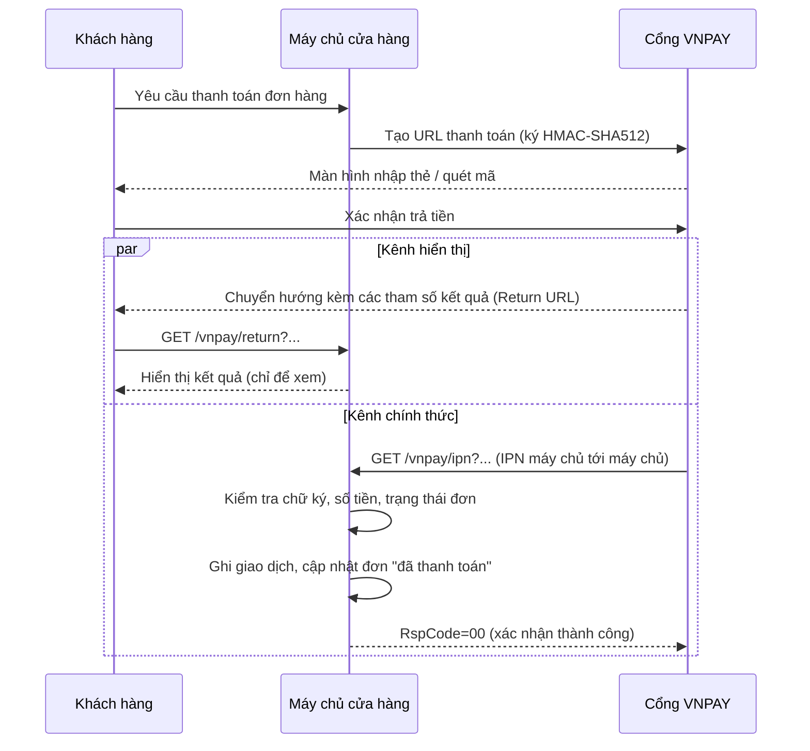
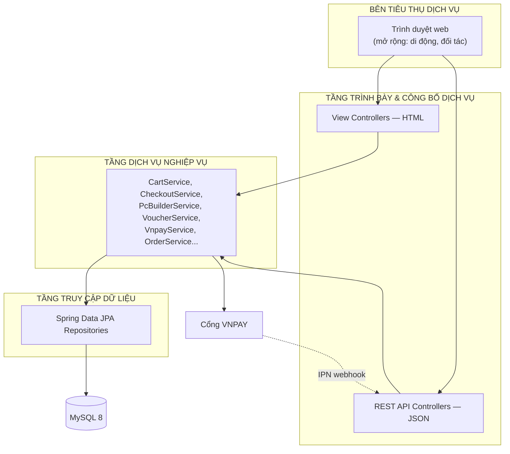
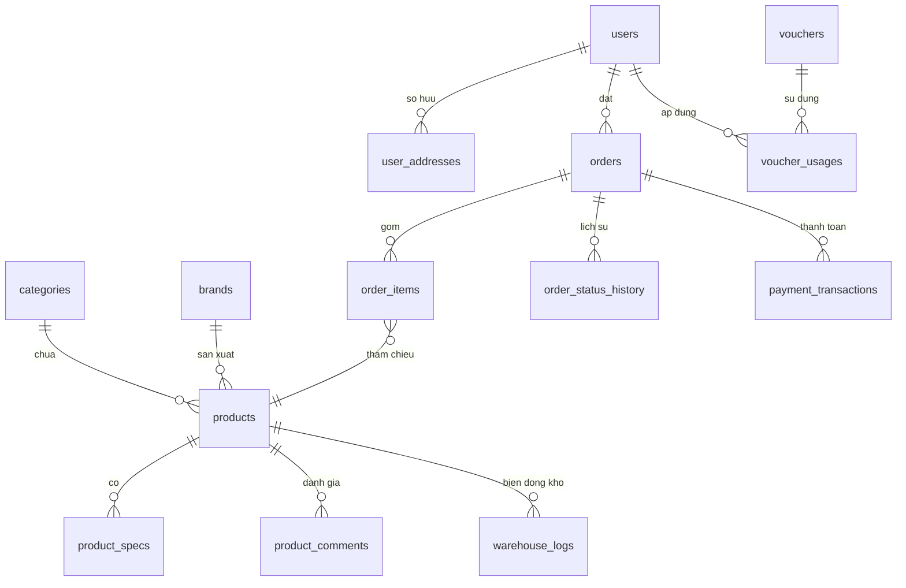
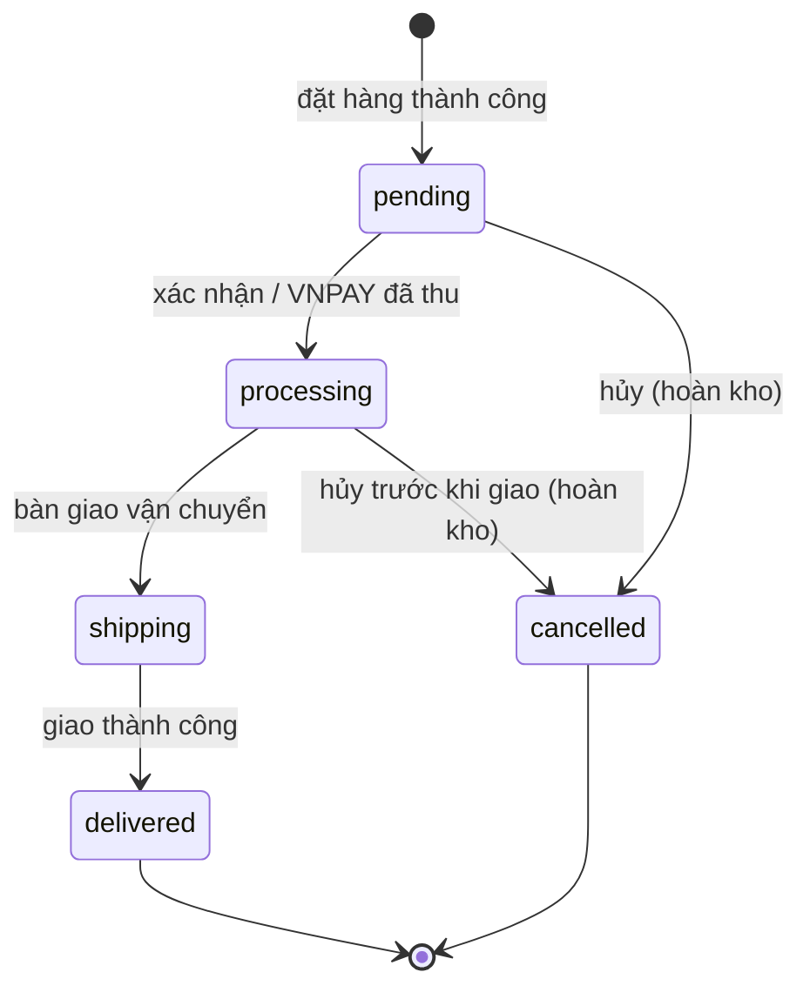
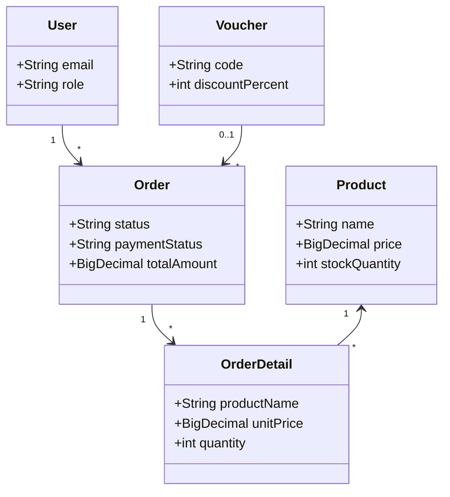
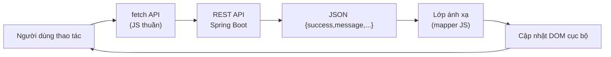

<div align="center">

**TRƯỜNG ĐẠI HỌC …**

**KHOA CÔNG NGHỆ THÔNG TIN**

**BỘ MÔN CÔNG NGHỆ PHẦN MỀM**

---

<br/>

# BÁO CÁO ĐỒ ÁN MÔN HỌC

## HỌC PHẦN: PHÁT TRIỂN PHẦN MỀM HƯỚNG DỊCH VỤ

<br/>

### ĐỀ TÀI

# XÂY DỰNG DỊCH VỤ API VÀ ỨNG DỤNG CLIENT CHO HỆ THỐNG BÁN HÀNG LINH KIỆN PC TRỰC TUYẾN

**(Bản báo cáo rút gọn)**

<br/>

| | |
|---|---|
| **Giảng viên hướng dẫn** | …………………………………… |
| **Nhóm sinh viên thực hiện** | Nhóm …… |
| **Thành viên 1** | …………………………… – MSSV: …………… |
| **Thành viên 2** | …………………………… – MSSV: …………… |
| **Thành viên 3** | …………………………… – MSSV: …………… |
| **Lớp / Khóa** | …………………………………… |
| **Ngành** | Công nghệ Thông tin |
| **Chuyên ngành** | Phát triển phần mềm hướng dịch vụ |
| **Kho mã nguồn** | `tunghoang2533/Ban_linh_kien_java` |
| **Nhánh nộp bài** | `arena/01a0f7f6-ban-linh-kien-java` |

<br/>

*…………, tháng 10 năm 2026*

</div>

---

<div style="page-break-after: always;"></div>

## LỜI CẢM ƠN

Nhóm chân thành cảm ơn giảng viên đã tận tình hướng dẫn, góp ý và định hướng trong suốt quá trình làm đồ án; cảm ơn khoa/trường đã tạo điều kiện học tập và thực hành; cảm ơn cộng đồng mã nguồn mở cung cấp tài liệu kỹ thuật quý giá. Dù đã nỗ lực, đồ án khó tránh thiếu sót, rất mong nhận được nhận xét của quý thầy cô để hoàn thiện hơn.

## LỜI CAM ĐOAN

Nhóm cam đoan đồ án là kết quả nghiên cứu và tự hiện thực của nhóm dưới sự hướng dẫn của giảng viên phụ trách; các số liệu, kết quả trình bày là trung thực, không sao chép. Các nội dung tham khảo từ tài liệu, website đều được trích dẫn nguồn đầy đủ ở phần Tài liệu tham khảo.

Nhóm xin chịu trách nhiệm về tính chính xác của các nội dung nêu trên.

## MỤC LỤC

*(Đề nghị chèn mục lục tự động của Word — References → Table of Contents — để số trang cập nhật theo tài liệu cuối cùng.)*

---

## DANH MỤC HÌNH VẼ VÀ SƠ ĐỒ

| Hình | Tên hình |
|---|---|
| Hình 2.1 | Sơ đồ Use Case tổng quan của hệ thống |
| Hình 2.2 | Sơ đồ tuần tự luồng đặt hàng với kiểm soát tồn kho |
| Hình 2.3 | Sơ đồ tuần tự thanh toán VNPAY với hai kênh phản hồi |
| Hình 2.4 | Sơ đồ kiến trúc phân tầng tổng thể của hệ thống |
| Hình 2.5 | Sơ đồ thực thể liên kết (ERD) rút gọn của các bảng lõi |
| Hình 2.6 | Sơ đồ máy trạng thái của đơn hàng |
| Hình 2.7 | Sơ đồ lớp rút gọn các thực thể nghiệp vụ chính |
| Hình 3.1 | Sơ đồ luồng tiêu thụ REST API phía client |
| Hình 3.2 | Ảnh chụp kết quả chạy bộ kiểm thử (vị trí chèn) |
| Hình 3.3 | Ảnh chụp nhật ký kiểm thử đồng thời (vị trí chèn) |

## DANH MỤC BẢNG BIỂU

| Bảng | Tên bảng | Chương trình bày |
|---|---|---|
| Bảng 0.1 | Danh sách mục tiêu nghiên cứu | Mở đầu |
| Bảng 1.1 | Các đặc trưng chính của dịch vụ và hệ quả đối với đồ án | 1 |
| Bảng 1.2 | Biện luận lựa chọn kiến trúc so với hai phương án thuần | 1 |
| Bảng 1.3 | Gợi ý thiết kế tài nguyên và phương thức của hệ thống | 1 |
| Bảng 1.4 | Kiểm soát chất lượng dịch vụ của hệ thống | 1 |
| Bảng 1.5 | So sánh tính năng các nền tảng bán lẻ linh kiện | 1 |
| Bảng 2.1 | Yêu cầu chức năng chính của hệ thống | 2 |
| Bảng 2.2 | Các yêu cầu phi chức năng chính | 2 |
| Bảng 2.3 | Các quy tắc nghiệp vụ chính | 2 |
| Bảng 2.4 | Danh sách tác nhân | 2 |
| Bảng 2.5 | Danh mục các ca sử dụng trọng yếu | 2 |
| Bảng 2.6 | Đặc tả UC01: Đăng ký tài khoản | 2 |
| Bảng 2.7 | Đặc tả UC02: Đăng nhập và phân quyền | 2 |
| Bảng 2.8 | Đặc tả UC03: Tìm kiếm và lọc sản phẩm nâng cao | 2 |
| Bảng 2.9 | Đặc tả UC04: Ráp cấu hình PC và kiểm tra tương thích | 2 |
| Bảng 2.10 | Đặc tả UC05: Quản lý giỏ hàng | 2 |
| Bảng 2.11 | Đặc tả UC06: Đặt hàng và áp dụng mã giảm giá | 2 |
| Bảng 2.12 | Đặc tả UC07: Thanh toán trực tuyến qua VNPAY | 2 |
| Bảng 2.13 | Đặc tả UC08: Quản lý đơn hàng (Quản trị viên) | 2 |
| Bảng 2.14 | Đặc tả UC09: Quản lý kho và nhật ký biến động | 2 |
| Bảng 2.15 | Đặc tả UC10: Đánh giá và bình luận sản phẩm | 2 |
| Bảng 2.16 | Trách nhiệm của từng tầng kiến trúc | 2 |
| Bảng 2.17 | Danh mục 17 bảng dữ liệu lõi | 2 |
| Bảng 2.18 | Từ điển dữ liệu rút gọn bảng `products` | 2 |
| Bảng 2.19 | Từ điển dữ liệu rút gọn bảng `orders` | 2 |
| Bảng 2.20 | Quy ước thiết kế API | 2 |
| Bảng 2.21 | Các loại phản hồi lỗi chuẩn | 2 |
| Bảng 2.22 | Màn hình client và API tương ứng | 2 |
| Bảng 3.1 | Môi trường phần cứng và hệ điều hành thử nghiệm | 3 |
| Bảng 3.2 | Công cụ và phiên bản phần mềm | 3 |
| Bảng 3.3 | Các tham số cấu hình chính trong `application.yml` | 3 |
| Bảng 3.4 | Trách nhiệm các gói mã nguồn chính | 3 |
| Bảng 3.5 | Quy mô mã nguồn đã đo | 3 |
| Bảng 3.6 | Tổng hợp hợp đồng dịch vụ (17 endpoint) | 3 |
| Bảng 3.7 | Mã phản hồi IPN của hệ thống trả về cho VNPAY | 3 |
| Bảng 3.8 | Các cơ chế bảo đảm toàn vẹn bổ trợ | 3 |
| Bảng 3.9 | Danh sách màn hình chính và điểm kỹ thuật minh chứng | 3 |
| Bảng 3.10 | Danh mục lớp kiểm thử tiêu biểu | 3 |
| Bảng 3.11 | Kết quả kiểm thử tích hợp theo lát cắt | 3 |
| Bảng 3.12 | Kết quả kiểm thử đồng thời | 3 |
| Bảng 3.13 | Trích ma trận kịch bản kiểm thử hệ thống | 3 |
| Bảng 3.14 | Tổng hợp mức độ đáp ứng yêu cầu | 3 |
| Bảng 3.15 | Các hạn chế chính và khuyến nghị | 3 |

## DANH MỤC THUẬT NGỮ VÀ TỪ VIẾT TẮT

| Thuật ngữ / Viết tắt | Tiếng Anh nguyên bản | Diễn giải trong báo cáo |
|---|---|---|
| SOA | Service-Oriented Architecture | Kiến trúc hướng dịch vụ: tổ chức hệ thống thành dịch vụ tự chứa, ghép nối lỏng |
| API | Application Programming Interface | Giao diện lập trình cho phép hai phần mềm tương tác theo quy ước |
| REST | Representational State Transfer | Phong cách kiến trúc API web lấy tài nguyên làm gốc, không trạng thái |
| Endpoint | Endpoint | Điểm cuối dịch vụ: URI + phương thức HTTP mà client có thể gọi |
| DTO | Data Transfer Object | Đối tượng trung chuyển dữ liệu qua ranh giới dịch vụ, cô lập mô hình nội bộ |
| IPN | Instant Payment Notification | Thông báo thanh toán tức thời (máy chủ → máy chủ) của VNPAY |
| Giao dịch (transaction) | Transaction | Nhóm thao tác CSDL được thực hiện nguyên tử: hết hoặc không |
| Khóa bi quan | Pessimistic lock | Cơ chế khóa bản ghi CSDL (`SELECT ... FOR UPDATE`) chặn tranh chấp |
| RBAC | Role-Based Access Control | Phân quyền theo vai trò (khách hàng, quản trị) |

# MỞ ĐẦU

## 1. Lý do chọn đề tài

Thương mại điện tử linh kiện máy tính là thị trường cạnh tranh (Phong Vũ, MemoryZone, HACOM…) và đặt ra các yêu cầu kỹ thuật điển hình: hàng nghìn sản phẩm, số liệu tồn kho thay đổi liên tục do nhiều khách thao tác đồng thời — dễ rơi vào lỗi "bán vượt tồn" nếu xử lý tối thiểu. Đây là bối cảnh lý tưởng để vận dụng kiến thức của kiến trúc hướng dịch vụ: xây dựng một dịch vụ API chuẩn phục vụ nhiều kênh (web, mobile sau này), tách rõ phần cung cấp và phần tiêu thụ dịch vụ.

Ngoài ra, cửa hàng linh kiện PC có một nghiệp vụ đặc thù chưa được các nền tảng thương mại hiện tại xử lý triệt để: **ràng buộc tương thích phần cứng** (socket CPU/Mainboard, công suất nguồn) và **tích hợp cổng thanh toán trực tuyến với yêu cầu an toàn cao** (chữ ký, callback máy chủ). Đề tài cho phép vận dụng đồng bộ kiến thức về web back-end, cơ sở dữ liệu, lập trình đồng thời, tích hợp thanh toán — đưa sản phẩm gần với thực tế hơn các bài tập SPRING CRUD phổ biến.

### 1.1. Đặt vấn đề và thực trạng

Thương mại điện tử Việt Nam tăng trưởng hai chữ số liên tục, trong đó linh kiện máy tính thuộc nhóm có giá trị giao dịch lớn. Đặc thù của mặt hàng này là các linh kiện trong một bộ máy phải **tương thích** với nhau (chuẩn chân cắm giữa vi xử lý và bo mạch chủ, công suất nguồn, thế hệ RAM…), khiến người dùng phổ thông dễ chọn sai cấu hình và phải đổi trả hàng.

Về kỹ thuật, phần lớn phần mềm bán hàng quy mô vừa được xây dựng theo kiểu kiến trúc nguyên khối: giao diện, xử lý nghiệp vụ và truy cập dữ liệu dính chặt vào nhau, rà soát các nền tảng bán lẻ trong nước (mục 1.4) cho thấy ba hạn chế phổ biến là **thiếu tư vấn kỹ thuật tự động** (chỉ lọc theo giá và hãng), **logic nghiệp vụ không tái sử dụng được** giữa các kênh tiêu thụ, và **chưa chú trọng tính toàn vẹn dữ liệu** (dễ bán vượt tồn kho khi nhiều khách đặt đồng thời).

### 1.2. Ý nghĩa và định hướng giải pháp

Từ thực trạng đó, nhóm chọn đề tài **"Xây dựng dịch vụ API và ứng dụng client cho hệ thống bán hàng linh kiện PC trực tuyến"** với ba trụ cột: *(1)* tách bạch nhà cung cấp và bên tiêu thụ dịch vụ — một backend công bố REST API, một client web tiêu thụ qua hợp đồng JSON; *(2)* đưa tri thức phần cứng vào dịch vụ bằng công cụ ráp cấu hình bảy khe có kiểm tra tương thích hai chiều và gợi ý cấu hình theo ngân sách; *(3)* bảo đảm toàn vẹn giao dịch bằng giao dịch cơ sở dữ liệu có khóa bản ghi và quy trình thanh toán có kiểm tra chữ ký, đối chiếu số tiền, chống ghi nhận trùng.

## 2. Mục tiêu nghiên cứu

### 2.1. Mục tiêu tổng quát

Vận dụng nguyên lý kiến trúc hướng dịch vụ và chuẩn RESTful API để phân tích, thiết kế, hiện thực và kiểm chứng một hệ thống bán hàng linh kiện PC trực tuyến gồm một dịch vụ backend công bố API và một ứng dụng client web tiêu thụ API đó.

### 2.2. Mục tiêu cụ thể

**Bảng 0.1 – Danh sách mục tiêu nghiên cứu**


| Mã | Mục tiêu cụ thể | Tiêu chí hoàn thành |
|---|---|---|
| MT01 | Hệ thống hóa cơ sở lý thuyết về kiến trúc hướng dịch vụ, REST và các công nghệ nền tảng | Trình bày tại Chương 1 |
| MT02 | Phân tích yêu cầu và mô hình hóa nghiệp vụ bằng UML | Có bảng tác nhân, danh mục và đặc tả ca sử dụng |
| MT03 | Thiết kế kiến trúc phân tầng tách bạch giao diện – API – nghiệp vụ – dữ liệu | Có sơ đồ kiến trúc và bảng trách nhiệm từng tầng |
| MT04 | Thiết kế cơ sở dữ liệu quan hệ chuẩn hóa | Có danh mục bảng và từ điển dữ liệu các bảng chính |
| MT05 | Thiết kế và hiện thực hợp đồng dịch vụ REST API cho 6 nhóm tài nguyên | Đầy đủ đường dẫn, phương thức, tham số, phản hồi, mã trạng thái |
| MT06 | Hiện thực ứng dụng client web tiêu thụ API, có xử lý trạng thái tải – thành công – lỗi | Các màn hình chính chạy đầu cuối |
| MT07 | Giải quyết bài toán tranh chấp tồn kho khi đặt hàng đồng thời | Kiểm thử đa luồng chứng minh không bán vượt tồn kho |
| MT08 | Tích hợp an toàn cổng thanh toán VNPAY | Xác thực chữ ký, đối chiếu số tiền, chống ghi nhận trùng |
| MT09 | Xây dựng bộ kiểm thử tự động phân tầng | Tối thiểu 50 ca kiểm thử, gồm đơn vị, tích hợp và đồng thời |
| MT10 | Đánh giá khách quan mức độ đáp ứng yêu cầu và hạn chế | Có bảng đối chiếu yêu cầu – mức độ thực hiện |

## 3. Đối tượng và phạm vi nghiên cứu

**Đối tượng**: kiến trúc và quy trình xây dựng dịch vụ API phục vụ thương mại điện tử linh kiện, các vấn đề kèm theo (toàn vẹn dữ liệu đồng thời, tích hợp thanh toán an toàn, ràng buộc tương thích phần cứng).

**Phạm vi** (gom theo bốn khung): *chức năng* — bán lẻ trực tuyến linh kiện PC lõi (danh mục, Build PC, giỏ, đơn, thanh toán VNPAY/COD) cùng phần quản trị vận hành; *công nghệ* — Spring Boot + Thymeleaf + MySQL 8, triển khai trên một máy chủ; *kiểm thử* — nghiệp vụ và an toàn mức ứng dụng, chưa gồm kiểm thử tải lớn; *ngoài phạm vi* — phí vận chuyển thật của hãng, ứng dụng di động native, hóa đơn điện tử, tối ưu SEO chuyên sâu.

## 4. Phương pháp nghiên cứu

Đồ án áp dụng kết hợp: **nghiên cứu tài liệu** (chuẩn REST của Fielding, đặc tả VNPAY, tài liệu OpenAPI/Spring); **khảo sát so sánh** ba nền tảng tiêu biểu để rút ra yêu cầu; **phân tích – thiết kế hướng đối tượng** với UML; **phát triển tăng dần theo lát cắt chức năng** (mỗi lát cắt xuyên từ API đến CSDL, có kiểm thử riêng); **kiểm thử thực nghiệm** (tự động hóa + thủ công có kịch bản + đo hiệu năng quan sát được).

## 5. Cấu trúc đồ án

Ngoài các phần định dạng của báo cáo, nội dung chính gồm ba chương: **Chương 1** giới thiệu tổng quan đề tài và cơ sở công nghệ; **Chương 2** phân tích yêu cầu và thiết kế hệ thống; **Chương 3** trình bày kết quả cài đặt, kiểm thử và đánh giá.

---

<div style="page-break-after: always;"></div>
# CHƯƠNG 1. GIỚI THIỆU TỔNG QUAN VỀ ĐỀ TÀI

## 1.1. Đặt vấn đề và tính cấp thiết của đề tài

Nhu cầu sở hữu máy tính hiệu năng cao tại Việt Nam tăng đều nhờ học tập – làm việc trực tuyến, game điện tử và sáng tạo nội dung số; hình thức tự chọn linh kiện rồi lắp ráp được ưa chuộng vì tối ưu chi phí – hiệu năng. Tuy nhiên, khảo sát các diễn đàn công nghệ cho thấy bốn nhóm lỗi cấu hình phổ biến: **sai chuẩn chân cắm** giữa vi xử lý và bo mạch chủ, **thiếu công suất nguồn**, **sai thế hệ RAM**, và **mất cân đối hiệu năng** giữa các linh kiện — tất cả đều khiến người mua phải đổi trả hàng.

Về phía phần mềm, đa số hệ thống bán hàng quy mô vừa vẫn xây dựng theo mô hình nguyên khối: một bộ điều khiển vừa nhận biểu mẫu, vừa chứa logic nghiệp vụ, vừa truy vấn dữ liệu và kết xuất HTML. Hệ quả là logic không tái sử dụng được cho kênh khác ngoài trình duyệt, mọi thay đổi nhỏ đều buộc triển khai lại toàn bộ, và quy tắc nghiệp vụ rải rác khó kiểm soát.

Kiến trúc hướng dịch vụ khắc phục bằng một ranh giới rõ ràng: mọi quy tắc nghiệp vụ tập trung tại tầng dịch vụ và công bố qua API có hợp đồng. Ví dụ trong đề tài, quy tắc "giá bán do máy chủ tính", "không bán vượt tồn kho", "một mã giảm giá chỉ dùng một lần" được đóng gói tại các lớp dịch vụ tương ứng — bảo đảm thống nhất cho mọi kênh và kiểm thử được tự động.

## 1.2. Tổng quan về Kiến trúc hướng dịch vụ

### 1.2.1. Khái niệm và các đặc trưng của kiến trúc hướng dịch vụ

Kiến trúc hướng dịch vụ (Service-Oriented Architecture – SOA) tổ chức hệ thống thành các **dịch vụ tự chứa**: mỗi dịch vụ thực hiện một đơn vị chức năng có ý nghĩa thương mại, tiếp xúc bên ngoài qua giao diện được định nghĩa rõ (hợp đồng) và được gọi qua mạng bằng giao thức chuẩn, bất kể công nghệ bên trong. Phía cung cấp và phía tiêu thụ chỉ cần tuân thủ hợp đồng — đặc trưng quan trọng gọi là **ghép nối lỏng** (loose coupling), giúp hệ thống dễ bảo trì, tích hợp, mở rộng và tái sử dụng dịch vụ cho nhiều kênh khác nhau (web, ứng dụng di động, đối tác).

**Bảng 1.1 – Các đặc trưng chính của dịch vụ và hệ quả đối với đồ án**

| Đặc trưng | Nội dung | Hệ quả lựa chọn |
|---|---|---|
| Hợp đồng dịch vụ rõ ràng | Chỉ lộ qua giao diện đã định nghĩa, không lộ cài đặt | Đặc tả 17 endpoint đầy đủ, dùng DTO cô lập mô hình nội bộ |
| Ghép nối lỏng | Phụ thuộc vào mô hình dữ liệu trao đổi, không vào bên trong | Bản tin JSON và DTO đóng vai trò "liên kết nhớ" (black box) |
| Trừu tượng hóa | Che giấu công nghệ thực thi | Client và đối tích trả dữ liệu không quan tâm mã nguồn server |
| Tái sử dụng | Dịch vụ có thể dùng ở nhiều kênh | Local client web hôm nay — client mobile/đối tác tương lai |
| Tính mở | Không buộc công nghệ phía gọi chung nền tảng | Hợp đồng JSON/HTTP chế trung lập nền tảng |

Ở phạm vi cơ khóa học, báo cáo tập trung nắm rõ tư tưởng kiến trúc và vận dụng vừa mức — toàn phổ SOA ở tổ chức (điều phối, nhắn tin, thi hành bất đồng bộ…) đề cập thêm thay vì áp dụng nguyên mẫu.

### 1.2.2. Quy mô triển khai và lựa chọn kiến trúc của đồ án

Ở quy mô doanh nghiệp, SOA thường gắn với **tuyến dịch vụ doanh nghiệp** (ESB) — trung tâm mang điện hỗ trợ định tuyến, bảo mật, giám sát nhiều dịch vụ ứng dụng. Phạm vi đó phù hợp dự án dài hạn, phức tạp; với một cửa hàng vừa và các ưu tiên của học phần (thiết kế tài nguyên và hợp đồng rõ ràng, trọng tận dụng thứ có thể hiện thực ngay), đề tài chọn **nguyên khối định hướng dịch vụ (SOA-oriented monolith)**: một ứng dụng duy nhất triển khai, nhưng trong đó phía cung cấp API, phía tiêu thụ web client và ranh giới đúng chuẩn dịch vụ.

**Bảng 1.2 – Biện luận lựa chọn kiến trúc so với hai phương án thuần**

| Yếu tố | SOA truyền thống (ESB) | Microservices | Đồ án chọn |
|---|---|---|---|
| Tính phù hợp phạm vi | Quá nặng, chi phí vận hành cao | Vi mô dịch vụ → phức tạp tìm kiếm | Nguyên khối định hướng dịch vụ: giữ lõi đơn chặt, dễ trình bày |
| Độc lập triển khai | Cao | Cao, nhưng vụn đại | Toàn bộ cùng triển khai: đơn giản bảo trì |
| Hợp đồng dịch vụ | Phức tạp, XML/SOAP | REST/JSON | REST/JSON chuẩn |
| Mức thành thục đòi hỏi | Cao, nhiều công cụ | Rất cao | Vừa đủ minh họa tư tưởng dịch vụ |

### 1.2.3. Giới thiệu API web và phong cách REST

**API (Application Programming Interface)** là giao diện lập trình cho phép hai phần mềm tương tác theo quy ước; **API web** chuyển giao diện này qua mạng bằng HTTP. **REST (Representational State Transfer)** — do Roy Fielding đề xuất — lấy tài nguyên làm gốc, mỗi tài nguyên có URI riêng; thao tác rồi được biểu thị qua các phương thức HTTP; toàn bộ giao tiếp **không trạng thái** (mỗi yêu cầu mang đủ thông tin), trạng thái đại diện chuyển tiếp qua các loại dữ liệu chuẩn (JSON, XML…).

Phong cách REST áp dụng trong đồ án gồm các ràng buộc then chốt:

1. **Mô hình khách–chủ**: tách phần giao diện (client) khỏi phần dữ liệu (server), độc lập phát triển.
2. **Không trạng thái**: máy chủ không nhớ yêu cầu trước — dễ cân bằng tải, giải chất lượng dịch vụ.
3. **Có thể đệm (cacheable)**: phản hồi định danh khả năng đệm để tối ưu.
4. **Giao diện thống nhất**: URI tài nguyên, phương thức HTTP, định dạng dữ liệu đồng nhất, tự mô tả.
5. **Hệ thống nhiều lớp**: tầng kết hợp, nghiệp vụ, dữ liệu độc lập lẫn nhau — phân tách công việc và kiểm soát an ninh.

### 1.2.4. Gợi ý triển khai REST cho ngành bán linh kiện

**Bảng 1.3 – Gợi ý thiết kế tài nguyên và phương thức của hệ thống**

| Tài nguyên | URI | Mô tả nghiệp vụ |
|---|---|---|
| Sản phẩm | `GET /api/products?category=...&brand=...&page=...` | Liệt kê kèm tiêu chí lọc, phân trang |
| Sản phẩm nhanh | `GET /api/products/{id}/quick-view` | Xem nhanh qua AJAX |
| Giỏ hàng | `POST /api/cart/add` | Thêm hoặc gộp bút tắt vào giỏ |
| Phiếu giảm giá | `POST /api/voucher/apply` | Áp dụng mã giảm |
| Đơn hàng | `POST /api/orders` | Tạo đơn (đặt hàng nguyên tử) |

Mọi endpoint trả định dạng JSON, hỗ trợ phân trang `page-size`, dùng đúng mã HTTP (200 OK, 400, 401, 404, 500) để client tự xử lý; hợp đồng lỗi chuẩn hóa theo dạng `{"success": false, "message": ...}`.

### 1.2.5. Đảm bảo chất lượng API web

**Bảng 1.4 – Kiểm soát chất lượng dịch vụ của hệ thống**

| Mục tiêu | Kỹ thuật |
|---|---|
| Bảo mật | Xác thực phiên máy chủ + phân quyền; kiểm tra chữ ký callback VNPAY; mã hóa bcrypt |
| Đúng đắn nghiệp vụ | Kiểm tra toàn vẹn tồn kho + giao dịch nguyên tử; bất biến IPN |
| Hiệu năng | Phân trang, đệm, giới hạn 200 ms (NFR-05) |
| Thân thiện | Bản tin lỗi tiếng Việt, rõ nguyên nhân |
## 1.3. Tổng quan về công nghệ sử dụng trong ứng dụng

- **Nền tảng máy chủ – Spring Boot 3**: tự cấu hình, máy chủ nhúng, tiêm phụ thuộc — giảm boilerplate và thời gian khởi động phát triển.
- **Ánh xạ đối tượng – Spring Data JPA / Hibernate**: khai báo thực thể ánh xạ bảng, truy vấn suy đẫn kèm khóa bản ghi phục vụ tồn kho.
- **Bảo mật – Spring Security 6**: xác thực form + phiên, phân quyền (RBAC), tự chống CSRF/XSS trong khung.
- **Giao diện – Thymeleaf + HTML/CSS/Bootstrap 5 + JavaScript thuần/Fetch API**: kết xuất máy chủ kết hợp gọi API phía khách.
- **Cơ sở dữ liệu – MySQL 8 (InnoDB)**: ACID, khóa bản ghi `SELECT ... FOR UPDATE` cho bài toán tồn kho.
- **Thanh toán – cổng trung gian VNPAY**: chuẩn HMAC-SHA512, URL Return + IPN; có môi trường sandbox để kiểm thử.
- **Bộ công cụ – JDK 21 + Maven**: biên dịch lặp lại, quản lý phụ thuộc, đóng gói triển khai.

## 1.4. Khảo sát các hệ thống tương tự và phân tích bài toán

Nhóm khảo sát ba nền tảng tiêu biểu trong nước: **Phong Vũ** danh mục rộng nhưng công cụ cấu hình sơ khai (chủ yếu gợi ý bộ máy dựng sẵn); **MemoryZone** có công cụ chọn linh kiện khá hoàn chỉnh nhưng kiểm tra tương thích chỉ dừng ở cảnh báo, vẫn tạo được cấu hình không hợp lệ; **HACOM** có Build PC theo khe song giao diện dày đặc, khó dùng với người phổ thông.

**Bảng 1.5 – So sánh tính năng các nền tảng bán lẻ linh kiện**

| Tiêu chí | Phong Vũ | MemoryZone | HACOM | Hệ thống đề tài |
|---|---|---|---|---|
| Công cụ ráp cấu hình PC | Thấp | Cao | Trung bình | Cao |
| Kiểm tra tương thích ràng buộc | Không | Cảnh báo | Không | **Có, bắt buộc hai chiều** |
| Gợi ý cấu hình theo ngân sách | Bộ dựng sẵn | Không | Không | Có (bộ luật + gợi ý thông minh) |
| Phí vận chuyển theo địa chỉ | Có | Có | Có | Có (theo vùng) |
| API công khai cho bên thứ ba | Không | Không | Không | Có (sẵn sàng mở rộng) |

Ba nền tảng đều có **khoảng trống về hỗ trợ ra quyết định kỹ thuật** và không công bố API. Đề tài chọn bốn trọng tâm cải tiến: ràng buộc tương thích socket hai chiều ở mức bắt buộc; gợi ý cấu hình theo ngân sách; hợp đồng REST API hoàn chỉnh sẵn sàng cho kênh mới; cơ chế toàn vẹn tồn kho dưới tải đồng thời.

## 1.5. Kết luận chương 1

Chương 1 đã trình bày bối cảnh, động lực và lý do chọn đề tài; cơ sở lý thuyết về kiến trúc hướng dịch vụ và API web (quy mô phù hợp, phong cách REST, thiết kế tài nguyên, đảm bảo chất lượng dịch vụ); sơ lược công nghệ; khảo sát các hệ thống tương tự để cô lập hai mảng chức năng mà thị trường còn hở — hợp đồng dịch vụ minh bạch tiêu thụ được và công cụ ráp cấu hình ràng buộc thật. Những nền tảng này là căn cứ chuyển sang phân tích – thiết kế ở Chương 2.

# CHƯƠNG 2. PHÂN TÍCH VÀ THIẾT KẾ HỆ THỐNG

## 2.1. Phân tích yêu cầu hệ thống

### 2.1.1. Yêu cầu chức năng

Hệ thống có 41 yêu cầu chức năng theo ba nhóm tác nhân; bảng dưới gom các yêu cầu chính:

**Bảng 2.1 – Yêu cầu chức năng chính của hệ thống**

| Mã | Tác nhân | Yêu cầu | Mô tả ngắn |
|---|---|---|---|
| FR-G01 | Khách | Duyệt, tìm, lọc sản phẩm | Trang chủ, danh mục; phân trang, lọc danh mục – thương hiệu – từ khóa |
| FR-G02 | Khách | Xem chi tiết sản phẩm | Giá sau khuyến mại, thông số kỹ thuật, đánh giá |
| FR-G03 | Khách | Đăng ký tài khoản | Kiểm tra trùng, băm mật khẩu |
| FR-G04 | Khách | Ráp cấu hình PC | 7 khe, kiểm tra tương thích hai chiều |
| FR-G05 | Khách | Gợi ý cấu hình theo ngân sách | Bộ luật theo tầm giá + diễn giải thông minh |
| FR-G06 | Khách | Quản lý giỏ phiên | Thêm, đổi số lượng, xóa; giá do máy chủ tính |
| FR-C01 | Khách hàng | Đăng nhập, hồ sơ, sổ địa chiỉ | Xác thực, phân quyền; nhiều địa chiỉ giao hàng |
| FR-C02 | Khách hàng | Áp mã giảm giá | Xác thực 7 điều kiện của mã |
| FR-C03 | Khách hàng | Đặt hàng | Phí ship theo địa chỉ, COD/VNPAY, chống bán vượt tồn |
| FR-C04 | Khách hàng | Theo dõi, tra cứu đơn | Tra cứu nhanh không đăng nhập bằng mã truy cập |
| FR-C05 | Khách hàng | Đánh giá sản phẩm | Chỉ khi đã mua sản phẩm |
| FR-A01 | Quản trị | Bảng điều khiển, báo cáo | Doanh thu, đơn chờ, sắp hết hàng; bán chạy |
| FR-A02 | Quản trị | Quản lý sản phẩm | Danh mục, sản phẩm, thông số kỹ thuật, ẩn/hiện |
| FR-A03 | Quản trị | Xử lý đơn, quản lý kho | Duyệt/đổi trạng thái/hủy kèm hoàn kho; nhập/xuất, nhật ký |
| FR-A04 | Quản trị | Voucher, banner, người dùng | Khuyến mại, phân quyền, khóa tài khoản |

### 2.1.2. Yêu cầu phi chức năng

**Bảng 2.2 – Yêu cầu phi chức năng trọng yếu**

| Mã | Yêu cầu | Giải pháp áp dụng |
|---|---|---|
| NFR-01 | Tính đúng đắn tuyệt đối của tồn kho dưới đồng thời | Giao dịch bao trọn + khóa bản ghi (BR-03), kiểm chứng bằng ca đa luồng |
| NFR-02 | Bảo mật tài khoản | Mật khẩu băm bcrypt; chống CSRF/XSS/SQLi bởi khung và tham số hóa truy vấn |
| NFR-03 | Bảo mật thanh toán | Chữ ký HMAC cả hai chiều, đối chiếu số tiền, bất biến IPN; mã tra cứu không đoán được |
| NFR-04 | Một trang web, hai kênh tiêu thụ | Mọi cập nhật động qua JSON API chuẩn hóa, không phụ thuộc phiên trình duyệt |
| NFR-05 | Hiệu năng phản hồi | Endpoint thông dụng dưới 200 ms ở dữ liệu mẫu; phân trang bắt buộc |
| NFR-06 | Dễ bảo trì | Phân tầng nghiêm, tiêm phụ thuộc toàn bộ, cấu trúc theo miền chức năng |
| NFR-07 | Khả năng kiểm thử | Bộ kiểm thử tự động chạy bằng một lệnh; dữ liệu mẫu tự nạp |
| NFR-08 | Tính thẩm mỹ, thân thiện | Giao diện tiếng Việt, đáp ứng màn hình phổ biến (Bootstrap) |

### 2.1.3. Quy tắc nghiệp vụ trọng yếu

**Bảng 2.3 – Quy tắc nghiệp vụ (rút gọn các BR cốt lõi)**

| Mã | Quy tắc nghiệp vụ |
|---|---|
| BR-01/02 | Sản phẩm phải thuộc danh mục và thương hiệu hợp lệ; thông dụng của linh kiện (socket, công suất) lưu ở thuộc tính mở rộng |
| BR-03 | Không được phép bán vượt tồn kho trong mọi tình huống, kể cả đồng thời (*quy tắc cốt lõi*) |
| BR-05 | Khuyến mại theo sản phẩm chỉ có hiệu lực trong khoảng thời gian ấn định |
| BR-08 | Giá hiển thị, giá tính tiền luôn do máy chủ quyết định; giá trong chi tiết đơn đông băng lúc mua |
| BR-09 | Mỗi tài khoản dùng một mã giảm tối đa một lần (khóa duy nhất ở CSDL) |
| BR-10 | Mã giảm chỉ áp khi đủ hạn, đủ lượt, đạt giá trị đơn tối thiểu; phần giảm có chặn trên |
| BR-15 | Địa chiỉ giao hàng bắt buộc đủ ba cấp (tỉnh – huyện – xã) và lưu bản chụp vào đơn |
| BR-19/20 | Trạng thái đơn di chuyển một chiều theo máy trạng thái (Hình 2.6); hủy buộc hoàn kho nguyên tử |
| BR-27/28 | Chỉ khách đã mua mới được đánh giá; quản trị có thể ẩn đánh giá vi phạm |
| BR-32 | Mọi biến động tồn kho và chuyển trạng thái đơn đều phải để lại nhật ký kèm tác nhân |

## 2.2. Phân tích chức năng hệ thống

### 2.2.1. Tác nhân và phân hệ chức năng

**Bảng 2.4 – Tác nhân hệ thống**

| Tác nhân | Vai trò |
|---|---|
| Khách vãng lai | Duyệt, tìm kiếm linh kiện; ráp thử cấu hình; giỏ phiên; đăng ký |
| Khách hàng | Toàn quyền của khách + đặt hàng, mã giảm, thanh toán, sổ địa chiỉ, lịch sử đơn, đánh giá |
| Quản trị viên | Bảng điều khiển, quản trị sản phẩm/đơn/kho/voucher/người dùng, báo cáo |
| Hệ thống VNPAY | Tác nhân ngoài: quay lại kết quả (Return) và xác nhận máy chủ (IPN) |

Chức năng chia năm phân hệ: **danh mục và sản phẩm** (duyệt, tìm, lọc, xem nhanh); **ráp cấu hình** (Build PC 7 khe, chặn tương thích, gợi ý ngân sách); **bán hàng** (giỏ, voucher, đặt hàng, thanh toán); **tài khoản** (đăng ký/đăng nhập, sổ địa chiỉ, tra cứu); **quản trị** (toàn bộ vận hành).

### 2.2.2. Danh mục ca sử dụng

Mười ca sử dụng trọng yếu nhất được chọn để phát triển thành đặc tả chi tiết (tiêu chí: tác động rủi ro tính toàn vẹn/bảo mật hoặc chứa logic phức tạp):

**Bảng 2.5 – Danh mục ca sử dụng**

| Mã | Tên ca sử dụng | Tác nhân chính |
|---|---|---|
| UC01 | Đăng ký | Khách |
| UC02 | Đăng nhập | Khách / Khách hàng |
| UC03 | Tìm và lọc sản phẩm | Khách |
| UC04 | Ráp cấu hình PC | Khách |
| UC05 | Cập nhật giỏ hàng | Khách |
| UC06 | Đặt hàng | Khách hàng |
| UC07 | Thanh toán VNPAY | Khách hàng + VNPAY |
| UC08 | Xử lý đơn hàng | Quản trị |
| UC09 | Quản lý kho | Quản trị |
| UC10 | Đánh giá sản phẩm | Khách hàng |

### 2.2.3. Đặc tả chi tiết các ca sử dụng

Mười ca sử dụng trọng yếu được đặc tả theo mẫu rút gọn (tên bảng tương ứng mã UC01 – UC10): mục tiêu, tác nhân – tiên quyết, luồng chính, ngoại lệ và kết quả.

**Bảng 2.6 – Đặc tả UC01: Đăng ký tài khoản**

| Thành phần | Nội dung |
|---|---|
| Mục tiêu | Tạo tài khoản khách hàng mới để đặt hàng |
| Tác nhân – tiên quyết | Khách vãng lai; chưa có tài khoản hoặc muốn tạo mới |
| Luồng chính | 1. Chọn "Đăng ký", nhập họ tên, tên đăng nhập, email, mật khẩu hai lần. 2. Hệ thống kiểm tra hợp lệ/trùng lặp. 3. Băm mật khẩu, lưu vai trò khách hàng, báo thành công |
| Ngoại lệ | Trùng tên/email, mật khẩu không khớp: báo lỗi tại trường tương ứng |
| Kết quả | Người dùng mới với mật khẩu đã băm trong `users` |

**Bảng 2.7 – Đặc tả UC02: Đăng nhập và phân quyền**

| Thành phần | Nội dung |
|---|---|
| Mục tiêu | Xác thực người dùng, thiết lập phiên theo vai trò |
| Tác nhân – tiên quyết | Khách hàng, quản trị viên; tài khoản tồn tại, không bị khóa |
| Luồng chính | 1. Nhập tên đăng nhập, mật khẩu. 2. Tải tài khoản, đối chiếu băm. 3. Thành công: tạo phiên, nạp vai trò, chuyển hướng theo vai trò |
| Ngoại lệ | Sai tài khoản/mật khẩu hoặc bị khóa: thông báo chung (không lộ nguyên nhân) |
| Kết quả | Phiên hợp lệ với quyền theo vai trò |

**Bảng 2.8 – Đặc tả UC03: Tìm kiếm và lọc sản phẩm nâng cao**

| Thành phần | Nội dung |
|---|---|
| Mục tiêu | Tìm đúng linh kiện trong danh mục lớn |
| Tác nhân – tiên quyết | Khách, khách hàng; không |
| Luồng chính | 1. Nhập từ khóa và/hoặc chọn danh mục, thương hiệu, sắp xếp. 2. Truy vấn phân trang, hiển thị giá sau khuyến mại và tồn. 3. Chọn sản phẩm xem chi tiết |
| Ngoại lệ | Không có kết quả: gợi ứ sản phẩm nổi bật |
| Kết quả | Danh sách khớp tiêu chí, có phân trang |

**Bảng 2.9 – Đặc tả UC04: Ráp cấu hình PC và kiểm tra tương thích**

| Thành phần | Nội dung |
|---|---|
| Mục tiêu | Dựng cấu hình 7 khe hợp lệ, tránh lỗi tương thích |
| Tác nhân – tiên quyết | Khách, khách hàng; không |
| Luồng chính | 1. Mở Build PC, chọn CPU — hệ thống chuẩn hóa socket. 2. Các khe còn lại: API chỉ trả linh kiện tương thích. 3. Hiển thị tổng giá, công suất nguồn. 4. Đủ 7 khe: chuyển vào giỏ |
| Ngoại lệ | Đổi CPU khác socket: vô hiệu lựa chọn lệch; thêm hàng loạt: hết hàng bị bỏ qua và báo rõ, phần còn lại vẫn thêm |
| Kết quả | Cấu hình hợp lệ; không thể tạo cấu hình sai socket |

**Bảng 2.10 – Đặc tả UC05: Quản lý giỏ hàng**

| Thành phần | Nội dung |
|---|---|
| Mục tiêu | Quản lý mục hàng trước khi đặt mua |
| Tác nhân – tiên quyết | Khách, khách hàng; giỏ lưu theo phiên |
| Luồng chính | 1. Thêm/đổi số lượng/xóa qua `/api/cart/*`: hệ thống kiểm tra tồn, tính lại giá máy chủ, cập nhật huy hiệu và tổng tiền tức thời |
| Ngoại lệ | Vượt tồn: từ chối, trả số lượng hiện có; số lượng < 1: lỗi đầu vào |
| Kết quả | Giỏ phiên luôn khớp tồn kho và giá máy chủ |

**Bảng 2.11 – Đặc tả UC06: Đặt hàng và áp dụng mã giảm giá**

| Thành phần | Nội dung |
|---|---|
| Mục tiêu | Tạo đơn từ giỏ với đầy đủ phí và giảm giá |
| Tác nhân – tiên quyết | Khách hàng; đã đăng nhập, giỏ không rỗng |
| Luồng chính | 1. Chọn địa chiỉ, tính phí vùng; (tùy chọn) áp mã — kiểm tra 7 điều kiện. 2. Xác nhận: trong một giao dịch — khóa + kiểm tra tồn từng sản phẩm, tính lại tiền máy chủ, trừ kho, tạo đơn và chi tiết, ghi nhật ký, xóa giỏ |
| Ngoại lệ | Hết hàng giữa chừng: hủy toàn bộ, giỏ giữ nguyên; mã không hợp lệ: báo lý do cụ thể |
| Kết quả | Đơn "chờ xử lý"; tồn giảm đúng số lượng |

**Bảng 2.12 – Đặc tả UC07: Thanh toán trực tuyến qua VNPAY**

| Thành phần | Nội dung |
|---|---|
| Mục tiêu | Thanh toán đơn qua cổng VNPAY an toàn |
| Tác nhân – tiên quyết | Khách hàng, VNPAY; đơn đã tạo, chọn thanh toán trực tuyến |
| Luồng chính | 1. Tạo URL thanh toán có chữ ký, chuyển khách sang cổng. 2a. Return URL: chỉ *hiển thị* kết quả. 2b. IPN: kiểm tra chữ ký, đối chiếu số tiền và trạng thái đơn, rồi mới *cập nhật* |
| Ngoại lệ | Chữ ký/số tiền sai: từ chối theo mã lỗi; IPN trùng: báo đã xác nhận, không ghi lần hai; khách đóng tab: đơn vẫn cập nhật nhờ IPN |
| Kết quả | Trạng thái thanh toán chính xác, đúng một lần |

**Bảng 2.13 – Đặc tả UC08: Quản lý đơn hàng (Quản trị viên)**

| Thành phần | Nội dung |
|---|---|
| Mục tiêu | Xử lý vòng đời đơn sau khi khách đặt |
| Tác nhân – tiên quyết | Quản trị viên; đăng nhập vai trò quản trị |
| Luồng chính | 1. Xem đơn theo trạng thái, mở chi tiết. 2. Chuyển trạng thái hợp lệ, ghi lịch sử kèm người thực hiện |
| Ngoại lệ | Hủy đơn: hoàn kho ngay trong cùng giao dịch; chuyển sai trình tự: từ chối |
| Kết quả | Trạng thái đơn nhất quán tồn kho, đủ vết kiểm toán |

**Bảng 2.14 – Đặc tả UC09: Quản lý kho và nhật ký biến động**

| Thành phần | Nội dung |
|---|---|
| Mục tiêu | Theo dõi và điều chỉnh tồn kho có truy vết |
| Tác nhân – tiên quyết | Quản trị viên; đăng nhập vai trò quản trị |
| Luồng chính | 1. Xem tồn kho (cảnh báo hết hàng). 2. Nhập thêm/điều chỉnh kèm lý do. 3. Cập nhật tồn, ghi nhật ký. 4. Truy vết nhật ký theo sản phẩm |
| Ngoại lệ | Điều chỉnh làm tồn âm: từ chối |
| Kết quả | Mọi biến động tồn có dấu vết kiểm toán |

**Bảng 2.15 – Đặc tả UC10: Đánh giá và bình luận sản phẩm**

| Thành phần | Nội dung |
|---|---|
| Mục tiêu | Phản hồi chất lượng sản phẩm đã mua |
| Tác nhân – tiên quyết | Khách hàng; có đơn thành công chứa sản phẩm đó |
| Luồng chính | 1. Gửi đánh giá (sao + nội dung). 2. Kiểm tra đã mua, lưu và hiển thị |
| Ngoại lệ | Chưa mua: từ chối; quản trị viên có thể ẩn vi phạm |
| Kết quả | Bình luận lưu và hiển thị tại trang sản phẩm |

## 2.3. Thiết kế luồng xử lý cho các nghiệp vụ trọng yếu

Chương này minh họa hai luồng nghiệp vụ quyết định chất lượng hệ thống (đặt hàng toàn vẹn tồn kho; thanh toán VNPAY hai kênh), các luồng còn lại chỉ nêu điểm kiểm soát chính.

**a) Luồng đặt hàng với kiểm soát tồn kho** (Hình 2.2): toàn bộ bước kiểm tra – trừ kho – tạo đơn nằm trong một giao dịch nguyên tử; mỗi sản phẩm được khóa bản ghi (`FOR UPDATE`) theo thứ tự ổn định (sắp theo mã) để tránh bế tắc; bất kỳ sai lệch nào (hết hàng, voucher vừa hết lượt) cũng làm hủy toàn bộ và đưa giỏ về trạng thái trước đó.

**Hình 2.2 – Sơ đồ tuần tự luồng đặt hàng với kiểm soát tồn kho**

```mermaid
sequenceDiagram
    participant KH as Khách hàng
    participant C as OrderController
    participant S as OrderService
    participant R as ProductRepository
    participant DB as CSDL MySQL
    KH->>C: Gửi biểu mẫu đặt hàng
    C->>S: placeOrder(cartSession)
    activate S
    S->>DB: BEGIN TRANSACTION
    loop Mỗi sản phẩm (sắp theo mã tăng dần)
        S->>R: findByIdForUpdate(id)
        R->>DB: SELECT ... FOR UPDATE
        alt Còn đủ hàng
            R-->>S: giá, tồn hiện tại
            S->>DB: UPDATE products SET stock = stock - n
        else Hết / không đủ hàng
            R-->>S: số lượng còn lại
            S->>DB: ROLLBACK (giữ nguyên giỏ)
        end
    end
    S->>DB: Ghi đơn, chi tiết, lịch sử trạng thái, nhật ký kho; xóa giỏ
    S->>DB: COMMIT
    deactivate S
    S-->>C: OrderResult(mã đơn, tổng tiền)
    C-->>KH: Trang xác nhận / hóa đơn
```

**b) Luồng thanh toán VNPAY hai kênh** (Hình 2.3): khách thấy màn hình kết quả từ **Return URL** nhưng trạng thái đơn chỉ được cập nhật bởi **IPN** (máy chủ–máy chủ, có kiểm tra chữ ký, đối chiếu số tiền và bất biến đơn); nếu khách đóng tab trình duyệt sau khi trả tiền, IPN vẫn bảo đảm đơn chuyển sang đã thanh toán.

**Hình 2.3 – Sơ đồ tuần tự thanh toán VNPAY với hai kênh phản hồi**



**c) Các luồng khác**: *đăng ký/đăng nhập* — băm mật khẩu bcrypt, tạo và hủy phiên đúng cách; *thêm vào giỏ* — kiểm tra tồn ngay khi thêm/sửa, giá luôn do máy chủ tính lại; *quản trị xử lý đơn* — chỉ chuyển trạng thái theo máy trạng thái Hình 2.6, mọi lần chuyển ghi nhật ký và hủy đơn thì hoàn kho trong cùng giao dịch.

## 2.4. Thiết kế hệ thống

### 2.4.1. Thiết kế kiến trúc tổng thể

Hệ thống tổ chức theo kiến trúc phân tầng nghiêm ngặt, mỗi tầng chỉ phụ thuộc tầng ngay dưới:

**Hình 2.4 – Sơ đồ kiến trúc phân tầng tổng thể của hệ thống**



**Bảng 2.16 – Trách nhiệm của từng tầng kiến trúc**

| Tầng | Trách nhiệm | Điều cấm |
|---|---|---|
| Bên tiêu thụ (trình duyệt) | Hiển thị, thu thập thao tác, gọi API | Tự tính giá hay quyết định nghiệp vụ |
| Trình bày và công bố dịch vụ | Nhận tham số HTTP, kiểm tra đầu vào, ánh xạ DTO, trả HTML/JSON | Chứa logic nghiệp vụ |
| Dịch vụ nghiệp vụ | Thực thi quy tắc nghiệp vụ, quản lý giao dịch | Phụ thuộc chi tiết HTTP |
| Truy cập dữ liệu | Truy vấn và lưu trữ qua JPA | Chứa quyết định nghiệp vụ |
| Cơ sở dữ liệu | Lưu trữ bền vững, ràng buộc, khóa, giao dịch | Chứa logic ứng dụng |

Các mối quan tâm xuyên suốt (bảo mật, xử lý ngoại lệ tập trung, DTO) hiện thực dạng thành phần dùng chung. Quan hệ sở hữu mạnh (đơn – chi tiết đơn – lịch sử: xóa cha kéo theo con) được phân biệt rõ với quan hệ tham chiếu (xóa danh mục không xóa sản phẩm).

### 2.4.2. Thiết kế cơ sở dữ liệu

Cơ sở dữ liệu gồm 17 bảng lõi, chuẩn hóa 3NF, trường tiền tệ dùng DECIMAL; mọi giao dịch biến động tồn kho hoặc chuyển trạng thái đơn đều để lại vết kiểm toán (`warehouse_logs`, `order_status_history`).

**Bảng 2.17 – Danh mục 17 bảng dữ liệu lõi**

| Tên bảng | Nhóm | Vai trò nghiệp vụ |
|---|---|---|
| `users`, `roles`, `user_addresses` | Người dùng | Tài khoản (mật khẩu băm, khóa), vai trò, sổ địa chiỉ |
| `categories`, `brands` | Sản phẩm | Danh mục linh kiện (CPU, Mainboard, RAM, VGA, PSU, SSD, Case), thương hiệu |
| `products`, `product_specs`, `product_comments` | Sản phẩm | Linh kiện (giá, khuyến mại theo hạn, tồn), thông số tên–giá trị, đánh giá |
| `orders`, `order_items`, `order_status_history` | Đơn hàng | Đơn (hai trục trạng thái, mã tra cứu), chi tiết lưu giá lúc mua, vết kiểm toán |
| `payment_transactions` | Thanh toán | Giao dịch cổng, mã tham chiếu, mã phản hồi |
| `vouchers`, `voucher_usages` | Khuyến mại | Mã giảm (loại, giá trị, chặn trên, lượt); khóa duy nhất (mã, người dùng) hiện thực BR-09 |
| `warehouse_logs`, `shipping_zones`, `shop_settings` | Kho, vận hành | Nhật ký tồn kèm lý do; vùng phí ship; tham số cửa hàng |

**Hình 2.5 – Sơ đồ thực thể liên kết (ERD) rút gọn của các bảng lõi**



Hai bảng trung tâm minh họa mẫu đặc tả chung của toàn hệ thống (khóa chính tự tăng, khóa ngoại kèm hành vi xóa, chỉ mục theo mẫu truy vấn):

**Bảng 2.18 – Từ điển dữ liệu rút gọn bảng `products`**

| Trường | Kiểu | Ràng buộc | Ý nghĩa |
|---|---|---|---|
| `id` | INT | Khóa chính | Định danh sản phẩm |
| `category_id`, `brand_id` | INT | Khóa ngoại | Danh mục, thương hiệu; xóa cha thì để trống |
| `name` | VARCHAR | Bắt buộc | Tên hiển thị |
| `price` | DECIMAL | Bắt buộc | Giá gốc |
| `discount_percent` | INT | 0–100 | Phần trăm khuyến mại |
| `sale_start`, `sale_end` | DATETIME | — | Khoảng hiệu lực khuyến mại (BR-05) |
| `quantity` | INT | ≥ 0 | Tồn kho (đối tượng của BR-03) |
| `is_active`, `is_featured` | TINYINT | — | Đang bán; nổi bật trang chủ |

**Bảng 2.19 – Từ điển dữ liệu rút gọn bảng `orders`**

| Trường | Kiểu | Ràng buộc | Ý nghĩa |
|---|---|---|---|
| `id` | INT | Khóa chính | Mã đơn hàng |
| `user_id` | INT | Khóa ngoại → `users` | Xóa tài khoản vẫn giữ đơn |
| `status` | VARCHAR | — | Trạng thái xử lý (Hình 2.6) |
| `payment_status` | VARCHAR | — | Trục thanh toán độc lập |
| `total_amount`, `shipping_fee`, `discount_amount` | DECIMAL | — | Tiền hàng, phí ship, mức giảm |
| `payment_method`, `access_token` | VARCHAR | Duy nhất | COD/VNPAY; mã tra cứu UUID (NFR-03) |

Hành vi xóa có chủ đích: xóa người dùng thì địa chiỉ xóa theo nhưng đơn giữ lại; xóa đơn thì chi tiết, lịch sử trạng thái, giao dịch thanh toán xóa theo; xóa sản phẩm không làm mất chi tiết đơn (đã lưu tên và giá lúc bán). Ghi nhận trung thực: ba tham chiếu chưa có khóa ngoại vật lý (ví dụ `users.role_id` → `roles.id`) — hạn chế kế thừa từ lược đồ PHP cũ, xem Bảng 3.15.

**Hình 2.6 – Sơ đồ máy trạng thái của đơn hàng** (hiện thực BR-19, BR-20; tách trục thanh toán độc lập vì đơn có thể đã thu tiền nhưng chưa giao, hoặc COD chỉ kết toán ở cuối):



**Hình 2.7 – Sơ đồ lớp rút gọn các thực thể nghiệp vụ chính**



### 2.4.3. Thiết kế API dịch vụ

**Bảng 2.20 – Quy ước thiết kế API**

| Hạng mục | Quy định |
|---|---|
| Giao thức, đặt tên | HTTP/1.1, JSON UTF-8, base URL `{host}/api`; URI danh từ tài nguyên, chữ thường, gạch ngang |
| Phương thức | `GET` chỉ đọc; biến đổi dùng `POST` (riêng IPN bắt buộc `GET` theo đặc tả VNPAY) |
| Tham số | Path cho định danh, query cho lọc/tùy chọn, body JSON cho dữ liệu |
| Phản hồi thất bại / lỗi | `success` + `message` rõ nghĩa; lỗi kèm mã HTTP và thông điệp tiếng Việt |
| Xác thực | Phiên máy chủ; API quản trị yêu cầu `ROLE_ADMIN` |

Mọi endpoint (trừ IPN) trả cấu trúc thống nhất, ví dụ phản hồi thêm giỏ hàng:

```json
{
  "success": true,
  "message": "Đã thêm sản phẩm vào giỏ hàng",
  "cart_count": 3,
  "subtotal": 12500000,
  "item": { "product_id": 101, "quantity": 1, "unit_price": 4990000 }
}
```

**Bảng 2.21 – Các loại phản hồi lỗi chuẩn**

| Loại lỗi | Mã | Ví dụ | Client xử lý |
|---|---|---|---|
| Đầu vào không hợp lệ | 400 | Số lượng ≤ 0 | Lỗi cạnh trường nhập |
| Vi phạm nghiệp vụ | 400 | Vượt tồn kho | Cảnh báo, hiển thị tồn còn |
| Chưa đăng nhập | 401 | Áp mã khi chưa đăng nhập | Mở hộp thoại đăng nhập |
| Không đủ quyền / không tồn tại | 403 / 404 | API quản trị; sản phẩm đã xóa | Thông báo rõ ràng |

Để tách mô hình nội bộ khỏi hợp đồng công bố, hệ thống dùng **DTO hai chiều**: lớp yêu cầu chỉ chứa trường client được phép gửi, lớp phản hồi chỉ chứa trường được phép lộ (ví dụ xem nhanh sản phẩm cố ứ không có giá nhập). DTO tiêu biểu: `CartAddRequest`/`CartResponse`, `BuildSelectRequest`/`BuildSuggestionResponse`, `ProductQuickViewDto`, `VoucherApplyResponse`, `VnpayIpnResponse`.

### 2.4.4. Thiết kế ứng dụng client

Client web gồm 44 tệp khuôn mẫu Thymeleaf theo hai bố cục gốc (khách hàng và quản trị); các màn hình chính:

**Bảng 2.22 – Màn hình client và API tương ứng**

| Màn hình | Chức năng | API gọi (nếu có) |
|---|---|---|
| Trang chủ, danh mục, chi tiết | Duyệt và xem linh kiện | Kết xuất máy chủ; nút giỏ gọi `POST /api/cart/add` |
| Build PC | 7 khe, gợi ý theo ngân sách | `/api/build-pc/components`, `/select`, `/suggest` |
| Giỏ hàng | Sửa số lượng, xóa, áp mã | `/api/cart/update`, `/remove`, `/api/voucher/apply` |
| Thanh toán, kết quả | Địa chiỉ, phí ship, đặt hàng, kết quả VNPAY | `/api/location/*`, `POST /checkout`, `GET /vnpay/return` |
| Tài khoản, đơn của tôi, tra cứu | Hồ sơ, sổ địa chiỉ, lịch sử đơn, tra cứu không đăng nhập | Kết xuất máy chủ |
| Quản trị | Điều khiển, sản phẩm, đơn, kho, voucher, người dùng | Biểu mẫu máy chủ trong `/admin/**` |

Mỗi lời gọi API từ trình duyệt đi qua đủ bốn trạng thái: **đang tải** (vô hiệu nút, vòng quay), **thành công** (cập nhật cục bộ đúng vị trí, ví dụ huy hiệu giỏ), **lỗi nghiệp vụ** (hiển thị thông điệp server, ví dụ "còn 2 sản phẩm"), **lỗi kỹ thuật** (mất kết nối, 500 — báo chung và cho thử lại); khối kết thúc luôn mở lại nút bấm.

Tiêu chí phân công kết xuất – gọi API: nội dung cần thân thiện công cụ tìm kiếm và ổn định thì kết xuất sẵn (khung trang, danh sách, chi tiết); nội dung phụ thuộc tương tác hoặc phiên thì gọi API (giỏ, cấu hình, địa giới, voucher) — mô hình lai này không cần khung ứng dụng trang đơn phức tạp.

## 2.5. Kết luận chương 2

Chương 2 đã chuyển hóa bài toán nghiệp vụ thành bản thiết kế kỹ thuật hiện thực được trực tiếp: 41 yêu cầu chức năng, các yêu cầu phi chức năng và quy tắc nghiệp vụ trọng tâm; mười ca sử dụng trọng yếu theo ba nhóm tác nhân, năm phân hệ; các luồng xử lý phức tạp nhất với điểm kiểm soát rõ (giao dịch bao trọn, thứ tự khóa, hai kênh thanh toán, hoàn kho nguyên tử); kiến trúc năm tầng có trách nhiệm và điều cấm; cơ sở dữ liệu 17 bảng lõi kèm máy trạng thái đơn; hợp đồng dịch vụ REST chuẩn hóa; client lai kết xuất máy chủ kết hợp tiêu thụ API. Đây là căn cứ cho Chương 3 trình bày kết quả hiện thực và kiểm chứng.

# CHƯƠNG 3. KẾT QUẢ THỰC NGHIỆM VÀ ĐÁNH GIÁ

## 3.1. Môi trường cài đặt và triển khai

### 3.1.1. Cấu hình môi trường thử nghiệm

**Bảng 3.1 – Môi trường phần cứng và hệ điều hành thử nghiệm**

| Thành phần | Thông số | Ghi chú |
|---|---|---|
| Bộ xử lý | x86-64, từ 4 luồng | Số luồng ảnh hưởng tới kiểm thử đồng thời |
| Bộ nhớ | 16 GB | Đủ cho ứng dụng Java và MySQL |
| Lưu trữ | SSD 512 GB | Tốc độ đĩa ảnh hưởng thời gian chạy kiểm thử |
| Hệ điều hành | Windows 10/11, Ubuntu 22.04 | Ứng dụng chạy giống nhau trên cả hai |

**Bảng 3.2 – Công cụ và phiên bản phần mềm**

| Công cụ | Phiên bản | Vai trò |
|---|---|---|
| Eclipse Temurin JDK | 21 (LTS) | Biên dịch và chạy ứng dụng |
| Apache Maven Wrapper | Đi kèm dự án (`mvnw`) | Quản lý phụ thuộc, build, chạy kiểm thử |
| Spring Boot | 3.4.3 | Nền tảng ứng dụng |
| MySQL Server | 8.0 | Hệ quản trị cơ sở dữ liệu |
| IntelliJ IDEA / VS Code | Bản mới nhất | Môi trường phát triển |
| Postman | Bản mới nhất | Gọi thử API thủ công |
| Git | Bản mới nhất | Quản lý mã nguồn |

### 3.1.2. Quy trình cài đặt và khởi chạy

Quy trình gồm năm bước: **(1)** tạo lược đồ rỗng và nhập tệp `db_ban_linh_kien.sql` (56 bảng kèm dữ liệu mẫu: danh mục, đơn vị hành chính ba cấp, vùng vận chuyển, tài khoản mẫu); **(2)** cấu hình các thông tin nhạy cảm (tài khoản CSDL, mã merchant và khóa VNPAY) qua **biến môi trường**; **(3)** biên dịch và chạy kiểm thử bằng `./mvnw clean test`; **(4)** khởi chạy `./mvnw spring-boot:run`, ứng dụng phục vụ tại `http://localhost:8088`; **(5)** đóng gói `./mvnw clean package -DskipTests` thành một tệp JAR chạy độc lập trên bất kỳ máy nào có JRE 17 trở lên.

**Bảng 3.3 – Các tham số cấu hình chính trong `application.yml`**

| Khóa | Giá trị | Ý nghĩa |
|---|---|---|
| `server.port` | 8088 | Cổng HTTP |
| `spring.datasource.*` | qua biến môi trường | Kết nối MySQL, UTF-8 đầy đủ |
| `spring.jpa.hibernate.ddl-auto` | `none` | Lược đồ chỉ do tệp SQL quản lý |
| `server.servlet.session.timeout` | 60m | Thời gian sống phiên |
| `vnpay.tmn-code`, `vnpay.hash-secret` | qua biến môi trường | Merchant và khóa ký HMAC |

## 3.2. Kết quả cài đặt hệ thống

### 3.2.1. Cấu trúc mã nguồn

Mã nguồn backend tổ chức theo gói tương ứng các tầng kiến trúc ở mục 2.4.1:

**Bảng 3.4 – Trách nhiệm các gói mã nguồn chính**

| Gói | Trách nhiệm |
|---|---|
| `config` | Cấu hình bảo mật, phân quyền, bean dùng chung |
| `controller.view` / `controller.api` | Bộ điều khiển trả HTML / công bố REST API (6 lớp) |
| `service` | Toàn bộ logic nghiệp vụ và ranh giới giao dịch |
| `repository` | Giao diện truy cập dữ liệu JPA |
| `entity` / `enums` | Lớp thực thể ánh xạ bảng, kiểu liệt kê |
| `dto` | Đối tượng truyền dữ liệu cho hợp đồng API |
| `exception` | Xử lý ngoại lệ tập trung, chuẩn hóa phản hồi lỗi |

**Bảng 3.5 – Quy mô mã nguồn đã đo**

| Hạng mục | Quy mô |
|---|---|
| Mã nguồn backend (`src/main/java`) | 7.027 dòng, 11 gói |
| Khuôn mẫu giao diện (Thymeleaf) | 9.294 dòng trên 44 tệp |
| Mã kiểm thử (`src/test/java`) | 1.709 dòng, 11 lớp, 55 ca kiểm thử |

Tỷ lệ mã kiểm thử/mã nghiệp vụ đạt khoảng 24%; bộ kiểm thử tập trung vào quy tắc trọng yếu (giá, tồn kho, voucher, thanh toán) thay vì bao phủ dàn trải.

### 3.2.2. Hợp đồng dịch vụ REST API

Hợp đồng dịch vụ công khai gồm **17 endpoint thuộc 6 nhóm tài nguyên**; toàn bộ tuân thủ quy ước thiết kế ở Bảng 2.20.

**Bảng 3.6 – Danh mục 17 endpoint REST API công khai**

| # | Nhóm | Phương thức và URI | Chức năng nghiệp vụ |
|---|---|---|---|
| 1 | Sản phẩm | GET `/api/products` | Danh sách: lọc danh mục/thương hiệu/từ khóa, phân trang |
| 2 | | GET `/api/products/{id}/quick-view` | Xem nhanh sản phẩm |
| 3–5 | Giỏ hàng | POST `/api/cart/add`, `/update`, `/remove` | Thêm, đổi số lượng, xóa mục giỏ |
| 6 | | GET `/api/cart` | Xem giỏ hiện tại (tính lại giá máy chủ) |
| 7 | Voucher | POST `/api/voucher/apply` | Áp mã giảm giá (kiểm tra 7 điều kiện) |
| 8 | | POST `/api/voucher/remove` | Gỡ mã đã áp |
| 9–11 | Build PC | GET+POST `/api/build-pc/components`, `/select`, `/suggest` | Linh kiện theo khe, chọn linh kiện, gợi ý ngân sách |
| 12 | | GET `/api/build-pc/current` | Cấu hình hiện tại, tổng giá, công suất |
| 13–15 | Đại giới hành chính | GET `/api/public/address/...` | Tỉnh/thành, quận/huyện, phường/xã |
| 16 | Đơn hàng | POST `/api/orders` | Tạo đơn (nguyên tử, chống vượt tồn) |
| 17 | Thanh toán | GET `/api/payment/vnpay-return` | Kênh hiển thị kết quả của khách |

**Bảng 3.7 – Bảng mã phản hồi của IPN VNPAY (RspCode)**

| Mã | Ý nghĩa | Khi nào trả về |
|---|---|---|
| `00` | Thành công | Chữ ký đúng, số tiền khớp, đơn hợp lệ |
| `01` | Đơn không tồn tại | Không tìm thấy mã giao dịch trên hệ thống |
| `02` | Đơn đã xác nhận | IPN lặp lại (bất biến — không ghi hai lần) |
| `04` | Số tiền không hợp lệ | Lệch mệnh giá so với đơn |
| `97` | Chữ ký không hợp lệ | Chuỗi ký không khớp khóa bí mật |

### 3.2.3. Hiện thực cơ chế bảo đảm toàn vẹn tồn kho

Cơ chế cốt lõi được đặt toàn bộ trong **phương thức dịch vụ có giao dịch bao trọn**, dùng truy vấn khóa bi quan của JPA:

```java
@Transactional
public OrderResult placeOrder(CartSession cart) {
    for (CartItem item : sorted(cart)) {
        Product p = productRepo.findByIdForUpdate(item.getId());  // SELECT ... FOR UPDATE
        if (p.getStock() < item.getQuantity()) throw new OutOfStockException(p);
        p.setStock(p.getStock() - item.getQuantity());
    }
    // ghi đơn, chi tiết, lịch sử trạng thái, nhật ký kho; xóa giỏ
}
```

**Bảng 3.8 – Các biện pháp đồng bộ và vai trò**

| Biện pháp | Vai trò |
|---|---|
| Giao dịch bao trọn toàn bộ đặt hàng | Không có trạng thái "vừa trừ kho vừa lỗi voucher": sai ở đâu, hủy sạch đó |
| Khóa bản ghi `SELECT ... FOR UPDATE` | Biến "đọc – kiểm tra – ghi tồn kho" thành nguyên tử với các giao dịch tranh chấp khác |
| Sắp xếp sản phẩm theo mã trước khi khóa | Thứ tự khóa ổn định → loại trừ bế tắc vòng tròn |
| Tính lại toàn bộ tiền trên máy chủ | Client không thể gửi giá rẻ hơn thỏa thuận |
| Kiểm tra voucher trong cùng giao dịch | Lượt dùng mã trừ duy nhất một lần (BR-09), không bị hai đơn cùng "nuốt" |
## 3.3. Kết quả giao diện ứng dụng client

### 3.3.1. Luồng tiêu thụ REST API phía client

Mọi tương tác động của client đi theo một chu kỳ thống nhất (Hình 3.1): JavaScript gọi `fetch` tới API → nhận JSON chuẩn hóa → lớp ánh xạ chuyển sang dạng hiển thị → cập nhật cục bộ DOM theo đúng bốn trạng thái giao diện đã thiết kế.

**Hình 3.1 – Sơ đồ luồng tiêu thụ REST API phía client**



Trang giỏ hàng minh chứng đầy đủ mô hình: sửa số lượng, xóa, áp mã đều gọi API và cập nhật huy hiệu, tổng tiền tức thời mà không tải lại trang.

### 3.3.2. Các màn hình chính của hệ thống

**Bảng 3.9 – Danh sách màn hình chính và điểm kỹ thuật minh chứng**

| Màn hình | Điểm kỹ thuật thể hiện |
|---|---|
| Trang chủ, danh sách, chi tiết | Kết xuất máy chủ, giá sau khuyến mại, huy hiệu giỏ cập nhật bất đồng bộ, lọc phân trang, xem nhanh qua API |
| Build PC và gợi ý cấu hình | 7 khe có lọc socket hai chiều, tổng giá và công suất nguồn theo thời gian thực, gợi ý theo ngân sách |
| Giỏ hàng | Sửa số lượng, xóa, áp mã — tất cả qua API, không tải lại trang |
| Thanh toán và kết quả | Địa chỉ 3 cấp qua API, phí ship theo vùng; hiển thị Return URL, trạng thái chính thức bởi IPN |
| Tài khoản, đơn hàng, tra cứu | Lịch sử đơn, theo dõi trạng thái, tra cứu nhanh bằng mã |
| Quản trị | Bảng điều khiển chỉ số, quản lý sản phẩm/đơn/kho/voucher/người dùng |

## 3.4. Kiểm thử và đánh giá hệ thống

### 3.4.1. Chiến lược và kết quả kiểm thử tự động

Bộ kiểm thử tổ chức ba tầng: đơn vị (Mockito mô phỏng phụ thuộc), tích hợp theo lát cắt (khởi động ngữ cảnh Spring, gọi endpoint qua MockMvc), và đồng thời chuyên biệt.

**Bảng 3.10 – Danh mục lớp kiểm thử tiêu biểu**

| Lớp kiểm thử | Đối tượng kiểm chứng chính | Số ca |
|---|---|---|
| `CartServiceTest` | Giá do máy chủ tính, kiểm tra tồn khi thêm/sửa giỏ | 6 |
| `VoucherServiceTest` | Bảy điều kiện áp mã, công thức tính giảm | 8 |
| `PcBuilderServiceTest` | Chuẩn hóa socket, lọc tương thích hai chiều | 5 |
| `VnpayServiceTest` | Tạo và xác minh chữ ký, bất biến IPN | 3 |
| `BcryptSpikeTest` | Tương thích chuỗi băm `$2y$` từ PHP | 3 |
| `Slice1…Slice5IntegrationTest` | Chuỗi Controller → Service → CSDL từng lát cắt | 29 |
| `CheckoutConcurrencyTest` | Chống bán vượt tồn kho dưới tranh chấp | 1 |

**Bảng 3.11 – Kết quả kiểm thử tích hợp theo lát cắt**

| Lát cắt | Phạm vi | Số ca | Kết quả |
|---|---|---|---|
| Slice 1 – Khung vận hành | Trang chủ, danh mục, kết nối CSDL | 6 | Đạt |
| Slice 2 – Giỏ hàng và địa giới | Thêm/sửa/xóa giỏ, tỉnh/huyện/xã | 7 | Đạt |
| Slice 3 – Build PC | Chọn linh kiện theo khe, cấu hình hiện tại | 5 | Đạt |
| Slice 4 – Đặt hàng và thanh toán | Đặt hàng, voucher, callback VNPAY | 6 | Đạt |
| Slice 5 – Quản trị | Duyệt đơn, hoàn kho, sản phẩm | 5 | Đạt |

Kết quả: **55/55 ca kiểm thử đạt** (22 đơn vị, 29 tích hợp, 1 đồng thời, 3 khảo sát kỹ thuật), không ca nào thất bại hay bị bỏ qua:

```text
[INFO] Tests run: 55, Failures: 0, Errors: 0, Skipped: 0
```

*(Hình 3.2 – Vị trí chèn ảnh chụp màn hình kết quả lệnh `./mvnw clean test`.)*

Bộ công cụ kiểm thử: **JUnit 5** (khung kiểm thử, nhóm tham số hóa), **Mockito** (mô phỏng lớp kho, cô lập tầng nghiệp vụ), **Spring MockMvc** (gọi điểm cuối không cần máy chủ thật, kiểm tra mã HTTP và cấu trúc JSON), **AssertJ** (câu kiểm tra tự nhiên, báo lỗi dễ đọc), **Maven Surefire** (chạy toàn bộ 55 ca bằng một lệnh duy nhất).

### 3.4.2. Kiểm thử đồng thời chống bán vượt tồn kho

Ca kiểm thử quan trọng nhất, kiểm chứng trực tiếp NFR-01 và BR-03 dưới tranh chấp thật: một sản phẩm tồn kho 2; mười luồng cùng gọi trực tiếp dịch vụ đặt hàng (bỏ qua tầng HTTP để tập trung tranh chấp dữ liệu), mỗi luồng mua 1; một chốt đồng bộ đưa cả mười luồng bắt đầu gần như cùng lúc.

**Bảng 3.12 – Kết quả kiểm thử đồng thời**

| Tiêu chí | Kỳ vọng | Thực tế | Kết luận |
|---|---|---|---|
| Số đơn thành công | 2 (đúng bằng tồn) | 2 | Đạt |
| Số đơn thất bại | 8 | 8, báo hết hàng rõ ràng | Đạt |
| Tồn kho sau kiểm thử | 0, không âm | 0 | Đạt |
| Số bán cộng dồn `order_items` | Bằng tồn ban đầu | Khớp | Đạt |
| Luồng thất bại | Chờ khóa rồi báo lỗi | Không bế tắc | Đạt |

```text
=== CONCURRENCY TEST RESULTS ===
Successful orders: 2
Failed orders: 8
```

*(Hình 3.3 – Vị trí chèn ảnh chụp nhật ký thực thi `CheckoutConcurrencyTest`.)*

Một điểm ghi nhận trung thực: đặc tả bài tập ban đầu dùng kịch bản tồn 1 ("1 thành công – 9 thất bại"); do dữ liệu khởi tạo thực tế có tồn 2, nhóm giữ nguyên kết quả đo (2 thành công – 8 thất bại) thay vì chỉnh số liệu cho khớp — bản chất bài toán không đổi: số đơn thành công luôn đúng bằng tồn kho, không bao giờ vượt tồn.

### 3.4.3. Ma trận kịch bản kiểm thử hệ thống

Ngoài kiểm thử tự động, nhóm thực hiện **35 kịch bản kiểm thử mức hệ thống** bằng giao diện và Postman; bảng dưới trích các kịch bản đại diện các nhóm rủi ro chính:

**Bảng 3.13 – Trích ma trận kịch bản kiểm thử hệ thống**

| Mã | Kịch bản | Kết quả mong đợi | Thực tế |
|---|---|---|---|
| TC02 | Đăng ký trùng tên | Từ chối, không tạo bản ghi | Đạt |
| TC05 | Đăng nhập sai mật khẩu | Thông báo chung, không lộ nguyên nhân | Đạt |
| TC08 | Lọc kết hợp danh mục + thương hiệu + từ khóa | Khớp cả ba tiêu chí, phân trang đúng | Đạt |
| TC11 | Chọn CPU rồi mở khe Mainboard | Chỉ mainboard cùng socket | Đạt |
| TC13 | Cấu hình có 1 linh kiện hết hàng | Phần còn lại vẫn vào giỏ, báo mục bỏ qua | Đạt |
| TC16 | Cập nhật giỏ vượt tồn | Từ chối, trả số tồn hiện có | Đạt |
| TC19 | Mã giảm giá hết lượt | Báo lý do cụ thể | Đạt |
| TC22 | Áp mã lần hai cùng tài khoản | Từ chối theo BR-09 | Đạt |
| TC25 | Một sản phẩm vừa hết khi đặt | Giao dịch hủy, giỏ giữ nguyên | Đạt |
| TC28 | Sửa chữ ký phản hồi VNPAY | Bị từ chối (mã 97) | Đạt |
| TC30 | Gọi IPN hai lần cùng giao dịch | Lần hai mã "đã xác nhận", không ghi trùng | Đạt |
| TC33 | Quản trị hủy đơn | Hủy + hoàn kho + có dòng lịch sử | Đạt |

Toàn bộ 35 kịch bản đều đạt.

### 3.4.4. Đánh giá mức độ đáp ứng yêu cầu

**Bảng 3.14 – Tổng hợp mức độ đáp ứng yêu cầu**

| Nhóm yêu cầu | Mức độ | Minh chứng |
|---|---|---|
| Chức năng – khách (16 yêu cầu) | 100% | Kiểm thử tích hợp, ma trận TC |
| Chức năng – khách hàng (11 yêu cầu) | 100% | Kiểm thử tích hợp, ma trận TC |
| Chức năng – quản trị (14 yêu cầu) | 100% | Ma trận TC, kiểm tra trực tiếp CSDL |
| Phi chức năng (toàn vẹn, bảo mật, hiệu năng) | Đạt tiêu chí đã đo | Ca đồng thời, đo phản hồi |
| Hợp đồng dịch vụ (MT05) | 17 endpoint, đủ đặc tả | Bảng 3.6 |
| Kiểm thử (MT09) | 55 ca tự động + 35 kịch bản | Mục 3.4 |

Đo trên môi trường cục bộ (khoảng 200 sản phẩm, trung bình 20 lần gọi): endpoint đọc đơn giản dưới 30 ms; endpoint truy vấn phức tạp (gợi ý cấu hình, lọc linh kiện) dưới 150 ms — đều dưới ngưỡng 200 ms của NFR-05.

## 3.5. Kết luận chương 3

### 3.5.1. Ưu điểm của hệ thống

- **Toàn vẹn dữ liệu được bảo đảm và kiểm chứng bằng thực nghiệm**: khóa bản ghi trong giao dịch bao trọn chứng minh bằng ca đa luồng với số liệu thật — ưu điểm quan trọng nhất.
- **Bảo mật thanh toán đạt chuẩn thực tiễn**: ba lớp phòng vệ cho IPN và tách vai trò hai kênh phản hồi.
- **Hợp đồng dịch vụ bài bản**: 17 endpoint thuộc 6 nhóm tài nguyên, phản hồi thống nhất, sẵn sàng cho kênh client mới; kiến trúc phân tầng nghiêm, tiêm phụ thuộc toàn bộ nên dễ kiểm thử.
- **Nghiệp vụ đặc thù tạo khác biệt**: ràng buộc tương thích socket ở mức bắt buộc — điểm cả ba nền tảng thương mại khảo sát đều chưa làm; mọi biến động kho và đổi trạng thái đơn đều có vết kiểm toán.

### 3.5.2. Hạn chế và phân tích nguyên nhân

**Bảng 3.15 – Các hạn chế chính và khuyến nghị**

| Mã | Hạn chế | Khuyến nghị |
|---|---|---|
| HC-01 | Bảo vệ CSRF đang tắt (gọi fetch chưa gắn token) | Bật lại CSRF, đưa token vào thẻ meta và header |
| HC-02 | `anyRequest().permitAll()` mở mặc định | Đổi sang đóng mặc định |
| HC-03 | Giỏ lưu trong phiên một tiến trình | Chuyển kho phiên sang Redis khi cần nhiều máy chủ |
| HC-04 | Chưa xác thực IP của IPN (chỉ dựa chữ ký) | Bổ sung danh sách IP cho phép của VNPAY |
| HC-05 | Ba cột tham chiếu chưa có khóa ngoại (kế thừa PHP cũ) | Bổ sung ràng buộc khi nâng cấp lược đồ |
| HC-06 | Chưa kiểm thử tải lớn | Kiểm thử tải trước khi vận hành thật |
| HC-07 | Chỉ một cổng thanh toán | Tách giao diện thanh toán |
| HC-08 | Chưa có HTTPS/tên miền thật | Triển khai sau reverse proxy kèm chứng chỉ |

### 3.5.3. Tổng kết chương 3

Hệ thống được hiện thực hoàn chỉnh (7.027 dòng backend, 9.294 dòng khuôn mẫu, 1.709 dòng kiểm thử); hợp đồng 17 endpoint đặc tả đầy đủ; cơ chế chống bán vượt tồn kho được kiểm chứng thực nghiệm; 55 ca kiểm thử tự động và 35 kịch bản hệ thống đều đạt; các yêu cầu trong phạm vi cam kết về cơ bản hoàn thành 100%. Các hạn chế đã được nhận diện, phân tích nguyên nhân và đề xuất hướng khắc phục.

# KẾT LUẬN VÀ HƯỚNG PHÁT TRIỂN

## 1. Kết quả đạt được

**Về lý thuyết và phân tích – thiết kế**: đề tài hệ thống hóa cơ sở của SOA và chuẩn REST ở mức đủ dùng, biện luận trung thực quyết định kiến trúc (nguyên khối định hướng dịch vụ thay vì microservices); xây dựng bản thiết kế hiện thực được trực tiếp gồm 41 yêu cầu chức năng theo ba nhóm tác nhân, mười đặc tả ca sử dụng, năm luồng nghiệp vụ trọng yếu, kiến trúc năm tầng, cơ sở dữ liệu 17 bảng lõi và hợp đồng dịch vụ chuẩn hóa.

**Về hiện thực và kiểm thử**: ba đóng góp kỹ thuật nổi bật — cơ chế chống bán vượt tồn kho trong giao dịch bao trọn, tích hợp cổng thanh toán với ba lớp phòng vệ IPN, công cụ ráp cấu hình với ràng buộc tương thích hai chiều bắt buộc; bộ 55 ca kiểm thử tự động và 35 kịch bản hệ thống đều đạt.

**Đối chiếu với các mục tiêu đặt ra ở phần Mở đầu:**

| Mã | Mục tiêu | Mức độ hoàn thành |
|---|---|---|
| MT01 | Cơ sở lý thuyết SOA, REST | Hoàn thành (Chương 1) |
| MT02 | Mô hình hóa nghiệp vụ bằng UML | Hoàn thành (mục 2.2, 2.3) |
| MT03 – MT04 | Kiến trúc phân tầng; CSDL chuẩn hóa | Hoàn thành (mục 2.4) |
| MT05 | Hợp đồng dịch vụ 6 nhóm tài nguyên | Hoàn thành — 17 endpoint (mục 3.2.2) |
| MT06 | Client web tiêu thụ API | Hoàn thành (mục 3.3) |
| MT07 | Chống bán vượt tồn kho | Hoàn thành — kiểm thử đồng thời đạt |
| MT08 | Tích hợp an toàn VNPAY | Hoàn thành — ba lớp phòng vệ IPN |
| MT09 | Bộ kiểm thử tự động ≥ 50 ca | Hoàn thành — 55/55 đạt |
| MT10 | Đánh giá khách quan | Hoàn thành (mục 3.4.4, 3.5.2) |

## 2. Hạn chế của đề tài

- Hệ thống mới kiểm chứng ở quy mô dữ liệu và lưu lượng nhỏ (khoảng 200 sản phẩm, môi trường cục bộ), chưa có số liệu dưới tải thật; chưa triển khai vận hành (tên miền, HTTPS, sao lưu định kỳ).
- Phạm vi tích hợp còn hẹp: một cổng thanh toán, chưa tích hợp vận chuyển thật, thư xác nhận hay hóa đơn điện tử.
- Còn các hạn chế kỹ thuật đã nhận diện tại Bảng 3.15 (CSRF, cấu hình mở mặc định, kho phiên tập trung, ràng buộc khóa ngoại thiếu).

## 3. Hướng phát triển

**Ngắn hạn**: khắc phục các hạn chế bảo mật ở Bảng 3.15 (bật CSRF, đóng mặc định cấu hình truy cập, danh sách IP của IPN) và bổ sung khóa ngoại cho các tham chiếu còn thiếu. **Trung hạn**: xác thực không trạng thái bằng JWT phục vụ ứng dụng di động và đối tác; chuyển kho phiên và bộ nhớ đệm sang Redis; cảnh báo tồn kho dưới ngưỡng; nâng cấp hợp đồng API theo hướng REST thuần hơn (mã 201/204). **Dài hạn**: module hóa mã nguồn theo miền nghiệp vụ và tách dần các nhóm có tải cao (tìm kiếm sản phẩm) thành dịch vụ độc lập từ chính hợp đồng sẵn có; mở rộng kiểm thử hiệu năng và kiểm thử đầu-cuối tự động.

## 4. Bài học kinh nghiệm

Thứ nhất, thiết kế hợp đồng API trước, hiện thực sau giúp hai phía dịch vụ – client phát triển song song và giảm lỗi tích hợp. Thứ hai, bài toán tồn kho đồng thời chỉ có thể giải triệt để bằng cơ chế ở tầng cơ sở dữ liệu (giao dịch + khóa bản ghi); kiểm tra ở tầng ứng dụng không đủ tin cậy. Thứ ba, kiểm thử tích hợp theo lát cắt cho tỷ lệ phát hiện lỗi thật trên chi phí tốt hơn hẳn kiểm thử chỉ đơn vị hoặc chỉ đầu-cuối. Thứ tư, việc ghi nhật ký cho mọi biến động dữ liệu quan trọng (kho, trạng thái đơn) trả đền khi cần truy vết và giải thích kết quả kiểm thử.

# TÀI LIỆU THAM KHẢO

*Tài liệu tham khảo trình bày theo chuẩn IEEE.*

[1] T. Erl, *Service-Oriented Architecture: Concepts, Technology, and Design*. Prentice Hall, 2005.

[2] R. T. Fielding, "Architectural Styles and the Design of Network-based Software Architectures," Ph.D. dissertation, University of California, Irvine, 2000.

[3] M. Fowler, *Patterns of Enterprise Application Architecture*. Addison-Wesley, 2002.

[4] R. C. Martin, *Clean Architecture: A Craftsman's Guide to Software Structure and Design*. Prentice Hall, 2017.

[5] Spring Boot Reference Documentation, Version 3.4.3 [Trực tuyến]. https://docs.spring.io/spring-boot/

[6] Spring Security Reference Documentation, Version 6.x [Trực tuyến]. https://docs.spring.io/spring-security/

[7] Spring Data JPA Reference Documentation [Trực tuyến]. https://docs.spring.io/spring-data/jpa/

[8] Hibernate ORM 6 User Guide [Trực tuyến]. https://docs.jboss.org/hibernate/orm/

[9] MySQL 8.0 Reference Manual — InnoDB Locking and Transaction Model [Trực tuyến]. https://dev.mysql.com/doc/refman/8.0/en/

[10] Jakarta Persistence Specification, Version 3.1, Eclipse Foundation, 2022.

[11] Object Management Group, "Unified Modeling Language (UML) Specification, Version 2.5.1," 2017.

[12] Công ty Cổ phần Giải pháp Thanh toán Việt Nam, "Tài liệu tích hợp cổng thanh toán VNPAY, phiên bản 2.1.0" [Trực tuyến]. https://sandbox.vnpayment.vn/apis/

[13] Thymeleaf Documentation [Trực tuyến]. https://www.thymeleaf.org/documentation.html

[14] WHATWG, "Fetch Living Standard" [Trực tuyến]. https://fetch.spec.whatwg.org/

[15] OWASP Foundation, "OWASP Top 10:2021" [Trực tuyến]. https://owasp.org/Top10/

[16] Website thương mại điện tử Phong Vũ, MemoryZone, HACOM [Trực tuyến], truy cập phục vụ khảo sát năm 2026.

---

<div style="page-break-after: always;"></div>

# PHỤ LỤC

## Phụ lục A – Bảng mã định danh sử dụng trong báo cáo

| Tiền tố | Ý nghĩa | Vị trí đặc tả |
|---|---|---|
| MT | Mục tiêu của đề tài | Phần Mở đầu |
| FR | Yêu cầu chức năng | Mục 2.1.1 |
| NFR | Yêu cầu phi chức năng | Mục 2.1.2 |
| BR | Quy tắc nghiệp vụ | Mục 2.1.3 |
| UC | Ca sử dụng | Mục 2.2 |
| TC | Kịch bản kiểm thử hệ thống | Mục 3.4.3 |
| HC | Hạn chế | Mục 3.5.2 |

## Phụ lục B – Bảy khe linh kiện của công cụ Build PC

Bảy khe linh kiện của công cụ Build PC (bo mạch chủ đặt ngay sau vi xử lý để giải quyết sớm nhất ràng buộc socket):

| Khe | Danh mục | Vai trò trong kiểm tra tương thích |
|---|---|---|
| 1 | CPU – Bộ vi xử lý | Nguồn chuẩn socket |
| 2 | Mainboard – Bo mạch chủ | Nguồn chuẩn socket và thế hệ RAM |
| 3 | RAM – Bộ nhớ trong | Thế hệ khe cắm |
| 4 | VGA – Card đồ họa | Công suất nguồn gợi ý |
| 5 | PSU – Bộ nguồn | Công suất tối thiểu |
| 6 | SSD/HDD – Lưu trữ | Không ràng buộc |
| 7 | Case – Vỏ máy | Không ràng buộc |


## Phụ lục C – Lệnh vận hành thường dùng

| Mục đích | Lệnh |
|---|---|
| Chạy toàn bộ bộ kiểm thử | `./mvnw clean test` |
| Chạy riêng ca kiểm thử đồng thời | `./mvnw test -Dtest=CheckoutConcurrencyTest` |
| Chạy ứng dụng ở chế độ phát triển | `./mvnw spring-boot:run` |
| Đóng gói bản triển khai | `./mvnw clean package -DskipTests` |
| Chạy tệp đã đóng gói | `java -jar target/ban-linh-kien-java-0.0.1-SNAPSHOT.jar` |
| Nhập cơ sở dữ liệu | `mysql -u root -p db_ban_linh_kien < db_ban_linh_kien.sql` |

---

**— HẾT —**
